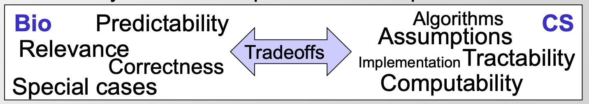

## Alignment 算法的应用

引入Alignment算法，对这块不熟悉，以后遇到再细看

- 发现同源序列
- 比较找到功能相同的元件，保守区域
- develop methods for estimating the level of constraint (估计一些限制水平的方法，不大熟悉这一块，不是特别理解）
   - edit operations, substutions, gaps 等数量
   - 估计mutations的数量（包括back-mutations: 基因通过二次突变又变回原来的基因型和表型)
   - conservation ‘windows' (不是特别理解，一段保守区域？）
   - 估计限制的‘隐藏状态’ （HMM）
   - 用phylogeny估计突变比例树
   - phylogenetics: Allow different portions of the tree to have different rates
- 各种功能的进化信号 （蛋白编码基因、RNA结构、microRNA、regulatory motifs）
## To actually align two genes

- From Bio to CS: Formalizing the problem
   - Define set of operations (insertion, deletion, mutation in evolutionary)
   - Define optimality criterion (min number, min cost,Occam's razor: find min)
   - Design algorithm that achieves that optimality

这个图对Bio和comp的关系描述的很好，算法和模型是为了简化/公式化，忽略噪声信息，提取有意义的信息

- 各种align Formulations 构建思路（从简单到复杂，很好展示了一个建模思考过程）：

Longest common substring (no gaps)->Longest common subsequence (gaps allowed)->
Allow gaps (fixed penalty)->Varying penalties
->Varying gap cost models:

   - Linear gap penalty (前面所说的几个都是线性）
   - Affine gap penalty
      - 给位于starting/ending position 的gap更大的成本
   - General gap penalty
   - Frame-aware gap penalty
      - 考虑编码框破坏的成本
   - Seek duplicated regions，rearrangements, ...
## Introduction to principles of dynamic programming

- 用Fibonacci num作为例子说明Top-down 和 bottom-up对算法复杂度的影响
   - Iterative solution do (迭代过程做了什么）：
      - reveal identical sub-problems
      - odering to enable result reuse
      - Systematically filled-in table of results
      - Expressed larger problems from their subparts
   - Ordering of computations matters (bottom-up 在这个问题上优于top-down)
      - bottom-top结构把所有子问题的解全都添加进入表格，并排序
      - 最终回溯只需要寻找解，而不必重复计算

（从这个层面看似乎需要回溯的问题考虑bottom-top结构更合适）

- Dynamic programming in Theory
   - Hallmarks of DP
      - Optimal substructure: 问题的最优解包含子问题的最有解（区别于greedy algorithm：子问题最有解就是全局解）
      - Overlapping subproblems: 有限数量不同的子问题，重复多次
   - Typically for optimization problems
      - 局部最优解
      - search space 添加score
      - traceable find optimal path
   - Middle  of the road in range of difficulty (DP 为中等难度）
      - Easier: greedy choice possible at each step
      - DynProg: requires a traceback to find that optimal path
      - Harder: no options/substrains?
- DP recipe：
   - Parameterization （设计dimensions，选择合适variables）
   - sub-problem space （一定要有限的subpro, 如果不能广泛reuse，DP不是一个很好的解决方案)
   - traversal order
   - recursion formula [larger problems=F（subparts)]
   - trace-back
## DP for sequence alignment

- Building up a solution from smaller parts
   - compute best alignment recursively
   - compute optimal score based on smaller problems
      - key idea: cal max score of longer sequences based on pre-computed shorter (用短序列设计一个积分规则，保证所有短序列已经计算好了，并且可以被用于作为长序列比对的规则）
      - Store all these alignments of any length this way（构建一个打分的矩阵）
- Prefix matrix: finite subproblems, exponential paths
- Compute alignments recursively
   - Local update rules (仅关注相邻的格子，根据前面比对结果计算下一个比对）
   - compute scores for prefixes of increasing length
## Advanced topics: Dynamic Programming variants
进一步优化算法，降低时间复杂度

- Linear-time bounded DP (heuristic) 

将traceback限制在一定范围之内--限制gap数量

- Linear-space DP: Hirschberg algorithm （感觉像是类似添加了二分法的思想）
