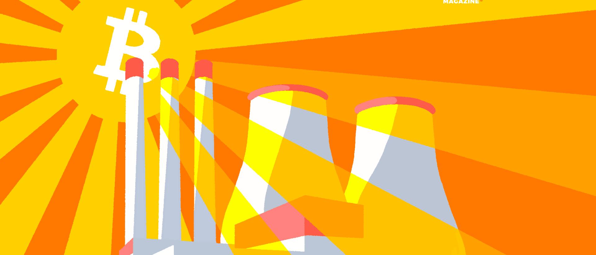

<header>

  
  


</header>

This is 🇨🇿 Czech translation of <a href="https://bitcoinmagazine.com/business/bitcoin-mining-at-nuclear-power-plants">this article</a> 
by <a href="https://twitter.com/purugyl">Puru Goyal</a> & Tina Torres, published on Jul12/2022 
<a href="https://twitter.com/BitcoinMagazine">@BitcoinMagazine</a> / Translated with 🧡 @745935 by <a href="https://twitter.com/nekonecnik">@nekonecnik</a> 

# MŮŽE TĚŽBA BITCOINU ZAJISTIT DOSTATEK JADERNÉ ENERGIE ZDARMA?

Představme si jadernou elektrárnu, která v místě integruje těžbu bitcoinu. Jaká bude její ziskovost ve srovnání se standardním provozem?

<head>
<meta name="viewport" content="width=device-width, initial-scale=1">

</head>

### Cyklus roste a zvětšuje se

Jak lidstvo poroste z civilizace typu II na civilizaci typu III, bude se tento cyklus opakovat v ještě větším a závratnějším měřítku.

Celý vesmír lze zkomprimovat pomocí logaritmického měřítka do jediného obrázku. To nám umožňuje vizualizovat blockchainy typu I, II a III naráz.

<body>

  
1 / 3

  
  
Caption Text

  
2 / 3

  
  
Caption Two

  
3 / 3

  
  
Caption Three

<a class="prev" onclick="plusSlides(-1)">❮</a>
<a class="next" onclick="plusSlides(1)">❯</a>

 

   
   
   

</body>

> <b>Velké řetězce mají v rámci svých hash horizontů malé řetězce, 
> A malé řetězce mají menší řetězce, a tak donekonečna.</b>
>  HYMENOPTERA, FROM MICHAELUS DE SAYLOR’S A BLOCKCHAIN OF PARADOXES (2194)
>  BLANOKŘÍDLÍ, Z DÍLA BLOCKCHAIN PARADOXŮ OD MICHAELUSE DE SAYLORA (2194)

Naše hvězdné okolí bude nakonec hostit mnoho blockchainů typu II od Solcoinu po Centauricoin, Siriuscoin a další. 

## ---
<big>Autoři: <a href="https://twitter.com/purugyl">Puru Goyal</a> & Tina Torres 
 Původní článek: <a href="https://bitcoinmagazine.com/business/bitcoin-mining-at-nuclear-power-plants">CAN BITCOIN MINING 
  MAKE NUCLEAR ENERGY ABUNDANT AND FREE?</a>
 Přeložil: <a href="https://twitter.com/nekonecnik">@nekonecnik</a> <a href="https://sifrant.github.io/jednadvacet/support" style="text-decoration: none">🧡</a>
<!--
 Korektura / konzultace: <a href="https://twitter.com/@SatsJoseph">@SatsJoseph</a>
-->
</big>
  

  <footer>
    

    
  </footer>


