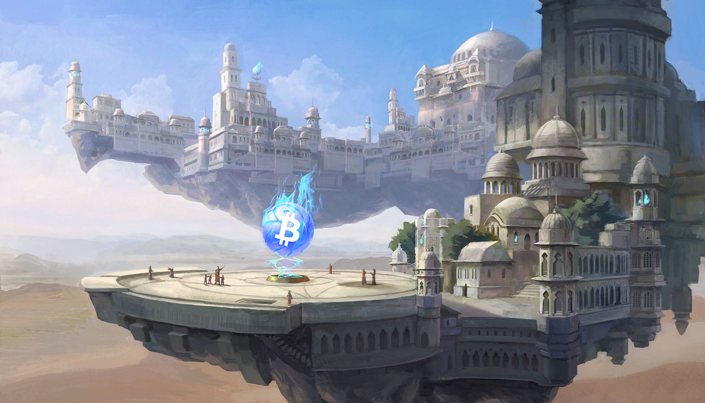

<header>

  
  


</header>

<small>This is 🇨🇿 Czech translation of <a href="https://dergigi.com/2020/03/31/dear-bitcoiners/">this article</a> by <a href="https://twitter.com/dergigi">@dergigi</a> originally published @623774 
 Translated @739884 by <a href="https://twitter.com/nekonecnik">@nekonecnik</a> 🧡</small>

# Drazí Bitcoineři
Optimistický dopis přátelům i nepřátelům z celého světa.
 623774

<big>Šílenství tohoto světa se zjevilo v okamžení. Všechno se mění mnohem rychleji, než si většina z nás kdy dokázala představit - ale já se nebojím. Naopak, jsem podivně optimistický - kvůli Bitcoinu a kvůli vám.</big>

<big>Pravděpodobně mě neznáte a já pravděpodobně neznám vás. A to je naprosto v pořádku. Některé z vás však znám - a věřím, že některé znám docela dobře, i když jsme se nikdy nesetkali nebo pouze letmo. Četl jsem vaše texty, sledoval jsem, jak spolu debatujete, viděl jsem věci, které jste vybudovali, a nespočet hodin jsem poslouchal vaše hlasy. Je mi jedno, identifikujete-li se jako bitcoiner nebo maximalista, nebo jako pre-/shit-/multi-/cokoliv-coiner. Je mi fuk, jestli jste už před lety spadli do králičí nory, nebo zda jste právě poprvé zahlédli brloh medojedův. Nezajímá mě vaše politické přesvědčení, sexuální orientace, pohlaví, náboženství, věk a nespočet dalších kvalifikátorů, jimiž vás lze zaškatulkovat. Stačí mi fakt, že jste tady, čtete to, přemýšlíte o Bitcoinu a zajímáte se o něj. To je důvod, proč jsem optimistický. Optimistický vůči Bitcoinu a optimistický vůči Bitcoinerům.</big>

> <b>"Bullish on bitcoiners."</b>
>  <a href="https://twitter.com/ODELL/status/1202843544093954048?s=20">Matt Odell</a>

<big>Důsledky bitcoinu jsou tak dalekosáhlé a inovace tak hluboké, že to až zaráží. Mezioborová povaha této bestie přitahuje mozky z nesčetných oblastí: počítačová věda, kryptografie, matematika, fyzika, ekonomie, finance, obchodování, inženýrství, seznam je dlouhý. Bystré mozky, výjimečné osobnosti, silné názory, kontrariáni, idealisté snažící se změnit svět - ti všichni a mnozí další tvoří volný kolektiv, který bychom mohli označit za bitcoinery.</big>

## Medojed neřeší
<big>Nechápejte mě špatně: Bitcoin vás nepotřebuje, nepotřebuje nikoho z nás. Jeho systémy pobídek mají způsob, jak zajistit, že bude v pořádku, i když se množina lidí, kteří na něm pracují a používají ho, zcela změní. Bitcoin bude v pořádku, stejně jako nyní, kdy se celý svět zastavil.
Současná krize - a finanční dopady, které budou nevyhnutelně následovat - jasně ukáže, že Bitcoin potřebujeme více než Bitcoin potřebuje nás. Opět mě však nechápejte špatně: nesmíme být lhostejní. Musíme se i nadále starat, pokračovat v budování, pokračovat ve vzdělávání, pokračovat s konverzí, pokračovat v argumentaci, pokračovat v debatách. Nacházíme se v čele bitvy myšlenek a v této bitvě samolibost zabíjí.</big>

> <b>"Neptejte se, co může bitcoin udělat pro vás, ale co můžete udělat vy pro bitcoin."</b>
>  <a href="https://twitter.com/adam3us/status/944543821307707392?s=20">Adam Back</a>

<big>Pokud můžete přispět kódem, psaním, vzděláváním, diskusemi, nahráváním, vytvářením nebo prostě hodlováním - skvělé. Ale nenechte se mýlit: Bitcoin je větší než my všichni. A troufám si říct, že současné selhání dosavadního systému je větší než Bitcoin.</big>

<big>Ano, Bitcoin má potenciál vyřešit mnoho skrytých klíčových problémů našich prohnilých a nefunkčních systémů. K vítězné válce však budeme potřebovat celou řadu technologií umožňujících svobodu; nástrojů, které implicitně posilují postavení jednotlivce nabídkou silných záruk soukromí, šifrování a svobody používat tyto nástroje bez omezení.</big>

## Netlač na pilu
<big>Jak se tato globální pandemie šíří světem, statisíce nakažených, desetitisíce mrtvých a miliony lidí bez práce, mění se priority z triviálních na ty existenční. Přes nespornou náročnost je mnohem důležitější zůstat pokorný a netlačit na pilu. Je až příliš snadné odcizit si přátele a rodinu tím, že u každé večeře nabídnete nadšenou přednášku o Bitcoinu. I když je nadšení chvályhodné, pevně věřím, že Bitcoin pochopí každý ve chvíli, kdy bude připraven - ať už z nutnosti, nebo ze zvědavosti. Ano, časová osa právě nabrala na rychlosti. Ale stále je to maraton, nikoli sprint. A může to být jeden z mnoha maratonů.</big>

> <b>"Jedním z historických faktů je, že bitvy nezůstávají vyhranými. Ty, na nichž záleží, se musí vést znovu a znovu."</b>
>  <a href="https://en.wikiquote.org/wiki/Stanley_Knowles">Stanley Knowles</a>

<big>Vrchnost neodstoupí ani dobrovolně, ani mlčky. A protože bojujeme o vlastní suverenitu a svobodu, musíme svádět tento boj znovu a znovu.</big>

## Ochrana myšlenky, jejíž čas nadešel
<big>Padouši se budou neustále snažit Bitcoin podkopat, jako se o to pokoušeli v minulosti. Bohužel máme dobrý důvod se domnívat, že v tom budou pokračovat. A trend podkopávání a mrzačení technologií bohužel je zřejmý všude kolem. Na příkladu internetu, vidíme, jak různé zájmové skupiny vedou válku proti síťové neutralitě, jak politici zavádějí celonárodní firewally, jak webové stránky blokují obsah z geografických důvodů, jak jsou lidé svévolně deplatformováni, demonetizováni nebo blokováni.</big>

<big>Říká se, že nic není tak mocné jako myšlenka, jejíž čas nadešel. Věřím, že čas Bitcoinu nadešel, a při zpětném pohledu to bude každému jasné. Než se to však stane zřejmým, budou se houfy lidí snažit překroutit to, co Bitcoin je, a myšlenky, jež představuje.</big>

> <b>"Myšlenky mění svět, ale dělají to tak, že nabývají tvaru, že nabývají konkrétní podoby."</b>
>  <a href="https://en.wikiquote.org/wiki/Stanley_Knowles">Stanley Knowles</a>

<big>Ačkoli je forma Bitcoinu od jeho vzniku zcela konkrétní, jedná se o abstraktní, nehmotnou podobu, takže je mimořádně obtížné ji uchopit. Bude ještě nějakou dobu trvat, než se Bitcoin stane stejně všudypřítomným, jako je nyní internet. Tento čas - toto okno zmatku - využijí a zneužijí zákonodárci i šarlatáni. Je to však také příležitost. Příležitost nabrousit si nástroje, připravit se na záplavu, doručit budoucnost rychleji, než ji stihnou zakázat.</big>

## Nikdy nemají pravdu
<big>Nepochybně existuje spousta lidí, kteří si nepřejí, aby Bitcoin uspěl. Udělají vše, co bude v jejich silách, aby prodloužili nevyhnutelné. Zaklínají se současným systémem a těží z jeho přirozené nerovnováhy. Někteří z nich mají blízko k peněžnímu kohoutu, jiní jsou záměrně nevědomí nebo nepřáteli svobody vůbec. Další jsou vyloženě zlí a usilují o to, aby byli tou nohou, která vám šlápne na kuří oko. Napořád.</big>

> <b>Říkali nám, abychom si v první řadě nic nepřáli, abychom se nesnažili, abychom byli zticha, abychom si hezky hráli, abychom mířili nízko a vůbec o
> nic neusilovali. Nikdy nemají pravdu. Jděte za svými sny. Plňte si svá přání. Vytvářejte budoucnost. A především věřte sami sobě.</b>
>  <a href="https://en.wikiquote.org/wiki/J._Michael_Straczynski">Joseph Michael Straczynski</a>

<big>Budou nám i nadále tvrdit, že to, co děláme, je bláhový sen, že to, oč usilujeme, je nemožné, že nemůžeme fungovat mimo stávající systémy. Budou omezovat naše svobody: svobodu transakcí, svobodu spořit, svobodu zůstat v soukromí. Budou nám tvrdit, že určité druhy matematiky a softwaru jsou nezákonné. Budou nadále ospravedlňovat masové sledování tím, že se nám budou snažit prodat iluzi bezpečí. A i nadále nebudou mít pravdu.</big>

<big>Ozvěte se. Buďte pobouřeni. Používejte alternativy. Vytvářejte alternativy. Nespokojte se se současným stavem - máme na víc. Bitcoin je takový, jakým ho uděláme, a nedokážu si představit lepší skupinu lidí, uvědomující si plný potenciál této velkolepé myšlenky.</big>

> <b>Není nic lepšího než být na jedné lodi s výjimečnými lidmi, kteří k sobě dokážou být radikálně pravdiví a zásadně transparentní.</b>
>  <a href="https://www.youtube.com/watch?v=J2Qrm9UB7qY&t=154s">Ray Dalio</a>

<big>Buďte ostražití. Zůstaňte radikální. Zůstaňte věrní sami sobě. V době, kdy svět spěje do záhuby a pád Říma je takhle blízko, jsou silné charaktery, zdravé zásady a čestné jednání nezbytností.</big>

<big>Scéna je připravena, drama se odehrává, a při nástupu crescenda nesmíme podlehnout tyranii. Cesta bude klikatá a hrbolatá a já mám tu čest ji projít až do konce, s vámi po svém boku. Zvládneme to.</big>

## Poděkování
Děkuji <a href="[https://twitter.com/FriarHass">Hassovi</a>, <a href="https://twitter.com/johnkvallis">Johnovi</a> a <a href="https://twitter.com/dennisreimann">Dennisovi</a> za jejich cenné připomínky.
Původní grafika "Citadela vyhnanství" od <a href="https://samkeiser.artstation.com/projects/a3ALX">Sama Keisera</a>

## ---
<big>Autor: <a href="https://twitter.com/dergigi">Der Gigi</a>
 Původní článek: <a href="https://dergigi.com/2020/03/31/dear-bitcoiners/">Bitcoin and the Interplanetary Frontier</a>
 Přeložil: ⚡ <a href="lightning:nekonecnik@stacker.news">nekonecnik@stacker.news</a></big>


  <footer>
    

    
  </footer>


