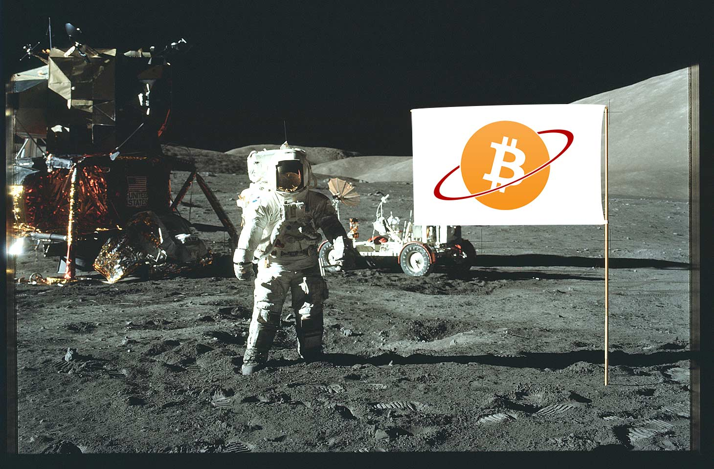
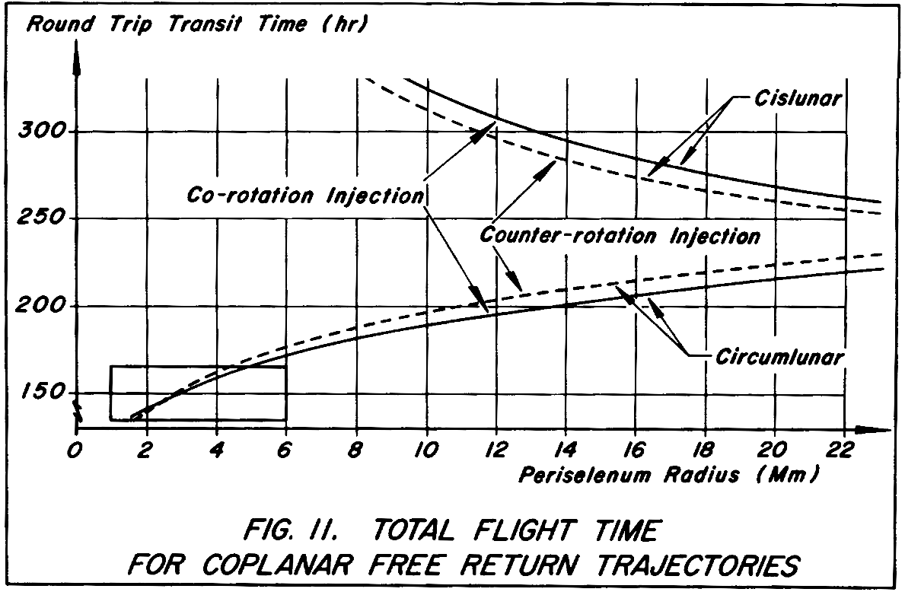
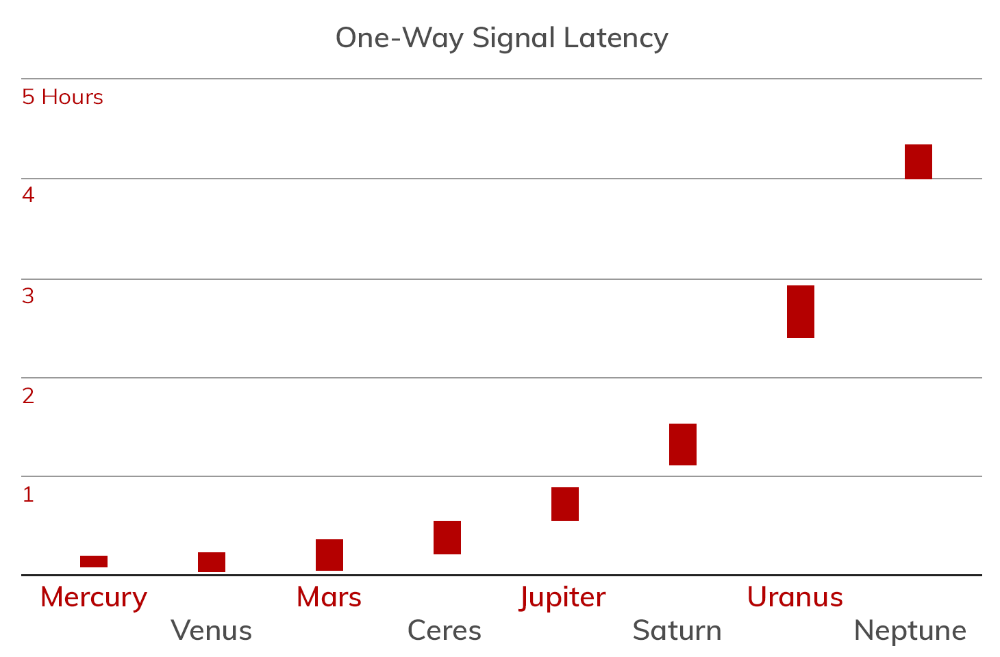
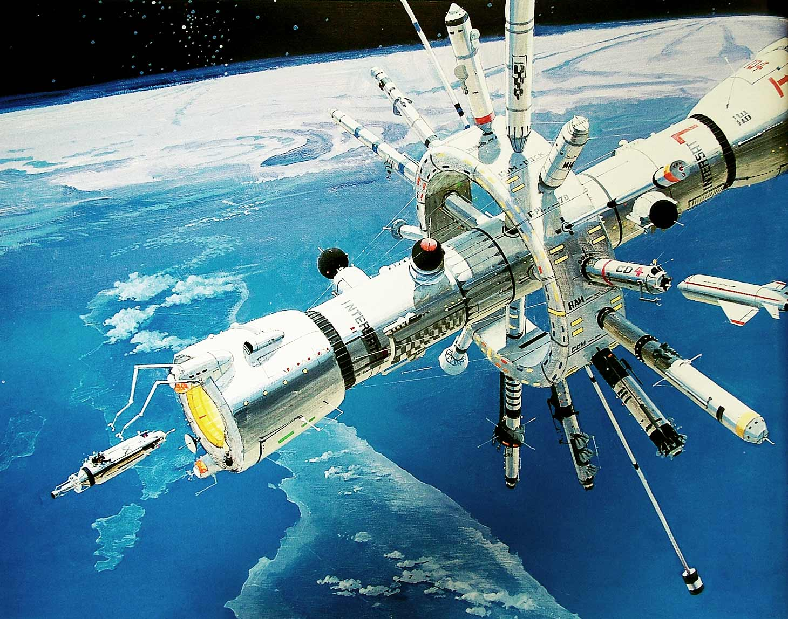

<header>

  
  


</header>

This is 🇨🇿 Czech translation of <a href="https://bitcoin.clarkmoody.com/posts/bitcoin-interplanetary-frontier">this article</a> by <a href="https://twitter.com/clarkmoody">@clarkmoody</a> originally published on October 2, 2018. Translated @740195 by <a href="https://twitter.com/nekonecnik">@nekonecnik</a> 🧡

# Bitcoin a meziplanetární hranice
<big>Bitcoinový meme "To the Moon!" předvídá masivní nárůst kurzu a nikdy nekončící býčí trh. Uvažovali jsme však o tom, co by se stalo, kdybychom poslali Bitcoin na Měsíc doslova? Toto je první ze série článků, které se zabývají budoucností ekonomiky, peněz a Bitcoinu v době, kdy se lidstvo vydává k planetám a ke hvězdám.</big>

## Vesmírná ekonomika
<big>Vesmírné ekonomiky se od svých pozemských protějšků výrazně liší v několika zásadních ohledech. Ale stejně jako se pohyb na nebi řídí zákony nebeské mechaniky, řídí se finanční interakce lidí bez ohledu na jejich umístění zákony ekonomie.</big>

<big>Doposud byly lety do vesmíru uskutečňovány převážně vládními silami a plánovači misí pečlivě rozdělovali prostředky. V dobách programu Apollo bylo za cestu na Měsíc astronautům poskytováno stejné denní odškodné jako za nocleh v motelu (s odpočtem za ubytování na palubě kosmické lodi). Významnou ekonomickou aktivitu ve vesmíru bychom měli očekávat až ve chvíli, kdy si větší skupiny lidí budou muset zdroje alokovat samy. Tento článek se zabývá některými omezeními vesmírné ekonomiky a příležitostmi pro Bitcoin, až se ve vesmíru uchytíme.</big>

## Limity hmoty
<big>Především náklady na dopravu na oběžnou dráhu jsou... astronomické. Nedávná úsilí známého podnikatele v oblasti kosmonautiky sice snižují náklady, ale starty raket mohou být i nadále neúměrně drahé ještě celá desetiletí. Neraketové systémy vynášení do vesmíru snad sníží náklady, zatím je však odlet ze Země drahá záležitost.</big

<big>Obrovské náklady na vynášení na orbitu částečně vysvětlují nízkou hustotu obyvatelstva ve vesmíru. Lidé jsou pro lety do vesmíru mnohem méně vhodní než počítače. Potřebujeme jídlo, vzduch, kontrolované klima, omezené zrychlení a nízkou radiaci. S vysláním člověka do vesmíru je spojeno tolik hmoty a komplexnosti, že má smysl vyslat místo něj robota a přenášet zpět záběry. Jakmile však získáme ve vesmíru silnější lidskou přítomnost, dojde k obchodu a ekonomické kalkulaci, a můžeme tedy pokračovat v naší diskusi.</big>

<big>Tváří v tvář omezením hmoty nemá smysl alokovat vzácnou emisní kapacitu do fyzických peněz, jako je papír nebo zlato. Bitcoin coby digitální peníze byl prakticky vynalezen k tomu, aby poháněl mimozemský obchod. Informace jsou nehmotné a počítače a komunikační zařízení potřebné ke zpracování digitálních plateb by byly na místě bez ohledu na to, že by sloužily jiným, misi kriticky důležitým účelům. Bitcoin klade další režijní náklady na stahování a zpracování bloků.</big>

## Orbitální mechanika
<big>Nedostatek užitečné hmoty ve vesmíru nás omezuje k co nejefektivnějším oběžným drahám. Díky tomu je cesta na Mars uskutečnitelná jen jednou za 26 měsíců, i když chytří lidé pracují na levnějších trasách. Mise k asteroidům, k Jupiteru a dál vyžadují roky letu, dokud se nepodaří vynalézt alternativní pohonné systémy.</big
  

<big>Dlouhá dodací lhůta dělá z nejbanálnějšího výdaje na Zemi extrémní luxus. Vesmírné osady musí odletět s velkým množstvím záložních a náhradních dílů pro všechny kritické systémy, s důmyslnými systémy recyklace vody a nakonec i s nějakým způsobem pěstování potravin. Po příletu musí být osady schopny vyrábět zboží z místních zdrojů, jinak budou navždy závislé na zásobovacích misích od svého pozemského sponzora. Dokonce i měsíční kolonie s třídenní přepravní dobou vyžadují raketový start pro zásoby, a to vyžaduje plánování.</big>

<big>Zavedení dlouhých časových prodlev do dodavatelského řetězce ještě více ztěžuje a zvyšuje význam pokročilého ekonomického plánování. Systematické narušení lidských časových preferencí způsobené znehodnocením fiat peněz odstartuje konjunkturu hospodářského cyklu. Pro mimozemské kolonie může být velký ekonomický šok fatální. Za tímto účelem by měla být ponechána volnost kolísání úrokové míry v závislosti na nabídce a poptávce po penězích, což by podnikatelům, kteří se rozhodují o budoucnosti, poskytovalo nejlepší informace. Zdravé peníze, jako je bitcoin, zajišťují, že úrokové sazby nebudou uměle snižovány zvýšenou nabídkou peněz.</big>

## Sankce rychlosti světla
<big>Informace se ve vakuu nešíří rychleji než světlo, což znamená, že zpáteční zpráva mezi vesmírnou osadou a Zemí bude mít nějakou minimální časovou ztrátu. Měsíc je od nás vzdálen 384 400 kilometrů a rádiové vysílání urazí tuto vzdálenost za 1,28 sekundy. Použití internetu s takovou latencí by bylo možné, ale strastiplné. Bitcoin by díky své výsledné konzistenci a desetiminutovým blokům mohl na Měsíci a v blízkém vesmíru fungovat dostatečně dobře za předpokladu dostatečné komunikační kapacity. Měsíční kolonie by dokonce mohla obdržet nový blok dříve než některé uzly na Zemi, a to kvůli dlouhým latenčním dobám v určitých částech internetu.</big>

<big>Naproti tomu Mars osciluje mezi 3,1 a 22 světelnými minutami. Při těchto vzdálenostech by byla ke zkrácení prodlevy nutná nová zpoždění odolná síťová architektura. Těžba bitcoinů na Marsu by byla kvůli prodlevě při přenosu nerentabilní, za předpokladu, že by si Země zachovala hashovací převahu. Marťanští těžaři by měli stav blockchainu zpožděný až o 22 minut, takže než by se jejich poslední vytěžený blok dostal k většině hashovací síly na Zemi, do chainu by v průměru přibyly čtyři nové bloky. Těžbu na Marsu můžeme simulovat již dnes: stačí těžit na bloku čtyři bloky za koncem chainu. Pomineme-li extrémní náhodu, dominující těžební planeta zůstane dominantní napříč sluneční soustavou.</big>
  

<big>To však neznamená, že by Bitcoin nebylo možné používat daleko od Země. Naopak, doba potvrzení se jednoduše stane součástí plánování transakcí a řešení druhé vrstvy doplní prostor pro platby. Zatímco přeprava fyzického zboží s sebou nese náklady na start rakety a dobu přepravy na oběžnou dráhu, transakce s digitálním zbožím probíhají rychlostí světla. Mimozemští osadníci by mohli pozemšťanům účtovat poplatky za zajímavá data, jako jsou vědecké experimenty nebo umění inspirované Měsícem. Takovou výměnu bitcoin umožňuje.</big>

## Vesmírná hotovost
<big>Vesmírné osady budou po desetiletí zcela závislé na svých pozemských sponzorech, což znamená, že samostatná ekonomika může vzniknout až po několika generacích. Nicméně rodící se ekonomiky a mimozemské společnosti budou jednoho dne potřebovat peníze a zdravé peníze by poskytly stabilní základ pro plánování, investice a růst. Bitcoin jsou takové peníze a přenášejí se napříč galaxií.</big>

<big>Kolonie na oběžné dráze Země, vesmírné stanice, a dokonce i základny na Měsíci by mohly fungovat na Bitcoinu stejně spolehlivě, jaký bude jejich přístup k internetu. Všude, kde se Bitcoin používá, je nezbytné ověřování blockchainu, aby se předešlo ekonomické cenzuře vypořádání. Bitcoinové uzly by měly zajistit, aby aktualizace ze Země přijímal více než jeden komunikační kanál. Více nezávislých provozovatelů uzlů v každé osadě zlepší odolnost blockchainu proti cenzuře. Odchozí transakce by měly být přenášeny zpět na Zemi více kanály, aby taková vyrovnání byla odolná proti ekonomické blokádě.</big>

## Platby přes Lightning
<big>On-chain transakce vyžadují zpětné spojení a vícenásobné potvrzení, aby zůstaly důvěryhodnými i mimozemsky. Pro platby daleko od Země se hodí síť Lightning Network. Platební kanály se otvírají na chainu, ale další transakce probíhají off-chain a lokálně. Vaše platba za nejnovější experimentální marťanskou kávu bude okamžitá, privátní a levná.</big>

<big>Ke zvládnutí velkých časových prodlev je třeba jednoduchá technická úprava během nastavení kanálu: upravte time lock deltu tak, aby zohledňovala vysílání do blockchainu. Marťanští osadníci přidají 44 minut, tedy 4 bloky. Kolonisté na Saturnově měsíci Titanu přidávají k minimální timr lock deltě 3 hodiny neboli 18 bloků. Jinak budou platby lokální a okamžité, přičemž si zachovají všechny vlastnosti plateb Lightning Network na Zemi.</big>

<big>A co meziplanetární Lightning kanály? Umožnění rychlejších plateb mezi světy by bylo třešničkou na dortu, ale se současným protokolem nemusí být Lightning nejvhodnější. Kromě předpokladu, že "doprava je uspořádaná a spolehlivá", jsou interakce mezi uzly náročné na komunikaci a určité operace vyžadují několikanásobné cesty tam a zpět. To neznamená, že by tuto mezeru nemohla zaplnit nějaká jiná technologie druhé vrstvy nebo že by Lightning mohl mít režim tolerující zpoždění. Pravděpodobně budou existovat bezpečné mosty mezi sítěmi vrstvy 2, stejně jako již existují služby, přemosťující platby on a off chain. Geniální mozky tyto protokoly neustále zdokonalují a vylepšují, proto v době, kdy budeme meziplanetární platby potřebovat, tak pravděpodobně bude existovat řešení problému časového zpoždění.</big

<big>Měly by se bitcoiny používat pro všechny planety soustavy? Potřebujeme MarsCoin a MoonBux? Poletí Bitcoin s kolonisty na mise k jiným hvězdám? V pozdějších esejích se budeme zabývat životaschopností více blockchainů pro meziplanetární obchod a dalšími důsledky pro mezihvězdnou expanzi.</big>

## Meziplanetární hranice
  
 
  
<big>Hranice je příslibem nového začátku a duch osadníků podněcuje houževnatost tváří v tvář obrovským výzvám. Když se vydáváme na cestu ke hvězdám, potřebujeme veškerou pomoc, které se nám může dostat. Protože peníze vesmírného osídlení budou digitální, musíme opustit tiskařské stroje. Opusťme také pokřivení nesolidních peněz a pohánějme vesmírnou ekonomiku Bitcoinem.</big>

## ---
<big>Autor: <a href="https://twitter.com/clarkmoody">Clark Moody</a>
 Původní článek: <a href="https://bitcoin.clarkmoody.com/posts/bitcoin-interplanetary-frontier">Bitcoin and the Interplanetary Frontier</a>
 Přeložil: ⚡ <a href="lightning:nekonecnik@stacker.news">nekonecnik@stacker.news</a></big>
  
  

  <footer>
    

    
  </footer>

  
