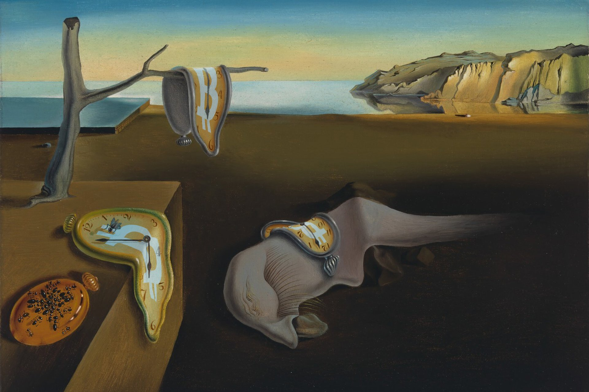
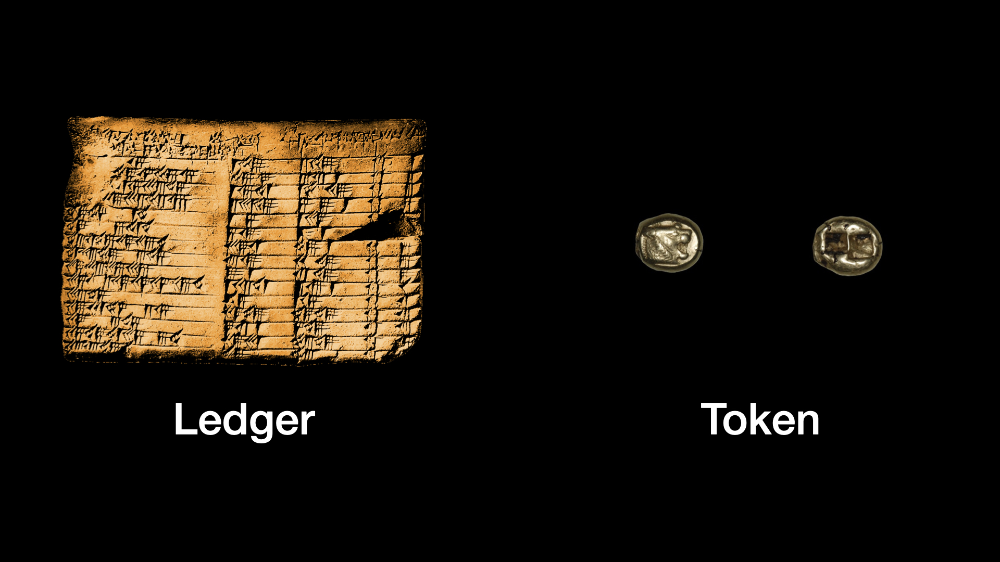
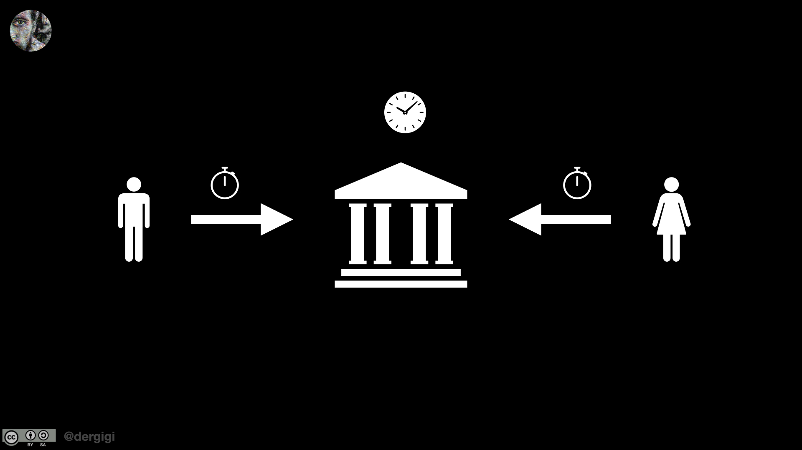
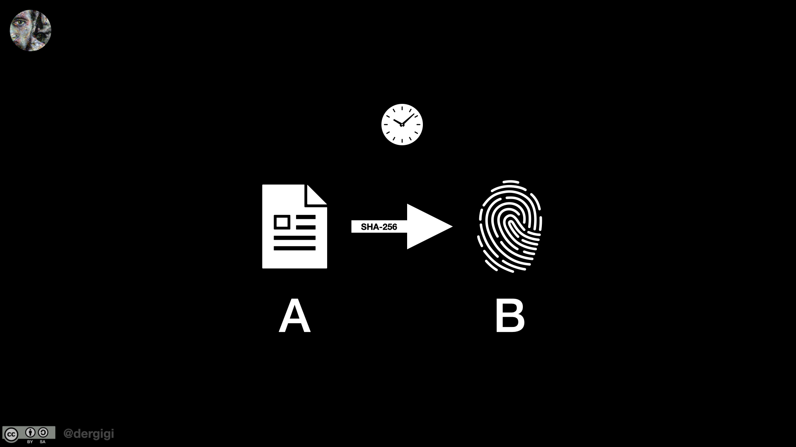
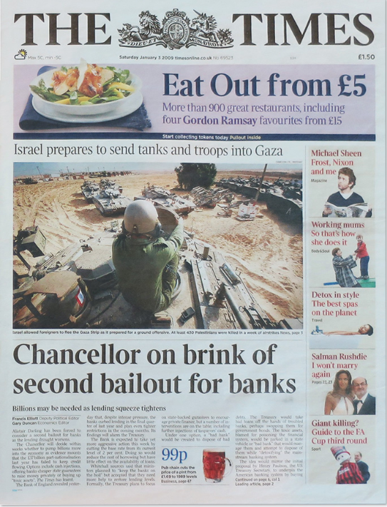
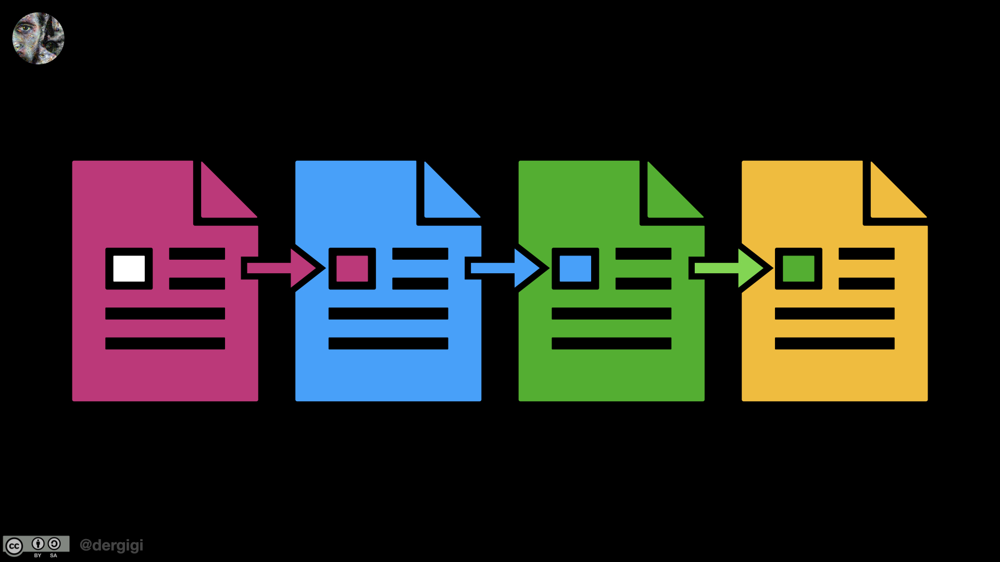
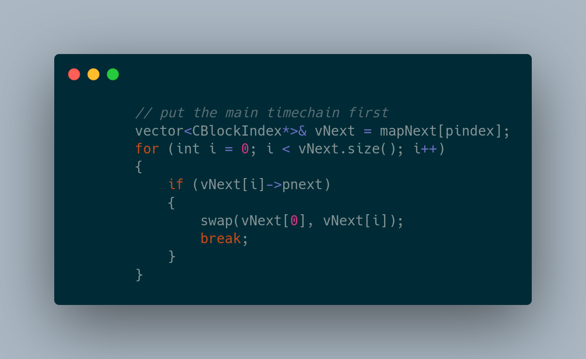

<header>

  
  


</header>

This is 🇨🇿 Czech translation of <a href="https://dergigi.com/2021/01/14/bitcoin-is-time/">this article</a> 
by @dergigi originally published @666053 
 Translated @740913 by <a href="https://twitter.com/nekonecnik">@nekonecnik</a> 🧡

# Bitcoin je čas
666053

> <b>"Jediné zářivé hodiny na pozadí oblohy
> hlásaly, že čas není špatný ani správný."</b>
 Robert Frost, Acquainted with the Night (1928)

> <b>"Čas je pro nás stále velkou záhadou. Není to nic víc než pojem; nevíme, zda vůbec existuje...</b>
>  Clifford D. Simak, Shake­speare’s Planet (1976)

<big>Čas jsou peníze, alespoň se to říká. Z toho vyplývá, že peníze jsou také čas: představují kolektivní ekonomickou 
energii, kterou lidstvo uchovává. Souvislost mezi časem a penězi je však složitější, než by se na první pohled mohlo zdát. 
Pokud peníze nevyžadují k vytvoření žádný čas, nefungují jako peníze příliš dobře, nebo ne dlouho. Ještě hlouběji, 
jak uvidíme, sledování věcí v informační sféře vždy předpokládá sledování času.</big>

<big>Jakmile se peníze stanou digitálními, musíme se dohodnout na definici času, v čemž celý problém spočívá. Možná 
si myslíte, že určit čas je tak snadné, jako se podívat na hodiny, které jsou poblíž, a máte pravdu, pokud jde 
o každodenní úkoly. Ale když dojde na synchronizaci stavu globální, soupeřící, distribuované sítě, stává se určování 
času téměř neřešitelným problémem. Jak zjistit čas, když hodinám nelze věřit? Jak vytvořit koncept jednotného času, 
když se váš systém rozprostírá po celé galaxii? Jak měřit čas v bezčasí? A co je vlastně čas?</big>

<big>Abychom na tyto otázky odpověděli, budeme se muset blíže podívat na samotný pojem času a na to, jak Bitcoin 
vytváří svůj vlastní čas: blokový čas - známější jako *výška bloku*. Prozkoumáme, proč problém měření času úzce 
souvisí s vedením záznamů, proč v decentralizovaném systému neexistuje absolutní čas a jak Bitcoin využívá kauzalitu 
a nepředvídatelnost k vytvoření vlastního smyslu přítomnosti.</big>

<big>Časoměrná zařízení nejednou změnila civilizace. Jak upozornil Lewis Mumford v roce 1934: "Klíčovým strojem moderního 
průmyslového věku jsou hodiny, nikoli parní stroj." Dnes je to opět časoměrné zařízení, které transformuje naši 
civilizaci: hodiny, nikoli počítače, jsou skutečným klíčovým strojem moderního informačního věku. A těmito hodinami 
je Bitcoin.</big>

## Sledování posloupnosti událostí

> <b>"Nechte dítě, aby se učilo počítat věci, a získalo tak pojem o počtu. Tyto věci, pro účely počítání považovány 
> za rovnocenné, mohou být jednotlivé předměty nebo skupiny.</b>
>  David Eugene Smith, The Teaching of Elemen­tary Mathe­matics (1900)

<big>Velmi obecně řečeno, existují dva způsoby sledování věcí: fyzické tokeny a účetní knihy. Buď můžete přímo 
použít artefakty z reálného světa, např. dát někomu mušli, minci nebo jinou hmatatelnou věc, nebo můžete stav 
světa replikovat tak, že na kus papíru zapíšete, co se stalo.</big>

<big>Představte si, že jste pastýřem a chcete zajistit, aby se celé vaše stádo vrátilo domů. Každé ovci můžete nasadit 
obojek, a jakmile se ovce vrátí domů, obojek jednoduše sundáte a pověsíte do kůlny. Pokud máte pro každý obojek 
jeden háček, budete vědět, že se každá ovce vrátila v pořádku, jakmile se všechny háčky zaplní. Samozřejmě je můžete 
také spočítat a vést si jejich seznam. Budete však muset dbát na to, abyste pokaždé, když začnete počítat, vytvořili 
nový seznam, a také budete muset dbát na to, abyste ani jednu ovci nepočítali dvakrát (nebo naopak vůbec).</big>

<big>Peníze jsou v podstatě nástrojem pro evidenci toho, kdo komu co dluží. Obecně řečeno, vše, co jsme dosud používali 
jako peníze, spadá do dvou kategorií: fyzické předměty a informační seznamy. Nebo, abychom použili běžnější řeč: 
tokeny a účetní knihy.</big>

<big>Je důležité uvědomit si přirozenou odlišnost těchto kategorií, a proto na ni výslovně upozorním: První 
metoda - fyzický token - přímo reprezentuje stav věcí. Druhá - účetní kniha - odráží stav věcí nepřímo. Každá z nich 
má své výhody a nevýhody. Například tokeny jsou fyzické a distribuované; účetní knihy jsou informační a centralizované. 
Tokeny ze své podstaty nevyžadují důvěru, účetní knihy naopak.</big>

<big>V digitálním světě - bez ohledu na to, jak intenzivně se vás marketingoví guruové snaží přesvědčit o opaku - můžeme 
používat pouze účetní knihy. Je to informační sféra, nikoliv fyzická. I když určitý druh informace nazvete "tokenem", stále 
se jedná o tvárnou informaci, zapsanou na pevném disku nebo jiném, informace uchovávajícím, médiu, což z ní fakticky 
činí informační záznam.</big>

<big>Základní příčinou problému dvojitého utrácení je povaha všech digitálních informací, mající charakter účetní knihy. 
Informace nikdy nereprezentují stav světa přímo. Dále pak pohyb informací znamená kopírování. Informace existuje na jednom 
místě, a abyste ji mohli "přesunout", musíte ji zkopírovat na jiné místo a v místě jejího vzniku ji vymazat. Tento problém 
ve fyzické sféře neexistuje. Ve fyzikální sféře můžeme skutečně přesouvat věci z místa A do místa B. Informační sféra tuto 
vlastnost nemá. Pokud chcete "přesunout" informaci ze seznamu A do seznamu B, musíte ji zkopírovat z A do B. Jiný způsob neexistuje.</big>

<big>Další způsob, jak o tom přemýšlet, je jedinečnost. Fyzické tokeny jsou jedinečné kompozity atomů, jejichž sestavení není 
snadno replikovatelné. Čistá informace tuto vlastnost nemá. Pokud můžete informaci přečíst, můžete ji také dokonale zkopírovat. 
Z toho prakticky vyplývá, že fyzické tokeny jsou jedinečné a digitální tokeny nikoli. Dokonce bych tvrdil, že "digitální token" 
je nesprávné označení. Token může představovat tajnou informaci, ale nikdy nebude představovat jedinečnou, singulární, 
nekopírovatelnou informaci.</big>

<big>Tento rozdíl ve vlastnostech ukazuje, že skutečně neexistuje způsob, jak "předat" informace. Digitální token nelze přenechat 
stejně jako fyzický token, protože si nikdy nemůžete být jisti, zda původní vlastník informace na své straně nezničil. Digitální 
tokeny, stejně jako všechny informace, lze pouze šířit, podobně jako myšlenku.</big>

> <b>"... když máš jablko a já mám jablko a vyměníme si je - každý z nás skončí jen s jedním jablkem. Ale pokud máme oba nápad 
> a vyměníme si je - každý z nás nakonec získá dva nápady."</b>
>  Charles F. Brannan (1949)

<big>Fyzické tokeny - to, čemu říkáme fyzická aktiva nebo "hotovost" - jsou tohoto dilematu zbaveny. V reálném světě platí, že pokud 
mi předáte minci, vaše mince je pryč. Neexistuje žádná magická duplikace mince a jediný způsob, jak mi ji dát, je fyzicky mi ji předat. 
Fyzikální zákony neumožňují, abyste ji utratili dvakrát.</big>

<big>Double spending sice existuje i v nedigitální sféře - vzpomeňme na George Parkera, podvodníka, který proslul " double-spendnutím" 
Brooklynského mostu a dalších pamětihodností - ale vyžaduje to promyšlený podvod a důvěřivé kupující. Ne tak v digitální oblasti.</big>

<big>V digitální sféře, kde se neustále pracuje s informacemi, je double spending neodmyslitelným problémem. Jak ví každý, kdo někdy 
kopíroval soubor nebo použil funkci Ctrl+C a Crtl+V, informace je něco, co lze dokonale zkopírovat, a není vázána na médium, na kterém 
je umístěna. Máte-li například digitální fotografii, můžete ji zkopírovat milionkrát, některé kopie uložit na USB disk a poslat tisícům 
různých lidí. Dokonalé kopie jsou možné, protože informace umožňují bezchybnou opravu chyb, která eliminuje degradaci. A aby toho 
nebylo málo, kopírování prakticky nic nestojí a není možné určit originál.</big>

<big>Ještě jednou: pokud jde o informace, nic jiného než kopírování neexistuje. Jednoduše není způsob, jak přesunout digitální informaci 
z bodu A do bodu B. Informace se vždy zkopíruje z bodu A do bodu B, a pokud byl proces kopírování úspěšný, původní kopie bodu A se vymaže. 
To je důvod, proč je double spending problém tak ošemetný. Neexistuje-li centrální autorita, neexistuje způsob, jak cokoli přesunout 
z místa A do místa B bez nutnosti důvěry. Vždy musíte věřit, že originál bude smazán. Přirozeným vedlejším efektem je, že pokud jde 
o digitální informace, nelze zjistit, kolik kopií existuje a kde se tyto kopie mohou nacházet.</big>

<big>Z tohoto důvodu používání digitálních "tokenů" jako peněz nemůže a nikdy nebude fungovat. Vzhledem k tomu, že tokeny odvozují svou 
spolehlivost od toho, že je v důsledku jejich jedinečné fyzické konstrukce obtížné je reprodukovat, tato výhoda v digitální sféře mizí. 
V digitální sféře nelze tokenům důvěřovat. V důsledku podstaty vnitřních vlastností informací není jediným životaschopným formátem 
digitálních peněz token, ale účetní kniha - což nás přivádí k problému času.</big>

## Tokeny jsou časově neomezené, účetní knihy nikoliv

> <b>Viditelné je dočasné, neviditelné však věčné.</b>
 Pavel z Tarsu - 2. Korintským 4, 18b (Cor2/4,18b)

<big>Budeme-li se bavit o fyzických tokenech, na čase transakce nezáleží. Buď mince v kapse máte, nebo nemáte; buď je můžete utratit, 
nebo ne. Jediným předpokladem pro utrácení je prostý akt vlastnictví. O zbytek se postarají přírodní zákony. V tomto smyslu nevyžadují 
fyzické tokeny důvěru a nepodléhají času.</big>

<big>Pokud jde o účetní knihy, fyzické vlastnictví ustupuje do pozadí. Ten, kdo má účetní knihu pod kontrolou, musí zajistit, aby byly 
věci *v pořádku*. Co je jinak dáno fyzikálními zákony - totiž že nemůžete utratit peníze, které nemáte, ani takové, které jste již dříve 
utratili - musí být vynuceno pravidly vytvořenými člověkem. A právě tato pravidla, nikoliv fyzikální zákony, řídí řádný chod a vedení 
účetní knihy.</big>

<big>Podstatou věci je zmíněný přechod od fyzikálních zákonů k pravidlům vytvořeným člověkem. Lidské normy lze ohýbat a porušovat, fyzikální 
zákony ne. Například fyzickou zlatou minci si nemůžete jednoduše "vymyslet". Musíte ji vykopat ze země. Zlatou minci si však můžete zcela 
jistě vyrobit na papíře. Uděláte to tak, že jednoduše přidáte záznam do účetní knihy, jímž si pár mincí přivlastníte. Nebo, v případě 
centrálních bank, jednoduše přidáte pár bilionů pomocí několika stisků počítačových kláves. (Fajnoví finančníci tomu říkají "rehypotekace", 
"bankovnictví frakčních rezerv" nebo "kvantitativní uvolňování" - ale nenechte se zmást, vždy jde o totéž: vytváření peněz).</big>

<big>Pro zachování důvěryhodnosti účetních knih a těch, kteří s nimi manipulují, jsou nutné pravidelné nezávislé audity. Schopnost zaúčtovat 
každý jednotlivý záznam v účetní knize není luxus. Auditoři musí být schopni procházet účetní knihy - zpětně v čase - aby tyto mohly být 
poctivé a funkční. Bez spolehlivých časových razítek není možné ověřit vnitřní konzistenci účetní knihy. Mechanismus pro stanovení 
jednoznačného pořadí je nezbytný.</big>

<big>Bez absolutního vnímání času není možné stanovit pořadí transakcí. A bez definovaného pořadí transakcí nelze dodržovat pravidla účetní 
knihy. Jak jinak se můžete ujistit, kolik peněz vlastně máte? Jak jinak se můžete ujistit, že jsou věci *v pořádku*?</big>

<big>Rozdíl mezi tokeny a účetními knihami zdůrazňuje nutnost sledování času. Ve fyzické sféře jsou mince časově neohraničené artefakty, 
které lze vyměňovat bez dozoru. V digitální sféře vyžaduje mince časové razítko.</big>

## Centralizovaná ražba mincí

> <b>"Čas: velký archivář nebo kotelník."</b>
>  Yahia Lababidi (b. 1973)

<big>Obvyklým způsobem, jak vyřešit problém dvojího utrácení - jak zajistit, aby se digitální převod uskutečnil pouze jednou - je centrální 
seznam transakcí. Jakmile máte centrální seznam transakcí, máte jedinou účetní knihu, která může sloužit jako jediný zdroj pravdy. Vyřešit 
double spending problém je tak snadné, jako projít tento seznam a ujistit se, že vše souhlasí. Takto řeší double spending PayPal, Venmo, Alipay 
a všechny banky tohoto světa - včetně centrálních bank: prostřednictvím centrální autority.</big>

> <b>Problém je samozřejmě v tom, že příjemce nemůže ověřit, zda jeden z majitelů neutratil minci dvakrát. Obvyklým řešením je zavedení důvěryhodné 
> centrální autority neboli mincovny, která u každé transakce kontroluje, zda nedošlo k double spendingu. [...] Problém tohoto řešení spočívá 
> v tom, že osud celého peněžního systému závisí na společnosti provozující mincovnu, přičemž každá transakce musí projít přes ni, podobně jako 
> v bance.<b>
>  Satoshi Nakamoto (2009)

<big>Je třeba zdůraznit, že Satoshi nedokázal zajistit, aby informace nebylo možné kopírovat. Každou část bitcoinu - jeho zdrojový kód, účetní 
knihu, váš soukromý klíč - lze zkopírovat. Všechno to lze namnožit a zfalšovat. Satoshimu se však podařilo vytvořit systém, který kopie 
porušující pravidla činí zcela a naprosto nepoužitelnými. Síť Bitcoin provádí složitý tanec, aby rozhodla, které kopie jsou užitečné a které ne, 
a právě tento tanec vnáší do digitální sféry nedostatek. A jako při každém tanci je zapotřebí taktovky diktující rytmus.</big>

<big>Dokonce i centralizovaná účetní kniha může vyřešit problém double spendingu pouze tehdy, pokud má konzistentní způsob sledování času. 
Vždy je třeba vědět, kdo komu kolik dal a hlavně: kdy. V informační sféře neexistuje vydávání mincí bez časového razítkování.</big>

> <b>Je třeba zdůraznit, že nemožnost zařadit v distribuovaných systémech události na časovou osu byla nevyřešeným problémem, bránícím tomu, 
> aby byla decentralizovaná účetní kniha vůbec možná. Dokud Satoshi Nakamoto nepřišel s řešením.</b>
>  Gregory Trubetskoy (2018)

## Decentralizovaný čas

> <b>Čas vše odnese.</b>
>  Aischylos (525 BC – 456 BC)

<big>Čas a řád jsou ve velmi úzkém vztahu. Jak upozornil Leslie Lamport ve svém článku *Time, Clocks, and the Ordering of Events 
in a Distributed System* z roku 1978: "Pojem času je pro náš způsob myšlení zásadní. Je odvozen ze základnějšího pojmu pořadí, 
v jakém události nastávají." Bez centrálního koordinačního bodu se zdánlivě intuitivní pojmy "před", "po" a "současně" rozpadají. 
Slovy Lamporta: "pojem 'dění před' definuje neměnné dílčí uspořádání událostí v distribuovaném víceprocesním systému."</big>

<big>Jinak řečeno: Kdo by měl být zodpovědný za čas, když není možno nikoho pověřit? Jak můžete mít spolehlivé hodiny, když neexistuje 
centrální referenční rámec?</big>

<big>Možná si myslíte, že vyřešit tento problém je snadné, protože každý může používat své vlastní hodiny. To však funguje pouze tehdy, 
pokud jsou hodiny každého z nás přesné a hlavně pokud všichni hrají fér. V nepřátelském systému by bylo spoléhání se na individuální hodiny 
katastrofou. Navíc to kvůli relativitě nefunguje konzistentně v celém prostoru.</big>

<big>Jako myšlenkový experiment si představte, jak byste mohli podvádět systém, kdyby si každý určoval čas sám pro sebe. Mohli byste 
předstírat, že transakce, kterou právě odesíláte, je ve skutečnosti ze včerejška - jen se z nějakého důvodu zpozdila - a tudíž by vám 
zůstaly všechny peníze, které jste dnes utratili. Vzhledem k asynchronní komunikaci, která je vlastní každému decentralizovanému systému, 
je tento scénář více než teoretický myšlenkový experiment. Zprávy se skutečně zpožďují, časová razítka jsou nepřesná a díky relativistickým 
efektům a přirozenému omezení rychlosti našeho vesmíru je cokoli, jen ne snadné rozeznat pořadí věcí bez přítomnosti centrální autority 
nebo pozorovatele.</big>

> <b>"Kdo tam? Ťuk, ťuk!"</b>
>  Asynchronní vtip

<big>Pro lepší ilustraci tohoto problému se podívejme na konkrétní příklad. Představte si, že vy i váš obchodní partner máte přístup 
k firemnímu bankovnímu účtu. Podnikáte po celém světě, takže váš bankovní účet je ve Švýcarsku, vy jste v New Yorku a váš partner je v Sydney. 
Pro vás je 3. ledna a užíváte si krásný nedělní večer ve svém hotelu. Pro ni je už pondělí ráno, proto se rozhodne koupit si snídani pomocí 
debetní karty vašeho společného bankovního účtu. Cena je 27 dolarů, disponibilní zůstatek je 615 dolarů. Místní čas je 8:21 ráno.</big>

<big>Ve stejnou dobu se chystáte zaplatit za svůj pobyt jinou debetní kartou, která je vázána na stejný bankovní účet. Cena je 599 dolarů. 
Dostupný zůstatek je 615 USD. Místní čas je 17:21.</big>
  

<big>Tak se stane, že oba ve stejný okamžik protáhnete kartu terminálem. Co se stane? (Vážení fyzici, omluvte, prosím, můj výraz "ve stejný 
okamžik" - relativistické efekty a skutečnost, že v našem vesmíru neexistuje absolutní čas, budeme prozatím ignorovat. Budeme také ignorovat, 
že koncepce synchronních událostí ve skutečnosti neexistuje. Bitcoin je už tak dost komplikovaný!)</big>

<big>Centrální účetní kniha vaší banky pravděpodobně obdrží jednu transakci dříve než druhou, takže jeden z vás bude mít štěstí, druhý ne. 
Pokud by transakce náhodou přišly ve stejném okamžiku - řekněme ve stejné milisekundě - musela by banka rozhodnout, kdo peníze utratí.</big>

<big>Co by nastalo, kdyby žádná banka neexistovala? Kdo by rozhodoval o tom, kdo první vybral peníze? Co kdybyste to nebyli jen vy dva, ale 
stovky nebo dokonce tisíce koordinujících se osob? Co kdybyste těmto lidem nevěřili? Co když se někteří z těchto lidí snaží podvádět, např. 
tím, že si nastaví hodiny zpět, aby to vypadalo, že peníze utratili o pár minut dříve?</big>

> <b>"V případě absence centrálního koordinátora je zapotřebí časový nástroj pro stanovení kanonického uspořádání a vynucení jedinečné historie."</b>
>  Giacomo Zucco, Discov­ering Bitcoin (2019)

<big>Tento problém je právě důvodem, proč všechny předchozí pokusy o digitální hotovost vyžadovaly centralizovaný registr. Vždy jste museli 
věřit, že někdo správně určí pořadí věcí. Bylo nutné, aby centralizovaná strana sledovala čas.</big>

<big>Bitcoin tento problém řeší tím, že znovu vynalézá samotný čas. Říká ne sekundám a ano blokům.</big>

## Udržování času, blok za blokem

> <b>"Sláva času je mírem králům soupeřícím,
>  odhalit faleš a vynést pravdu dovede,
>  vtisknout pečeť věků věcem letitým,
>  probouzet jitro a střežit noční nebe,
>  Křivému křivě, než spraví sám sebe.
>  William Shake­speare, Znásilnění Lukrecie (1594)

<big>Všechny hodiny jsou založeny na periodických procesech, které bychom mohli nazvat "tikot". Známé *tikání* dědečkových hodin je v podstatě 
stejné jako molekulárně-atomové bzučení našich moderních Quartzových a cesiových hodin. Něco se houpe - nebo osciluje - a my tyto kmity 
jednoduše počítáme, dokud se nesečtou do minuty nebo sekundy.</big>

<big>U velkých kyvadlových hodin jsou tyto výkyvy dlouhé a dobře viditelné. U menších a specializovanějších hodin je zapotřebí zvláštního 
vybavení. Frekvence hodin - jak často tikají - závisí na způsobu jejich využití.</big>

<big>Většina hodin má určenou pevnou frekvenci. Konec konců, chceme znát přesný čas. Existují však hodiny, které mají frekvenci proměnnou. 
Například metronom má proměnlivou frekvenci, kterou nastavíte před tím, než ho necháte tikat. Zatímco metronom si po nastavení udržuje 
konstantní tempo, čas bitcoinu se při každém tiknutí mění, protože jeho vnitřní mechanismus je pravděpodobnostní. Účel je však stejný: 
udržet hudbu na nohou, aby tanec mohl pokračovat.</big>
  

<big>Skutečnost, že Bitcoin jsou hodiny, zůstává očím skryta. Satoshi ostatně poukazuje na to, že Bitcoinová síť jako celek představuje 
hodiny, nebo jeho slovy: distribuovaný server časových razítek.</big>

> <b>"V tomto dokumentu navrhujeme řešení problému dvojí útraty pomocí peer-to-peer distribuovaného serveru přidělujícího časová razítka 
> (timestamp server), který vytváří výpočetní důkaz chronologického pořadí transakcí."</b>
>  Satoshi Nakamoto (2009) - překlad Bitcoin whitepaper CZ od Braiins Publishing

<big>To, že hlavním problémem, který je třeba vyřešit, je časové razítkování, je zřejmé i z odkazu na konci Bitcoinového whitepaperu. 
Z celkového počtu osmi odkazů se tři týkají časového razítkování:
 - How to time-stamp a digital document by S. Haber, W.S. Stornetta (1991)
 - Improving the efficiency and relia­bility of digital time-stamping by D. Bayer, S. Haber, W.S. Stornetta (1992)
 - Design of a secure timestamping service with minimal trust require­ments by H. Massias, X.S. Avila, and J.-J. Quisquater (May 1999)</big>

<big>Jak Haber a Stornetta nastínili v roce 1991, digitální časové razítkování spočívá ve výpočetně praktických postupech, 
které uživateli - nebo třeba protivníkovi - znemožňují digitální dokument datovat zpětně nebo předem. Na rozdíl od fyzických dokumentů 
lze s digitálními dokumenty snadno manipulovat a změna nemusí nutně zanechat na samotném fyzickém médiu žádné poznávací znaky. V digitální 
sféře mohou být padělky a manipulace dokonalé.</big>

<big>Vzhledem k proměnlivé povaze informací je časové označování digitálních dokumentů složitý a důmyslný proces. Naivní řešení nefungují. 
Vezměme si například textový dokument. Nemůžete jednoduše přidat datum na konec dokumentu, protože každý - včetně vás - může v budoucnu datum 
jednoduše změnit. Také byste si mohli v první řadě libovolné datum vymyslet.</big>

## Čas je řetězec příčin

> <b>"Krajním pohledem lze svět chápat výhradně jako vazby, spojení, nic jiného."</b>
>  Tim Berners-Lee, Weaving the Web (1999)

<big>Dokazování data je obecný problém, dokonce i v nedigitální oblasti. To, čemu se ve světě únosů říká "ověřování podle novin", je obecným 
řešením problému arbitrárních časových razítek.</big>
  

<big>Toto funguje, protože noviny je těžké zfalšovat, ale snadné ověřit. Je obtížné je podvrhnout, protože dnešní titulní strana odkazuje 
na včerejší události, které by únosce nemohl předvídat, kdyby byl obrázek několik týdnů starý. Prostřednictvím těchto událostí je obrázek 
důkazem, že rukojmí byl v den, kdy noviny vyšly, stále naživu.</big>

<big>Tato metoda zdůrazňuje jeden z klíčových pojmů, co se týče času: kauzalitu. Šíp času popisuje příčinný vztah událostí. Bez kauzality 
není čas. Kauzalita je také důvodem, proč jsou kryptografické hashovací funkce tak zásadní, pokud jde o časové razítkování dokumentů 
v kyberprostoru: zavádějí kauzální vztah. Protože je prakticky nemožné vytvořit platný kryptografický hash, aniž by byl k dispozici dokument 
na prvním místě, zavádí se kauzální vztah mezi dokumentem a hashem: daná data existovala jako první, hash byl vytvořen později. Jinými slovy: 
bez výpočetní nevratnosti jednosměrných funkcí by v kyberprostoru kauzalita neexistovala.</big>
  

<big>S tímto stavebním kamenem kauzality lze vymýšlet schémata, která vytvářejí řetězec událostí, kauzálně spojující A s B s C atd. V tomto 
smyslu nás bezpečné digitální časové razítko přesouvá z bezčasého éteru do světa digitální historie.</big>

> <b>"Kauzalita fixuje události v čase. Pokud byla událost determinována určitými dřívějšími událostmi a podmiňuje určité následné události, 
> pak je událost bezpečně zasazena na své historické místo."</b>
>  Bayer, Haber, Stornetta (1992)

<big>Je bez diskuse, že příčinná souvislost je při ekonomických výpočtech nanejvýš důležitá. A protože účetní kniha není nic jiného než 
ztělesnění ekonomických výpočtů více spolupracujících účastníků, je kauzalita pro každou účetní knihu nezbytná.</big>

> <b>"Potřebujeme takový systém, aby se účastníci dokázali dohodnout na jediné historii [...]. Řešení, které navrhujeme, začíná serverem 
> časových razítek."</b>
>  Satoshi Nakamoto (2009)

<big>Je fascinující, že všechny střípky mozaiky, díky nimž Bitcoin funguje, existovaly už dříve. Již v roce 1991 Haber a Stornetta představili 
dvě schémata, která "ztěžují nebo znemožňují výrobu falešných časových razítek". První se spoléhá na důvěryhodnou třetí stranu, druhé, 
propracovanější schéma "distribuované důvěry" nikoli. Autoři dokonce identifikovali inherentní problémy důvěry v kauzální řetězec událostí 
a co by bylo zapotřebí k přepsání historie. Podle jejich slov "jediným možným podvrhem je připravit falešný řetězec časových razítek, dostatečně 
dlouhý na to, aby vyčerpal nejpodezřelejšího vyzyvatele, kterého lze předpokládat". Podobný vektor útoku existuje v Bitcoinu již dnes, a to 
v podobě 51% útoku (více o něm v jedné z dalších kapitol).</big>

<big>O rok později Bayer, Haber a Stornetta na svou předchozí práci navázali a navrhli použít ke svázání událostí stromové struktury namísto 
jednoduchých propojených seznamů. To, co dnes známe jako Merkle Trees, jsou jednoduše efektivní datové struktury pro deterministické vytvoření 
hashe z více hashů. Pro časové razítkování to znamená, že lze efektivně spojit více událostí do jednoho "tiknutí". Ve stejném textu autoři 
navrhují, že distribuovaný model důvěryhodnosti představený roku 1991 by mohl být vylepšen prováděním opakovaného "světového turnaje", který 
by určil jediného "vítěze", jenž by výsledný hash publikoval veřejně, podobně jako noviny. Zní vám to povědomě?</big>

<big>Jak ještě uvidíme, ukazuje se, že noviny jsou také skvělým způsobem, jak přemýšlet o druhé složce času: nepředvídatelnosti.</big>

## Kauzalita a nepředvídatelnost

> <b>"Čas není skutečnost [hupostasis], ale představa [noêma] nebo míra [metron]..."</b>
>  Antifon Sofista, Pravda (Alétheia), 3. století BC

<big>Příčinná souvislost je sice zásadní, ale nikoliv postačující. K tomu, aby čas plynul, potřebujeme také nepředvídatelnost. Ve fyzikální 
sféře pozorujeme přírodní procesy, které popisují tok času. Pozorujeme obecný nárůst entropie a nazýváme jej šípem času. I když se zdá, 
že přírodní zákony na směr tohoto šípu ve většině případů zapomínají, některé věci prakticky nelze vrátit zpět. Jak se říká, rozbité vejce 
nelze znovu složit.</big>

<big>Podobně jsou funkce zvyšující entropii nutné k vytvoření šípu času v digitální sféře. Stejně jako je prakticky nemožné složit rozbité vejce, 
je prakticky nemožné rozbít hash SHA256 nebo kryptografický podpis.</big>

<big>Bez tohoto nárůstu entropie by bylo možné pohybovat se libovolně časem kupředu i zpět. Například Fibonacciho posloupnost čísel je kauzální, 
ale ne entropická. Každé číslo v posloupnosti je způsobeno dvěma čísly, která mu předcházela. V tomto smyslu se jedná o kauzální řetězec. Není 
však užitečný k určení času, protože je zcela předvídatelný. Stejně jako se únosce nemůže jednoduše postavit před kalendář, který ukazuje aktuální 
datum, nemůžeme předvídatelné procesy použít jako důkaz času. Vždy se musíme spolehnout na něco, co nelze předem předvídat, jako je například 
titulní strana dnešních novin.</big>

<big>Bitcoin spoléhá na dva zdroje nepředvídatelnosti: transakce a proof-of-work. Stejně jako nikdo nedokáže předpovědět, jak budou vypadat zítřejší 
noviny, nikdo nedokáže předpovědět, jak bude vypadat další blok Bitcoinu. Nelze předpovědět, jaké transakce budou zařazeny, protože nelze předpovědět, 
jaké transakce budou v budoucnu vůbec vyslány. A co je ještě důležitější, nemůžete předpovědět, kdo najde aktuální řešení proof-of-work a jaké toto 
řešení bude.</big>

<big>
  Na rozdíl od únoscových novin je však proof-of-work fyzicky spojen *přímo* s tím, co se stalo. Není to jen záznam události - je to událost sama. 
  Právě pravděpodobnostní přímočarost proof-of-work odstraňuje z rovnice důvěru. Jediný způsob, jak najít platný proof-of-work, je provést mnoho 
  odhadů, přičemž provedení jednoho pokusu zabere trochu času. Pravděpodobnostní součet těchto odhadů je to, co vytváří časový řetězec, 
  kterým je Bitcoin.
</big>
  
<big>
  Využitím kauzality hashovacích řetězců a nepředvídatelnosti proof-of-work poskytuje Bitcoinová síť mechanismus pro stanovení nezpochybnitelné 
  historie pozorovaných událostí. Bez kauzality není možné oddělit, co bylo předtím a co potom. Bez nepředvídatelnosti postrádá kauzalita smysl.
</big>
  
<big>
  Na to, co intuitivně chápe každý únosce, výslovně upozornili Bayer, Haber a Stornetta v roce 1992: "Aby bylo možné prokázat, že dokument byl 
  vytvořen po určitém časovém okamžiku, je nutné uvést události, které nebylo možné předvídat předtím, než se staly".
</big>

<big>
  Právě kombinace kauzality a nepředvídatelnosti umožňuje vytvořit umělou "přítomnost" v jinak bezčasé digitální sféře. Jak upozorňují Bayer, 
  Haber a Stornetta ve svém článku z roku 1991: "pořadí klientů žádajících o časová razítka a jimi předkládané hashe nelze předem znát. Pokud tedy 
  do podepsaného certifikátu zahrneme bity z předchozí posloupnosti žádostí klientů, pak víme, že časové razítko vzniklo až po těchto 
  žádostech. [...] Požadavek na zahrnutí bitů z předchozích dokumentů do certifikátu však lze využít i k řešení problému omezení času v opačném 
  směru, protože společnost, která časová razítka vydává, nemůže vydat pozdější certifikáty, pokud nemá k dispozici aktuální žádost."
</big>
  
<big>
  Všechny kousky skládačky už tu byly. Satoshimu se je podařilo poskládat tak, aby z rovnice vypadla "společnost, která razítkuje čas".
</big>

## Proof of Time

> <b>"Causa latet: vis est notis­sima."
>  "Příčina je skrytá, ale výsledek je známý."</b>
>  Publius Ovidius Naso, Proměny, IV. 287 (8 AD)

<big>
  Shrňme si to: abychom mohli používat peníze v digitální sféře, musíme se spolehnout na účetní knihy. Aby byly účetní knihy spolehlivé, je 
  zapotřebí jednoznačný řád. Aby bylo možné zavést pořádek, jsou nutná časová razítka. Pokud tedy chceme mít v digitální sféře *důvěru 
  nevyžadující* peníze, musíme odstranit jakoukoli entitu, která časová razítka vytváří a spravuje, a jakoukoli jedinou entitu mající na starosti 
  samotný čas.
</big>
  
<big>
  Řešení si musel uvědomit génius jako Satoshi Nakamoto: "Abychom mohli implementovat distribuovaný server časových razítek na peer-to-peer bázi, 
  budeme muset použít systém proof-of-work podobný systému Hashcash od Adama Backa."
</big>
  
<big>
  Musíme použít systém proof-of-work, neboť potřebujeme něco, co je digitální sféře vlastní. Jakmile pochopíte, že digitální doména má informační 
  povahu, je zřejmý závěr, že máme k dispozici pouze výpočty. Pokud je váš svět tvořen daty, manipulace s daty je vše, co máte k dispozici.
</big>
  
<big>
  Proof-of-work funguje v peer-to-peer prostředí, protože *nevyžaduje důvěru*, jelikož je odpojen od všech vnějších vstupů - jako jsou údaje hodin 
  (nebo novin, když na to přijde). Spoléhá na jednu jedinou věc: výpočet vyžaduje práci a v našem vesmíru práce vyžaduje energii a čas.
</big>
  

## Překlenovací období

> <b>Vyhovuje mi to.
>  Když kráčíme po mostě - schváceném ohněm
>  s plameny za zády, 
>  stojíme před čarou. 
>  Jsme to jen my dva, zlato, proti celému světu.</b>
>  Kate Bush, Burning Bridge (1985)

<big>
  Bez proof-of-work bychom vždy narazili na Oracle problém, protože fyzická sféra a informační sféra jsou nerozlučně oddělené. Značky na vašem 
  seznamu ovcí nejsou vaše ovce, mapa není území a to, co bylo napsáno ve včerejších novinách, nemusí být nutně to, co se stalo ve skutečném 
  světě. Stejně tak to, že si pomocí hodin v reálném světě zapíšete časový údaj, neznamená, že to ve skutečnosti byl čas právě takový.
</big>
  
<big>
  Jednoduše řečeno, neexistuje žádný způsob, jak ověřit, že data reprezentují realitu, s výjimkou případů, kdy je daná realita obsažena už 
  v samotných datech. Geniální na bitcoinové metodě proof-of-work s úpravou obtížnosti je to, že vytváří svou vlastní realitu v souladu 
  s vlastním prostorem a časem.
</big>
  
<big>
  Proof-of-work poskytuje přímé spojení mezi digitální a fyzickou sférou. A co víc, je to jediné spojení, které lze navázat bez nutnosti důvěry. 
  Vše ostatní bude vždy záviset na vnějších vstupech.
</big>
  
<big>
  Obtížnost těžby nového bloku bitcoinu je upravována tak, aby tenká nit mezi časem bitcoinu a naším časem zůstala nedotčena. Obtížnost těžby se 
  jako hodinový strojek upravuje každých 2016 tiků. Cílem tohoto přenastavení je udržet průměrnou dobu mezi tiky na deseti minutách. Právě těchto 
  deset minut udržuje stabilní spojení mezi fyzickou a informační sférou. V důsledku toho je k přenastavení tikání Bitcoinových hodin zapotřebí 
  smysl pro lidský čas. Přenastavení založené čistě na blocích by nefungovalo, protože by bylo zcela odtržené od našeho lidského světa, a celým 
  účelem přenastavení je zabránit nám, vynalézavým lidem, abychom našli bloky příliš rychle (nebo příliš pomalu).
</big>
  
<big>
  Jak nám ukázal Einstein, čas není statická věc. Neexistuje nic takového jako univerzální čas, na nějž bychom se mohli spolehnout. Čas je relativní 
  a simultánnost neexistuje. Už jen tato skutečnost činí všechna časová razítka - zejména na velké vzdálenosti - ze své podstaty nespolehlivými, a to 
  i bez přítomnosti nepřátelských subjektů. (Mimochodem, právě proto se časová razítka GPS satelitů musí neustále upravovat.)
</big>
  
<big>
  U Bitcoinu na tom, že jsou naše lidská časová razítka nepřesná, příliš nezáleží. Stejně tak nehraje roli, že v první řadě nemáme žádný absolutní 
  referenční rámec. Musí být pouze dostatečně přesná, aby bylo možné vypočítat do jisté míry spolehlivý průměr napříč posledními 2016 bloky. Aby 
  to bylo zaručeno, je časové razítko bloku v realitě akceptováno pouze tehdy, pokud splňuje dvě kritéria:
   1. Časové razítko musí být vyšší než medián časových razítek předchozích 11 bloků.
   2. Časové razítko musí být nižší než čas sítě plus dvě hodiny. (Síťový čas je jednoduše medián časových razítek vrácených všemi připojenými uzly.)
</big>
  
<big>
  Jinými slovy, nastavení obtížnosti se týká udržení konstantního času, nikoli konstantní úrovně bezpečnosti, obtížnosti nebo energetického výdeje. 
  To je geniální, protože dobré peníze musí být nákladné v čase, nikoli v energii. Samotné propojení peněz s energií nestačí k vytvoření absolutního 
  nedostatku, protože každé zlepšení ve výrobě energie by nám umožnilo vytvořit více peněz. Čas je jediná věc, které nikdy nebudeme schopni vyrobit 
  více. Je to nejvyšší zdroj, jak zdůrazňuje Julian Simon. Bitcoin se tak stává ultimátní formou peněz, protože jeho emise je přímo spojena 
  s ultimátním zdrojem našeho vesmíru: časem.
</big>
  
<big>
  Nastavení obtížnosti je nezbytné, protože bez něj by vnitřní hodiny Bitcoinu měly tendenci jít stále rychleji, čím více těžařů by se do sítě 
  připojovalo nebo jak by se zlepšovala účinnost těžebních zařízení. Rychle bychom narazili na problém koordinace, který si Bitcoin klade za cíl 
  vyřešit. Jakmile by čas bloku klesl pod určitou hranici, řekněme 50 milisekund, nebylo by možné se dohodnout na sdíleném stavu, a to ani 
  teoreticky. Cesta světla z jedné strany Země na druhou trvá přibližně 66 milisekund. I kdyby tedy naše počítače a routery byly dokonalé, byli 
  bychom opět na začátku: při dvou událostech by bylo marné určit, která událost se stala dříve a která později. Bez periodické úpravy Bitcoinového 
  tikotu by se beznadějnost řešení koordinačního problému dostavila rychlostí vyšší, než světelnou. Čas je také základem problému kryptografické 
  nestability, který byl nastíněn v kapitole 1. Kryptografie funguje díky asymetrii v čase: vybudování kryptografické stěny trvá chvíli a její 
  prolomení dlouho - pokud nemáte klíč.
</big>
  
<big>
  V jistém smyslu tedy proof-of-work - a s ním spojené nastavení obtížnosti - uměle zpomaluje čas, alespoň z pohledu Bitcoinové sítě. Jinými slovy: 
  Bitcoin vynucuje vnitřní rytmus, jehož nízká frekvence umožňuje dostatečnou rezervu pro zpoždění komunikace mezi peery. Každých 2016 bloků 
  se vnitřní hodiny Bitcoinu přenastaví, aby byl - v průměru - jeden platný blok nalezen každých 10 minut.
</big>
  
<big>
  Z vnějšího pohledu Bitcoin přenáší chaotickou změť globálně vysílaných asynchronních zpráv do paralelního vesmíru, který je omezen vlastními 
  pravidly a vlastním smyslem pro prostor a čas. Transakce v mempoolu jsou z pohledu bitcoinové sítě mimočasové. Teprve když je transakce zahrnuta 
  do platného bloku, je jí přiřazen čas: číslo bloku, do kterého je začleněna.
</big>

<big>
  Je těžké přecenit, o jak elegantní řešení se jedná. Jakmile jste schopni vytvořit vlastní definici času, je dešifrování toho, co bylo předtím 
  a co potom, triviální. Stejně tak se stává triviálním dohodnout se na tom, co se stalo, v jakém pořadí, a následně i kdo komu co dluží.
</big>
  
<big>
  Úprava obtížnosti zajišťuje, že tikání vnitřního bitcoinového metronomu je do jisté míry konstantní. Je dirigentem bitcoinového orchestru. 
  Je tím, co udržuje hudbu při životě.
</big>
  
<big>
  Proč se ale vůbec můžeme spoléhat na práci? Odpověď je trojí. Můžeme se na ni spolehnout, protože výpočet vyžaduje práci, práce vyžaduje čas 
  a danou práci - hádání náhodných čísel - nelze provádět efektivně.
</big>
  

## Pravděpodobnostní čas

> <b>"Čas se neustále rozvětvuje směrem k nesčetným budoucnostem."</b>
>  Jorge Luis Borges, The Garden of Forking Paths (1941)

<big>
  Nalezení platné nonce pro bitcoinový blok je hádáním. Je to podobné jako házení kostkou, házení mincí nebo točení ruletou. V podstatě se snažíte 
  najít náhodné číslo, které je nesmírně obrovské. K nalezení řešení neexistuje žádná zkratka. Buď trefíte jackpot, nebo ne.
</big>
  
<big>
  Pokaždé, když si hodíte mincí, pravděpodobnost, že padne hlava nebo orel, bude 50 % - i kdybyste si předtím hodili dvacetkrát a pokaždé padla 
  hlava. Podobně pokaždé, když čekáte na příchod bitcoinového bloku, šance, že se najde v této vteřině, je ~0,16 %. Nezáleží na tom, kdy byl 
  nalezen poslední blok. Přibližná doba čekání na další blok je vždy stejná: ~10 minut.
</big>
  
<big>
  Z toho vyplývá, že každé jednotlivé tiknutí těchto hodin je nepředvídatelné. Ve srovnání s našimi lidskými hodinami se tyto hodiny jeví jako 
  spontánní a nepřesné. To je však irelevantní, jak upozorňuje Gregory Trubetskoy: "Na tom, že jsou tyto hodiny nepřesné, nezáleží. Důležité je, 
  že jsou to stejné hodiny pro všechny a že stav chainu lze jednoznačně vztáhnout k tikání těchto hodin". Hodiny bitcoinu jsou možná 
  pravděpodobnostní, ale nejsou iluzorní.
</big>
  
> <b>"Čas je iluze pouhá,
>  dvojnásob čas oběda."</b>
>  Douglas Adams (1979)

<big>
  Přítomný okamžik však může být v Bitcoinu naprostou iluzí. Protože v síti neexistuje žádná centrální autorita, mohou vznikat zvláštní situace. 
  Je to sice nepravděpodobné, ale je možné, že se ve stejnou dobu (opět: omluva všem fyzikům) objeví další platný blok, což způsobí, že hodiny 
  budou tikat dopředu na dvou různých místech najednou. Protože se však tyto dva různé bloky budou velmi pravděpodobně lišit svým obsahem, budou 
  obsahovat dvě různé historie, obě stejně platné.
</big>
  
<big>
  V takovém případě se bavíme o rozdělení chainu, což je přirozený proces Nakamotova konsensu. Stejně jako hejno ptáků, které se na chvíli rozdělí 
  na dvě části, aby se posléze opět spojilo, i uzly v síti Bitcoin nakonec po určité době konvergují ke společné historii, a to díky 
  pravděpodobnostní povaze hádání.
</big>
  
<big>
  Nakamotův konsensus zkrátka stanoví, že správná historie se nachází v nejtěžším chainu, tj. v tom, který obsahuje největší množství 
  proof-of-work. Máme-li tedy dvě historie A a B, někteří těžaři se budou snažit stavět na historii A, jiní na historii B. Jakmile jeden z nich 
  najde další platný blok, druhá skupina je naprogramována tak, aby uznala, že byla na špatné straně historie, a přešla na nejtěžší řetězec - ten, 
  který podle definice představuje to, co se skutečně stalo. V Bitcoinu opravdu píší historii vítězové.
</big>
  
> <b>"Příjemce platby potřebuje důkaz, že v době každé transakce většina uzlů souhlasila s tím, že jde o první přijatou transakci. [...] Pokud 
> existuje více double-spend verzí téže transakce, platnou se stane pouze jedna z nich. Příjemce platby musí počkat zhruba hodinu, než 
> se přesvědčí, zda je platná. Síť do té doby případné závody o double-spending vyřeší.</b>
>  Satoshi Nakamoto (2009)

<big>
  V tomto jednoduchém tvrzení spočívá tajemství problému distribuované koordinace. Takto Satoshi vyřešil problém " simultánní platby", se kterým 
  se naši fiktivní obchodní partneři setkali v počátku. Vyřešil jej jednou provždy, relativistické efekty budiž zatraceny!
</big>
  
<big>
  Vzhledem k této pravděpodobnostní povaze hodin bitcoinu je současný okamžik - který nazýváme vrcholem chainu - vždy nejistý. Minulost - bloky 
  pohřbené pod koncem chainu - je však stále jistější.
</big>
  
> <b>"Čím důkladnějšího pochopení je zapotřebí, tím hlouběji do minulosti je třeba se vydat."</b>
>  Gordon Clark, A Chris­tian View of Men and Things, p. 58. (1951)

<big>
  V důsledku toho se mohou hodiny bitcoinu čas od času přetočit, u některých peerů o jedno nebo dvě tiknutí. Pokud se stane, že váš vrchol 
  chainu - současný okamžik - prohraje s konkurenčním, vaše hodiny se nejprve přetočí a poté poskočí dopředu, čímž se překryje posledních 
  několik tiků, o kterých jste si mysleli, že jsou již minulostí. Pokud jsou vaše hodiny pravděpodobnostní, musí být pravděpodobnostní 
  i vaše chápání minulosti.
</big>
  
> <b>"Tick tock tick tock tick — what is the time?
>  Tick tock tick tock… it ends in c619.
>  Are you sure this is fine? Are we probably late?
>  Absolutes do not matter: before nine there comes eight.
>  The clock isn’t exact; it sometimes goes in reverse.
>  Exact time implies center; that’s the root of this curse!
>  Yet this clock keeps on ticking, tock-tick and tick-tock,
>  there’s no profit in tricking; just tick-tock and next block.</b>
>  A Funny Little Rhyme on Bitcoin and Time (2020)

## Závěr

> <b>"Čas je stále jednou z největších záhad fyziky, takovou jež zpochybňuje její samotnou definici."</b>
>  Jorge Cham and Daniel Whiteson: We Have No Idea: A Guide to the Unknown Universe, pp. 117 – 118 (2017)

<big>
  Sledování věcí v informační sféře předpokládá sledování posloupnosti událostí, což zase vyžaduje sledování času. Sledování času vyžaduje 
  dohodnout se na přítomnosti - časovém okamžiku, který navždy spojuje ustálenou minulost s nejistou budoucností. V Bitcoinu je tímto "teď" 
  vrchol nejtěžšího proof-of-work chainu.
</big>
  
<big>
  Pro strukturu času jsou zásadní dva stavební kameny: kauzální vazby a nepředvídatelné události. Příčinné vazby jsou nutné k definování 
  minulosti a nepředvídatelné události jsou nutné k vytvoření budoucnosti. Kdyby byla posloupnost událostí předvídatelná, bylo by možné 
  přeskakovat dopředu. Pokud by jednotlivé kroky posloupnosti nebyly propojeny, bylo by triviální měnit minulost. Kvůli jeho vnitřnímu smyslu 
  pro čas je šíleně obtížné Bitcoin oklamat. Člověk by musel přepsat minulost nebo předpovědět budoucnost. Timechain Bitcoinu brání obojímu.
</big>
  
<big>
  Pohled na Bitcoin optikou času by měl jasně ukázat, že " block chain" - datová struktura, která kauzálně propojuje více událostí - není hlavní 
  inovací. Není to ani nová myšlenka, jak je patrné ze studia dřívější literatury o časových razítcích.
</big>

> <b>"Blockchain je řetězec bloků."</b>
>  Peter Todd

<big>
  Novinkou je, že Satoshi přišel na to, jak se nezávisle shodnout na historii událostí bez centrální koordinace. Našel způsob, jak implementovat 
  decentralizované schéma časového razítkování, které (a) nevyžaduje řídící společnost nebo server, (b) nevyžaduje jako důkaz noviny nebo jiné 
  fyzické médium a (c) dokáže udržet tikot víceméně konstantní, i když pracuje v prostředí stále rychlejšího taktování procesorů.
</big>
  
<big>
  Sledování času vyžaduje kauzalitu, nepředvídatelnost a koordinaci. V Bitcoinu zajišťují kauzalitu jednosměrné funkce: kryptografické hashovací 
  funkce a digitální podpisy, které jsou jádrem protokolu. Nepředvídatelnost zajišťuje jak úloha proof-of-work, tak interakce s ostatními peery: 
  nemůžete dopředu vědět, co ostatní udělají, ani jaké bude řešení proof-of-work. Koordinaci umožňuje úprava obtížnosti, kouzelná omáčka, která 
  spojuje čas Bitcoinu s naším časem. Bez tohoto mostu mezi fyzickou a informační sférou by nebylo možné, spoléháním se pouze na data, dohodnout 
  se na čase.
</big>
  
<big>
  Bitcoin je časem ve více ohledech. Jeho jednotky jsou konzervovaným časem, neboť jsou penězi, a jeho síť je časem, protože je sama 
  decentralizovanými hodinami. Právě neúnavné bití těchto hodin je tím, co dává vzniknout všem magickým vlastnostem Bitcoinu. Bez něho by se 
  tento složitý tanec rozpadl. Ale díky němu má každý na světě přístup k něčemu skutečně zázračnému: Magickým internetovým penězům.
</big>
  
<big>
  "Bitcoin je čas" je kapitola z mé nadcházející knihy "21 způsobů".
</big>
  

## ---
<big>Autor: <a href="https://twitter.com/dergigi">Der Gigi</a> <a href="https://dergigi.com/support/">🧡</a>
 Původní článek: <a href="https://dergigi.com/2021/01/14/bitcoin-is-time/">Dear Bitcoiners</a>
 Přeložil:</big> ⚡ <a href="lightning:nekonecnik@stacker.news">nekonecnik@stacker.news</a> 🔗 Samourai 
PayNym 🤖 <a href="https://paynym.is/+muddydarkness33F">+muddydarkness33F</a>


  <footer>
    

    
  </footer>

