<header>

  
  


</header>

This is 🇨🇿 Czech translation of <a href="https://bitcoinmagazine.com/business/bitcoin-unlocks-ocean-energy">this article</a> 
by <a href="https://twitter.com/level39">@level39</a> originally published on May 23, 2022. 
Translated @741540 by <a href="https://twitter.com/nekonecnik">@nekonecnik</a> 🧡

# JAK MŮŽE BITCOIN UVOLNIT ENERGII OCEÁNŮ PRO 1 MILIARDU LIDÍ
(aneb Má kapitán Nemo v Nautilu ASICy?)

Přeměna tepelné energie oceánů (OTEC - Ocean Thermal Energy Conversion), 150 let stará technologie obnovitelných zdrojů, 
kterou brzdí škálovací náklady. Bitcoin jí může vdechnout nový život.

<big>Bitcoin má potenciál pomoci uvolnit 2 až 8 terawattů čisté, nepřetržité a celoroční základní energie - pro jednu miliardu lidí - využitím 
  tepelné energie oceánů. Jde o technologii přeměny tepelné energie oceánů (OTEC), 150 let starou myšlenku, kterou brzdí škálovací náklady 
  a která proměňuje oceány Země v obrovskou obnovitelnou solární baterii.</big>

<big>Toho je dosaženo kombinací teplé tropické povrchové vody se studenou vodou hlubokomořskou, vytvářející konvenční tepelný motor. Tato 
  jednoduchá myšlenka se dokonale hodí ke škálování v planetárním měřítku, a to díky jedinečnému apetitu Bitcoinu k nákupu a spotřebě 
  nevyužité energie z prototypů a pilotních zařízení, které budou nutné k prokázání funkčnosti tohoto systému. Navíc díky využití prakticky 
  neomezeného množství studené vody pro chlazení ASICů umístěných na těchto místech může být OTEC velmi dobře nejefektivnějším 
  a nejekologičtějším způsobem těžby bitcoinu.</big>
  
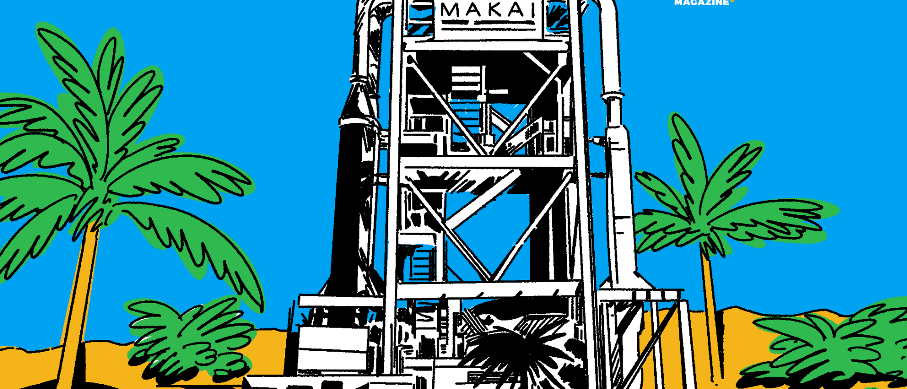

## KONCEPT SYSTÉMU OTEC

> <b>„Existuje mocná, poslušná, rychlá a snadno dostupná energie, které lze ke všemu použít a která vládne i na mé lodi. Vykonává zde 
> všechnu práci. Svítí mi, hřeje mě, je duší mých strojů. A tato energie je elektřina."</b>
>  Jules Verne - Dvacet tisíc mil pod mořem (pdf překlad)

<big>Technologie OTEC se zrodila v roce 1881, kdy francouzský fyzik Jacques Arsene d'Arsonval navrhl získávat tepelnou energii vázanou v oceánu. 
  Inspiroval se románem Julese Verna "Dvacet tisíc mil pod mořem", kde kapitán Nemo poznamenává, že není nouze o energii, kterou by jeho 
  loď Nautilus mohla využít, například "získávat elektřinu díky rozdílným teplotám v různých hloubkách".</big>

<big>D'Arsonval navrhl využít tyto rozdílné teploty k pohonu tepelného motoru, který přeměňuje teplo na mechanickou energii. Jeho myšlenka 
  zařízení s Rankinovým cyklem vycházela z práce Williama Rankina, skotského strojního inženýra z poloviny 19. století, který popsal 
  idealizovaný termodynamický cyklus, v němž se mechanická práce získává z kapaliny při jejím pohybu mezi tepelným zdrojem a chladičem. 
  OTEC lze provozovat přímo na pobřeží nebo jej propojit s pevninou ze vzdálené oceánské plošiny, skryté z dohledu.</big>

<big>Více než miliarda lidí žije v pásmu 100 kilometrů od tropického pobřeží, kde je v hloubce jednoho kilometru teplotní rozdíl mezi teplou 
  povrchovou a studenou hlubokomořskou vodou 25 °C. Tento rozdíl (ΔT) je pro OTEC ideální. Při pokojové teplotě pracovní kapalina, jako je čpavek, 
  vře a odpařuje se. Snížíme-li teplotu v kondenzátoru v hluboké studené mořské vodě, čpavek opět zkapalní. Rozdílné teploty společně vytvářejí 
  Rankinův cyklus, který pohání turbínu a vyrábí elektřinu. Výsledkem je čistá, nepřetržitá základní energie, která běží po celý rok a může 
  poskytovat bezplatné chlazení pro budovy, infrastrukturu nebo těžební zařízení. Stačí jen čerpat vodu na povrch a nechat pracovat fyziku.</big>

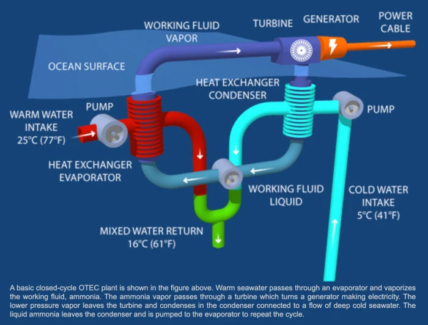
<small>Image source: Makai Ocean Engineering</small> 
 

<big>Na d'Arsonvalův odkaz navázali další inženýři, například Ben J. Campbell, který v roce 1913 předpověděl, že tropické oceány by mohly 
  představovat neomezeně velkou a nevyčerpatelnou zásobárnu potenciální energie, jež by mohla bohatě pokrýt veškeré energetické potřeby 
  člověka budoucnosti. První elektrárna OTEC však byla dokončena až v roce 1930.</big>

<big>Georges Claude, d'Arsonvalův žák - známý jako "francouzský Edison" díky svým objevům v oblasti neonových světel a průmyslových plynů - přišel 
  o celé své jmění v živořící OTEC elektrárně v zátoce Matanzas na Kubě a v nákladní lodi, které měly vyrábět a prodávat led obyvatelům 
  Ria de Janeira. Projekty, které sužovaly logistické problémy, bouře, pochybení a rostoucí náklady, nakonec ztroskotaly.</big>
  
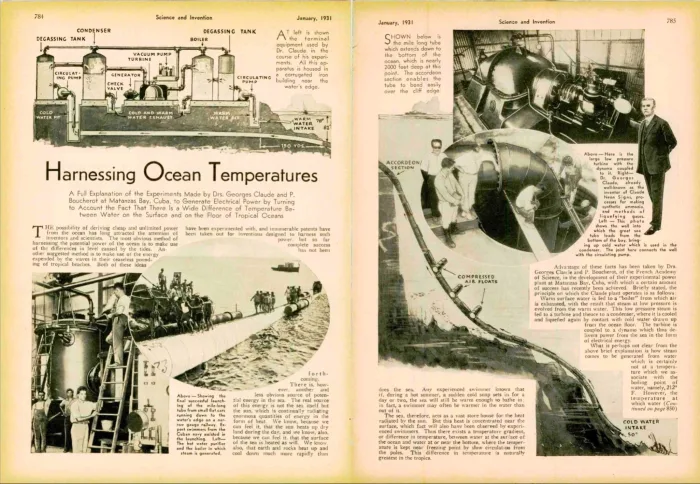
<small>Image source: “Science and Invention,” January 1931</small> 
 

<big>Claude dokonce uvažoval o tom, že by, pro zvýšení výnosů své elektrárny, extrahoval z mořské vody pomocí OTEC mikroskopická zrnka zlata. 
  Nemohl tušit, že téměř o sto let později budou oceánografové využívat mořskou vodu k získávání nového druhu digitálního zlata z počítačů.</big>

<big>Nikola Tesla považoval tepelnou energii oceánu za velmi perspektivní a navrhl optimalizace Claudova tepelného motoru s cílem zlepšit 
  logistiku a ekonomiku. Oba inženýři zjistili, že jejich pokusy o využití bohaté zemské energie budou narážet na úspory z rozsahu.</big>

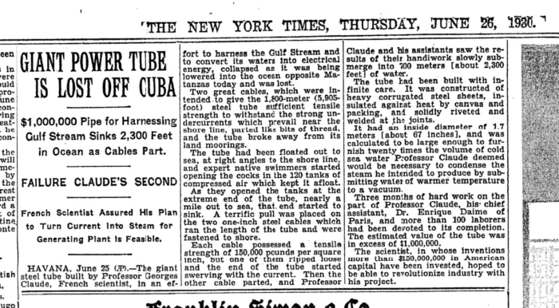
<small>Image source: The New York Times, June 26, 1930</small> 
 

<big>Claudeovy ztráty způsobily, že se investoři začali technologii OTEC obávat. Během několika let došlo k objevu jaderného štěpení a v roce 1944 
  oznámil významný ropný geolog Everette DeGolyer americké vládě, že země Blízkého východu disponují nespočetným objemem ropy. DeGolyer ve své 
  zprávě pro ministerstvo zahraničí poznamenal: "Ropa v tomto regionu je nejvyšší výhrou v dějinách." Po takovém objevu měl být systém OTEC 
  na další desetiletí přehlížen a jen málo vlád bylo ochotno investovat více času nebo peněz do průzkumu nebo rozvoje této začínající technologie.</big>

## NOVÁ NADĚJE PRO OTEC

> <b>"Kdybychom využili pouhá dvě procenta energie dostupné v tepelném rozdílu oceánů, měli bychom k dispozici mnohonásobně více energie, 
> než svět nyní potřebuje."</b>
>  Bryn Beorse, University of California at Berkeley, 1977

<big>O OTEC zůstává sporadický zájem, zejména na Havaji. V roce 1979 stát Havaj, společnost Lockheed Corporation a dvě další společnosti ve vzájemné 
  spolupráci vytvořily "Mini-OTEC", první úspěšný uzavřený, soběstačný provoz využívající tepelnou energii oceánu. Toto plovoucí zařízení 
  o výkonu 50 kilowattů (kW) používalo pro přívod studené vody polyethylenové potrubí o průměru dvou stop a délce 2 150 stop.</big>

<big>Havajské ostrovy později v roce 2015 přijaly zákon nařizující, aby se do roku 2045 veškerá energie ve státě vyráběla z obnovitelných zdrojů. 
  Havajské ostrovy, které leží v teplých vodách Tichého oceánu, mají jedinečnou energetickou síť, která je podobná té v Texasu, protože je zcela 
  izolovaná a oddělená. Navíc je však komplexnější, neboť každý ostrov má svou vlastní izolovanou rozvodnou síť. Jednotlivé ostrovy nejsou 
  k sobě energeticky napojeny ani energii vzájemně nesdílejí a neexistuje ani žádná politická vůle ostrovy propojit. Ironií je, že Havajské 
  ostrovy jsou fyzicky obklopeny obrovským množstvím potenciální energie, ale nemají příliš velkou motivaci ji využívat.</big>

<big>Velký havajský ostrov spolu s řídce osídlenými okolními ostrovy mají zatížení přibližně 200 megawattů (MW) a měly by být schopny snadno 
  splnit státní mandát pomocí konvenčních obnovitelných zdrojů energie, včetně geotermální. Oahu, nejlidnatější havajský ostrov, je však 
  v obtížnější situaci.</big>

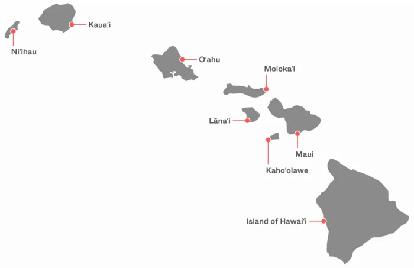
<small>Image source: Only One</small> 
 

## PROBLÉM OSTROVA OAHU

<big>Oahu je domovem přibližně 1 milionu lidí (z 1,4 milionu obyvatel státu Havaj) a má zatížení 2 000 MW, přičemž zde není téměř žádná volná 
  půda pro umístění nových inženýrských sítí. Podle Nathaniala Harmona - oceánografa a zakladatele a jednatele společností Blockchain Solutions 
  Hawaii a OceanBit Energy, které kombinují těžbu bitcoinu a OTEC - budou konvenční obnovitelné zdroje na Oahu buď nedostatečné, nebo z řady 
  důvodů neudržitelné.</big>

<big>Harmon spočítal, že pokud by se měla nahradit 600 MW elektrárna na fosilní paliva Kahe na ostrově Oahu přerušovaným větrem, bylo by zapotřebí 
  vybudovat větrnou farmu na moři o velikosti samotného ostrova Oahu, jejíž náklady by činily přibližně 19 miliard dolarů. Potřebovala by také 
  systém baterií a obrovské množství kabelů a kotvišť. Větrná farma takového rozsahu by se setkala s velkým odporem komunity v oblasti životního 
  prostředí, protože do kanálu Kaiwi se každoročně z Aljašky připlouvají rozmnožovat velryby.</big>

<big>Co se týče solární energie, Oahu by potřebovalo dostatek panelů a pozemků o rozloze čtyřnásobku jeho mezinárodního letiště, přičemž by mezi 
  jednotlivými panely nebyl žádný prostor. K výrobě stálé energie by opět byly zapotřebí baterie a umístění infrastruktury by výrazně poškodilo 
  životní prostředí.</big>

<big>Pokud jde o jádro, na Oahu není prakticky žádný prostor, kde by bylo možné takovou elektrárnu postavit. Přestože je energie z jádra spolehlivou, 
  čistou a bezpečnou formou výroby energie, neexistuje způsob, jak provést evakuaci ostrova v případě tsunami, sesuvu půdy nebo havárie.
</big>

<big>Technologie získávání energie z mořských vln, která se dosud neosvědčila a nemá spolehlivou historii, by pokryla pouze zhruba 17 % energetické 
  potřeby ostrova Oahu, a to za předpokladu, že by ostrov dokázal využít celé své pobřeží.</big>

<big>I kdyby se podařilo najít pozemky, vykoupit či vyvlastnit je, zničit stávající životní prostředí a přestavět distribuční a přenosovou síť 
  na Oahu tak, aby vyhovovala konvenčním obnovitelným zdrojům, z finančního hlediska by to nedávalo smysl. A připomínám, že každý ostrov 
  má svou vlastní izolovanou síť a neexistuje politická vůle je propojit.</big>

<big>S 30 centy za kilowatthodinu již nyní Havaj platí nejvyšší náklady na energii v zemi. V roce 2020 společnost Hawaiian Electric nakoupila 
  od výrobců energii v hodnotě přibližně 6,75 milionu dolarů, která nebyla využita. Účet za toto plýtvání je přenesen na obyvatele Havaje. 
  Kdyby energetická společnost využila odezvu na poptávku po těžbě bitcoinu, podle Harmonových výpočtů by jí to přineslo příjmy převyšující 
  8 milionů dolarů.</big>

<big>Harmon je přesvědčen, že OTEC je pro Oahu jedinou reálnou možností, jak splnit svůj mandát v oblasti obnovitelných zdrojů energie. Jeho 
  společnost OceanBit doufá, že technologie OTEC bude realizovatelná díky zapojení bitcoinové těžby. Společnost OceanBit získala technickou 
  podporu od společnosti Makai Ocean Engineering, která vybudovala první výzkumné zařízení OTEC připojené k síti v Kailua-Kona na Velkém 
  ostrově. Jedná se o malou elektrárnu s uzavřeným cyklem o výkonu 100 kW, která stojí přímo na pobřeží.</big>

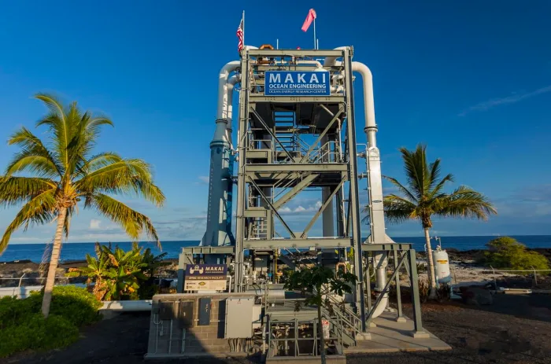
<small>Image source: Makai Ocean Engineering</small> 
 

<big>Přesto se zatím nepodařilo prokázat, že by OTEC bylo možné realizovat ve velkém měřítku. Kritici oprávněně poukazují na dlouhou historii 
  fyzikálních a ekonomických problémů. Elektrárna o výkonu 100 MW by potřebovala potrubí na studenou vodu o průměru asi 35 stop (~10,5m), 
  které by dosahovalo hloubky jednoho kilometru, a toto potrubí by muselo zůstat spolehlivě neporušené a připojené i při bouřích a silných 
  proudech po celá desetiletí. Ekonomické výzvy jsou stejně odstrašující, ale Harmon má tajnou zbraň: bitcoin.</big>

## ÚDOLÍ SMRTI VÝVOJE INOVACÍ

<big>Abychom pochopili, proč se Bitcoin a OTEC tak dobře doplňují, je důležité si uvědomit jak ekonomické aspekty, které musí OTEC překonat, 
  tak symbiotický vztah mezi ASIC těžaři a samotným oceánem. Pokrok v oblasti OTEC je v současné době omezen takzvaným údolím smrti inovací. 
  Prototypová zařízení OTEC nejsou komerčně atraktivní, ale jsou nezbytná k tomu, aby přesvědčila investory, že riziko je vzhledem k velikosti 
  potenciálního trhu zvládnutelné.</big>

<big>Menší zkušební zařízení, jako je například 100 kW elektrárna Makai v Koně, vyrábějí elektřinu za více než 1 dolar za kilowatthodinu. Při této 
  ceně nemají žádní odběratelé zájem, ale i přes neprodejnost takové elektřiny je možné v malém měřítku získat možnost financování.</big>

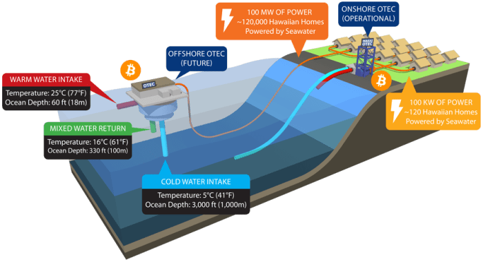
<small>Image source: Makai Ocean Engineering</small> 
 

<big>Odhaduje se, že velká elektrárna OTEC o výkonu 100 až 400 MW by vyráběla elektřinu v rozmezí 6 až 20 centů za kilowatthodinu. Než však bude 
  možné simulovat a postavit velkou elektrárnu, musí inženýři postavit zkušební zařízení středního rozsahu (5 až 10 MW), které prokáže, že zvládne 
  spolehlivě udržovat přívodní potrubí studené vody tak, aby vyrábělo nepřetržitě základní výkon po dobu přibližně dvou a půl roku. Problémem je, 
  že propojená středně velká elektrárna by stála asi 200 až 300 milionů dolarů a vyráběla by elektřinu v rozmezí 50 centů až 1 dolar za kWh. 
  Za takovou cenu nikdo v síti energii nekoupí. Každý, kdo by financoval středně velkou elektrárnu OTEC, by na své nemalé investici prodělal. 
  Stát Havaj si takovou ztrátu nemůže dovolit.</big>

<big>Tato hádanka vnukla Harmonovi nápad. Co kdyby tým optimalizoval středně velké zařízení OTEC pro těžbu bitcoinu?</big>

<big>Typický bitcoinový těžař vynaloží značné množství času, energie a peněz na chlazení svých ASIC minerů pomocí klimatizace nebo kapalinového 
  chlazení a tyto náklady snižují ziskovost. Hlavním odpadním produktem OTEC je však téměř nekonečný a nepřetržitý přísun studené vody 
  o teplotě 5 °C. <b>Nejenže OTEC produkuje chlazení zdarma, ale také poskytuje takovou úroveň chlazení, ke které nemá přístup téměř nikdo 
  jiný v těžebním průmyslu - podle Harmona stačí k přetaktování těžebních zařízení o 30 až 40 %. Díky tomu může OTEC v podstatě dosáhnout 
  indikátor energetické efektivity (PUE) úrovně 1 - což představuje téměř dokonalou efektivitu. Může se jednat o nejúčinnější způsob těžby 
  bitcoinu.</b></big>

<big><b>Pokud neexistuje žádný odběratel energie ze středně velkého zkušebního zařízení za 50 centů až 1 dolar za kilowatthodinu, pak není třeba 
  jej připojovat k pevnině - to znamená úsporu 40 až 100 milionů dolarů, neboť není zapotřebí pokládat kabel v moři. Pokud není třeba připojovat 
  zařízení k pevnině, není třeba získávat povolení ani jej kotvit - to jsou další desítky milionů dolarů úspor. A pokud není nutné zařízení 
  kotvit, pak je možné s ním dynamicky manévrovat pomocí vlastního výtoku a není nutné vynakládat neúměrně vysoké náklady na jeho ochranu 
  proti hurikánům. A pokud lze se zařízením manévrovat, může se v oceánu "pást" a hledat nejoptimálnější místo pro OTEC s nejteplejšími 
  povrchovými vodami a největším teplotním rozdílem, aby se tak maximalizovala účinnost a zabránilo se inovačnímu údolí smrti. To se shodou 
  okolností nachází v horké a bezvětrné oblasti podél rovníku zvané doldrums, proslavené uvízlými loděmi z dob plachetnic.</b></big>
  
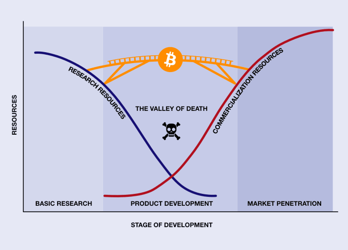
<small>Image modified from Ocean Energy Systems</small> 
 

<big></b>V rozhovoru pro tento článek Harmon uvedl, že účinnost výroby energie OTEC roste s kvadrátem delta T. Teoreticky lze zdvojnásobit účinnost 
  OTEC s dalšími 8ºC rozdílu teplot. Jinými slovy, přesunem z Havaje (kde je průměrná roční teplotní delta  20ºC) na rovník (kde je průměrná 
  roční delta T 28ºC) lze z 5 MW zařízení udělat 10 MW zařízení.</big>

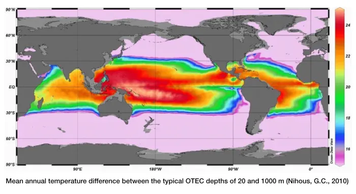
<small>Image source: Ocean Energy Systems</small> 
 

<big>Harmon tvrdí, že díky všem těmto optimalizacím a snížení kapitálových výdajů může jeho tým snížit cenu za kilowatthodinu plovoucí středně velké 
  OTEC elektrárny na 11 centů. V kombinaci s bezplatným chlazením a přetaktovanými těžebními zařízeními by testovací zařízení bylo schopno prodávat 
  svou vázanou energii symbiotickému a vysoce optimalizovanému odběrateli ve společné lokalitě: bitcoinovým těžařům.</big>

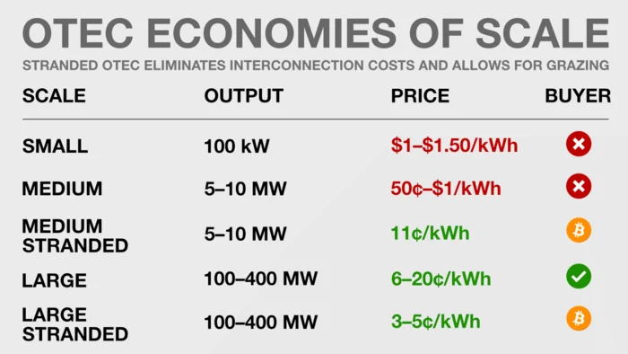
<small>Image source: author</small> 
 

<big>Harmon také očekává, že středně velké testovací zařízení, plovoucí v mezinárodních vodách a optimalizované pro těžbu bitcoinu, umožní 
  technologii OTEC poprvé v historii překonat údolí smrti inovací.</big>

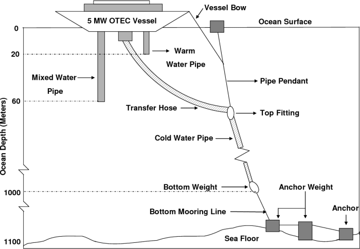
<small>Image source: “OTEC Technology- A World Of Clean Energy And Water”</small> 
 

## HOJNOST ENERGIE A FLEXIBILNÍ VYTÍŽENÍ BITCOINU

<big>V tropických lokalitách, které jsou vhodné pro rozsáhlý systém OTEC, může být k dispozici také hodně přerušované sluneční a větrné energie 
  včetně velkého krácení její výroby. Harmon předpokládá, že tyto regiony by mohly toto krácení směřovat do svých elektráren OTEC, kde by chlazené 
  a přetaktované bitcoinové minery mohly být optimalizovány pro spotřebu přebytečné energie a snižovaly náklady na velkokapacitní OTEC.</big>

<big>Region, který by tuto architekturu využíval, by měl k dispozici levnou, čistou a nepřetržitou energii základního zatížení, přičemž flexibilní 
  zatížení ve špičkách by bylo dotováno příjmy z těžby bitcoinu. Díky větší hojnosti energie lze OTEC využít k napájení odsolovacích zařízení, 
  která by těmto regionům poskytovala čerstvou pitnou vodu a zároveň udržitelným způsobem získávala surové minerály z mořské vody. Ještě 
  kontroverznější je, že by se díky ní mohla poprvé stát ziskovou těžba manganových konkrecí z mořského dna - geod obsahujících koncentrace 
  minerálů v ekonomické hodnotě bilionů dolarů.</big>

<big>V tropickém prostředí je často zvýšená potřeba klimatizace po celý rok. To obvykle zvyšuje náklady na elektřinu a vysoká poptávka po ní často 
  vyžaduje energii z neobnovitelných zdrojů. OTEC může snížit potřebu energeticky náročné klimatizace tím, že bude pro blízké budovy zajišťovat 
  klimatizaci mořskou vodou (SWAC). Studená voda o teplotě 5 °C se ze zařízení OTEC čerpá přes výměník tepla do uzavřeného systému chlazené vody. 
  Smyčka prochází různými ventilátorovými jednotkami, které vhánějí vzduch přes chladicí potrubí a zajišťují tak přívod chladného vzduchu 
  do obytných prostor.</big>

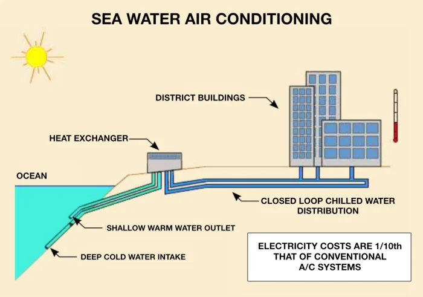
<small>Image modified from The Brando</small> 
 

## HAVAJSKÁ TRADICE UDRŽITELNÝCH PŘÍRODNÍCH ZDROJŮ

<big>Před kontaktem s obyvateli Západu mělo Havajské království dlouhou tradici udržitelného využívání dostupných přírodních zdrojů. Domorodé 
  obyvatelstvo mělo kulturní tradici známou jako ahupua'a - rozvodí a společné rozdělení půdy v rámci vodních toků a údolí. K ahupua'a patřila 
  půda od hor až k pobřeží a pobřežní oceán sahající až ke korálovému útesu včetně něj. Domorodci pěstovali na náhorních plošinách taro a sváděli 
  na svá pole potoky, které odnášely živiny do kameny obehnaných rybničních ústí na pobřeží oceánu. V těchto ústích se ve směsi sladké vody 
  s vysokým obsahem živin a slané vody z oceánu pěstovaly jejich oblíbené ryby.</big>

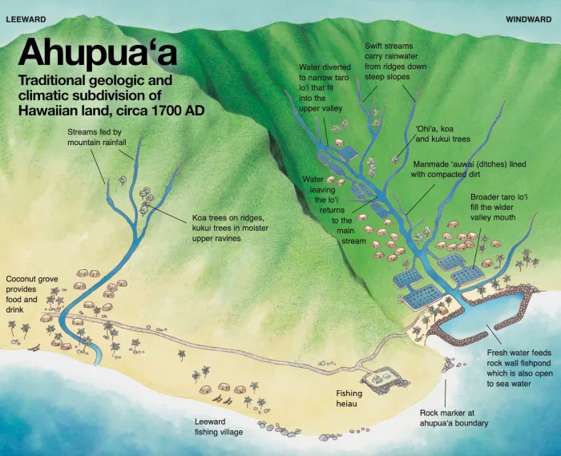
<small>Image source: Water for Life, Hawaii Board of Water Supply</small> 
 

<big>Před příjezdem kapitána Jamese Cooka na Havaj v roce 1778 zde žily statisíce lidí, kteří byli po stovky let zcela izolováni od okolního světa. 
  Dnes Havaj dováží přibližně 85 % svých potravin a 95 % energetických zdrojů.</big>

## OD TRADICE K MODERNÍ UDRŽITELNOSTI

<big>Studená voda, kterou OTEC získává z hlubin oceánu, je bohatá na minerály a živiny. Mořský život na povrchu oceánu se nakonec stává detritem 
  a neustále padá do hlubin oceánu. Oceánská termohalinní cirkulace přenáší značné množství detritu do Tichého oceánu, kde se hustota živin 
  ještě zvyšuje. Vedlejší produkt systému OTEC lze využít nejen k napájení a chlazení bitcoinových minerů, ale jeho živiny lze využívat 
  i v zemědělství nebo akvakultuře.</big>

<big>Vodu získanou pomocí zařízení OTEC lze použít k odsolování nebo k výrobě ekologického vodíkového paliva pomocí energeticky náročné elektrolýzy, 
  přičemž všechny tyto procesy jsou poháněny OTEC technologií. Veškerá nevyužitá voda se vypouští zpět do oceánu. Živiny vrácené zpět do moří 
  zvyšují účinnost mělkého fytoplanktonu, který může vázat oxid uhličitý do hlubin oceánu, jak se tento mořský život stává padajícím detritem. 
  Účinky tohoto vypouštění je však třeba studovat ve větším měřítku. Je třeba poznamenat, že pokud by se umělé vzestupné proudění neudržovalo 
  donekonečna, účinky by se nakonec obrátily a možná by ještě více zvýšily teplotu. Proto by Harmon mnohem raději viděl, kdyby se tyto živiny 
  staly rezervoárem uhlíku na pevnině a zlepšily výnosy plodin pro lidstvo, čímž by dosáhly trvalejšího účinku.</big>

<big>Použitím elektřiny v mořské vodě lze vytvořit umělé útesy díky procesu známému jako elektrolýza mořské vody, kdy se kolem katody tvoří 
  uhličitan vápenatý, který nakonec pokryje elektrodu materiálem třikrát pevnějším než beton. Tento proces akrece zdokonalil Wolf Hilbertz, 
  jenž se nechal inspirovat britským vědcem Michaelem Faradayem z poloviny 19. století, známým především díky vynálezu stejnosměrné baterie. 
  Faraday si při průchodu elektřiny vodou všiml nadýchaných bílých částic. Při správné kultivaci se z této sraženiny vytvoří uhličitan vápenatý, 
  látka, z níž jsou tvořeny korály a mušle.</big>

<big>Elektrolýzu mořské vody poháněnou technologií OTEC lze využít k vytváření samoopravných porézních útesů, které účinně rozptylují energii vln a chrání a obnovují erodované pláže, pobřeží a mořské prostředí rychleji, než může stoupat hladina moře. Tyto neuvěřitelně pevné struktury by jednoho dne mohly dokonce podporovat nová udržitelná lidská sídla a vytvářet umělá souostroví zásobovaná dostatkem elektřiny, sladké vody, potravin a paliva z OTEC zařízení.</big>

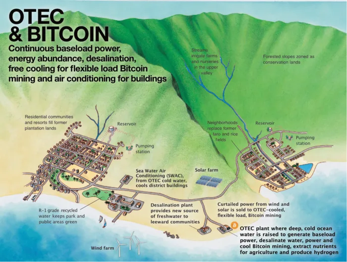
<small>Image source: Water for Life, Hawaii Board of Water Supply</small> 
 

## POSTAVIT, TESTOVAT A STUDOVAT

> <b>"Pokud máte neomezenou energii, můžete vyřešit jakýkoli problém... OTEC mění povrch oceánu v obří solární panel. Na světě není dostatek 
> lithia, aby bylo možné instalovat baterie a solární panely, které by poháněly celosvětové energetické zdroje. Takže místo toho využijete 
> oceán, který to už dělá."</b>
>  –Nathaniel Harmon, “Bitcoin, Energy, And The Environment”

<big>Technologie OTEC může mít i nežádoucí dopady na životní prostředí a studium těchto negativních externalit je jedním z hlavních cílů 
  středně velkého testovacího zařízení, které Harmon a jeho tým plánují vybudovat. Elektrárny mohou být hlučné a mohou mít vliv na mořské 
  živočichy, takže je třeba studovat tlumení hluku. Dalším potenciálním problémem je užití sloučenin proti zanášení, jimiž se chrání potrubí 
  před korozí. A čerpání příliš velkého množství vody s vysokým obsahem živin na hladinu, aniž by byla dobře využita, může podpořit hnilobný 
  proces. Řešením je vypouštění smíšené vody do střední hloubky, kde pokračuje v koloběhu detritu. Tím se navíc změní trofická struktura 
  okolí, kterou je také třeba prozkoumat.</big>

<big>Zatímco vodu s vysokým obsahem živin ze zařízení OTEC lze využít v zemědělství a k produktivní sekvestraci uhlíku na pevnině, dalším 
  možným využitím této vody je akvakultura. Její "umělé vzestupné proudění" kopíruje proudy vyskytující se v přírodě, zodpovědné za výživu 
  a podporu největších mořských ekosystémů na světě a za největší hustotu života na planetě. V této mořské vodě bohaté na živiny se dobře 
  daří nepůvodním druhům, jako jsou mořští šneci, pstruzi, ústřice, škeble a studenovodní mořští živočichové, například humr a losos, které 
  by bylo možné chovat v tropických lokalitách. Tím by se snížila potřeba dálkové přepravy a energeticky náročného chlazení v tropických 
  oblastech, kde se ulovené mořské plody často rychle kazí. Ironií osudu je, že technologie, která byla inspirována Verneovým smyšleným 
  příběhem o mořských sídlech, by mohla velmi dobře sloužit k vybudování stálých obydlí, výzkumných laboratoří a bitcoinových citadel 
  v mezinárodních vodách.</big>

<big>Prvním krokem Harmona a jeho týmu bude modernizace 100kW elektrárny Makai v Kailua-Kona na Velkém ostrově, která bude vybavena 
  bitcoinovými minery S9. Tato elektrárna je příliš malá na to, aby vydělávala peníze, ale bude demonstrovat integrovanou technologii 
  chlazení ze systému OTEC. Dále chce tým pracovat na demonstraci ve středním měřítku pomocí plovoucí kontejnerové platformy.
</big>

## OTEC A TERAFORMACE

<big>Je pozoruhodné, že OTEC lze využít ke zvýšení srážek a zmírnění vysokých teplot v tropech. Elektrárna o výkonu 100 MW by byla schopna 
  každou minutu přečerpat na povrch přibližně 12 milionů galonů (45 400 m3) vody o teplotě 5 °C, což je o něco více než výtlak bitevní lodi 
  třídy Bismarck. Ačkoli je zapotřebí dalšího výzkumu, teoreticky, pokud by řada velkých elektráren OTEC nasměrovala v určitém regionu toto 
  proudění na povrch, mohlo by to potenciálně příznivě ovlivnit počasí.</big>

<big>Když je povrch oceánu teplý, vzniká systém tlakové níže vytvářející suché a teplé oceánské větry. Výhodnější je vlhký vítr od oceánu 
  směrem k pevnině, který zvyšuje množství srážek, odvrací sucha a podporuje příjemnější letní teploty (pod 35 °C) na pevnině. Stoupání 
  desítek miliard galonů studené vody směrem k povrchu oceánu by teoreticky mělo mít právě takový účinek - tropické oblasti by se staly 
  mírnějšími a lépe zavlažovanými. Lokality jako Blízký východ, severovýchodní Afrika, indický subkontinent a Austrálie by zřejmě mohly mít 
  prospěch z kontroly svých horkých a suchých letních období a nepravidelných srážek. Tyto účinky jsou samoomezující, neboť OTEC nefunguje, 
  pokud se povrchové teploty příliš ochladí. Nicméně samostatné plovoucí platformy OTEC těžící bitcoin se mohou snadno přemístit 
  na optimálnější místa.</big>

<big>Když byl Harmon postgraduálním studentem na Havajské univerzitě v Manoa - studoval mořskou geologii a geochemii - navrhl výzkum, 
  jak by se Bitcoin mohl stát transportní vrstvou v knize Jeremeyho Rifkina "Třetí průmyslová revoluce". Harmonův návrh nebyl přijat dobře. 
  Profesor Camilo Mora neměl zájem. Dr. Michael J. Roberts, profesor ekonomie, mu poslal e-mail, že jeho výzkum je "vážně scestný", vyzval ho, 
  aby zanechal školy a začal pracovat pro bratry Winklevossovy a přečetl si Paula Krugmana, aby mohl řádně kritizovat ekonomiku Bitcoinu.
</big>

<big>Harmon se domnívá, že možná nechtěně inspiroval trojnásobně vyvrácené stanovisko Mora et al. z roku 2018 ve vědeckém časopise Nature, 
  které mylně tvrdilo, že Bitcoin sám o sobě by mohl zvýšit globální teplotu o 2 °C. Podle Harmona toto stanovisko napsali vysokoškolští 
  studenti v rámci jednoho z projektů na univerzitě, kteří se možná dozvěděli o jeho výzkumu. Ani Camilo Mora, ani Katie Taladayová jej 
  nenapsali - upravili jej kvůli gramatice, nikoliv kvůli obsahu. Chybný článek je dodnes kritiky bitcoinu citován.</big>

<big>Ale co když Bitcoin a OTEC mohou více než jen stimulovat obnovitelné zdroje energie. Co kdyby společně dokázaly zmírnit klima a omezit 
  extrémní počasí? Teplé tropické vody podél rovníku notoricky generují tropické cyklóny, tajfuny a hurikány, které každoročně způsobují škody 
  za desítky miliard dolarů po celém světě. Teoreticky by se intenzita těchto bouří mohla snížit umělým vypouštěním obrovského množství 
  chladné vody, financovaným z těžby bitcoinu. Jak již bylo zmíněno, výhradou je, že klimatické inženýrství využívající oceán by v globálním 
  měřítku pravděpodobně muselo být udržováno donekonečna, jinak by se příznivé účinky brzy obrátily.
</big>

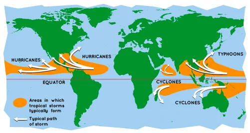
<small>Image source: NASA</small> 
 

<big>V roce 2010 Satoshi Nakamoto ve svém příspěvku na fóru Bitcointalk předpověděl, že těžba bitcoinu by mohla směřovat k zemským pólům, když 
  napsal: "Těžba bitcoinu by měla skončit tam, kde je nejlevnější. Možná to bude v chladném podnebí, kde se vužívá elektrického topení, které 
  by bylo v podstatě zdarma."</big>

<big>Ačkoli Nakamoto zřejmě nevzal v úvahu, že Bitcoin má potenciál čerpat obrovské množství volné energie z tropických oceánů, není 
  metoda OTEC technicky omezena na rovníkové vody.</big>

## ENERGIE JAKO VEDLEJŠÍ PRODUKT

> <b>"Výkon je synonymem pokroku a civilizace."</b>
>  Dr. H. Barjot

<big>K výrobě energie lze využít jakýkoli teplotní rozdíl. V březnovém čísle časopisu Scientific American z roku 1930 navrhl Dr. H. Barjot 
  využít tepelný rozdíl mezi arktickými vodami a vzduchem k výrobě energie v zimních měsících, kdy vodní elektrárny mají snížený průtok. 
  Barjot předpokládal, že jako pracovní kapalinu použije butan, který má bod varu -0,5 °C. Kapalina se kondenzuje s bloky ledové soli tvořené 
  zmrzlým kryohydrátem, nasyceným slaným ledem vyrobeným ze solanky, který recirkuluje mezi kondenzátorem zpět do přilehlého ledového lože, 
  kde znovu zmrzne.</big>

<big>Za předpokladu reálné účinnosti 4 % Barjot vypočítal, že energie získaná ze zmrazení jednoho krychlového metru vody v zařízení Barjot OTEC 
  by se rovnala energii vyrobené ze dvou galonů ropy. Odpadním produktem Barjotovy elektrárny je led.</big>

<small>Image source: Scientific American, March 1930</small> 
 

<big>Přestože moderní inženýři považují Barjotovy myšlenky za z velké části nerealizovatelné, nejsou nemožné. Barjotova elektrárna by mohla 
  být umístěna na ostrovech v polární oblasti nebo na plošinách připevněných k ledovým příkrovům. Taková odloučená zařízení by se mohla 
  financovat z optimálně chlazené těžby bitcoinu a vytvářet tak umělé ledové kry nebo ledovce v Grónsku nebo v údolích Antarktidy, která 
  se nacházejí v blízkosti pobřeží. Ve velmi vzdálené budoucnosti by tato technologie mohla být dokonce využita k teraformaci planet nebo měsíců.</big>

<big>Proces ledovcového štěpování není nijak zvlášť obtížný. Když ve 12. století dorazily na území dnešního severního Pákistánu zprávy 
  o Čingischánovi a postupujících Mongolech, vesničané prý zablokovali horské průsmyky tím, že přes ně nechali narůst ledovce. Umění roubování 
  ledovců se definitivně praktikuje přinejmenším od počátku 19. století v horách Hindúkuše a Karakoru, a to za účelem zavlažování a zachování 
  přístupu k čerstvé vodě.</big>

<big>Barjotův návrh dále ilustruje, jak mohou vázané teplotní rozdíly produkovat značné množství energie a žádoucích vedlejších produktů, 
  jako jsou živiny, umělé útesy, akvakultura, odsolená voda, minerály nebo dokonce ledové kry. V jistém smyslu by se dalo uvažovat o zadržené 
  energii jako o vedlejším produktu, který lze snadno vyměnit za bitcoiny, aby se projekt stal skutečností.</big>

## POSUN LIDSTVA KUPŘEDU

<big>V roce 1964 navrhl sovětský astronom Nikolaj Kardašev tzv. Kardaševovu stupnici, metodu měření úrovně technologické vyspělosti civilizace na základě množství energie, kterou je schopna získat ze svého okolí. Využití volné energie oceánů planety je nezbytným předpokladem pro pokrok civilizace na této stupnici.

Možnosti využití tepelné energie oceánů jsou téměř neomezené. Zatímco inovátoři minulé éry - včetně d'Arsonvala, Clauda, Campbella, Tesly a Barjota - se svých nápadů nedočkali, Bitcoin může pomoci uskutečnit jejich sny o prakticky bezplatné obnovitelné energii a hojnosti. Zatímco se vlády po celém světě pokoušejí pochopit smysl otevřených, inkluzivních a neutrálních globálních peněz, které monetizují energii, inovace v oblasti výroby energie zůstanou - bez využití Bitcoinu jako kupce poslední instance této vázané energie - utlumeny.

Přesto se zdá, že Bitcoin je předurčen k využití tepelné energie oceánů. Těžba bitcoinů metodou OTEC v mezinárodních vodách by vytvořila ochrannou regulační bariéru před vládami, které by se snažily potlačit nestátní peníze. Díky síle, která by umožnila založit mořské citadely, by technologie OTEC mohla lidem umožnit udržitelný a nezávislý rozvoj v izolovaných vodách - mimo dosah vlád. Čím více budou vlády bojovat proti bitcoinu, tím více bude bitcoin přitahován do energeticky bohatých mezinárodních vod.

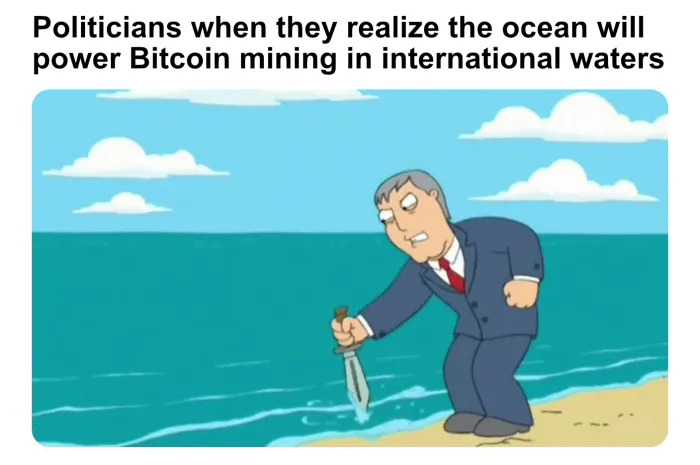
<small>Image source: 20th Century Fox</small> 
 
  
Schopnost Bitcoinu odemykat hojnost energie ztělesňuje to, co Brandon Quittem popisuje ve své eseji "Bitcoin je pionýrským druhem", kde Bitcoin napodobuje biologické systémy, které kolonizují nehostinná prostředí a uvolňují potenciální energii v surových prvcích, aby ji mohly využívat, a prosperovat z ní, pokročilejší druhy.
  

## DOKAŽTE, ŽE TO FUNGUJE

Při vší představivosti a naději na budoucnost plnou energie, kterou by systém OTEC mohl přinést, je třeba zůstat realistou. Stále existují technické problémy, které je třeba vyřešit. V porovnání s tím, čeho bylo dosaženo v oblasti těžby ropy a zemního plynu na moři, však není nemožné tyto překážky překonat. Problémem v současnosti je, že výše uvedené výzvy brání lidstvu škálovat tuto technologii z 10 na 100 MW.

Před Bitcoinem byla 10 MW elektrárna OTEC příliš drahá a její inovační údolí smrti příliš široké. Rovněž zde máme environmentální otázky, ale nic v takovém měřítku jako při těžbě nebo spalování fosilních paliv. V rámci procesu škálování je zapotřebí komplexní studie.

V dlouhé historii futuristického snění o lepší budoucnosti však přeměna tepelné energie oceánů zaznamenala více neúspěchů než zdarů. Její funkčnost zůstává otázkou. Dobrou zprávou je, že nemusíme věřit oceánografům a inženýrům, kteří o OTEC nebo o jakékoli jiné energetické technologii tvrdí něco mimořádného. Testovací laboratoří pro škálování nových forem výroby energie je namísto toho Bitcoin. Těžební zařízení a jejich veřejné adresy peněženek investorům i široké veřejnosti prokáží, zda jsou testovací zařízení schopna vykonávat práci, kterou tvrdí. V tomto světle je proof of work jen jiným výrazem pro důkaz funkčnosti - "prove it works" - dokaž, že to funguje.

Bitcoinu je jedno, zda OTEC funguje, nebo ne. Pokud pilotní elektrárna vyrobí slibovanou energii, bude její stavitelský tým odměněn. Ve veřejné účetní knize bude zřejmý symbiotický odběratel vázané energie z téže lokace, jenž pomůže elektrárně zajistit si financování potřebné k rozšíření provozu. V opačném případě experiment selže bez odměny. Bitcoinová těžební zařízení se připojí k jakémukoli jinému zdroji energie na kterémkoli odlehlém místě a budou připravena platit za svou energii digitálním zlatem. Bitcoin bude konečným soudcem a porotou, zda OTEC vyroste, nebo zahyne.

V tom spočívá krása těžby bitcoinu a proof of work, energeticky náročného digitálního aktiva, které paradoxně odemyká lidskou prosperitu a hojnost energie. Claude nikdy nedokázal z mořské vody vytěžit dostatek mikroskopických částeček zlata nebo prodat dostatek ledu, aby mohl financovat své plovoucí projekty OTEC. Mít u sebe spolehlivého lokálního odběratele energie, mohl by však uspět. Uvolněním energie nepřístupných pobřeží a vzdálených plošin může lidstvo zahájit proces čerpání energie způsobem dosud neuskutečnitelným.

Poprvé se nám naskýtá možnost ekonomicky využít planetární energii. Díky bitcoinu zůstává lidský inovační duch silný. Cesta nebude snadná a čeká nás ještě mnoho práce. A při tom všem bude Bitcoin připraven, ochoten a schopen vést lidstvo touto cestou k budoucnosti energetické hojnosti, prosperity a svobody.

## ---
<big>Autor: <a href="https://twitter.com/level39">Level39</a>
 Původní článek: 
  <a href="https://bitcoinmagazine.com/business/bitcoin-unlocks-ocean-energy">How Bitcoin can unlock the energy of the ocean for 1 billion people</a>
 Přeložil:</big> ⚡ <a href="lightning:nekonecnik@stacker.news">nekonecnik@stacker.news</a> 🔗 Samourai 
PayNym 🤖 <a href="https://paynym.is/+muddydarkness33F">+muddydarkness33F</a>
  
  

  <footer>
    

    
  </footer>

  
