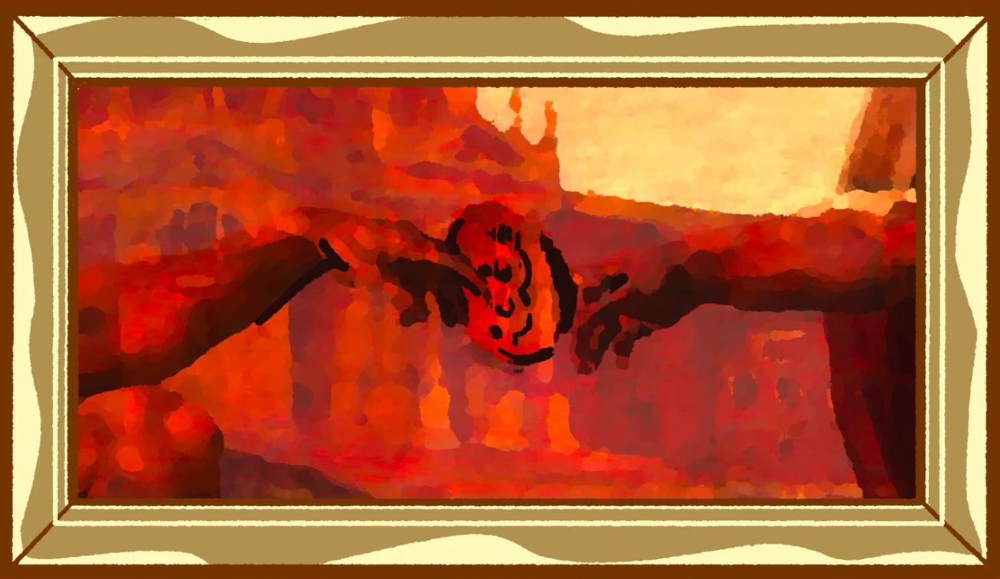
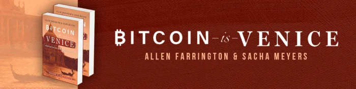

<header>

  
  


</header>

This is 🇨🇿 Czech translation of <a href="https://bitcoinmagazine.com/culture/bitcoin-and-the-truth-of-mixed-martial-arts">this article</a> 
by @allenf32 originally published on Mar28/2022 by  
 Translated @741990 by <a href="https://twitter.com/nekonecnik">@nekonecnik</a> 🧡

# Bitcoin jsou Benátky: Zápas s pravdou
Jakkoli to může být překvapivé, historie bitcoinu reflektuje historii smíšených bojových umění.

<big>Začněme myšlenkovým experimentem: Historie bitcoinu se podobá historii smíšených bojových umění (Mixed Martial Arts - MMA).</big>

<big>Vezměte v úvahu, že ceny vznikají na základě jednání a pravda o cenách je výsledkem experimentování. Není nadiktována. Je opakovaně 
  objevována. Každá transakce šíří znalosti a posouvá cenu směrem k lepšímu konsensu, avšak samotný konsensus je pohyblivým cílem.</big>

<big>MMA prošlo mnoha obměnami od svých kořenů v uměních, jako je judo, až po podobu, kterou známe dnes, a tímto procesem prochází, díky 
  přirozenému experimentu, který představuje každý jednotlivý zápas, i nadále.</big>

<big>Síla cen spočívá v procesu dynamického objevování, který je základem jejich vzniku, nikoli v prchavém konsenzu v určitém časovém 
  okamžiku. Cena není nikdy správná, ale ceny jsou tak správné, jak lze v daném čase doufat. Pokusy o vynucení cen bez možnosti změnit 
  realitu, kterou sdělují, proto nutně narazí na problémy. A přesto, zdá se, nejsme schopni přijmout pravdu o cenách, kdykoli je to nepohodlné. 
  Abychom zajistili, že konsenzus může dospět k platným společenským pravdám, potřebujeme systémy nebo instituce, které odolávají pokusům 
  o nátlak a které využívají decentralizovaná zjistění.</big>

<big>Bojová umění jsou vhodnou případovou studií a povzbudivou alegorií pro vše, co následuje. Ještě před několika desetiletími byla v zajetí 
  nesmyslného donucování. Dnes vzkvétají pod vlivem trhu myšlenek.</big>

## NA POČÁTKU BYL BOJ

> <b>"Když se zamyslíte nad historií bojových umění, je to docela šílené... Od počátku věků se lidé snažili přijít na lepší způsoby, jak někoho 
> rozsekat. Od té doby, co přišli na jazyk a vymysleli, jak učit dovednosti, pracují na technikách. [A teprve] v roce 1993 jsme se dozvěděli, 
> co skutečně funguje."</b>
>  Joe Rogan, “The Joe Rogan Experience MMA Show #98 With Luke Thomas”

<big>Zápas je pravděpodobně nejstarší sport na světě. Nejstarší důkazy o něm pocházejí z jeskynních maleb ve Francii z doby před více než 
  15 000 lety. Zjistili jsme také, že většina dnes praktikovaných chvatů byla známa již ve starověku. Box je o něco mladší, zobrazen byl až 
  ve třetím tisíciletí před naším letopočtem na sumerském reliéfu. Čtenáři by tedy mohlo být odpuštěno, kdyby se domníval, že o umění boje 
  se toho už nelze mnoho dozvědět. A přesto současný svět poznal, které bojové techniky jsou skutečně účinné, teprve až v posledních 
  30 letech. Jen málo sportů se v posledních desetiletích vyvinulo tak výrazně, a ještě méně jich má svůj původ v pravěku.</big>

<big>Jak Rogan zmínil výše, v roce 1993 se zrodil šampionát UFC (Ultimate Fighting Championship). UFC dal vzniknout volnému trhu bojových 
  myšlenek, který se nazývá smíšená bojová umění neboli MMA. Předtím většinu bojových umění chránil před drobnohledem jejich půvab a autorita. 
  Soutěž byla omezená a pravdivost stylistické nadřazenosti nebylo možné definitivně určit. UFC spolu se svou proslulou bojovou arénou, oktagonem, 
  vytvořil prostředí, kde se mohly systematicky testovat konkurenční hypotézy. Když se falešné teorie neměly kam schovat, mohla pravda konečně 
  získat šanci na úspěch.</big>

<big>Nedávný vývoj bojových umění slouží jako jedinečná případová studie pro pochopení způsobů, jakými se vytvářejí, testují a šíří myšlenky. 
  Namísto toho, abyste se s kamarády u piva dohadovali o hypotetickém zápase judo versus karate, UFC provede veřejný experiment. Místo abychom 
  dané bojové umění posuzovali podle toho, jak skvěle vypadá ve filmu, musí prokázat svou účinnost proti zkušenému, motivovanému a odolávajícímu 
  soupeři. Úcta k senseiovi už nepostačí. Strohé nařízení přestalo mít hodnotu. Tradice mohly být zpochybňovány a školy sraženy na kolena. 
  Z netušených koutů světa se objevily další. V tomto smyslu můžeme po roce 1993 říci, že boj přestal být teorií. Stal se praktickým.</big>

<big>Budeme hodnotit evoluci zápasu ve třech scénách: na filmovém plátně, v dódžó a v oktagonu. Volně je propojíme se třemi starořeckými způsoby 
  ovlivňování: patosem (pathos) neboli emocemi, étosem (ethos) čili autoritou a logem (logos) neboli rozumem; a třemi různými způsoby učení: 
  inspirací, rutinou a praxí. Uvidíme, jak se šířily neúčinné myšlenky a co proti nim nakonec zakročilo: kopanec do obličeje to jistil. Toto je 
  příběh o tom, jak UFC vypustil na bojová umění konkurenční síly volného trhu. V důsledku je to alegorie na sílu konkurence, která motivuje 
  k hledání a objevování pravdy.</big>

## FILMOVÁ SCÉNA ANEB PŮSOBENÍ NA EMOCE A ESTETICKÉ VĚDĚNÍ

> <b>"Není možné, aby někdo lhal, pokud si nemyslí, že zná pravdu. Produkovat sračky takové přesvědčení nevyžaduje."</b>
>  Harry Frankfurt, “On Bullshit”

<big>Od 60. let 20. století se o rozšíření východních bojových umění mezi západní publikum zasloužil především Hollywood. Mnoho dnešních 
  nejlepších bojovníků přilákaly filmy jako "Enter The Dragon" Bruce Leeho nebo "Bloodsport" s Jeana-Claud Van Dammem. Romantická představa 
  zkušeného bojovníka, který na své cestě za slávou obratně likviduje tucty grázlů, je víc než dostatečná k tomu, aby většina dětí vyhledala 
  nejbližší oddíl kung-fu.</big>

<big>Pro mnohé byla jejich nerealistická očekávání bohužel odměněna akorát hovadinami. Hollywood se snaží prodávat lístky do kina, ne důsledně 
  testovat bojové techniky v reálných bojových scénářích. Filmy šíří myšlenky a techniky bojových umění vizuálně a emocionálně rezonující s diváky 
  a generující příjmy do pokladen kin.</big>

<big>Staří Řekové tuto metodu přesvědčování lidí nazvali pathos, tedy apel na emoce. Věříte mi, protože mě máte rádi. To, co se dozvíte, víte 
  (nebo si myslíte, že víte), protože to tak cítíte; připadá vám to správné. Je to výrazně estetický způsob získávání znalostí. Je příjemný. 
  Je uklidňující. Jeho formy jsou hladké, symetrické a rovné.</big>

<big>Poznání získané touto formou inspirace může být samozřejmě legitimní, ale to můžeme zjistit pouze na základě důkazu. Pokud je důkaz 
  praktický, na rozdíl od důkazu deduktivního, vyžaduje zkoušku. Možná však tyto metody boje nemají být nikdy testovány, pouze obdivovány. 
  Ve skutečnosti jde za těchto okolností právě o to, aby se takové zkoušce za každou cenu vyhnuly. Je třeba zachovat pocit poznání, nikoli 
  jeho fakt nebo pravděpodobný nedostatek.</big>

<big>Bez ohledu na to, jak dobré tyto filmy jsou - a některé z nich jsou sakra dobré - upřednostňují formu před funkcí. Úder už není veden 
  nejkratší cestou k cíli. Vezme to dramatickou oklikou. Pouliční bitky málokdy končí na zemi. Jsou dokonale choreograficky zpracované 
  v kulisách ulic. Ulice přestává být interaktivním terénem boje a místo toho se stává setrvačným dějištěm melodramatického tance. Když ne 
  tanec, tak rozhodně drama je dostatečně přesvědčivé na to, aby divák pozastavil svou nedůvěru, což je okamžik, kdy virus udeří. Část 
  extravagance zbaštíme kvůli tomu, jak hezky vypadá, a citově se s hrdinou sžijeme. Přesto si ještě dlouho po skončení titulků a rozsvícení 
  světel budou filmoví diváci spojovat karate s téměř nadlidskými výkony. Většina z nás ví, že je to všechno přehnané, ale pravděpodobně budeme 
  stále věřit, že někdo s černým páskem je obávaníhodný.</big>

<big>Seriózní škola bojových umění by se mohla s mírou uchýlit k rozbíjení desek, aby přilákala nové členy, což je zbytečná praktika, jaká 
  se ve slušných školách nevyučuje. Když dojdeme do extrému, dostaneme falešná bojová umění, která vás učí přenášet životní energii nebo 
  čchi do úderů.</big>

<big>To je naprosté fantazírování. Jak hlasatelé, tak příjemci těchto myšlenek jsou rozpolceni, pokud jde o jejich skutečnou účinnost. 
  Jejich hodnocení vychází pouze z pocitů. Něco takového nemůže být empirickému testování vzdálenější. Připomíná to dynamiku sekty, jejíž 
  členové přijímají indoktrinaci čistě kvůli získanému pocitu sounáležitosti.</big>

## DÓDŽÓ, NEBOLI ODVOLÁVÁNÍ SE NA AUTORITU A KODIFIKOVANÉ ZNALOSTI.

> <b>"Vzdělání je obdivuhodná věc, ale je dobré si čas od času připomenout, že nic, co stojí za vědění, se nedá naučit."</b>
>  Oscar Wilde

<big>Před vstupem do dódžó se musíte uklonit. Je to tradice. Je to úcta. Je to japonské. Je to projev úcty k autoritě signalizující ochotu 
  učit se od mistra. Na rozdíl od falešných bojových umění studenti skutečných bojových umění věří svému učiteli a jeho řemeslu díky jeho 
  úspěchům a postavení v širší komunitě. Je to podobné důvěře, kterou vkládáme do policistů a vládních úředníků. Možná nejsme schopni přímo 
  posoudit pravdivost a oprávněnost jejich nároků, ale je logické, že tak učinilo mnoho jiných. Účinnost myšlenek se ověřuje zprostředkovaně.</big>

<big>Dódžó šíří myšlenky odvoláváním se na autoritu neboli ethos. Znalosti, které získáváme, se učíme memorováním. Stejně jako si dítě může 
  zapamatovat časové tabulky provedením určité mentální operace, tak se i kroky karate učí opakováním fyzické operace. Znalost byla kodifikována 
  a předávána dál.</big>

<big>Jedním z největších učitelů - neboli sensei - je Kano Jigoro, který se narodil v roce 1860, osm let před obnovením vlády Meidži, kdy 
  se Japonsko začalo industrializovat. V tomto období také došlo ke zrušení samurajské třídy válečníků. Její tři hlavní disciplíny byly: 
  boj s mečem - neboli kenjutsu - lukostřelba - neboli kyujutsu - a boj beze zbraně - neboli jujitsu. S tím, jak samurajská třída začala 
  zanikat, ztrácely se i její znalosti. Na scénu nastoupill Jigoro. Jigoro sice nebyl samurajem, ale trénoval bojová umění a proslavil se 
  pečlivým zaznamenáváním technik jujutsu, které považoval za nejúčinnější. Svou práci popisoval jako "uchovávání toho, co jsem cítil, že 
  by mělo být zachováno, a vyřazování toho, co jsem cítil, že by mělo být vyřazeno". Staří mistři vyhledávali Jigora, aby se s ním podělili 
  o své techniky v naději, že tak nevymřou. Tito mistři shromažďovali těžce nabytý kapitál v podobě znalostí získaných experimentováním. 
  Protože nebyli schopni tyto vlastní poklady udržovat, natož je opečovávat, doplňovat a rozvíjet, hledali někoho, o kom doufali, že to dokáže. 
  Obávali se, že jejich znalosti přijdou vniveč a nic po nich nezbude. Jigoro nabízel prostředky, jak takové epistemologické katastrofě zabránit. 
  Svou novou školu nazval judo, jemná cesta.</big>

<big>Vzhledem k zadanému úkolu a vysoké kvalitě výsledku se zdá, že Jigoro dokázal zázraky. Judo zůstává jedním z nejúčinnějších bojových umění 
  a je skvělým základem pro začínající bojovníky. Jeho nedostatky však byly vlastní samotné Jigorově metodě. Tím, že rozhodoval, co ponechat 
  a co zavrhnout, vystupoval jako autorita. Dalo by se říci, že jeho doktrína fungovala jako server a všichni, kdo ho následovali, byli pouhými 
  klienty. Jako jediný server bez zpětné vazby ovšem doktrína sama vyvolala sebezranitelnost. Jigorem vytvořená pevná struktura chránila judo 
  jak před kritikou zvenčí, tak před vnitřním experimentováním. Studenti se podřizovali svému senseiovi a pravidla dódžó zakazovala používat 
  techniky jiných tradic.</big>

<big>Co kdybych tě praštil dřív, než by ses přiblížil natolik, abys mě chytil za límec a shodil na zem? To se nesmí. Můžeš soutěžit pouze proti 
  jiným vyznavačům svého umění. V důsledku toho pak takové umění pomalu ztrácí jakékoliv povědomí o reálném průběhu souboje a mění se ve hru, 
  kterou hraje samo proti sobě. Nebijte, nechytejte za kalhoty, nepoužívejte zámky na nohy, necvrnkejte do genitálií. Nezkoušejte, jestli 
  to funguje.</big>

<big>Rigidní techniky a pravidla dané školy vedou k tomu, že se vyvíjí jako druh uvězněný na ostrově. Stává se hyper-specializovaným pro své 
  prostředí. Ale co když se prostředí změní? Trhlina v pověstném brnění dódžó se může objevit během exhibičního zápasu, v němž proti sobě stojí 
  dva styly. V roce 1963 se boxer Milo Savage utkal s judistou Genem LeBellem v soutěži, která měla ukázat převahu amerického boxu.</big>

<big>Věci však nešly podle organizátorských představ. LeBell shodil Savage na zem a škrtil ho do bezvědomí. Jednalo se o první schválený zápas 
  smíšených bojových umění ve Spojených státech. Když se setkají dvě velmi odlišné hypotézy, můžeme se dočkat překvapivých výsledků. Bez zápasu 
  to totiž nelze přesně určit. Musí se to vyzkoušet empiricky. Dalo by se říci, že to nelze modelovat. I kdybychom dokázali dokonale matematizovat 
  schopnosti bojovníků a parametrizovat dynamiku zápasu, výsledek by byl stále výpočetně nezredukovatelný. Proč simulovat celý vesmír, když se vesmír 
  spokojeně simuluje sám? Proč se prostě jen nedívat na probíhající zápas?</big>

<big>Další významný exhibiční zápas se odehrál v roce 1988, kdy kickboxer Rick Roufus bojoval s thajským boxerem Changpuekem Kiatsongritem. Bojovník 
  Thai zvítězil jedinou technikou. Kopal Roufuse do nohou, dokud mu nepřestaly fungovat. Tato technika je v thajském boxu běžná, ale v americkém 
  kickboxu se používala jen zřídka. Po zápase Rickův bratr Duke Roufus v rozhovoru řekl:</big>

<big>"Doufám, že si lidé uvědomí, že Thai boxeři, pokud budou bojovat podle našich pravidel, nevyhrají. A my nebudeme bojovat podle jejich pravidel. 
  Dnes jsme experimentovali, ale zjistili jsme, že to nemá cenu. Ke kopání do nohou není potřeba příliš talentu."</big>

<big>Duke se nakonec stal jedním z nejlepších trenérů thajského boxu v Americe. Uvědomil si, že na tuto jednoduchou, ale účinnou techniku stále 
  nemá kickbox odpověď. Byla v podstatě nepředvídatelná, ale nyní, když byl proveden experiment, vyšla pravda najevo. Teď bylo úkolem tyto 
  poznatky systematizovat.</big>

<big>Celosvětová komunita bojových umění musela, od svých nejranějších počátků, najít způsob, jak techniky testovat opakovaně empiricky, nikoliv 
  estetickým srovnáním nebo myšlenkovými experimenty. Jen tak můžeme doufat v odhalení pravdy.</big>

## OKTAGON, ANEB ODVOLÁNÍ SE NA ROZUM A PRAKTICKÉ ZNALOSTI

> <b>"Skutečné partnerství mezi holistickými lidmi v terénu a výzkumnými pracovníky, kteří jejich úsilí podporují, musí začínat vzájemným 
> respektem. Od dob Descarta a počátků moderní vědy však společnost natolik povýšila status akademického badatele a natolik snížila status 
> hospodáře na půdě, že výzkumník dnes zpravidla hovoří o hospodaření s větší autoritou než člověk, který skutečně denně hospodaří a vyrábí 
> potraviny. A to i přesto, že to byli zemědělci a pastevci, kteří objevili, které rostliny a zvířata lze domestikovat, a z nich pak vyšlechtili 
> tisíce odrůd několik tisíciletí předtím, než se vědci vůbec objevili."</b>
>  Allan Savory, “Holistic Management”

<big>Gracie Challenge byla otevřená pozvánka pro školy bojových umění v losangeleském údolí: přijďte se utkat s členem rodiny Gracie. Kung-fu, 
  judo a karate, ti všichni přijali výzvu v naději, že předvedou převahu svého umění. Zrnité záběry, z nichž většina pochází z počátku 90. let, 
  ukazují jednotný příběh. Graciovi sráželi své soupeře k zemi a škrtili je nebo jim blokovali klouby. Pěkné kopy a údery nebyly pro někoho, 
  kdo se vyzná v boji na zemi, žádným soupeřem. Umění manželů Graciových je dnes celosvětově známé jako brazilské jiu-jitsu (BJJ). BJJ je základním 
  kamenem moderního tréninku smíšených bojových umění. Na počátku 90. let 20. století však bylo prakticky neznámé.</big>

<big>Příběh brazilského jiu-jitsu začíná u potulného japonského emigranta jménem Mitsuyo Maeda. Maeda se narodil v roce 1878 a studoval judo pod vedením jeho zakladatele Jigora. Cestoval po světě a údajně vyhrál více než 2000 profesionálních zápasů, mnoho z nich proti vyznavačům jiných umění. Nakonec se usadil v Brazílii, kde vyučoval verzi juda s velkým důrazem na boj na zemi. Nazval ji jiu-jitsu. Jeden z Maedových žáků se jmenoval Carlos Gracie. Umění se rozšířilo v rodině a nějakou dobu bylo známé jako Gracie Jiu-Jitsu.</big>

<big>Přestože techniky BJJ jsou podobné technikám juda, jeho kultura a tréninková metodika nikoli. BJJ podporuje hravé experimentování. Komunita 
  neustále vyvíjí a testuje techniky nové. Oproti tomu judo má oficiální seznam technik, které může upravovat pouze oficiální orgán. Zatímco judo 
  funguje na modelu klient/server, BJJ je skutečně bojovým uměním typu peer-to-peer; kde se judo zaměřuje na soutěžení v rámci své komunity, BJJ 
  se od počátku soustředilo na testování sebe sama v porovnání s jinými uměními; zatímco judo se zdá být zaměřeno na zdokonalování estetické 
  rovnováhy, BJJ je dynamický proces: nikdy se neustálí, vždy se snaží objevit své vlastní chyby a zlepšit se.</big>

<big>Pravdivosti zakódované v judu je třeba důvěřovat, pravdivost zakódovanou v BJJ lze ověřit. Měřítkem úspěchu BJJ byla vždy efektivita. Nesklání 
  se před autoritami ani se nesnaží přesvědčit estetikou. Odvolává se na rozum neboli logos a poskytuje vědění v podobě toho, co James C. Scott 
  ve svém mistrovském díle " Seeing Like A State", na které opakovaně odkazujeme, nazývá mētis. O této formě poznání Scott píše:</big>

> "Mētis se nejvíce uplatní v podobných, ale nikdy ne přesně stejných situacích, které vyžadují rychlou a cvičenou adaptaci, jež se pro 
> praktikujícího stane téměř druhou přirozeností. Dovednosti mētis mohou zahrnovat i pravidla, ale tato pravidla se do značné míry získávají 
> praxí (často v rámci formálního učení) a vyvinutým citem nebo strategickou obratností. Mētis se vzpírá zjednodušení na deduktivní principy, 
> které lze úspěšně předat pomocí knih, neboť okolní prostředí je natolik složité a neopakovatelné, že formální postupy racionálního rozhodování 
> nelze použít. V jistém smyslu se mētis nachází v onom velkém prostoru mezi oblastí geniality, na kterou nelze aplikovat žádný vzorec, a oblastí 
> kodifikovaných znalostí, které se lze naučit zpaměti."

<big>Mētis - těžce nabyté, objevené, vyvíjející se praktické vědění - je potřebné k jednání, a tam, kde existuje nutnost lidského jednání, vzniká 
  produktivní vědění pomocným, prakticky reflexivním způsobem. Scott píše:</big>

> "Místní a lokální znalosti můžeme oprávněně považovat za znalosti participační, na rozdíl od znalostí obecných. To znamená, že držitel takové 
> znalosti má obvykle vášnivý zájem na určitém výsledku. Pojistitel obchodní lodní dopravy pro velkou, vysoce kapitalizovanou námořní firmu si může 
> dovolit spoléhat se na rozdělení pravděpodobnosti nehod. Ale pro námořníka nebo kapitána, který doufá v bezpečnou plavbu, je důležitý výsledek 
> jediné události, jediné cesty. Mētis je schopnost a zkušenost nezbytná k ovlivnění výsledku - ke zlepšení šancí - v konkrétním případě."

<big>Bojovník MMA netouží po morálním nebo estetickém vítězství, nechce vyhrát hypotetický nebo průměrný, ale tento zápas. Má vášnivý zájem 
  na konkrétním výsledku vlastního vítězství a na tom, aby se vyhnul fyzické bolesti spojené s prohrou. Je hluboce motivován k tomu, aby 
  se učil v daném okamžiku; aby každou akci a reakci bral jako experiment, který může zlepšit jeho výkon. Nechce pouze sledovat výsledek: 
  Chce ho ovlivnit.</big>

<big>V Los Angeles se Rorion Gracie snažil oslovit širší publikum. Vítězství rodiny proti místním školám bojových umění rozšířila její pověst 
  po celém údolí, ale ne daleko za jeho hranice. V roce 1993 Rorion vytvořil šampionát Ultimate Fighting Championship. Stejně jako soutěže 
  neměl mít "žádný časový limit - žádná pravidla". Pozváni měli být bojovníci všech stylů. Rodina Gracieových přihlásila Royce Gracieho ne proto, 
  že by byl jejich nejlepší, ale proto, že díky jeho štíhlé postavě by jeho vítězství bylo ještě výraznější. Royce se stal vítězem prvního ročníku 
  UFC poté, co porazil větší a silnější soupeře technikami, jaké většina z nich nikdy předtím neviděla. Účinnost BJJ už nebylo možné popřít.</big>

<big>Za 28 let se podařilo objasnit mnohé - téměř nic z toho se nedalo předvídat a už vůbec ne modelovat na základě matematických modelů boje. 
  Ukázalo se, že celá umění, například aikido, jsou neúčinná, a efektní umění založená na úderech, jako kung-fu nebo karate, byla překonána 
  prozaičtějším zápasem nebo boxem. Umění, která byla před několika desetiletími většinou neznámá, jako brazilské jiu-jitsu nebo ruské sambo, 
  obě pocházející z juda (Jigoro byl vskutku unikátní), jsou nyní považována za jedny z nejúčinnějších. I dnes se objevují nové techniky, jako 
  je kop do lýtka, který se snaží ochromit nohu protivníka zásahem do nervu pod kolenem.</big>

<big>Kdykoli dva zápasníci vstoupí do oktagonu, dochází k experimentu. Techniky všech umění jsou empiricky testovány po stránce účinnosti. 
  Úspěch znamená vítězství. Nejde o soutěž popularity ani o to, aby autority určovaly, co funguje a co ne. Žíněnka nelže, jak se říká v BJJ. 
  Zkuste to a uvidíte. Je to jediná zkouška, na které záleží, a teprve z ní vyplyne pravda.</big>

## FINÁLNÍ ÚTOK NEBO RUČNÍK DO RINGU

> <b>"Přestaň se mě snažit udeřit a udeř mě!"</b>
>  Laurence Fishburne as Morpheus, “The Matrix”

<big>Pravidla UFC drasticky zvýšila náklady a snížila výnosy z prodeje falešných bojových umění. Učitele kravin lze nyní odhalit a jednoznačně 
  se ukázalo, že "umění", která prosazují, jsou neúčinná. Nestačí, aby se umění skrývalo za rouškou úctyhodnosti. Aby nebyla ignorována nebo 
  dokonce zesměšňována, musí se autorita nejprve osvědčit v boji.</big>

<big>Tím, že UFC vytvořil prostor, v němž bylo možné empiricky testovat bojové myšlenky proti kreativnímu, motivovanému a odolnému soupeři, 
  předznamenala zlatý věk objevů. Výsledek zvaný smíšená bojová umění se neustále vyvíjí, nezůstává statický. Není to cíl, ale proces. Není to 
  seznam technik, ale způsob myšlení umožňující testovat nápady a přijmout jakýkoli, který se v boji ukáže jako účinný. MMA přijala Jigorovo 
  poznání "ponechat si to, co jsem cítil, že by se mělo ponechat, a zahodit to, co jsem cítil, že by se mělo zahodit", a rozšířila ho nad rámec 
  jednoho člověka na společenství cílevědomých aktérů.</big>

<big>UFC zavedl nové motivace k objevování, uchovávání a ochraně pravdy bojovným, ale respektujícím způsobem. I když jsou jejho zápasy akty 
  násilí, přesvědčuje nenásilnými prostředky. Apeluje na rozum. Bohužel až donedávna byly v lidských dějinách nenásilné prostředky přesvědčování 
  druhých nutně společenské. A jako takové trpěly "paradoxem tolerance" Karla Poppera, kdy tolerance k netoleranci vede ke vládě té druhé 
  jmenované. Ve společnosti pacifistů se osamělý nesnášenlivec stává králem.</big>

<big>Násilí se vždy podařilo zabránit pouze jedním ze tří způsobů: přirozenou lidskou dobrotou, vědomou přínosnou spoluprací nebo věrohodnými 
  či uskutečněnými hrozbami ještě většího násilí. Právě porozumění všem třem prvkům je důvodem, proč se učit bojovým uměním a sebeobraně 
  obecně: To, že se dobří a stateční mohou bránit nejen sami, ale mohou spolupracovat s těmi, kteří se bránit nemohou, a to tak, že budou 
  zlomyslným hrozit většími způsobenými náklady, než budou jejich očekávané nelegitimní zisky.</big>

<big>To vše může na první pohled znít intelektuálně působivě, ale ve skutečnosti nejde o nic jiného než o poukázání na to, že civilizace je 
  nadřazena povaze přírody. Fakt, že podpora kapitálu a zastrašení morálky (tj. "civilizace") jsou historicky nejlepší a poslední obranou 
  proti násilí, dává nemorálním lidem jasnou motivaci: Stigmatizovat a zesměšňovat morálku, démonizovat poctivou tvorbu kapitálu nebo infiltrovat 
  instituce určené k podpoře jednoho či druhého (ať už dobrovolně zřízené či nikoliv), čímž jejich případné násilí může přinést vyšší výnosy.</big>

<big>Nyní se však v této rovnici objevuje nová proměnná, která je navíc podbarvena historickou ironií: Po tisíciletích technologického pokroku, který nás dovedl od meče a štítu přes dlouhý luk, trebuchet, ruční zbraň, tank, bitevník dreadnought, stíhačku až k atomové bombě, lidstvo objevilo technologii, která násilí pouze brání, odrazuje od něj a nemá žádné jiné využití.</big>

<big>Stručně řečeno: Bitcoin fixes this. Dlouze: zbytek knihy "Bitcoin jsou Benátky".
  

## ---
<big>Autor: <a href="https://twitter.com/allenf32">Allen Farrington</a> & Sacha Meyers 
 Původní článek: <a href="https://bitcoinmagazine.com/culture/bitcoin-and-the-truth-of-mixed-martial-arts">Bitcoin 
  Is Venice: Wrestling With The Truth</a>
 Přeložil:</big> ⚡ <a href="lightning:nekonecnik@stacker.news">nekonecnik@stacker.news</a> 🔗 Samourai 
PayNym 🤖 <a href="https://paynym.is/+muddydarkness33F">+muddydarkness33F</a>
 Jedná se o autory upravenou (zkrácenou) verzi první kapitoly knihy Bitcoin Is Venice 


  <footer>
    

    
  </footer>

