<header>

  
  


</header>

This is 🇨🇿 Czech translation of <a href="https://www.coindesk.com/markets/2017/03/11/nobody-understands-bitcoin-and-thats-ok/">this article</a> by <a href="https://twitter.com/lopp">Jameson Lopp</a> originally published @456745, updated @734590
 Translated @742718 by <a href="https://twitter.com/nekonecnik">@nekonecnik</a> 🧡

# Bitcoinu nikdo nerozumí (a je to v pohodě)
Rozumí někdo bitcoinu? Tato mnohostranná technologie představuje pro každého člověka něco jiného a my bychom to měli akceptovat, tvrdí Jameson Lopp.
 

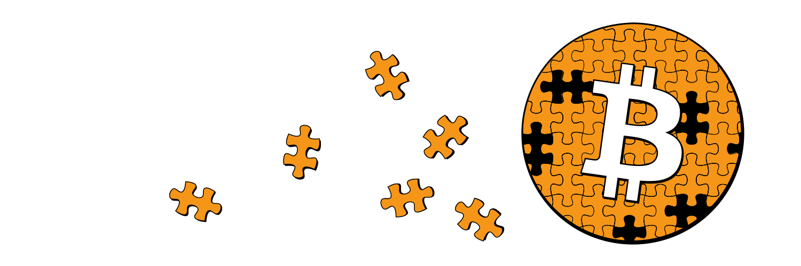

<big>Když jsem se poprvé začal zajímat o bitcoin, strávil jsem nespočet hodin vstřebáváním co největšího množství informací o něm a snažil se poskládat všechny kousky dohromady.</big>
<big>Po letech poznávání nyní věnuji dost času tomu, abych ostatním pomohl bitcoinu lépe porozumět. I když mě mnoho lidí označuje za "odborníka na bitcoin", stále se považuji za studenta - teprve potřebuji zjistit, jak hluboko králičí nora sahá.</big>

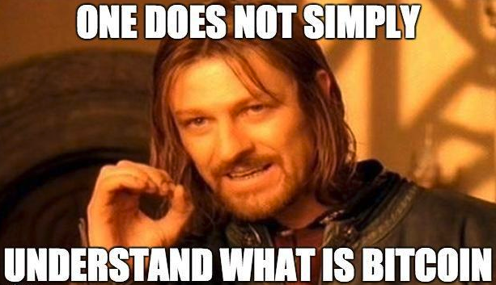

<big>Andreas Antonopoulos prohlásil toto o vysvětlování (a tím i pochopení) bitcoinu:</big>

> <b>"Napsal jsem knihu, která odpovídá na otázku "Co je to Bitcoin?" Má 300 stran, zastarala v okamžiku, kdy byla vytištěna, 
> a každé tři měsíce se musí opravovat a aktualizovat, jen abychom udrželi krok se změnami."</b>

## Rozmanitá povaha bitcoinu

<big>Dostatečným studiem se můžete naučit, jak bitcoin z technického hlediska aktuálně funguje.</big>

<big>Udržuji seznam studijních zdrojů, který je dostatečný k tomu, aby každého během snahy o dosažení tohoto cíle zaměstnal na několik měsíců. Tento způsob vstřebávání informací však odhalí pouze špičku bitcoinového ledovce.</big>

<big>Meltem Demirors zveřejnila trefný graf:</big>

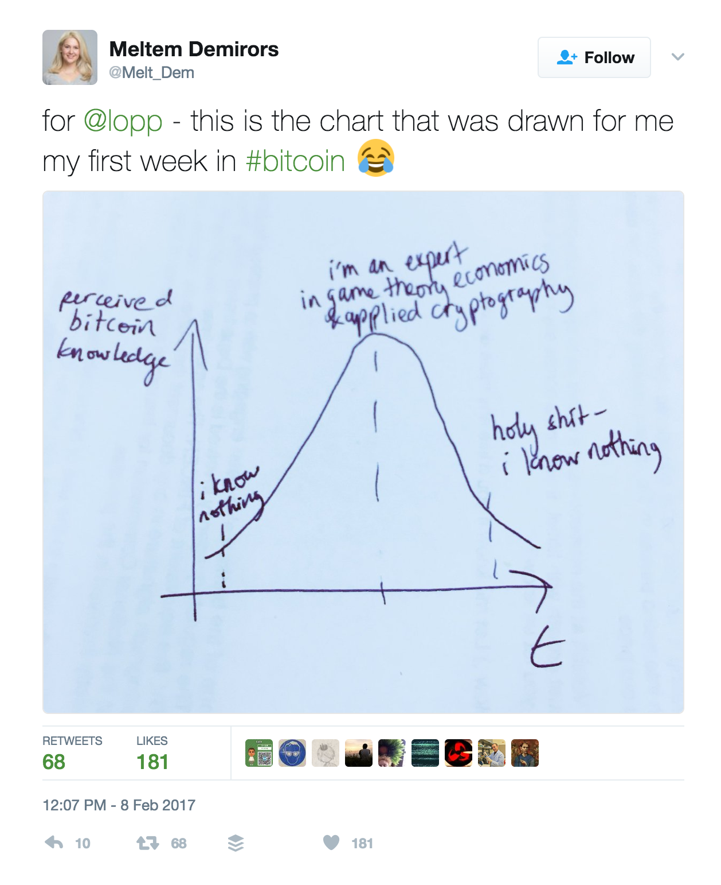

<big>Jednou z výzev pro porozumění bitcoinu je skutečnost, že se jedná o rozmanitý, neustále se vyvíjející, mezioborový systém.</big>

<big>Dobře to vystihl Ferdinando Ametrano:</big>

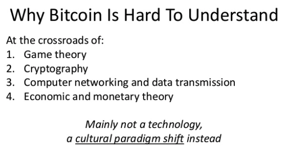

<small>Proč je těžké porozumět bitcoinu
 Nachází se na křižovatce: 1. Teorie her / 2. Kryptografie
 3. Síťového inženýrství a přenosu dat / 4. Ekonomické a monetární teorie
 Především se nejedná o technologii, / spíše o změnu kulturního paradigmatu</small>

<big>Ferdinando se trefil do klíčového bodu, kterému se budu věnovat - bitcoin není jen technologií; je to technologie představující něco ještě méně hmatatelného.</big>

<big>Bitcoin je živý protokol, který vzniká z tavicího kotle myšlenek, filozofií, kultur a politik poté, co projdou zkouškou ohněm.</big>

<big>Můžete si přečíst "Rise of the Cypherpunks" a dozvědět se, jak jsme se dostali tam, kde jsme dnes.</big>

## Satoshiho chápání bitcoinu

> <b>"Napsat popis této věci pro široké publikum je zatraceně těžké. Není nic, k čemu by se to dalo přirovnat."</b>
>  Satoshi, 5. července 2010

<big>Dokonce ani Satoshi plně nerozuměl tomu, co v souvislosti s bezpečnostním modelem bitcoinu vytvořil. Nakonec strávil první roky existence bitcoinu opravou spousty chyb.</big>

<big>Po 18 měsících se tempo oprav chyb zpomalilo do té míry, že nové zranitelnosti byly kategorizovány a dokumentovány. Podívejme se na několik chyb, které byly opraveny předtím, než si bitcoin získal příznivce.</big>

<big>V prvních verzích bitcoinu mohl kdokoli utratit mince kohokoli jiného:</big>

> <b>"Opcode OP_RETURN původně pouze působil, že skript místo selhání předčasně skončil, takže jste mohli ukrást jakékoli bitcoiny jednoduchým 
> použitím scriptSig OP_TRUE OP_RETURN. Bylo také možné umístit pushdata opcode přímo na konec scriptSig, aby se celý scriptPubKey změnil 
> na konstantu (která se vyhodnotí jako true). Satoshi tyto chyby opravil změnou chování OP_RETURN tak, aby transakce okamžitě selhala, 
> a zajistil, aby se scriptSig a scriptPubKey vyhodnocovaly ve dvou samostatných krocích."</b>
>  Theymos

<big>Satoshi opravil hlavní chybu konsensu tím, že změnil logiku "nejlepšího chainu" z použití nejdelšího chainu na chain s největším proof-of-work. Technicky by se dalo říci, že se jednalo o hard fork, ačkoli ve skutečnosti k forku chainu nedošlo, jelikož nejdelší chain byl v té době zároveň chainem s nejvyšším proof-of-work.</big>

<big>Satoshi také nastavil limit velikosti bloku jako ochranu proti DoS útokům. Velikost bloku byla původně pouze implicitně omezena velikostí síťové zprávy na 32 MB.</big>

<big>V OP_CHECKMULTISIG je také chyba, existující dodnes. Je zmíněna v BIP-011:</big>

> <b>"(OP_0 je vyžadováno kvůli chybě v OP_CHECKMULTISIG; ze stacku vyskočí příliš mnoho položek, proto musí být do stacku přiřazena 
> fiktivní hodnota)."</b>
>  Gavin Andresen

<big>A kdo by mohl zapomenout na value overflow bug, který někomu umožnil vytvořit 184 miliard bitcoinů!</big>

<big>Při mém pátrání po dalších raných Satoshiho chybách, které nejsou příliš známé, si Greg Maxwell vzpomněl na jednu šťavnatou:</big>

<big>"V raných verzích bitcoinu mohl kterýkoli uživatel hard forknout jakoukoli vydanou verzi z jakékoli jiné verze! Tato designová chyba ukázala, že při prvním releasu plně nepochopil podmínky nutné k bezpečnému upgradu, ale jeho oprava ukázala, že později jim již porozuměl.</big>
<big>Existoval opcode s názvem OP_VER, který na stack posunul číslo verze ověřovací nody. (Satoshi vždy věřil, že by měl existovat pouze jeden kus softwaru pro bitcoinové uzly.) Zřejmým účelem tohoto opcode byla možnost přidávat funkce do skriptu a zajištění viditelnosti těchto nových opcode pouze u novějších podporovaných verzí (původně bylo v codebase také 16 bitů prostoru pro opcode.) Někdo to však mohl zneužít způsobem "OP_VER 1234 IF FALSE RETURN ENDIF TRUE" k tomu, aby verze 1234 odmítla blok vytěžený jakoukoli jinou verzí. Takže jakýkoli uživatel mohl kdykoli přimět systém k forku! Když odstranil OP_VER, přidal OP_NOP, což je to, co umožňuje soft forky v moderním stylu skriptů. Tato změna sama o sobě byla soft forkem, protože původní verze neznámé opcodes ignorovaly."</big>

<big>Badatelé také objevili jisté nedostatky v Satoshiho whitepaperu týkající se popisu bezpečnosti systému.</big>

<big>Existují například otázky " minerského štěstí" a " sobeckého miningu". Zde je dokonce k dispozici kompilace známých problémů whitepaperu.</big>

<big>Bitcoin se zjevně neřídil přístupem "kód je zákon", ale spíše "Satoshiho vize je zákon", vzhledem k tomu, že v prvních letech provedl řadu úprav poté, co bylo zjištěno, že kód není zcela v souladu s tvůrčím záměrem.</big>

<big>Myslím, že toto rozlišení je obzvláště důležité vzhledem k tomu, že: a) Satoshi přestal přispívat do bitcoinu před mnoha lety a b) bitcoin nemá žádnou formální specifikaci.</big>

## Software není nikdy hotov

<big>Jak málo bitcoinu rozumíme, poznáte jednoduše podle obrovského množství výzkumů, které se provádějí za účelem jeho analýzy a zdokonalení.</big>

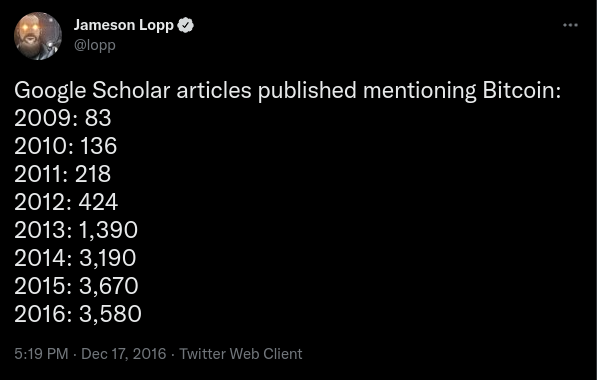

<big>Satoshi kdysi uvedl, že základní design je pevně daný a jiné implementace by byly pro síť hrozbou. Lidé tento citát (a další Satoshiho výroky) často přebírají a používají ho k mylné argumentaci (prostřednictvím odvolávání se na autoritu), že se bitcoinový protokol musí vyvíjet určitým způsobem.</big>

<big>Předesílám, že to byl jen další případ, kdy se Satoshi mýlil.</big>

<big>Jak jsme viděli, Satoshi musel v bitcoinu provést mnoho změn, jak první vývojáři zkoumali kód a objevovali mezní situace. Dnes také běží více než půl tuctu implementací bitcoinových klientů, které síť nenarušují. Dokonce jsme viděli, že jediná implementace může být pro síť hrozbou, když rozdíly na strojové úrovni mohou způsobit selhání konsensu, jak se stalo v roce 2013 při forku chainu Berkeley DB.</big>

<big>Vzpomeňte si na můj předchozí popis bitcoinu jako výsledku tavicího kotle plného přispěvatelů. To se skutečně projevilo ve chvíli, kdy Satoshi zveřejnil svůj malý projekt, na kterém tajně pracoval několik let.</big>

<big>Hned v prvním týdnu, kdy byl bitcoin spuštěn, získal také svého prvního spolupracovníka, Hala Finneyho. Hal byl jedním z mála lidí, kteří na počátku věřili, že bitcoin může skutečně fungovat, což je patrné z původního vydání Satoshiho whitepaperu:</big>

> <b>"[Hal Finney] údajně poukázal na spoustu chyb v raném kódu, které byly odstraněny redukcí opcodes. Hal Finney byl cypherpunkem cypherpunků. 
> Měl vzácnou schopnost superlativně kódovat, stejně jako vidět současně jak les, tak i stromy a popsat, co vidí. Všichni jsme jeho příspěvky 
> pečlivě četli, myslím, že neexistuje nikdo jiný, kdo by vzbuzoval takový respekt."</b>
>  Ian Grigg

<big>Finney zveřejnil řadu svých e-mailů se Satoshim pro Wall Street Journal; je to zajímavé čtení. Vidíte v nich Satoshiho překvapení, když se mu podaří najít několik chyb, které sám nepředpokládal, přestože "intenzivně testoval".</big>

<big>Na rozdíl od jiných systémů (např. ethereum) nemá bitcoin formální specifikaci. I kdyby ji měl, z technického hlediska by nebylo snazší ani těžší provádět v protokolu změny, ačkoli ze sociálního hlediska by to možné bylo.</big>

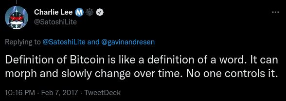

<big>Neexistuje ani objektivní proces, kterým by se změny uskutečňovaly:</big>

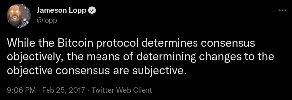

<big>Paul Stzorc hovořil o objektivním rozhodování o vývoji bitcoinu, ale k jeho uskutečnění je ještě daleko.</big>

<big>Jeho prezentace byla založena na <a href="http://www.truthcoin.info/blog/win-win-blocksize/">tomto blogu</a>.</big>

<a href="https://youtu.be/TgjrS-BPWDQ?t=1561">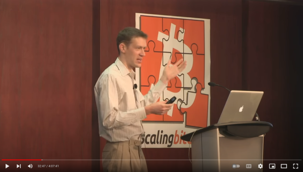</a>

<big>Považuji bitcoin za silný nikoliv proto, že by byl ztělesněním dogmatické víry v neměnnost, decentralizaci nebo jiná módní slova, ale díky spolupráci. Proces, v němž se spolupráce využívá k určení lidského konsensu, může být hlučný a chaotický, ale je to model řízení, v jehož rámci musíme pracovat.</big>

<big>Z mého pohledu je tento systém řízení, který vychází z dobrovolnosti, jediným aspektem bitcoinu, který je "vytesán do kamene".</big>

## Kouzlo bitcoinu

<big>Sergej Kotliar napsal před lety tento článek, ve kterém popisuje, proč má bitcoin podobnost s náboženstvím. Jak poznamenává, v tom, že systém funguje jako celek, je trochu magie, neboť se opírá o netechnické komponenty.</big>

<big>Systémem dobře nastavené pobídky tvoří "neviditelnou ruku", která jej řídí.</big>

<big>Většina uživatelů bitcoinu si to pravděpodobně neuvědomuje, ale svou účastí na kolektivně posilované víře v systém pravidel tvořících bitcoin, se hlásí k sofistikované subjektivistické ontologii.</big>

<big>Zjednodušeně řečeno:</big>

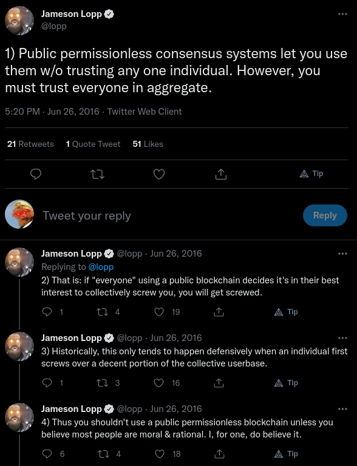

<big>Zatímco bitcoin lze označit za systém bez důvěry v tom smyslu, že provozovatel plného uzlu nemusí důvěřovat žádnému jinému účastníkovi sítě, na metaúrovni je často určitá forma důvěry přítomna. Například téměř žádný z uživatelů bitcoinu ve skutečnosti nerozumí softwaru ani nečte samotný protokol.</big>

<big>Důvěřují vývojářům, že budou opatrní a nevnesou do systému chyby.</big>

<big>Zdá se mi, že skutečnost, že hluboké znalosti o technických operacích bitcoinu má jen málo z nás, vede k tomu, že lidé s menšími vědomostmi rozhodují o tom, kterým "odborníkům" věřit. Proto se při střetu odborníků dav rozdělí a postaví se na stranu těch, jejichž argumenty považují za nejpřesvědčivější.</big>

<big>To bohužel znamená, že do rozhodovacího procesu někdy vstupuje politika.</big>

<big>Jak nedávno poznamenal Shaolin Fry, měli bychom se snažit vyhnout politizaci navrhovaných vylepšení protokolu. Aby bylo jasno, neznamená to, že "nikdo v ekosystému není motivován politickými ideály". Spíše to znamená, že směřování systému není řízeno politikou, při níž jedna skupina lidí vnucuje své přesvědčení druhé.</big>

<big>Například pojem "hlasování" obecně znamená, že dochází k politickému procesu. Místo toho bychom měli usilovat o systém inovací bez povolení, v němž mohou účastníci signalizovat, že chtějí určitým způsobem interagovat, bez ohledu na to, co signalizují ostatní účastníci.</big>

> <b>"Již nyní máme nepřeberné množství měn, které jsou (nepřímo) řízeny politickými rozmary. Bitcoin by měl být zdravějším řešením. Velmi rád 
> bych chtěl říci, že pravidla úplného konsensu v první den byla neměnná ('set in stone'), ale inženýrská realita to činí nereálným. Tento sen 
> pro Bitcoin zemřel v den, kdy byla nalezena první jednoznačná a vážná chyba konsensu. Deaktivace chybných opcodes jej dále oslabila a vyžadovala 
> další změny k opětovnému dosažení plné univerzálnosti. Ale svět je málokdy tak příhodně černobílý. Bitcoin stále může dostát slibu, že bude 
> méně politickými penězi, aniž by byl zcela pevně 'set in stone'."</b>
>  Greg Maxwell

## Potíže s promítáním

<big>Někteří uživatelé bitcoinu porozumí protokolu natolik, že začnou uvažovat o možných vylepšeních a snaží se systém změnit tak, aby lépe vyhovoval jejich představám.</big>

<big>Jedná se o myšlení " poroučet a ovládat ", které je člověku vlastní; sám jsem se v minulosti dopustil stejné chyby, když jsem se snažil promítnout svůj pohled na bitcoin místo toho, abych vstřebával názory komunity.</big>

<big>Do debat o vývoji bitcoinu vstupuje mnohem více okolností než jen technické aspekty toho, jak by změny ovlivnily síť.</big>

<big>Ryan X Charles zobecnil filosofii dvou nejpopulárnějších názorů v debatách o škálování. Velká část sporů v těchto debatách vychází z: a) rozdílných priorit a b) rozdílného přesvědčení o možnostech využití bitcoinu.</big>

<big>Bohužel značná část účastníků těchto diskusí své názory rozvinula až k dogmatickému přesvědčení, což téměř znemožňuje intelektuální diskusi.</big>

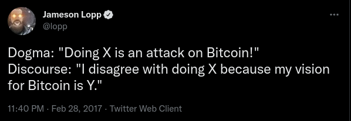

<big>Věřím se, že jedním z důvodů, proč lidé snadno promítají do bitcoinu svůj postoj, je jeho nedostatečná specifikace, a tedy i nedostatek jasných cílů.</big>

<big>Satoshi například popsal bitcoin jako "peer-to-peer elektronický peněžní systém". Ale i tento jednoduchý popis lze snadno interpretovat mnoha způsoby. Spojení "peer-to-peer" neposkytuje žádnou souvislost s tím, kolik peerů by mělo participovat; "hotovost" neposkytuje žádný kontext ohledně toho, jaká by měla být rychlost nebo cena transakcí.</big>

<big>Tak jako lze najít různé výklady a perspektivy pohledu na americkou ústavu, Bibli nebo Korán, můžeme podobně interpretovat i Satoshiho spisy a diskutovat o nich.</big>

<big>Promítání individuálních perspektiv do bitcoinu vedlo ke stejnému druhu štěpení, jaké můžeme pozorovat v politických, filozofických a náboženských systémech. Skupina se zpočátku většinou shoduje, dokud se neobjeví problém, na kterém se shodnout nedokáže.</big>

<big>Jednotlivci začnou polarizovat své názory a podporovat akce posilující tribalismus. Vymezují se stranické linie, na nově příchozí se uplatňují lakmusové papírky, potlačují se nesouhlasné projevy, upevňuje se propaganda, rozpadá se komunikace a vznikají komunikační bubliny - komnaty ozvěn.</big>

<big>V důsledku toho se dnes debaty o bitcoinu často zvrhávají v mylná tvrzení a osočování, kdy jedna strana považuje druhou za neznalou nebo zákeřnou. To je politováníhodné, protože lidé často končí u toho, že mluví jeden přes druhého v domnění, že mají pravdu a druhá strana se mýlí.</big>

<big>Je znepokojující sledovat zkostnatění názorů do dogmatických přesvědčení, která snižují kvalitu diskuse uvnitř komunity.</big>

<big>Předesílám vám, že neexistuje jediný "správný" přístup k bitcoinu, ale spíše mnoho pohledů. Různorodost pohledů a možností využití byla tématem jednoho z prvních článků, které jsem kdy o bitcoinu napsal.</big>

<big>Neříkám, že musíte souhlasit s rétorikou šířenou lidmi s opačnými názory na to, čím by bitcoin měl být. Navrhnu vám však, abyste ji uznali jako takovou - nikoli jako zákeřný útok, proti kterému se musíte bránit přímým protiútokem.</big>

<big>Pokud se debata stává příliš vyhrocenou a rozprava se tříští, vždy ji můžete ukončit.</big>

<big>Mějte na paměti, že všichni lidé podléhají předsudkům; nemůžeme se jim vyhnout, ale můžeme si vědomě vybrat, jak budeme reagovat na jiné předpojaté lidi. Také vám může pomoci uvědomění, že bitcoin nepotřebuje, abyste ho bránili - svůj vlastní pohled na bitcoin bráníte tím, že si vybíráte software, který chcete provozovat, a systém, kde ukládáte své peníze.</big>

## Bitcoinové tao

<big>Andreas kdysi hovořil o škálovací debatě "plné šumu".</big>

<big>Jakkoli to může být nepříjemné, měli bychom si uvědomit, že je to spíše důsledek vlastnosti bitcoinu než jeho vady.</big>

<a href="https://youtu.be/4IT4s-6T__k?t=53">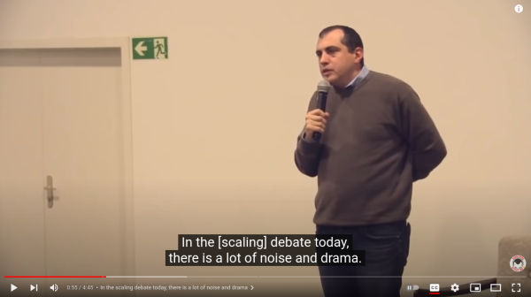</a>

<big>Účastníci diskuse o bitcoinovém ekosystému by měli být pokorní, a ne být přesvědčeni, že naše chápání systému je lepší než chápání ostatních. Já jsem například zjistil, že mé rozhovory jsou po tomto zjištění produktivnější.</big>

<big>Také jsem ztratil mnohem méně času tím, že jsem se vyhnul rozhovorům, které byly zjevně neproduktivní kvůli dogmatickým názorům druhé strany.</big>

<big>"Tao bitcoinu" můžete dosáhnout tím, že přijmete fakt, že bitcoin je na své vlastní cestě, která je mimo vaši kontrolu. Nebuďte frustrovaní, pokud se vaše vize bitcoinu neshoduje s vizí ostatních uživatelů. Bitcoin bude přirozeně konvergovat k nejmenšímu společnému jmenovateli lidského konsensu - k tomu, co je prospěšné (nebo alespoň neškodné) pro největší podmnožinu účastníků.</big>

<big>Tao bitcoinu není v jeho pochopení, ale v přijetí bitcoinu takového, jaký je.</big>

## Perníkový bitcoin

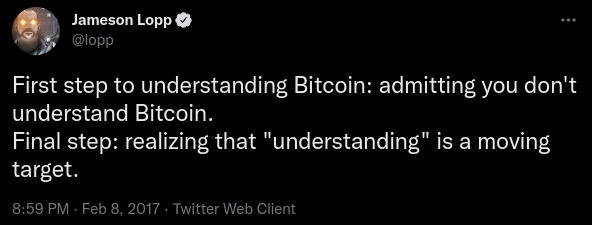

<big>Pokusil jsem se předložit dostatek důkazů o tom, že bitcoin se vymyká běžným vzdělávacím přístupům a dokonce se vymyká i samozvaným autoritám, které tvrdí, že mu rozumí. Výsledek může být matoucí, ale není důvod k pesimismu.</big>

<big>Měli bychom si zachovat naději, že bitcoin bude i nadále "selhávat při škálování" stejně jako internet.</big>

<a href="https://youtu.be/4IT4s-6T__k?t=53">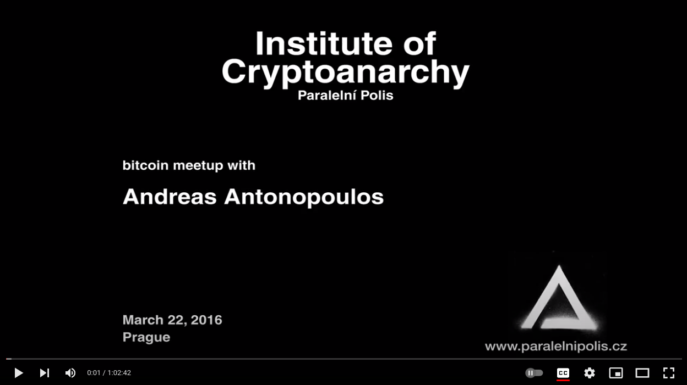</a>

<big>Jimmy Song se rovněž, tváří v tvář patové situaci a beznaději, vyslovil pro optimismus.</big>

<big>"Bitcoin zkrátka dozrává a trh začíná definovat, čím bitcoin bude. Jsem si jistý, že na obou stranách debaty jsou lidé, kterým se nebude líbit, v co se zvrhne, ale to je daň za decentralizované peníze."</big>

<big>Budu pokračovat ve své snaze získat o tomto novém ekosystému co nejvíce informací, ale už dávno jsem se vzdal cíle bitcoinu porozumět.</big>

<big>Čím rychleji k tomuto cíli běžím, tím více se ode mě vzdaluje. I když někteří lidé z tohoto prostředí jsou si jeho budoucím směřováním jistější než jiní, pravdou je, že razíme nové cesty a učíme se postupem kupředu.</big>

<big>Bitcoinu nerozumíte a nevadí to - nerozumí mu ani nikdo jiný.</big>

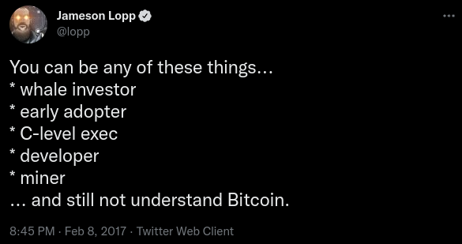

## ---
<big>Autor: <a href=""https://twitter.com/lopp">Jameson Lopp</a> 
 Původní článek: <a href="https://www.coindesk.com/markets/2017/03/11/nobody-understands-bitcoin-and-thats-ok/">
  Nobody Understands Bitcoin (And That's OK)</a>
 Přeložil:</big> ⚡ <a href="lightning:nekonecnik@stacker.news">nekonecnik@stacker.news</a> 🔗 Samourai 
PayNym 🤖 <a href="https://paynym.is/+muddydarkness33F">+muddydarkness33F</a>


  <footer>
    

    
  </footer>

