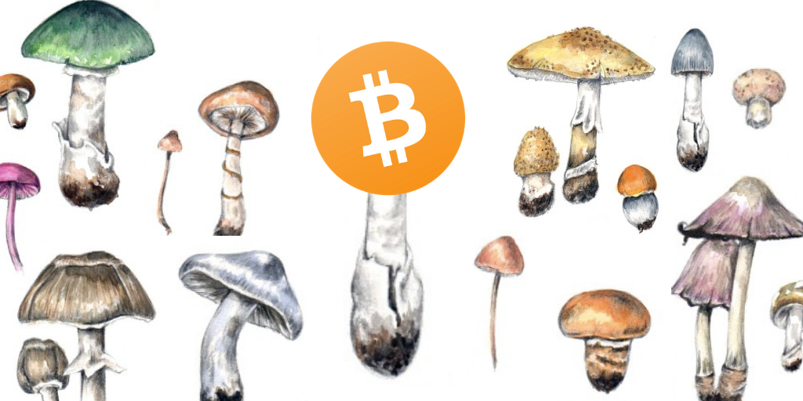
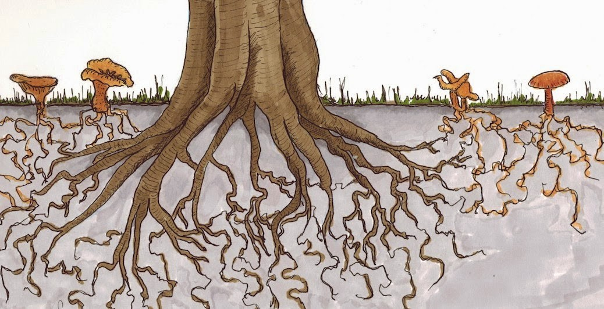
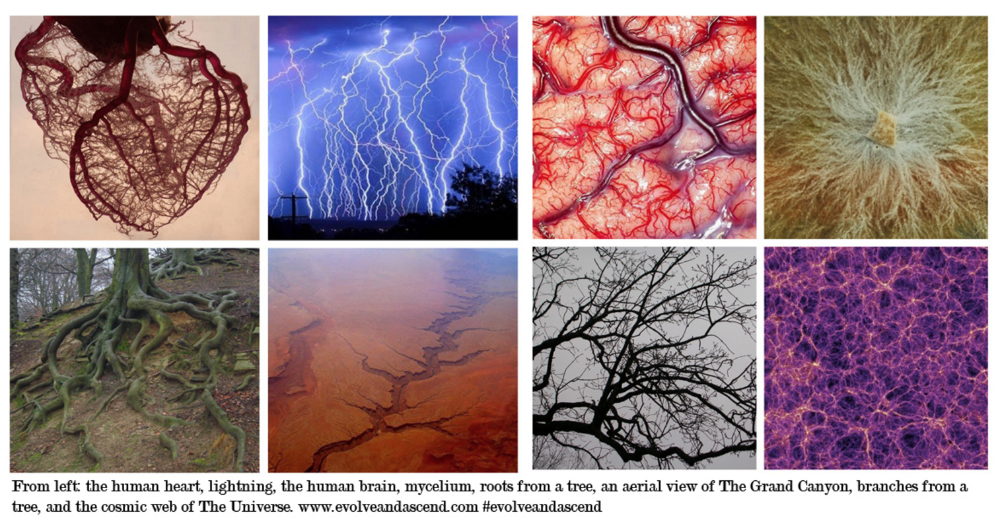

<header>

  
  


</header>

This is 🇨🇿 Czech translation of <a href="https://brandonquittem.com/bitcoin-is-the-mycelium-of-money/">this article</a> 
by <a href="https://twitter.com/Bquittem">Brandon Quittem</a> / Translated @744260 by <a href="https://twitter.com/nekonecnik">@nekonecnik</a> 🧡

# Bitcoin je myceliem peněz

## Předmluva

<big>Toto je PRVNÍ KAPITOLA za série bitcoin+houby. Mám více nepublikovaných materiálů, měl bych z toho udělat knihu? Dejte mi vědět 
  na twitteru, moje DMs jsou otevřené. Chtěli byste také dostávat upozornění, když budu publikovat nové články? Zaregistrujte se zde.</big>
  
<big>Musím pochválit Dana Helda za vydání jeho čtyřdílného seriálu, který přirovnává vznik bitcoinu k sázení stromu. I když se mi jeho 
  seriál líbil, domnívám se, že robustnější analogií je přirovnání bitcoinu k houbám. Pokud jste v tomto tématu noví, připoutejte se - je mi 
  ctí vás zasvětit do fascinujícího světa hub.</big>
  
*<b>Polymatická odpovědnost:</b>b> Jsem přesvědčen, že stejně jako Satoshi spojil jednotlivé obory, aby dal dohromady technologii, které 
říkáme bitcoin, má i každý z nás zodpovědnost za zkoumání svých vlastních jedinečných přesahů znalostí. Zde je můj průzkum hub a bitcoinu 
- paralely jsou ohromující.*

## Kapitola 1: Bitcoin je decentralizovaný organismus (mycelium)

<big>Na první pohled bitcoin vypadá jednoduše, ale pochopit tento systém je náročný úkol.</big>

<big>Na této cestě existují "intelektuální pasti" svádějící pozorovatele k unáhleným předpokladům. Snahu o pochopení bitcoinu 
  přirovnávám k horolezci, který neustále dosahuje "falešných vrcholů", které ho na chvíli oklamou, aby si myslel, že dosáhl 
  vrcholu skutečného.</big>

<big>Jakmile si myslíte, že jste bitcoin pochopili, zjistíte, jak málo toho ve skutečnosti víte (falešný vrchol).</big>

<big>Konkurenční narativy to ztěžují ještě více... Magické internetové peníze, spekulativní mánie, fintech revoluce, bitcoin vařící oceány, 
  krysí jed na druhou, libertariánský idealismus, digitální zlato, vrcholový predátor peněžních médií, gordický uzel vzájemně provázaných 
  incentiv atd.</big>

<big>Aby to bylo ještě složitější, bitcoin je živý systém, neustále se měnící na základě podnětů z okolí. Skutečné porozumění je pohyblivým 
  cílem, jenž zasáhneme jen stěží.</big>

<big>Když jsem se pokoušel nalézt odpověď na otázku "co je bitcoin", zjistil jsem, že zkoumání paralel se světem přírody je obzvláště podnětné.</big>

<big>Především pak některé z nejlepších vlastností bitcoinu jsou pouhým odrazem úspěšných evolučních strategií, jaké se vyskytují v přírodě, 
  konkrétně v říši hub.</big>

<big>Houby jsou převážně tvořeny svou vegetativní částí "myceliem" - podhoubím - podzemní decentralizovanou inteligentní sítí, kterou 
  Paul Stamets popsal jako "přírodní internet Země".</big>

<small>Image credit: John Upton</small>

> <b>"Věřím, že mycelium je neurologickou sítí přírody. Prolínající se mozaiky mycelia naplňují habitaty membránami sdílejícími informace. 
> Tyto membrány jsou uvědomělé, reagují na změny a společně mají na paměti dlouhodobé zdraví hostitelského prostředí. Mycelium zůstává 
> v neustálé molekulární komunikaci se svým prostředím a v reakci na složité výzvy vytváří rozmanité enzymatické a chemické reakce."</b>
>  Paul Stamets, Mycelium Running: How Mushrooms Can Help Save the World

### Úvod do hub

<big>Houby patří do samostatné říše stejně jako rostliny a živočichové. Existuje více druhů hub než rostlin a živočichů dohromady.</big>

<big>Jako živočichové jsme příbuznější houbám než rostlinám. Houby i živočichové vdechují kyslík a vydechují oxid uhličitý. Rostliny 
  si vytvářejí vlastní potravu fotosyntézou (jsou autotrofní), zatímco živočichové a houby si musí potravu sami najít (heterotrofní). 
  Živočichové se vyvinuli tak, že mají vnitřní žaludek/mozek, zatímco houby mají žaludek/mozek vnější.</big>

> Houbový fakt č. 1: lidé sdílejí s houbami více než 50 % své DNA. Vědci navrhli novou superříši nazvanou Opisthokon, která spojuje houby 
> a živočichy.

<big>Houby mohou mít mnoho podob. Většina z nich je organizována v podzemní "kořenové struktuře" zvané mycelium (podhoubí), která se vyskytuje 
  na naší planetě téměř všude.</big>

<big>Když jsou vhodné podmínky, houby produkují plodnice, které pak uvolňují spory (výtrusná semena), jež se snaží kolonizovat život 
  v blízkém okolí. Houby, jak je známe z naší pozemské perspektivy, jsou jednoduše rozmnožovacím orgánem. Houby jsou pro mycelium tím, 
  čím jsou pro strom jablka.</big>

<big>Houby mají pro život na Zemi zásadní význam:
 - Nejrozsáhlejším organismem této planety je houbová struktura.
 - Houby jsou nejlepšími chemiky na naší planetě, většina našich léků pochází z hub.
 - Stromy by bez svých podzemních houbových spojenců nepřežily.
 - Houby existují již 1,3 miliardy let a přežily všech 5 velkých případů vymírání druhů.
 - Houby jsou schopné zachránit včely</big>

### Houby jsou decentralizované inteligentní sítě

<big>Houbové sítě nemají centralizovaný "mozek". Místo toho tvoří jednobuněčný "kořenový systém" zvaný mycelium. Tento podzemní žaludek 
  a distribuovaná inteligentní síť je schopna obousměrně posílat informace na velké vzdálenosti a dokonce i napříč druhy. Tyto houbové 
  sítě se neustále vyvíjejí na základě zpětné vazby z prostředí.</big>

<big>V každém okamžiku obsahuje houbová síť miliony koncových bodů, z nichž každý hledá potravu, brání své území nebo vymýšlí nové molekuly, 
  kterými se snaží přemoci konkurenci (jiné houby, bakterie atd.). Tyto sítě vytvářejí decentralizovaný konsensus o tom, jak využívat zdroje, 
  kdy se rozmnožovat a jaká strategie nejlépe brání organismus.</big>

<big>To odráží decentralizovaný konsensus (<a href="https://medium.com/s/story/bitcoins-social-contract-1f8b05ee24a9">společenskou smlouvu</a>) 
  vytvořený v bitcoinu. Uzly určují, jaký software chtějí provozovat, a podle toho prosazují pravidla konsensu, která podporují. Těžaři určují, 
  které transakce mají být zahrnuty do bloků. Burzy, peněženky a obchodníci spravují velké skupiny uživatelů. Každý účastník bitcoinu se dobrovolně 
  rozhoduje, jakým způsobem se chce zapojit, a souhrnný konsensus představuje síť.</big>

<small>Zleva: lidské srdce, blesky, lidský mozek, mycelium, kořeny stromu, Velký Kaňon z leteckého záběru, větve stromu, vesmírná, 
  kosmická pavučina vesmíru</small>

### Decentralizované sítě jsou starší než lidstvo

<big>Decentralizované sítě existovaly již dávno před příchodem lidí. Ve skutečnosti houby úspěšně zavádějí takové systémy již 1,3 miliardy let, 
  což z nich činí nejúspěšnější říši planety.</big>

<big>Kromě hub existuje v přírodě několik příkladů archetypů distribuovaných sítí (mycelium, temná hmota, neurony, internet atd.). Tato 
  strategie zjevně funguje, jinak by příroda netrvala na jejím opakování.</big>

<big>V kontextu této dlouhé historie archetypu decentralizované sítě se nástup decentralizovaných digitálních peněz jeví jako méně novátorský 
  a více nevyhnutelný.</big>

<big>Archetypem decentralizované sítě je <a href="https://en.wikipedia.org/wiki/Lindy_effect">Lindy</a>.</big>

### Během miliardy let evoluce se houby staly mistry v přežití

<big>Houby jsou jedinečně přizpůsobivé a neustále přežívají hromadná vymírání druhů.</big>

<big>Před 65 miliony let zasáhl naši planetu obří asteroid, čímž zahubil většinu života (včetně dinosaurů). Náraz vytvořil tak hustý oblak dýmu, 
  že po mnoho let bránil přístupu slunečního světla na zemský povrch. Bez slunečního světla vymřely rostliny a s nimi i většina živočichů. Houby 
  však nejsou závislé na slunečním světle, dokážou se rychle přizpůsobit a najít si vlastní potravu.</big>

<big>Po každém vymírání houby "zdědí Zemi" a pomalu ji obnovují, dokud se podmínky nestabilizují a život může opět pokračovat.</big>

<big>Bitcoin se stane nejúspěšnějším peněžním druhem, protože je decentralizovaný, (relativně) rychle se přizpůsobuje, sám si najde potravu 
  (neuspokojenou poptávku) a nepotřebuje vládní podporu. V případě masového vymírání peněz bitcoin "zdědí Zemi".</big>

### Japonská vláda vs. pokorné hlenky

<big>Ať už jde o centrální banky, které se snaží řídit ekonomiku, nebo o hierarchické korporace, které se snaží v informačním věku maximalizovat hodnotu... Centrální plánování má mnoho chyb.</big>

<big>Při rozhodování v "informační ekonomice" jsou efektivnější decentralizované nebo ploché (nehierarchické) organizace. Odolávají korupci, 
  minimalizují byrokracii a posouvají rozhodování do extrémů, kde mají jednotlivci (uzly) o daném problému nejaktuálnější informace.</big>

<big>Pro ilustraci síly decentralizovaných sítí se podívejme na tokijské metro.</big>

<big>Vědci provedli <a href="https://www.science.org/doi/10.1126/science.1177894">experiment</a>, při němž byla pradávná houba (hlenka 
  či slizovka) podněcována k tomu, aby znovu vytvořila systém tokijského metra. Každá zastávka metra (uzel) byla označena oblíbenou potravou 
  hlenek (ovesnými vločkami).</big>

<big>Po krátké době se hlenka rozrostla a propojila všechny uzly/zastávky v efektivnějším designu než centrálně plánovaná komise inženýrů najatých japonskou vládou.</big>

<small>Hlenka navrhující systém tokijského metra</small>

<big>Z abstraktu:</big>
> Dopravní sítě jsou všudypřítomné jak v sociálních, tak v biologických systémech. Robustní výkonnost sítě zahrnuje složitý kompromis mezi 
> náklady, efektivitou přenosu a odolností proti poruchám. Biologické sítě byly zdokonaleny mnoha cykly evolučního selekčního tlaku 
> a pravděpodobně poskytují takovým kombinatorickým optimalizačním problémům rozumná řešení. Navíc se vyvíjejí bez centralizovaného řízení 
> a mohou představovat snadno škálovatelné řešení pro rostoucí sítě obecně. Ukazujeme, že hlenka Vápenatka mnohohlavá vytváří sítě 
> se srovnatelnou účinností, odolností proti poruchám a náklady jako sítě reálné infrastruktury - v tomto případě tokijský železniční systém. 
> Základní mechanismy potřebné pro adaptivní tvorbu sítí lze zachytit v biologicky inspirovaném matematickém modelu, který může být užitečný 
> pro řízení výstavby sítí v jiných oblastech.

<big>Když se zamyslíte nad náklady a složitostí takového infrastrukturního projektu, je docela vystřízlivující si uvědomit, že hlenka 
  dokáže navrhnout lepší síť za jediný den.</big>

<big><b>Satoshi si sílu hlenek uvědomoval.</b></big>

<big>Bitcoin je nestátní peněžní statek, který posouvá složitost a rozhodování na okraj stejně jako houby. Postupem času tato decentralizace 
  volného trhu umožňuje bitcoinu konkurovat různým zavedeným finančním systémům, které příliš nejdou s kůží na trh, trpí dilematem inovátora, 
  časem křehnou a často se utápějí v byrokracii (nebo ještě hůře).</big>

### Život bez centrálního bodu selhání

<big>Mycelium nemá žádný "centrální řídící bod". Každá jednotlivá část může být odstraněna, ale systém jako celek přežije.</big>

> <b>"Jdeš-li po králi, střez se minout."</b>
>  Omar Little (<a href="https://en.wikipedia.org/wiki/The_Wire">The Wire</a>)

<big>Národní státy a centrální banky čelí paradoxní výzvě. Pokud se pokusí svou konkurenci zničit, zdůrazní tím především samotnou potřebu 
  bitcoinu. A přesto, čím déle budou čekat, tím silnější bitcoin bude.</big>

<big><b>Tvrzeni nevraživoství</b></big>

<big>Mycelium i bitcoin přetrvávají v nejkonkurenčnějších ekosystémech naší planety a pro své přežití se musí neustále přizpůsobovat. Jdou 
  s kůží na trh a utužují se nepřátelstvím.</big>

<big>Houby žijí v nepřetržitém konkurenčním prostředí a neustále svádějí malé podzemní boje s různými bakteriemi, mikroby a konkurenčními houbami.</big>

<big>Pokud jeden myceliální "uzel" zaznamená predátora nebo kořist, pošle informaci "houbovým vědcům", kteří pak vytvoří nový enzym cílící 
  přímo na dotyčného. Houbová síť tento nový enzym distribuuje tam, kde je to zapotřebí.</big>

> Houbový fakt č. 2: Jako lidé využíváme léčivé látky vytvořené houbami. Nejslavnější je penicilin, 
> <a href="https://www.ncbi.nlm.nih.gov/pmc/articles/PMC4520913/">náhodně objevený Alexanderem Flemingem</a>. Ten se používal v boji proti 
> bakteriálním epidemiím, které v minulosti decimovaly lidskou společnost. Od objevu penicilinu se naše populace ztrojnásobila.

<big>Bitcoin reaguje na své okolí podobným způsobem. Jakmile jsou v systému nalezeny chyby/hrozby/příležitosti, informace putují 
  k "bitcoinovým vědcům" (vývojářům), kteří vytvoří "enzym" ( softwarový patch) a tato aktualizace se šíří systémem. To umožňuje větší 
  ekologickou úspěšnost i pro bitcoin. Bitcoin je antifragilní.</big>

<big>Houby i bitcoiny časem zpevní svou obranu a naučí se konzumovat nové zdroje potravy. To má složený účinek, který časem zvyšuje 
  antifragilitu i délku života.</big>

<big>V jednom extrémním případě se podívejme na <a href="https://www.bbcearth.com/news/8-fantastic-facts-about-fungi">největší organismus 
  na naší planetě, houbu václavku (Armillaria)</a>. Tento jediný organismus, který se nachází v Modrých horách ve východním Oregonu, měří 
  přes 3,8 km. Jeho stáří se odhaduje na 1 900 až 8 650 let a v současné době pohlcuje celý les.</big>

### Konkurenční boj

<big>Houbové sítě kradou konkurenční výhody svým sousedům v podobě genetické informace, stejně jako bitcoin absorbuje konkurenční výhody, 
  které nabízejí altcoiny.</big>

<big>Existuje (mylné) přesvědčení lidí předpokládajících, že altcoiny budou implementovat skvělé nové funkce, které nakonec překonají bitcoin.</big>

<big>Opačný tábor se domnívá, že bitcoin nakonec absorbuje všechny nejlepší funkce poté, co budou otestovány na trhu, což způsobí, že alternativní měny nebudou schopny dlouhodobě konkurovat. Osobně se hlásím k tomuto názoru.

<b>Podívejme se, jak ke své konkurenci přistupují houby...</b></big>

<big>Nejprve je třeba pochopit některé základní genetické poznatky. Geny se obvykle předávají z rodičů na potomky v rámci tzv. vertikálního 
  přenosu genetické informace.</big>

<big>Zajímavé je, že houby provádějí tzv. horizontální přenos genů - účinně přebírají genetickou informaci od různých druhů soupeřících 
  v témže ekosystému.</big>

<big>Tento proces horizontálního přenosu genetické informace demonstrovaný houbami předznamenává budoucí stav, kdy bitcoin plošně integruje 
  všechny osvědčené myšlenky pocházející z altcoinů.</big>

<big><b>Například:</b> Kombinace rozšíření Lightning Joule Browser s nodou (spuštěním vlastní, použitím Casa nebo jinak) umožňuje mikrotransakce prostřednictvím prohlížeče. Tím se účinně eliminuje potřeba tokenů, jako je BAT.</big>

<big>Dokonce byste mohli tvrdit, že bitcoin provádí horizontální přenos genů od doby, kdy Satoshi poprvé zkombinoval technologie používané 
  v předchozích pokusech o elektronické peněžní systémy, jako jsou Hash Cash, E-gold atd.</big>

### Arbitráž, pobídky a jejich uplatnění v ekologii

<big>Houby plní na Zemi dvě ekologické funkce: recyklují veškerou hmotu na základní prvky a fungují jako imunitní systém naší planety.</big>

> <b>"Mycelia jsou velkolepými rozkládači přírody."</b>
>  Paul Stamets

<big>Houby tráví své dny tichým rozkladem organických látek. Přeměňují kameny, větve, listí, uhynulá zvířata a ropné skvrny na základní prvky 
  (uhlík, dusík, kyslík atd.). Tyto cenné prvky pak houby vyměňují s okolními organismy.</big>

> Houbový fakt č. 3: Naše lesy by byly pohřbeny stovkami metrů listí a větví, kdyby je houby nerozkládaly a nedistribuovaly živiny.

<big>Jinými slovy, houby odemykají nevyužité zdroje. Strom nemůže znovu použít své vlastní listy nebo větve, protože uhlík, dusík a fosfor 
  jsou uzamčeny v nepoužitelné formě. Houby tak využívají arbitrážní příležitosti ve svém ekosystému.</big>

### Bitcoin díky mechanismu proof of work uvolňuje nevyužité zdroje v podobě energie

<big>Než se pustíme do bitcoinu, prozkoumejme fascinující historický příklad: Jak se používal hliník k "vývozu nevyužité obnovitelné energie" 
  ze země, jako je Island.</big>

<big>Island vyrábí obnovitelnou geotermální energii, často na odlehlých místech. To vede k nadměrné nabídce, která nedokáže dosáhnout 
  k poptávce (energie se špatně přepravuje na velké vzdálenosti).</big>

<big>Island využil přebytek energie k výrobě hliníku, což je energeticky velmi náročný proces. Island účinně přeměňuje přebytečnou energii 
  na trvalou zásobu hodnoty (hliník), kterou lze vyvážet.</big>

<big>Bitcoin dělá totéž. Místo nevyužité energie "ležící ladem" mohou její výrobci těžit bitcoin (nebo jen prodávat přebytečnou energii těžařům). 
  I to umožňuje přeměnit přebytečnou produkci energie na trvalé uchování hodnoty. Efektem druhého řádu je, že bitcoin účinně dotuje projekty 
  obnovitelné energie.</big>

<big>Chcete-li tento koncept prozkoumat podrobněji, podívejte se na článek Dana Helda: <a href ="https://danhedl.medium.com/pow-is-efficient-aa3d442754d3">PoW is Efficient</a>.</big>

> Houbový fakt č. 4: Houby pojídající horniny jsou hlavním důvodem, proč máme svrchní vrstvu půdy, jež nám umožňuje pěstovat potraviny. 
> Houbám trvalo více než 1 miliardu let, než vytvořily jen asi 18 palců dnešní ornice.

### Houby (a bitcoin) jsou ekologické imunitní systémy

<big>Houby jsou imunitním systémem jak vlastních ekosystémů, tak celé planety.</big>

<big>Houby produkují léčivé látky a chrání své ekosystémy prostřednictvím složitých symbiotických vztahů. Houby si v podzemí zprostředkovávají 
  zdroje (prostřednictvím mycelia) mezi jednotlivými druhy, aby zajistily zdraví celého ekosystému.</big>

<big><b>Jak spolu stromy v lese tajně mluví</b></big>

<big>O čem stromy mluví? V kanadských lesích douglasky tisolisté se podívejte, jak spolu stromy navzájem "mluví" vytvářením...</big>

<video width="320" height="240" controls>
  <source src="0744260-04-nat-geo-video-ipod-pt-1-.mp4" type="video/mp4">
<!--  <source src="movie.ogg" type="video/ogg">-->
Your browser does not support the video tag.
</video>

<big>Zjednodušeně řečeno, houby v podzemí těží minerály stromům výměnou za cukry (potravu), které stromy produkují prostřednictvím fotosyntézy. 
  Stromy tak získávají zvýšenou ochranu před útočníky a důležité minerální látky, které si samy nedokážou najít. Přemýšleli jste někdy o tom, 
  jak může mladý dub přežít na lesním podloží, kam se nedostane sluneční světlo?</big>

<big>Každý organismus zapojený do tohoto sdíleného systému incentiv zlepšuje evoluční kondici lesa. Věřím, že lesy jsou živé superorganismy 
  složené z různých druhů.</big>

### Bitcoin plní podobnou ekologickou roli

<big>Trh vysílá bitcoinu signály, aby vytvářel funkcionality, které vyhoví neuspokojeným požadavkům nebo vylepší bezpečnost, jakmile se objeví nové hrozby.
 - Poptávka po block space naroste nad kapacitu a vznikne síť Lightning Network.
 - Čína potlačuje burzy, LocalBitcoins.com vzkvétá.
 - Měny ve Venezuele, Turecku a Argentině podléhají hyperinflaci, bitcoin nastupuje jako nestátní úložiště hodnoty.
 - Blockstream spouští satelity schopné vysílat bitcoinové transakce, aby zmírnil dopady katastrofických událostí.</big>

<big><b>Kladná zpětná vazba</b></big>

<big>Bitcoin také získává z vyrovnaných pobídek mezi uživateli, full nody, těžaři, burzami a obchodníky. Jak se bitcoin lépe přizpůsobuje 
  svému prostředí, lépe splňuje požadavky svých rostoucích uživatelů, což následně přitahuje další účastníky. Tato pozitivní zpětná vazba 
  podporuje udržitelný růst sítě.</big>

<big>Stejně jako houba václavka, která pohlcuje celé lesy v Oregonu, i bitcoin se postupem času zvětšuje a sílí.</big>

> Houbový fakt č. 5: Při psaní převážné části této eseje jsem konzumoval medicinální houby používané pro zlepšení kognitivních 
> funkcí (Lions Mane, Chaga a Cordyceps).

## ---
<big>Autor: <a href="https://twitter.com/Bquittem">Brandon Quittem</a> 
 Původní článek: <a href="https://brandonquittem.com/bitcoin-is-the-mycelium-of-money/">Bitcoin is The Mycelium of Money</a>
 Přeložil:</big> ⚡ <a href="lightning:nekonecnik@stacker.news">nekonecnik@stacker.news</a> 🔗 Samourai 
PayNym 🤖 <a href="https://paynym.is/+muddydarkness33F">+muddydarkness33F</a>


  <footer>
    

    
  </footer>

