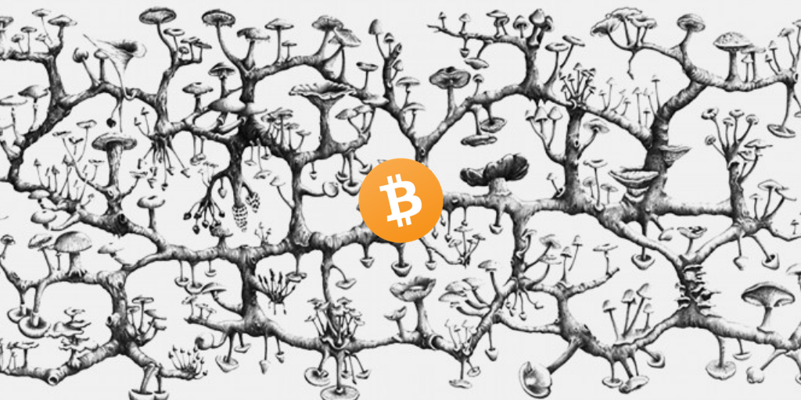
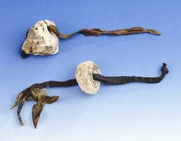
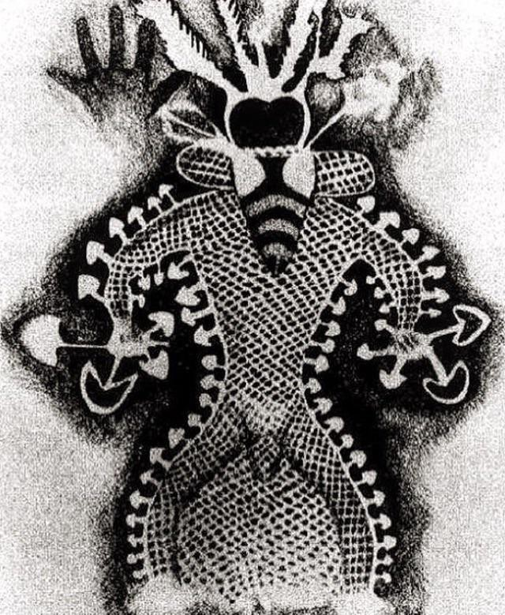
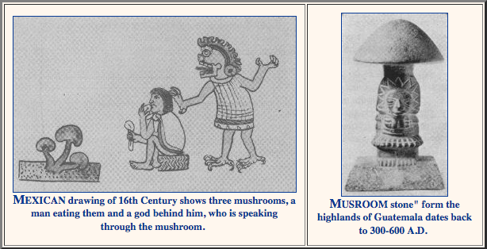
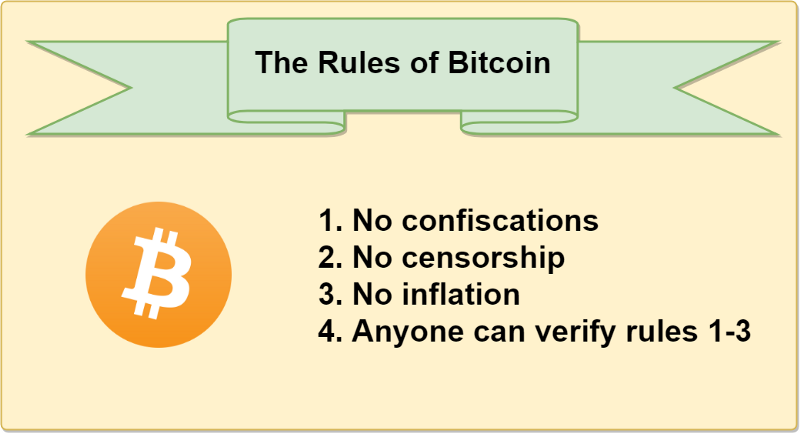
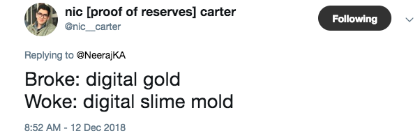

<header>

  
  


</header>

This is 🇨🇿 Czech translation of <a href="https://brandonquittem.com/bitcoin-is-the-mycelium-of-money/">this article</a> 
by <a href="https://twitter.com/Bquittem">Brandon Quittem</a> 
 Translated @744260 by <a href="https://twitter.com/nekonecnik">@nekonecnik</a> 🧡

# Bitcoin je myceliem peněz

*<b>Polymatická odpovědnost:</b> Jsem přesvědčen, že stejně jako Satoshi spojil jednotlivé obory, aby dal dohromady technologii, které 
říkáme bitcoin, má i každý z nás zodpovědnost za zkoumání svých vlastních jedinečných přesahů znalostí. Zde je můj průzkum 
hub a bitcoinu - paralely jsou ohromující.*

# Kapitola 2: Bitcoin jako sociální fenomén (houba - plodnice)
*Zkoumání hype cyklů, etnomykologie a Satoshiho kultu*

  <small>Original Artwork by <a href="http://www.richardgiblett.com.au/2dworks.html">Richard Giblett</a></small>

V první části jsme zkoumali decentralizovanou architekturu bitcoinu z pohledu mycelia. Věnovali jsme se archetypu decentralizované sítě, antifragilitě, PoW, arbitráži, roli bitcoinu v jeho ekosystému a přednostem decentralizace.

Nicméně náš příběh o houbách ještě není kompletní. Další fází životního cyklu hub je rozmnožování odehrávající se uvnitř houby. Po dosažení zralosti houby uvolňují malá semínka zvaná spory, díky nimž jsou schopny kolonizovat nové území.

Ačkoli je říše hub v porovnání s říší živočišnou poměrně cizí, lidé mají k houbám vztah již dlouho. Historicky představují houby tajemství, strach, příležitost, pomíjivost a pro některé až kultovní úctu.

V kapitole 2 prozkoumáme bitcoin jako společenský fenomén optikou tajemné houbičky.

Ponořme se do toho!

## Bitcoin je sociální systém stvrzený kódem

Bitcoin se skládá z jednotlivých účastníků, z nichž každý má vlastní pohled na věc, motivace a schopnosti. Společně vytvářejí konsensus na pravidlech bitcoinové hry. Kód tuto společenskou shodu pouze ratifikuje.

Z Hasuova zásadního článku <a href ="https://medium.com/s/story/bitcoins-social-contract-1f8b05ee24a9">Unpacking Bitcoin's Social Contract</a>:
> "Bitcoinový protokol automatizuje smlouvu odshouhlasenou na sociální vrstvě, zatímco sociální vrstva určuje pravidla bitcoinu na základě 
> konsensu jeho uživatelů. Jsou v symbióze: jedno bez druhého by nepostačovalo."

Lidé jsou chaotické, emocionální a předvídatelně iracionální bytosti. Bitcoin, který je tvořen sítí lidí, není jiný.

## Lidská psychologie, hype cykly a metoda hub

Houby se primárně vyskytují ve formě "mycelia", které si můžete představit jako podzemní kořenový systém spojující stromy a rostliny. Lidé by o existenci mycelia ani netušili, neboť po většinu svého života zůstává v tichosti pod zemí.

Nicméně vycítí-li houba příznivé podmínky (teplota, vlhkost atd.), vytvoří nadzemní houbu - plodnici. Tyto plodnice jsou pohlavními orgány hub - v podstatě jde o falické systémy pro přenos výtrusů (semen).

Než plodnice prorazí půdu, soustředí houby energii do malého množství buněk pod zemí, které se nazývají "pinheads - špendlíkové hlavičky" a které vytrvávají až do ideálního okamžiku. Pak houby zdánlivě z ničeho nic vyrazí ze země a každý den, dokud nedosáhnou zralosti, zdvojnásobí svou velikost.

> Houbový fakt č. 6: Některé houby dokáží tvořit plodnice takovou silou, že prorazí skrze asfalt.

Po dosažení plné zralosti houba vyprodukuje miliony výtrusů (houbových "semínek") a poté se rychle rozloží zpět do země.

Houba žije jen několik vítězných dní a většina spor zahyne ještě před dozráním, malé procento spor však cestuje do okolí a vytváří nové houbové kolonie. Ty pak mohou zůstat několik let v podzemí, než se reprodukční cyklus znovu rozběhne.

> Houbový fakt č. 7: Výtrusy jsou lehčí než vzduch, což usnadňuje jejich cestování. Teoreticky by spory mohly zachytit vzestupný proud a opustit oběžnou dráhu Země. Navíc se jakýmsi štěstím dostaly na kratičký seznam biologické hmoty schopné přežít chladné vakuum a radiaci vesmíru. Libo-li panspermie?

## Bitcoinové cykly jsou analogické s rozmnožováním hub

Pro náhodného pozorovatele je většina života bitcoinu nudná - ubíhají měsíce a nic se neděje. Když pak nastanou ty správné podmínky, bitcoin ožije, masivně se rozroste a dostane se do povědomí pozorovatelů. Cena vyletí na "měsíc", média zaplaví hyperbola a zprávy od "normíků" se jen hrnou.

Téměř ihned po svém vzestupu bitcoin zaniká a upadá do zapomnění, když ho náhodní účastníci odepisují jako módní výstřelek, hype nebo nepovedený experiment. Stejně jako houbové výtrusy většina nových uživatelů ekosystém opouští. Malé procento z nich však v bitcoinové zemi zakládá nové kolonie. Tito přeživší z medvědího trhu se stávají novými "hodlery poslední instance".

Není překvapením, že narativ medvědího trhu je poháněn aktivitou na povrchu (cenou).

## Odpůrci bitcoinu si pletou jeden cyklus (houbu) s celkovým obrazem (myceliální síť)

Amnézií trpící vědátoři hrdě hlásají, že bitcoin zanikl (<a href="https://99bitcoins.com/bitcoin-obituaries/">po 459.</a>). Fiatoví maximalisté se předvádějí na twitteru a zveřejňují dvanáctiměsíční grafy.

> "Pro houbu nevidíš mycelium!" 
h/t Nic Carter

Roubini pořádá barbecue na oslavu svého třetího medvědího trhu. Odpůrci se scházejí, aby si opekli pověstné (bitcoinové) houby a poplácali se přitom po zádech.

Abychom však byli spravedliví, bitcoin je komplikovaný. Mnoho "kryptolidí" si stále myslí, že bitcoin je myspace a Ripplecoin je "standard". Není překvapením, že většina novinářů nechápe, o co jde. Představte si, že vám jako novináři s dobrými úmysly a zaběhnutými postupy přidělí "bitcoinový štěk".

## Zatímco houba odumřela (nedávný hype cyklus), mycelium (bitcoin) v podzemí prospívá.

Stejně jako houby po vrcholu bujení, i bitcoin zažívá úpadek a jeho cena padá. Tento medvědí trh setřese slabé ruce, hedgeové fondy zkrachují, ICOs vrátí investorům peníze nebo ještě hůř, projekty zkrachují a někteří šarlatáni budou odhaleni.

Avšak hodleři, noví i staří, kolektivně přecházejí do podzemí a v tichosti bitcoin vylepšují: budují, učí se a vytvářejí aliance.

## Bitcoin se v medvědím trhu 2018-2019 dramaticky zlepšil

- Síť Lightning Network <a href="https://twitter.com/lnstats">nabírá na obrátkách</a>
- Nové služby typu <a href="https://www.swanbitcoin.com/Quittem/">SwanBitcoin</a>, usnadňují nabývání bitcoinů (auto DCA)
- Adopce SegWitu, zlepšující transakce, roste na <a href="http://charts.woobull.com/bitcoin-segwit-adoption/">zhruba 50 %</a>.
- Jimmy Song a Justin Moon vychovávají nové vývojáře
- Casa, Pierre, Nodl a další usnadňují provoz full nodů
- Nomics poskytuje čistší údaje než CMC (CoinMarketCap)
- Vznikají finanční služby bitcoinu (Unchained, River, Blockfi)
- Základy pro nevyhnutelnou financializaci (Fidelity, Bakkt atd.)
- Vytvářejí se Schnorrovy podpisy ( technická specifikace / whitepaper / TL;DR)
- "Proof of Keys" k minimalizaci rizika rehypotekace + zátěžový test ekosystému + připomenutí novým uživatelům ohledně vlastní suverenity.
- Blockstream umožňuje provádět bitcoinové transakce přes satelit. V kombinaci s mesh sítěmi to začíná být zajímavé.
- Objevují se metriky pro měření zdraví kryptoměn, jako je realizovaný cap, ekonomická propustnost, ekonomická hustota ($/byt) a MVRV.
- Vrchol centralizace těžby byl překonán (sbohem, Bitmain).
- Zpráva Coinshares uvádí, že 77 % energie spotřebované bitcoinem pochází z obnovitelných zdrojů
- Noví pisálci stojí na ramenou velikánů a snaží se bitcoin popsat neotřelým způsobem.

Postupem času, jak bitcoin pokračuje v odhalování sebe sama zvědavým pozorovatelům, se příběhy vyvíjejí.

  <small>Hodl Waves by Dhruv Bansal at <a href="https://unchained.com/hodlwaves/">Unchained Capital</a></small>

Nakonec se trh dostane na dno. Hodleři drží při sobě jako <a href="https://cs.wikipedia.org/wiki/Bratrstvo_neohro%C5%BEen%C3%BDch">Bratrstvo neohrožených</a> vytvářejíce pevný základ, který je schopen udržet budoucí růst.

> "<a href="https://tokeneconomy.co/hodlers-are-the-revolutionaries-66c8362ef9eb">Hodleři jsou revolucionáři</a>"
> Dan Held

Vzhledem k tomu, že hodleři hromadí stále více bitcoinů, je "float" (nabídka, s níž se aktivně obchoduje) stále omezenější. S klesající dostupnou nabídkou každý nový uživatel vyvíjí větší tlak na růst ceny. Jak cena stoupá, média si na ni posvítí, přitáhnou nové uživatele a zanedlouho jsme opět v dalším hype cyklu.

## Mykofobie, Maria Sabina a Satoshiho kult

Někdy se říká, že kryptografie může být trochu "okultní". To je pravda a zároveň čisté pozitivum. Než se pustíme do náboženských sklonů bitcoinu, poučme se z historie s houbami.

Moderní západní svět je postižen "mykofobií" - iracionálním strachem z hub. Lidé se bojí toho, čemu nerozumí, a přiznejme si to: většina lidí si myslí, že houby jsou "zelenina".

Houby jsou zvláštní. Představují koloběh pomíjivosti života a smrti, kterého se lidé podvědomě bojí. Čelit vlastní smrtelnosti není žádná legrace, lepší je se tomu raději vyhnout.

Nebylo tomu tak ale vždy. Lidé mají k houbám vztah už dlouho. Od potravin přes léčiva až po pověry a náboženské artefakty. Houby 
vám <a href="https://www.ncbi.nlm.nih.gov/pmc/articles/PMC4684114/">mohou zachránit život</a>, zabít vás, nasytit vás, a dokonce změnit vaše vědomí.

Antropologické důkazy naznačují, že lidé, kteří spolupracovali s houbami, měli evoluční výhodu. Jakmile více lidí porozumí houbám (a bitcoinu), brzy si uvědomí, jak významné mohou být.

## Lidé, kteří spolupracují s houbami, mají evoluční výhodu

Starověký člověk se v Alpách v severní Itálii spoléhal na houby, aby přežil. Ötzi, ledový muž, který zemřel před téměř 5 300 lety, byl nalezen se dvěma houbami (Troudnatcem kopytovitým - hubkou - a Březovníkem obecným) přivázanými na koženém řemínku. Jedna z hub sloužila k rozdělávání ohně a u druhé bylo zjištěna léčebná účinnost proti parazitovi objevenému v jeho střevech.

  <small>Original Artwork by <a href="http://theicemantheory.weebly.com/artifacts.html">zdroj</a></small>

Již před 19 000 lety konzumovala houby vysoce postavená žena, které se přezdívalo "červená dáma", což dokazují spóry nalezené na jejích zubech. Není známo, zda se jednalo o houby k jídlu, náboženským či jiným účelům.

Jeden z našich nejstarších příkladů jeskynních maleb byl objeven v severním Alžírsku a jeho stáří se odhaduje na více než 6 000 let. Tato malba zobrazovala "včelího muže", který má houby v rukou a vyrůstají mu z těla.

  <small>Jeskynní malba: "Včelí muž" pokrytý houbami. Asi 4 000 let př. n. l.</small>

Na Sibiři uctívali Koryakové houbu muchomůrku (Amanita Muscaria), což je ikonická "červenobílá" houba, která je známá z filmů Super Mario Brothers a Alenka v říši divů. Koryakové tuto houbu milovali natolik, že pili moč lidí a sobů, kteří ji nedávno konzumovali. Údajně lze tímto způsobem recyklovat moč až 5x a zároveň dosáhnout požadovaných účinků. Jak na tento jev přišli, to už je úplně jiná otázka...

Nasaďte si alobalový klobouk, <a hre="https://inhabitat.com/santa-and-the-shrooms-the-real-story-behind-the-design-of-christmas/">muchomůrka mohla inspirovat naše vánoční tradice</a>.

Mazatecká kultura z dnešního Mexika uctívala houby jako posvátné. Objevil ji relativně nedávno Gordon Wasson a podrobně ji popsal ve slavném článku v časopise Life Magazine z roku 1955. Od té doby navštívilo tuto oblast v Mexiku mnoho turistů, kteří usilovali o to, aby je učila slavná houbová šamanka Maria Sabina a její příbuzní.

  <small>Houbové artefakty ze Střední Ameriky</small>

Je zřejmé, že houby upoutaly pozornost našich předků.

## Bitcoin vzbuzuje podobný kvazináboženský náboj

Yuval Noah Harari skvěle popsal, že Homo Sapiens jsou jedinečně <a href="https://www.ynharari.com/topic/power-and-imagination/">schopni pružně spolupracovat ve velkém počtu</a>. To nám umožňuje kolektivně se dohodnout na abstraktních konceptech, jako jsou národy, bohové nebo peníze.

Stejně jako lidé vytvořili náboženské kulty kolem hub, lze bitcoin popsat jako náboženské hnutí nových peněz.

<b>Satoshiho tajemství vytvořilo pevný základ umožňující vznik religiózních tendencí.</b>

Bitcoin byl vytvořen díky neposkvrněnému početí mýtickou postavou (Satoshi), která se později obětovala pro vyšší dobro.

Satoshiho kult inspiruje některé fanatiky k tomu, aby zasvětili svůj život propagaci "dobrého slova". Ne všichni bitcoineři patří do stejné náboženské sekty. Někteří badatelé se drží starobylého náboženského textu (whitepaper), zatímco jiní interpretují Satoshiho vizi prostřednictvím jeho <a href="https://twitter.com/yassineARK/status/1047978606297792513">raných příspěvků na fóru.</a>

Neshody ohledně priorit, které se projevily ve škálovacích debatách, vedly k tvrdým rozkolům a roztříštěným "kongregacím". Ne nepodobné tomu, jak Martin Luther rozštěpil katolickou církev pověšením "Devadesáti pěti tezí" na dveře kostela v roce 1517.

Roger Ver byl od svých začátků známý jako "Bitcoin Jesus", který šířil dobré slovo tím, že obdarovával restauratéry postižené fiatem.

Objevují se mesiášské postavy jako Faketoshi (Craig Wright), který tvrdí, že je skutečný Satoshi Nakamoto. Fundamentalista Faketoshi označuje svou svátost za "Satoshiho vizi", jediný pravý bitcoin, jak je popsán v "bibli" (whitepaper).

> "Funkční detaily nejsou v dokumentu popsány, ale zdrojový kód bude brzy k dispozici."
Satoshi Nakamoto

Nehledě na to, jak neúplný whitepaper je a kolik chyb v něm lze najít, Faketoshi tvrdí, že jeho fork je skutečnou "Satoshiho vizí". I kdyby Faketoshiho fork BYL nejblíže Satoshiho původní vizi (což není), záleží na tom vůbec?

Odpověď zní ne. Podstata bitcoinu je úzce spjata s neustále se vyvíjejícím společenským konsenzem, který tento protokol obklopuje.

## Každá soupeřící sekta je konkurenční společenskou smlouvou

Společenská smlouva bitcoinu se opírá o několik jednoduchých pravidel. Tato odsouhlasená pravidla (Schelling point) jsou pak ratifikována v bitcoinovém protokolu automatizujícím společenský konsensus.

  <small>Zdroj: Hasu - <a href="https://medium.com/s/story/bitcoins-social-contract-1f8b05ee24a9">Bitcoin as a Social Contract</a></small>

Jako příklad uveďme "velkou debatu o škálování". Jedna skupina (BCH) se domnívala, že bychom se měli zaměřit na "levné platby" na úkor "decentralizace", zatímco druhá (BTC) věřila, že musíme upřednostnit "decentralizaci" na základní vrstvě a platby škálovat off-chain.

Jako konkurenční náboženská sekta na volném trhu mohl gang BCash svobodně forknout kód bitcoinu a otestovat svou hypotézu. O rok později je jasné, že společenský konsensus kolem bitcoinu s přístupem BCH nesouhlasí, protože trh nevidí žádnou hodnotu v BCH ani u jiného forknutého výplodu.

<b>Odpůrci bitcoinu by tedy mohli tvrdit, že "forkování kódu bitcoinu navyšuje nabídku".</b>

To je však stejné, jako kdybyste tvrdili, že když Zimbabwe tiskne více peněz, znehodnocuje to americký dolar. [h/t Murad]

V případě neúspěšných BCash forků zkopírovali kód (bitcoinový protokol), ale nedokázali zmobilizovat lidi (sociální vrstvu), což vedlo ke vzniku aktiva s relativně minimální hodnotou. Ukázkový příklad toho, jak bitcoin odolává korupci ze strany nekalých aktérů tím, že ke změně sítě vyžaduje společenský konsensus.

Jinými slovy, bitcoin nahrazuje sociální předpoklady matematickými premisami. Do důsledků, které to má na naši <a href="https://unenumerated.blogspot.com/2017/02/money-blockchains-and-social-scalability.html">sociální škálovatelnost</a>, se hlouběji ponoříme v kapitole 4.

## Je nábožensky fanatické chování indikátorem budoucího úspěchu?

Stáváme se svědky zpeněžení nové vzácné komodity v reálném čase. Žádný živý člověk dosud nebyl takového jevu svědkem.

Aby se to skutečně podařilo, musí se změnit kolektivní vědomí planety. Přesvědčit lidi, že peníze nejsou zelený papír a nemusí pocházet od vlády, bude chvíli trvat.

K překonání nevyhnutelné nepřízně osudu, která je nutná k vytvoření nové světové rezervní měny, je možná zapotřebí určité "náboženské zapálení". S tím, jak každý nový stoupenec konvertuje k Satoshiho kultu, se šance na hyperbitcoinizaci zvyšují.

<b>To znamená, že existují rizika přílišné politizace bitcoinu.</b> [h/t Hasu]

Některé frakce komunity líčí bitcoin jako klub rakouských ekonomů, kteří jedí jen maso, které osobně zastřelili jednou ze svých mnoha zbraní. Tyto věci jsou sice v pořádku, ale nejsou předpokladem pro to stát se bitcoinerem. Nemíchejme je sem, zaplatíme za to odpuzením potenciálních uživatelů bitcoinu.

*Než se vydáte na další křížovou výpravu proti FUD, přesvědčte všechny své přátele a rodinu, aby si alespoň dvakrát přečetli Nový zákon (Bitcoinový Standard).*

## Dobré kulty mají incentivy k evangelizaci

Peníze jsou ultimátním síťovým efektem - jejich hodnota je určena počtem lidí, s nimiž můžete interagovat.

V případě bitcoinu nejde jen o zaujetí uživatele v náboženském smyslu, ale také o finanční pobídky k náboru nových členů do kongregace. S každým novým uživatelem, který si bitcoin koupí, jeho hodnota roste, z čehož těží předchozí hodleři. Nový uživatel je pak motivován k tomu, aby konvertoval své přátele. Konvertující následně své přátele. A cyklus pokračuje.

S rostoucí cenou roste i motivace k lepšímu zabezpečení, což dosvědčuje úprava obtížnosti - jeden z nejgeniálnějších Satoshiho příspěvků.

Cena se zvyšuje → těžba se stává výnosnější → více těžařů přispívá hashovací silou → lepší zabezpečení zvyšuje hodnotu bitcoinu.

## Houba se šíří

Pokud se na vás mračí medvědí trh, stačí se podívat pod zem. Vývoj, přinášející optimismus, probíhá v bezpočtu oblastí (z nichž některé jsou uvedeny výše).

Bitcoinová houba se v tichosti šíří podzemím.

S každým dalším dnem bitcoin pohlcuje více fiatu, stává se robustnějším, decentralizovanějším a roste jeho Lindy efekt.

I ta nejtemnější noc ustoupí před východem slunce.

## ---
<big>Autor: <a href="https://twitter.com/Bquittem">Brandon Quittem</a> 
 Původní článek: <a href="https://brandonquittem.com/bitcoin-is-the-mycelium-of-money/">Bitcoin is The Mycelium of Money</a>
 Přeložil:</big> ⚡ <a href="lightning:nekonecnik@stacker.news">nekonecnik@stacker.news</a> 🔗 Samourai 
PayNym 🤖 <a href="https://paynym.is/+muddydarkness33F">+muddydarkness33F</a>


  <footer>
    

    
  </footer>

