<header>

  
  


</header>

This is 🇨🇿 Czech translation of <a href="https://bitcoinmagazine.com/business/bitcoin-mining-at-nuclear-power-plants">this article</a> 
by <a href="https://twitter.com/purugyl">Puru Goyal</a> & Tina Torres, published on Jul12/2022 
<a href="https://twitter.com/BitcoinMagazine">@BitcoinMagazine</a> / Translated with 🧡 @745935 by <a href="https://twitter.com/nekonecnik">@nekonecnik</a> 

# MŮŽE TĚŽBA BITCOINU ZAJISTIT DOSTATEK JADERNÉ ENERGIE ZDARMA?

Představme si jadernou elektrárnu, která v místě integruje těžbu bitcoinu. Jaká bude její ziskovost ve srovnání se standardním provozem?

Vítejte u druhé části série článků o bitcoinu a jaderné energii. Než se ponoříme hlouběji do témat druhé části, zrekapitulujeme si, co jsme 
probrali v <a href="https://bitcoinmagazine.com/business/bitcoin-is-the-future-of-our-energy-grid">části první</a>.

## KLÍČOVÉ POZNATKY Z ČLÁNKU "PROČ JE BITCOIN BUDOUCNOSTÍ NAŠÍ ENERGETICKÉ SÍTĚ"

- Bitcoin je velmi užitečný a pro lidi důležitý. Ne každý dnes jeho užitečnost využije nebo ocení, což je v pořádku, ale neznamená to, že pro ostatní není užitečný. V současné době je v něm uloženo téměř 400 miliard dolarů světového bohatství, což je spousta peněžní energie, kterou nelze přehlížet.

- Bitcoin spotřebovává jen asi 0,1 % celosvětové energie. Současná spotřeba energie se pohybuje mezi 100 až 200 terawatthodinami (TWh) ročně a podle prognóz uvedených v první části bude spotřeba energie bitcoinu vždy představovat zaokrouhlovací chybu, pokud jde o celosvětovou spotřebu energie. S největší pravděpodobností se bude ještě dlouho pohybovat pod úrovní 1 %.

- Bitcoin totiž může spotřebovávat nepoměrně málo energie vzhledem k hodnotě, kterou může v budoucnu představovat. Vezmeme-li v úvahu, že bitcoin v průběhu tohoto nadcházejícího desetiletí pravděpodobně poroste a mohl by uchovávat 20 bilionů dolarů světového bohatství, možná dokonce 50 nebo 100 bilionů dolarů, je to dost peněžní energie, kterou je třeba bezpečně zajistit a chránit. Do ochrany sítě bychom měli investovat více prostředků i energie než v současnosti.

- Bitcoinoví těžaři jsou vysoce mobilní, hledají nejlevnější energii pro těžbu a nesoutěží o energii s jinými průmyslovými odvětvími ani s vaší osobní spotřebou.

- Spotřeba energie je dobrá věc. Chcete žít v místě, kde je k dispozici dostatečné množství dostupné energie, spíše než její nedostatek. Abychom se stali civilizací Kardaševova I. typu, což bude trvat desítky let, musíme využívat a získávat více energie.

---

Jaderné elektrárny odjakživa lidi fascinovaly, ale zatím jen málo obyčejných smrtelníků rozumí ekonomické stránce výstavby jaderné elektrárny ve velkém měřítku. Dnes si právě toto téma rozebereme, a to zábavnou a inovativní formou.

<a href="https://energypost.eu/putting-nuclear-energy-on-the-critical-path/">Jak se říká v oboru</a>: "Při výstavbě jaderné elektrárny záleží jen na dvou věcech - na kapitálových nákladech a nákladech kapitálu."

---

## PŘÍBĚH ZAČÍNÁ ROKU 2009

Všechny dobré příběhy musí začínat na samém počátku. Proč bychom to měli být výjimkou? Tak pojďme na to.

Píše se rok 2009. Na trhu jsou dvě společnosti zabývající se technologií jaderných reaktorů, které soutěží o uvedení své technologie do provozu, nasazení reaktorů a prodej elektřiny. Tyto společnosti budeme nazývat Alpha Labs a Beta Labs.

Obě společnosti jsou v současné době ve fázi výzkumu a vývoje a procházejí koncepčním návrhem pro nasazení reaktoru. Příštích zhruba šest let bude vyčerpávajících. Než získají stavební povolení pro výstavbu jaderného reaktoru, budou obě tyto firmy procházet rozsáhlým výzkumem a vývojem, inženýrskými rozhodovacími procesy, výběrem dodavatelů a obchodníků, testováním komponent i hardware, revizemi a iteracemi koncepčního návrhu a důkladným licenčním řízením ze strany Komise pro jaderný dozor (NRC). Toto období bude plné technologických i dalších výzev. Stejně jako při práci na jakékoli náročné technologii se vždy najdou věci, které je třeba podrobně rozpracovat a iterovat, než budete připraveni uvést tuto technologii do reality. V jaderném odvětví tomu není jinak.

Kolem roku 2009 se však stala jiná věc: vynález nebo objev bitcoinu. V prvních letech si jej nikdo nevšímal, alespoň ne v jaderném průmyslu. Byli dost zaneprázdněni svou technologickou činností a bitcoinu se vyskytoval jen v obskurních zákoutích internetu. A kdo měl tehdy čas, pátrat po něčem takovém? To se však změnilo. V roce 2012 jeden inženýr pracující v Alpha Labs objevil bitcoin náhodou, když procházel blogpost na Redditu. Inženýra to zaujalo a začal se tím více zabývat. Protože pocházel z technického prostředí a měl bohaté zkušenosti s energetickými trhy, začal o bitcoinu přemýšlet jako o komoditě, s níž jsou spojeny výrobní náklady jako s jakoukoli jinou komoditou. Objevil těžbu metodou proof-of-work. To ho zavedlo do králičí nory, která navždy změnila samotnou podstatu historie Alpha Labs a hlavně budoucnost jaderné energie, energetických trhů, energetické sítě a lidstva. Toto je příběh právě tohoto inženýra.

Inženýr na začátku začal s těžbou bitcoinů u sebe doma. Usoudil, že není lepší způsob, jak se o těžbě něco naučit, než se vrhnout do zákopů a věnovat se jí sám. Nyní se psal rok 2013 a on už těžil dobrých šest měsíců a o těžbě hluboce přemýšlel. Brzy si uvědomil, jaké důsledky tato inovace má, jak lze těžbu využít ke zpeněžení energie, která by jinak nikdy zpeněžena být nemohla. Bitcoinová těžba nabízí kupce první instance pro jakoukoli energii, která je levná - vyplýtvaná, přebývající, redukovaná, přebytečná nebo nedostatečně využitá. Inženýr si to uvědomil. Předběhl svou dobu, svět na hloubku této inovace přijde až kolem roku 2030.

Když si to inženýr v roce 2013 uvědomil, začal prosazovat myšlenku společné lokality těžby bitcoinu na jaderném ostrově, který společnost Alpha Labs navrhovala pro svou první lokalitu. Zpočátku se setkal s tvrdým odporem, protože nikdo neměl o bitcoinu, natož o nějaké těžbě, ani ponětí. Byl však vytrvalý a nevzdával se.

Bitcoin se také začal dostávat do hlavních zpráv kvůli prudkému nárůstu ceny a následnému pádu v důsledku krachu burzy Mt. Gox, čímž se o něm dozvědělo více lidí. Začal dávat přednášky a prezentace vedoucímu týmu a několik z jeho členů orange-pillnul. Po šesti měsících důkladných projekčních a inženýrských prací na začátku roku 2014 oznámila společnost Alpha Labs svůj plán umístit na svém jaderném ostrově bitcoinovou těžební farmu, přičemž výstavba měla začít v roce 2016.

Inženýr byl přeřazen do nově vytvořené divize bitcoinové těžby a začal tuto skupinu uvnitř společnosti vést. Během následujícího roku tým propracoval detaily výstavby a začlenil návrh kolokace těžebního centra do návrhu jaderného ostrova. Společnost Alpha Labs se rozhodla pro vysoce mobilní konstrukční návrh své farmy, aby v případě, že bude muset těžební centrum přesunout nebo přemístit jinam, to bylo relativně snadné, a navíc tím omezila riziko, že bude vlastnit aktivum, které nebude možné přemístit, pokud si to okolnosti vyžádají. Uvědomila si, že plocha, kterou těžební farma zabírá, není v rámci samotného jaderného ostrova podstatná, a nemá velký dopad na velikost pozemku, který by pro výstavbu areálu musela získat.

Společnost Alpha Labs získala povolení k výstavbě Alpha-1, své vlajkové jaderné elektrárny s kolokací bitcoinové těžby, v druhé polovině roku 2016. Nyní byla připravena zahájit výstavbu.

To vše se dělo v době, kdy Beta Labs sama vyvíjela vlastní technologii jaderného reaktoru a dosahovala úžasných pokroků. Do roku 2014 prošla procesem návrhu, dokončila testování veškerého hardwaru a komponent a již v roce 2012 sama vedla jednání s NRC ohledně licenční části. Společnost Beta Labs se rozhodla pro tradiční jadernou elektrárnu bez souběžné těžby bitcoinu, protože ji na myšlenku této inovace nikdo konkrétní nepřivedl, a to přesto, že se o oznámení společnosti Alpha Labs dozvěděla již na začátku roku 2014.

Uskutečnila několik předběžných diskusí, aby pochopila rozhodnutí společnosti Alpha Labs, ale rozhodla se nepokračovat v podobné strategii, částečně kvůli tomu, že na veřejných trzích nebyly žádné zdroje, které by ji ke kolokaci bitcoinové těžby s vybudováním reaktoru navedly. Samotná společnost Beta Labs získala stavební povolení v druhé polovině roku 2016 a byla připravena na svou vlastní výstavbu.

Jak Alpha Labs, tak Beta Labs usilovaly o výstavbu jaderné elektrárny o výkonu 1 gigawatt elektrického výkonu (GWe) (nebo 2,5 gigawattu tepelného výkonu (GWth) se 40% účinností) již od samého počátku. V roce 2014 společnost Alpha Labs změnila směr a oznámila plán nasazení a výstavby reaktoru o výkonu 2 GWe (nebo 5 GWth s účinností 40 %), přičemž 1 GWe měl být využit k prodeji elektřiny do sítě, zatímco zbývající 1 GWe měl být využit výhradně k těžbě bitcoinu přímo na místě.

Pro rekapitulaci uvádíme plán výstavby pro obě společnosti:

Alpha Labs: výkon 2 GWe, 1 GWe k prodeji do sítě, 1 GWe integrovaná bitcoinová těžba 
Beta Labs: výkon 1 GWe, 1 GWe k prodeji do sítě

---

## EKONOMIKA JADERNÝCH ELEKTRÁREN

Nyní se nacházíme v druhé polovině roku 2016. Společnosti Alpha Labs i Beta Labs oznámily výstavbu svých jaderných elektráren a aktivně se snaží získat kapitál.

Financování jaderných elektráren může mít mnoho různých, exotických forem a uspořádání. Struktura financování atomových elektráren není předmětem tohoto článku. Zde předpokládáme, že laboratoře Alpha Labs i Beta Labs získají financování pro své stavební závody za stejných podmínek, abychom mohli provést "srovnávací" projekci jejich kapitálových nákladů, příjmů a zisků/ztrát.

<b>PŘEDPOKLADY</b>

- Předpokládejme, že stavba jaderné elektrárny bude u obou společností trvat šest let. Tedy od roku 2016 do roku 2022. To je <a href="https://inis.iaea.org/collection/NCLCollectionStore/_Public/42/105/42105221.pdf">v souladu</a> s dobou výstavby většiny současných elektráren.

- Předpokládejme, že kapitálové náklady na výstavbu jaderné elektrárny pro obě společnosti činí 5 000 USD na kilowatt (kW). Tento orientační odhad <a href="https://www.synapse-energy.com/sites/default/files/SynapsePaper.2008-07.0.Nuclear-Plant-Construction-Costs.A0022_0.pdf">odpovídá</a> dosavadním nákladům na výstavbu atomových elektráren.

Na základě tohoto čísla zde uvádíme kapitálové závazky obou společností:

Alpha Labs: $5,000 * 2 Gw/Kw = 10 miliard USD 
Beta Labs: $5,000 * 1 Gw/Kw = 5 miliard USD

Nezapomeňte, že společnost Alpha Labs by potřebovala kapitál také na nákup minerů a jejich nasazení na své farmě. To by však bylo zapotřebí až v okamžiku, kdy by vše bylo připraveno vyrábět elektřinu, což by se stalo až v roce 2022. Rozhodne se tedy získat vyšší kapitálový kredit, z něhož bude moci čerpat v případě potřeby během šesti let. V tomto okamžiku v roce 2016 se bitcoinové ASICy dostávaly do hlavního proudu, očekávalo se, že v příštích letech přijdou na trh nové a efektivnější stroje, což Alpha Labs sledovala. Do zadání objednávek na těžební stroje, které by spotřebovaly 1 GWe jaderné výroby, zbývalo ještě pěkných pár let, takže jediné, co se dalo v tu chvíli dělat, bylo sledovat těžební průmysl a jeho vývoj.

Zde jsou uvedeny podmínky financování, jež obě společnosti obdržely:

Alpha Labs: 10 miliard dolarů s 3% úrokem a dobou splácení dluhu 25 let. Kreditní limit by v případě potřeby mohl být v budoucnu prodloužen až na 15 miliard dolarů za stejných podmínek. Společnost Alpha Labs by čerpala 2 miliardy dolarů každý rok po dobu prvních pěti let výstavby elektrárny. 
Beta Labs: 5 miliard dolarů s 3% úrokem a délkou splatnosti 25 let. Beta Labs by čerpala 1 miliardu dolarů každý rok po dobu prvních pěti let výstavby.

Na základě těchto podmínek by nyní společnost Beta Labs musela po dobu příštích 25 let platit každý rok přibližně 57 milionů dolarů za každou vyčerpanou miliardu dolarů během prvních pěti let výstavby.

Podobně by společnost Alpha Labs musela po dobu příštích 25 let každý rok zaplatit přibližně 114 milionů dolarů za každou miliardu dolarů, kterou by během prvních pěti let výstavby čerpala ze svého kreditu.

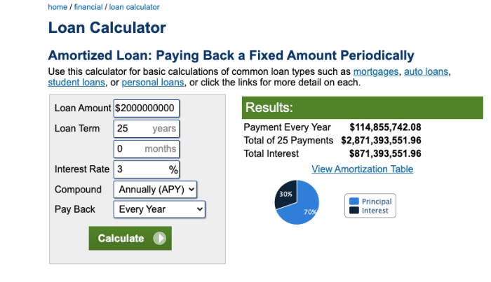

Následně použijeme bloky kapitálu, které budou představovat ekonomiku společností Alpha Labs a Beta Labs v průběhu následujících mnoha let, abychom mohli porovnávat jejich dluhy a zisky.

Předpokládejme, že <b>zhruba 57 milionů dolarů je jeden blok</b>. Na grafu jej budeme znázorňovat jako čtverec.

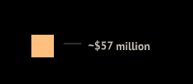

Je tedy polovina roku 2016 a výstavba obou jaderných elektráren je na spadnutí.

---

### ROK PRVNÍ: 2016

Beta Labs: Vybírá první miliardu dolarů na zahájení výstavby. Na základě toho bude muset splatit jeden blok dluhu, který je přidán do její rozvahy níže.
Čerpaný kapitál celkem: 1 miliarda USD
Dluh celkem: Jeden blok

Alpha Labs: Vybírá první 2 miliardy dolarů na výstavbu. Na základě toho bude muset splatit dva bloky dluhu přidané do její rozvahy níže.
Čerpaný kapitál celkem: 2 miliardy USD
Dluh celkem: Dva bloky

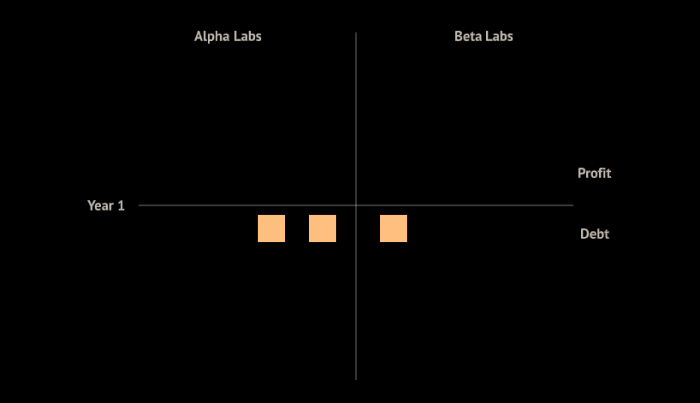

---

### ROK DRUHÝ: 2017

Beta Labs: Vybírá další miliardu dolarů. Na základě toho bude muset splatit další dva bloky dluhu přidané do její rozvahy níže. 
Čerpaný kapitál celkem: 2 miliardy USD 
Dluh celkem: Tři bloky

Alpha Labs: Vybírá další 2 miliardy dolarů. Na základě toho bude muset splatit další čtyři bloky dluhu přidané do její rozvahy níže. 
Čerpaný kapitál celkem: 4 miliardy USD 
Dluh celkem: Šest bloků

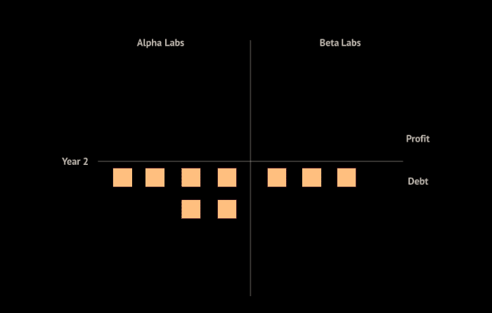

---

### ROK TŘETÍ: 2018

Beta Labs: Vybírá další miliardu dolarů. Na základě toho bude muset splatit další tři bloky dluhu přidané do její rozvahy níže. 
Čerpaný kapitál celkem: 3 miliardy USD 
Dluh celkem: Šest bloků

Alpha Labs: Vybírá další 2 miliardy dolarů. Na základě toho bude muset splatit dalších šest bloků dluhu přidané do její rozvahy níže. 
Čerpaný kapitál celkem: 6 miliard USD 
Dluh celkem: 12 bloků

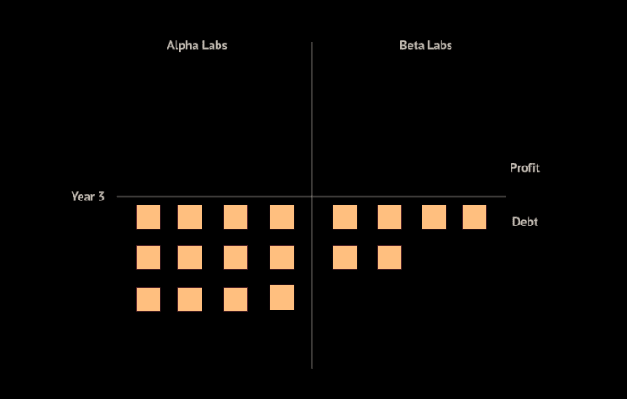

---

### ROK ČTVRTÝ: 2019

Beta Labs: Vybírá další miliardu dolarů. Na základě toho bude muset splatit další čtyři bloky dluhu přidané do její rozvahy níže. 
Čerpaný kapitál celkem: 4 miliardy USD 
Dluh celkem: 10 bloků

Alpha Labs: Vybírá další 2 miliardy dolarů. Na základě toho bude muset splatit dalších osm bloků dluhu přidané do její rozvahy níže. 
Čerpaný kapitál celkem: 8 miliard USD 
Dluh celkem: 20 bloků

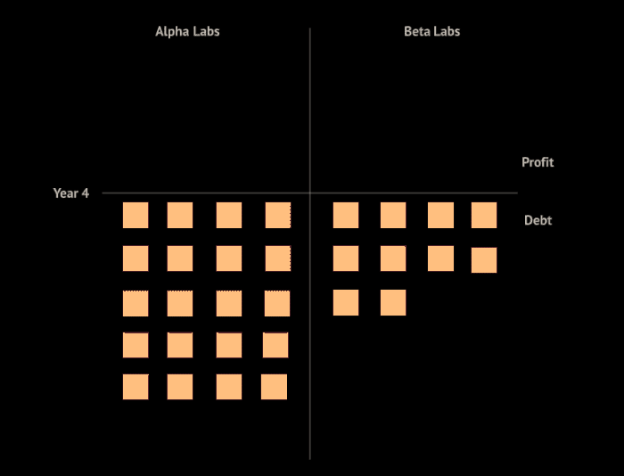

---

### ROK PÁTÝ: 2020

Beta Labs: Vybírá další miliardu dolarů. Na základě toho bude muset splatit dalších pět bloků dluhu přidané do její rozvahy níže. 
Čerpaný kapitál celkem: 5 miliard USD 
Dluh celkem: 15 bloků

Alpha Labs: Vybírá další 2 miliardy dolarů. Na základě toho bude muset splatit dalších 10 bloků dluhu přidané do její rozvahy níže. 
Čerpaný kapitál celkem: 10 miliard USD 
Dluh celkem: 30 bloků

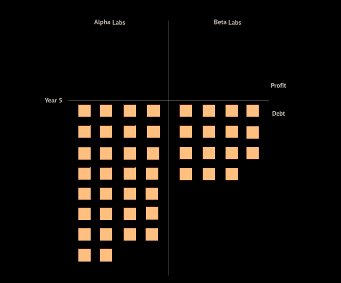

---

### ROK ŠESTÝ: 2021

Beta Labs: Žádný další kapitál. Dále musí splácet dalších pět bloků dluhu přidané do její rozvahy níže. 
Čerpaný kapitál celkem: 5 miliard USD 
Dluh celkem: 20 bloků

Alpha Labs: Žádný další kapitál. Dále musí splácet dalších 10 bloků dluhu přidané do její rozvahy níže. 
Čerpaný kapitál celkem: 10 miliard USD 
Dluh celkem: 40 bloků

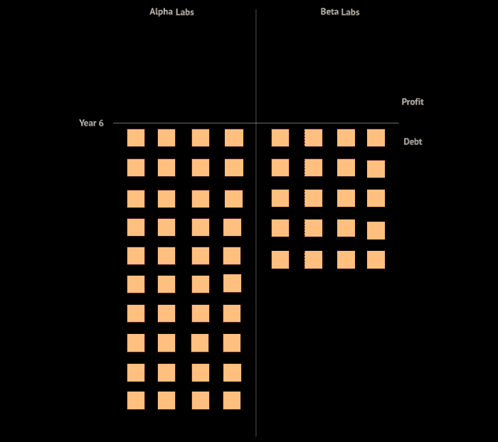

---

### ROK SEDMÝ: 2022

Teď to začíná být zajímavé. Obě společnosti Alpha Labs i Beta Labs dokončily výstavbu svých jaderných elektráren a jsou nyní připraveny vyrábět elektřinu. V tuto chvíli mají obě společnosti v rozvahách pouze obrovské dluhy, které vycházejí z výše kapitálu, který si nabraly na své stavby.

<b>PŘEDPOKLADY</b>

- Předpokládejme, že veškeré příjmy z prodeje 1 GWe elektřiny ročně na velkoobchodních trzích činí přibližně 525 milionů dolarů při zúčtovací ceně 6 centů za kWh. To na základě našeho blokového modelu znamená, že laboratoře Alpha Labs i Beta Labs by z prodeje elektřiny získaly ročně přibližně devět bloků příjmů. Předpokládáme, že obě společnosti budou provozovat své elektrárny na plný výkon nebo kapacitní faktor 100 %.

- Předpokládejme, že provozní náklady na provoz atomové elektrárny činí ročně přibližně 100 milionů dolarů na GWe. To zahrnuje roční náklady na palivo a variabilní náklady na provoz a údržbu. To na základě našeho blokového modelu znamená, že Beta Labs by na pokrytí provozních nákladů každý rok do budoucna vynaložily přibližně dva bloky, zatímco Alpha Labs přibližně čtyři bloky.

<b>PŘEDPOKLADY A ODHADY PRO TĚŽBU BITCOINU</b>

- Analýza čísel a ziskovosti těžby byla pro tento článek provedena 18. června 2022, kdy cena bitcoinu byla přibližně 20 000 USD, obtížnost sítě byla 30 T a hash rate sítě (30 dní) byl 215 exahashe za sekundu (EH/s). Projekce výnosů z těžby zohledňují snížení na polovinu v roce 2024 a vycházejí z předpokladu, že cena bitcoinu i obtížnost se budou v průměru každý rok zvyšovat o 50 % po dobu následujících pěti let.

- Předpokládejme, že společnost Alpha Labs je schopna zajistit pro své kolokované těžební centrum s kapacitou 1GWe ASIC minery nejnovější generace, přičemž cena každého z nich činí přibližně 10 000 USD. Na základě průměrného odběru energie jednoho těžebního zařízení by společnost Alpha Labs potřebovala přibližně 300 000 ASICů. Celkové kapitálové náklady na tuto část provozu by činily asi 3 miliardy dolarů, které by čerpala ze svého stávajícího kreditového rámce za stejných podmínek jako dosud. To znamená, že by za toto nové čerpání kapitálu musela každý rok do budoucna zaplatit další dluh ve výši přibližně 172 milionů dolarů (neboli ekvivalent tří bloků).

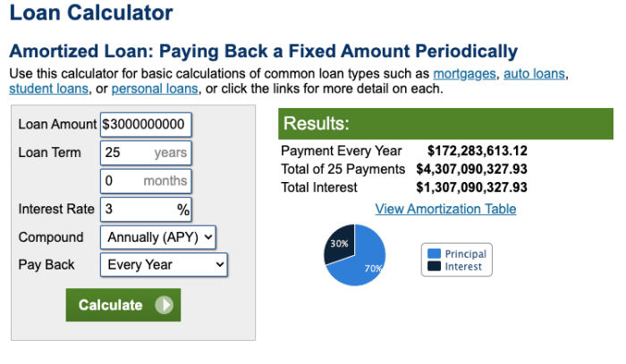

- Předpokládejme, že těžební hardware bude mít životnost pět let.

- Předpokládejme, že společnost Alpha Labs si z této těžby neponechá ve své rozvaze žádné bitcoiny, a proto veškeré příjmy z těžby převede na USD.

- Proveďme několik výpočtů ziskovosti těžby pomocí <a href="https://insights.braiins.com/en/profitability-calculator/">Braiins OS</a>, abychom získali prognózu, kolik příjmů by společnost Alpha Labs získala během příštích pěti let těžby s tímto zařízením:
- Zde jsou zisky z těžby, které by společnost Alpha Labs dosáhla za každý rok:
-- Rok sedmý: 1,5 miliardy USD tj. přibližně 27 bloků
-- Rok osmý: 1,6 miliardy USD tj. přibližně 29 bloků
-- Rok devátý: 970 milionů USD tj. přibližně 17 bloků
-- Rok desátý: 1,1 miliardy USD tj. přibližně 19 bloků
-- Rok jedenáctý: 1,25 miliardy USD tj. přibližně 22 bloků

Nyní pokračujme v naší blokové analýze rozvahy obou společností.

Beta Labs: 20 bloků dluhu, pět dalších bloků dluhu za sedmý rok, dva bloky provozních nákladů, devět bloků příjmů z 1GWe do sítě. 
Roční zisk a ztráta = 9 bloků - (5 bloků + 2 bloky) = 2 bloky 
Celkový dluh = 20 bloků - 2 bloky = 18 bloků

Alpha Labs: 40 bloků dluhu, 10 dalších bloků stávajícího úvěru za sedmý rok, tři další bloky dluhu za ASICy v sedmém roce, čtyři bloky provozních nákladů, devět bloků výnosů z 1 GWe do sítě, 27 bloků výnosů z 1 GWe těžby bitcoinu. 
Roční zisk a ztráta = (9 bloků + 27 bloků) - (10 bloků + 3 bloky + 4 bloky) = 19 bloků 
Celkový dluh = 40 bloků - 19 bloků = 21 bloků

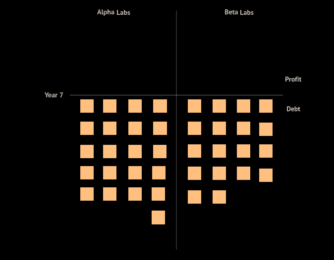

Jak nyní vidíte, Alpha Labs se dostává z pasti vymáhání pohledávek mnohem rychleji než Beta Labs, které bude trvat dlouho, než se stane ziskovou.

---

### ROK OSMÝ: 2023

Beta Labs: 18 bloků dluhu, pět dalších bloků dluhu za osmý rok, dva bloky provozních nákladů, devět bloků příjmů z 1GWe do sítě. 
Roční zisk a ztráta = 9 bloků - (5 bloků + 2 bloky) = 2 bloky 
Celkový dluh = 18 bloků - 2 bloky = 16 bloků

Alpha Labs: 21 bloků dluhu, 10 dalších bloků stávajícího úvěru za osmý rok, tři další bloky dluhu za ASICy v osmém roce, čtyři bloky provozních nákladů, devět bloků výnosů z 1 GWe do sítě, 29 bloků výnosů z 1 GWe těžby bitcoinu. 
Roční zisk a ztráta = (9 bloků + 29 bloků) - (10 bloků + 3 bloky + 4 bloky) = 21 bloků 
Celkový dluh = 21 bloků - 21 bloků = 0 bloků

Společnost Alpha Labs dosáhla v osmém roce, tedy teprve ve druhém roce provozu JE, vyrovnaného hospodaření, zatímco společnosti Beta Labs zbývá v rozvaze ještě 16 bloků dluhu. Rozdíl v rozvahách obou společností je najednou překvapivě velký. Společnost Alpha Labs dokázala během pouhých dvou let provozu smazat 40 bloků dluhu.

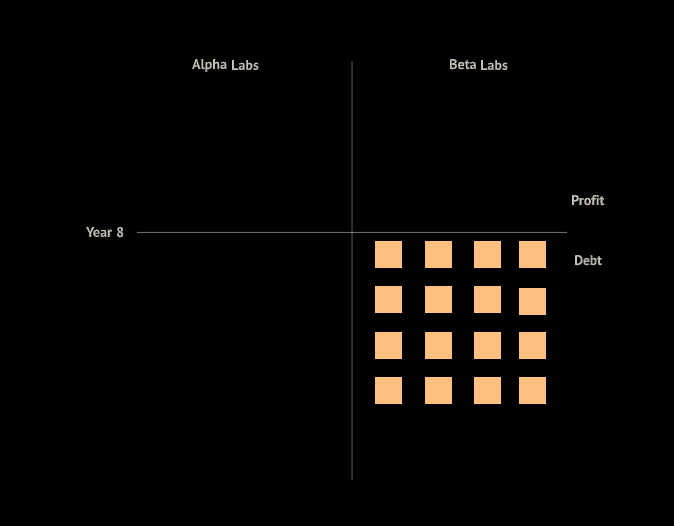

---

### ROK DEVÁTÝ: 2024

Beta Labs: 16 bloků dluhu, pět dalších bloků dluhu za devátý rok, dva bloky provozních nákladů, devět bloků příjmů z 1GWe do sítě. 
Roční zisk a ztráta = 9 bloků - (5 bloků + 2 bloky) = 2 bloky 
Celkový dluh = 16 bloků - 2 bloky = 14 bloků

Alpha Labs: 0 bloků dluhu, 10 dalších bloků stávajícího úvěru za devátý rok, tři další bloky dluhu za ASICy v devátém roce, čtyři bloky provozních nákladů, devět bloků výnosů z 1 GWe do sítě, 17 bloků výnosů z 1 GWe těžby bitcoinu. 
Roční zisk a ztráta = (9 bloků + 17 bloků) - (10 bloků + 3 bloky + 4 bloky) = 9 bloků 
Celkový zisk = 0 bloků + 9 bloků = 9 bloků

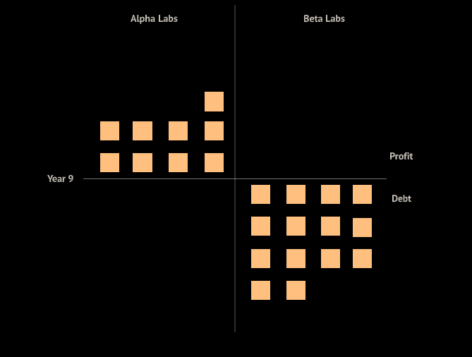

---

### ROK DESÁTÝ: 2025

Beta Labs: 14 bloků dluhu, pět dalších bloků dluhu za desátý rok, dva bloky provozních nákladů, devět bloků příjmů z 1GWe do sítě. 
Roční zisk a ztráta = 9 bloků - (5 bloků + 2 bloky) = 2 bloky 
Celkový dluh = 14 bloků - 2 bloky = 12 bloků

Alpha Labs: 9 bloků zisku, 10 dalších bloků stávajícího úvěru za desátý rok, tři další bloky dluhu za ASICy v desátém roce, čtyři bloky provozních nákladů, devět bloků výnosů z 1 GWe do sítě, 19 bloků výnosů z 1 GWe těžby bitcoinu. 
Roční zisk a ztráta = (9 bloků + 19 bloků) - (10 bloků + 3 bloky + 4 bloky) = 11 bloků 
Celkový zisk = 9 bloků + 11 bloků = 20 bloků

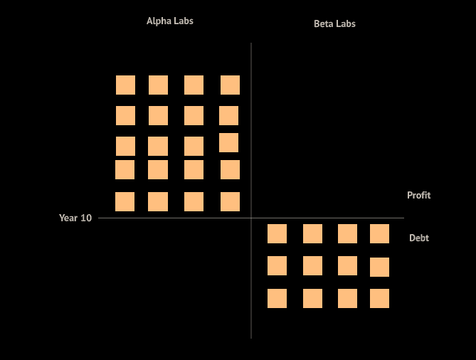

---

### ROK JEDENÁCTÝ: 2026

Beta Labs: 12 bloků dluhu, pět dalších bloků dluhu za jedenáctý rok, dva bloky provozních nákladů, devět bloků příjmů z 1GWe do sítě. 
Roční zisk a ztráta = 9 bloků - (5 bloků + 2 bloky) = 2 bloky 
Celkový dluh = 12 bloků - 2 bloky = 10 bloků

Alpha Labs: 20 bloků zisku, 10 dalších bloků stávajícího úvěru za jedenáctý rok, tři další bloky dluhu za ASICy v jedenáctém roce, čtyři bloky provozních nákladů, devět bloků výnosů z 1 GWe do sítě, 22 bloků výnosů z 1 GWe těžby bitcoinu. 
Roční zisk a ztráta = (9 bloků + 22 bloků) - (10 bloků + 3 bloky + 4 bloky) = 14 bloků 
Celkový zisk = 20 bloků + 14 bloků = 34 bloků

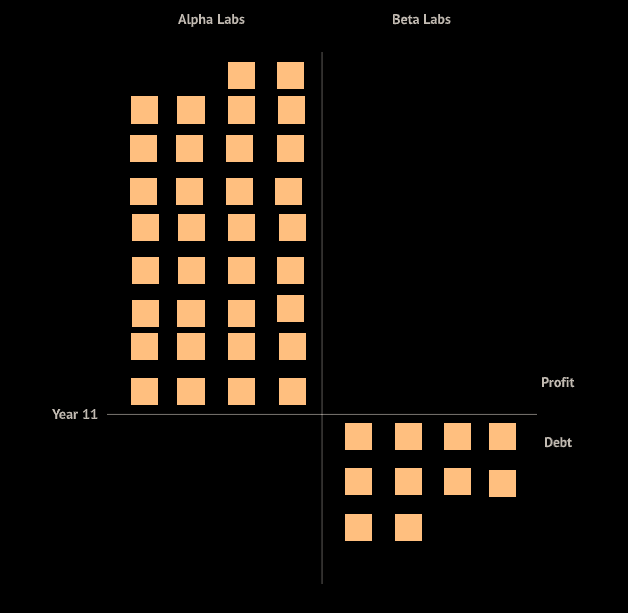

Jak nyní jasně vidíte, společnosti Beta Labs by trvalo asi 16 let, než by se dostala na hranici rentability (kolem roku 2031), zatímco společnost Alpha Labs se dostala na nulu už ve druhém roce svého provozu (v roce 2023) a v osmém roce po zahájení výstavby jaderné elektrárny v roce 2016.

Umístění bitcoinové těžební farmy v elektrárně bylo pro společnost Alpha Labs skutečně převratným rozhodnutím, a to díky jednomu vizionářskému inženýrovi, který byl teď povýšen do řídícího týmu. Zcela po zásluze.

Jak vyplývá z této případové studie, umístění bitcoinové těžby v atomové elektrárně zlepšuje výnosy projektu i dobu návratnosti, což zvyšuje atraktivitu investičního kapitálu. Mohla by těžba bitcoinu reálně pomoci prosadit jadernou energetiku opět do hlavního proudu? Otázka k zamyšlení.

---

## ELEKTŘINA TÉMĚŘ ZDARMA: MYŠLENKOVÝ EXPERIMENT

Co kdybychom nyní provedli malý myšlenkový experiment a podívali se, zda společnost Alpha Labs dokáže prodat svůj 1 GWe elektřiny do sítě za poloviční cenu, než za jakou ji prodávala v předchozí případové studii. Jak by v tomto případě vypadala její rozvaha?

Do šestého roku by nebyl žádný rozdíl, protože jaderné elektrárny se teprve dokončují, takže začneme od sedmého roku. Takto vypadají rozvahy obou společností na konci šestého roku:

---

### ROK SEDMÝ: 2022

Teď to začíná být opět opravdu zajímavé. Obě společnosti Alpha Labs a Beta Labs dokončily výstavbu svých jaderných elektráren a jsou nyní připraveny vyrábět elektřinu.

Všechny naše předpoklady z předchozí případové studie zůstávají v platnosti i pro tento myšlenkový experiment. Jediný rozdíl je v tom, že společnost Alpha Labs zpeněžuje 1 GWe generované elektřiny bitcoinovou těžbou úplně stejným způsobem, zatímco její 1 GWe část, kterou dříve prodávala do sítě za přibližně 525 milionů dolarů čili devět bloků příjmů, jim nyní vydělává polovinu, tedy přibližně 267 milionů dolarů nebo pět bloků příjmů. To by znamenalo prodej za zúčtovací cenu 3 centy za kWh místo 6 centů za kWh.

Beta Labs: 20 bloků dluhu, pět dalších bloků dluhu za sedmý rok, dva bloky provozních nákladů, devět bloků příjmů z 1GWe do sítě. 
Roční zisk a ztráta = 9 bloků - (5 bloků + 2 bloky) = 2 bloky 
Celkový dluh = 20 bloků - 2 bloky = 18 bloků

Alpha Labs: 40 bloků dluhu, 10 dalších bloků stávajícího úvěru za sedmý rok, tři další bloky dluhu za ASICy v sedmém roce, čtyři bloky provozních nákladů, pět bloků výnosů z 1 GWe do sítě, 27 bloků výnosů z 1 GWe těžby bitcoinu. 
Roční zisk a ztráta = (5 bloků + 27 bloků) - (10 bloků + 3 bloky + 4 bloky) = 15 bloků 
Celkový dluh = 40 bloků - 15 bloků = 25 bloků

---

### ROK OSMÝ: 2023

Beta Labs: 18 bloků dluhu, pět dalších bloků dluhu za osmý rok, dva bloky provozních nákladů, devět bloků příjmů z 1GWe do sítě. 
Roční zisk a ztráta = 9 bloků - (5 bloků + 2 bloky) = 2 bloky 
Celkový dluh = 18 bloků - 2 bloky = 16 bloků

Alpha Labs: 25 bloků dluhu, 10 dalších bloků stávajícího úvěru za osmý rok, tři další bloky dluhu za ASICy v osmém roce, čtyři bloky provozních nákladů, pět bloků výnosů z 1 GWe do sítě, 29 bloků výnosů z 1 GWe těžby bitcoinu. 
Roční zisk a ztráta = (5 bloků + 29 bloků) - (10 bloků + 3 bloky + 4 bloky) = 17 bloků 
Celkový dluh = 25 bloků - 17 bloků = 8 bloků

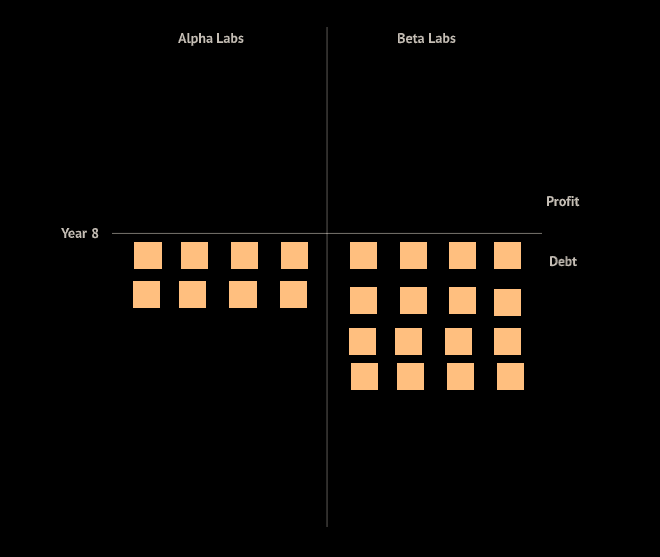

---

### ROK DEVÁTÝ: 2024

Beta Labs: 16 bloků dluhu, pět dalších bloků dluhu za devátý rok, dva bloky provozních nákladů, devět bloků příjmů z 1GWe do sítě. 
Roční zisk a ztráta = 9 bloků - (5 bloků + 2 bloky) = 2 bloky 
Celkový dluh = 16 bloků - 2 bloky = 14 bloků

Alpha Labs: 8 bloků dluhu, 10 dalších bloků stávajícího úvěru za devátý rok, tři další bloky dluhu za ASICy v devátém roce, čtyři bloky provozních nákladů, pět bloků výnosů z 1 GWe do sítě, 17 bloků výnosů z 1 GWe těžby bitcoinu. 
Roční zisk a ztráta = (5 bloků + 17 bloků) - (10 bloků + 3 bloky + 4 bloky) = 5 bloků 
Celkový dluh = 8 bloků - 5 bloků = 3 bloky

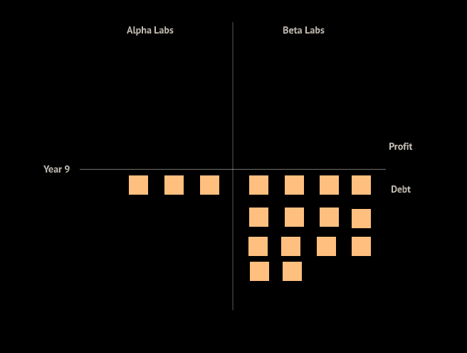

---

### ROK DESÁTÝ: 2025

Beta Labs: 14 bloků dluhu, pět dalších bloků dluhu za desátý rok, dva bloky provozních nákladů, devět bloků příjmů z 1GWe do sítě. 
Roční zisk a ztráta = 9 bloků - (5 bloků + 2 bloky) = 2 bloky 
Celkový dluh = 14 bloků - 2 bloky = 12 bloků

Alpha Labs: 3 bloky dluhu, 10 dalších bloků stávajícího úvěru za desátý rok, tři další bloky dluhu za ASICy v desátém roce, čtyři bloky provozních nákladů, pět bloků výnosů z 1 GWe do sítě, 19 bloků výnosů z 1 GWe těžby bitcoinu. 
Roční zisk a ztráta = (5 bloků + 19 bloků) - (10 bloků + 3 bloky + 4 bloky) = 7 bloků 
Celkový zisk = 7 bloků - 3 bloky = 4 bloky

V tomto případě společnost Alpha Labs dosáhla vyrovnaného hospodaření v desátém roce namísto osmého roku, tedy čtyři roky po zahájení činnosti. I tak je to ale úžasné, když uvážíme, že Beta Labs by se dostala do zisku až v 16. roce a Alpha Labs prodává 1 GWe elektřiny v porovnání s nimi za poloviční cenu.

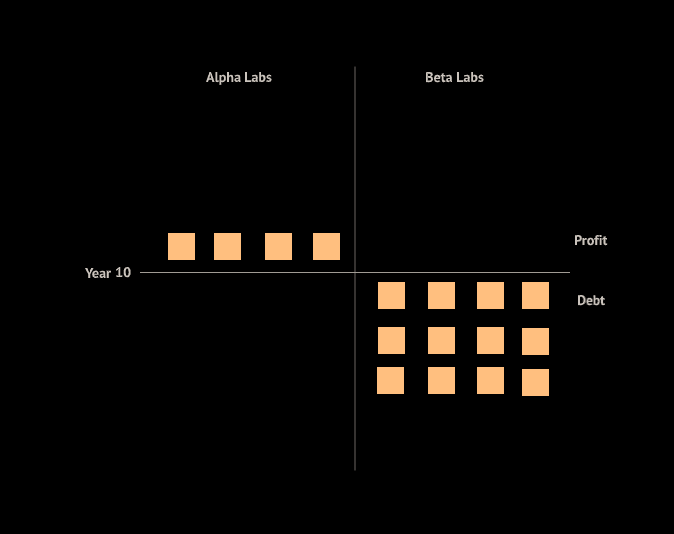

---

### ROK JEDENÁCTÝ: 2026

Beta Labs: 12 bloků dluhu, pět dalších bloků dluhu za jedenáctý rok, dva bloky provozních nákladů, devět bloků příjmů z 1GWe do sítě. 
Roční zisk a ztráta = 9 bloků - (5 bloků + 2 bloky) = 2 bloky 
Celkový dluh = 12 bloků - 2 bloky = 10 bloků

Alpha Labs: 4 bloky zisku, 10 dalších bloků stávajícího úvěru za jedenáctý rok, tři další bloky dluhu za ASICy v jedenáctém roce, čtyři bloky provozních nákladů, pět bloků výnosů z 1 GWe do sítě, 22 bloků výnosů z 1 GWe těžby bitcoinu. 
Roční zisk a ztráta = (5 bloků + 22 bloků) - (10 bloků + 3 bloky + 4 bloky) = 10 bloků 
Celkový zisk = 4 bloky + 10 bloků = 14 bloků

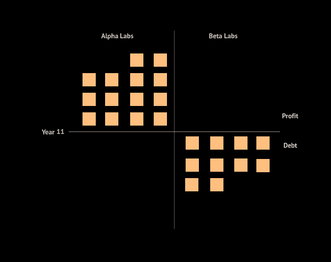

Zakomponování bitcoinového těžebního centra bylo pro Alpha Labs skutečně převratným rozhodnutím, a i když prodávala elektřinu ve srovnání s Beta Labs za poloviční cenu, je v této fázi ve srovnání s ní podstatně ziskovější.

---

Zde předkládáme citlivostní analýzu clearingové ceny elektřiny prodávané společností Alpha Labs a její rozvahy na základě přírůstků bloků:

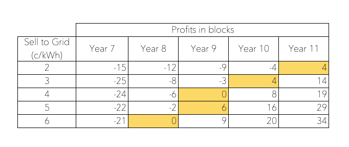
 

Jak je vidět z výše uvedené tabulky, ve všech případech ceny až do výše 2 centů za kWh by se společnost Alpha Labs dostala do zisku v 11. roce - tj. v pátem roce provozu elektrárny s farmou (vše zvýrazněno žlutě).

Poté, co jsme prošli výpočty rozvah společností Alpha i Beta Labs, je třeba upozornit na několik důležitých věcí, jež je třeba mít na paměti:

- Získat více než 10 miliard dolarů s 3% úrokem a podmínkami uvedenými v tomto článku pro výstavbu jaderné elektrárny s kolokovanou těžbou bitcoinů (dvě silně nepochopená odvětví) není v dnešním prostředí snadný úkol. Vybudování atomové elektrárny je velmi citlivé na kapitálové náklady a náklady kapitálu a pro dlouhodobou ziskovost je nezbytné pro výstavbu elektráren s integrovanou těžbou získat co nejlepší podmínky.

- Výstavba jaderné elektrárny může trvat dlouho, přibližně šest let, za předpokladu, že nedojde ke zpoždění z mnoha možných důvodů, včetně protestů veřejnosti. V porovnání s tím může být elektrárna na zemní plyn <a href="https://proest.com/construction/cost-estimates/power-plants/#:~:text=Power%20plant%20construction%20is%20generally,with%20some%20extending%20considerably%20further.">uvedena do provozu přibližně za dva roky</a>. Vybudování jaderné elektrárny je nákladné a její provoz je neuvěřitelně levný, zatímco u elektráren na zemní plyn je tomu přesně naopak. Vzhledem k tomu, jak se těžební průmysl cyklicky vyvíjí a jak konkurenční se může v průběhu času stát, je obtížné pro financování a rozšiřování kapacit těžby v lokalitě předpovídat příjmy z těžby na šest let dopředu s nějakou danou jistotou.

- Těžba bitcoinu se časem stane neuvěřitelně nákladově konkurenční a příjmy se zmenší do takové míry, že provozování velkých těžebních center bude v nějaké formě možné pouze přímo u zdroje. Jaderná energie poskytuje nejlepší základní zatížení pro budování těžebních center s nepřetržitou spolehlivou dodávkou energie a není nutné žádné napojení na rozvodnou síť. I v případě, že těžební centrum umístíte společně se solárním nebo větrným zařízením, budete potřebovat nějaké napojení na síť, protože solární i větrné zdroje jsou na rozdíl od jádra přerušované.

- S nástupem modulárních reaktorů a reaktorů nové generace využívajících nové konstrukce a materiály by se mohly náklady i lhůty výstavby jaderných elektráren výrazně snížit.

- Model výroby elektřiny v jaderné elektrárně a současná těžba bitcoinu by mohly ve velkém měřítku přijmout národní státy v rámci energetické a národní bezpečnosti. Tyto projekty by mohly získat státní financování a dotace/kredity, aby byly ještě atraktivnější pro investiční kapitál.

Záměrem tohoto článku bylo poskytnout zevrubnou případovou studii o tom, jak by mohla vypadat kolokace bitcoinové těžby s výstavbou jaderné elektrárny a jak velký rozdíl by to mohlo skutečně znamenat pro rozvahu společnosti vlastnící takové výrobní aktivum. Jak vidno, strategii Alpha Labs byste preferovali před Beta Labs. Stačí, aby to ve vaší společnosti pochopil jeden inženýr a nadhodil vám to.

---

## ODKAZY

<a href="https://www.youtube.com/watch?v=UC_BCz0pzMw&t=649s">“The Economics Of Nuclear Energy</a>,” Real Engineering 
<a href="https://www.youtube.com/watch?v=cbeJIwF1pVY&t=803s">“Economics Of Nuclear Reactor</a>,” Illinois EnergyProf

Disclaimer: Informace uvedené v tomto článku vycházejí z našich prognóz a odrážejí převládající tržní podmínky a naše názory k tomuto datu, které se mohou změnit. Článek obsahuje výhledové prognózy, které jsou spojeny s riziky a nejistotami. Veškerá prohlášení uvedená v článku vycházejí ze současných znalostí a předpokladů autorů. Různé faktory mohou způsobit, že skutečné budoucí výsledky, výkonnost nebo události se budou podstatně lišit od těch, které jsou popsány v těchto prohlášeních.

## ---
<big>Autoři: <a href="https://twitter.com/purugyl">Puru Goyal</a> & Tina Torres 
 Původní článek: <a href="https://bitcoinmagazine.com/business/bitcoin-mining-at-nuclear-power-plants">CAN BITCOIN MINING 
  MAKE NUCLEAR ENERGY ABUNDANT AND FREE?</a>
 Přeložil: <a href="https://twitter.com/nekonecnik">@nekonecnik</a> <a href="https://sifrant.github.io/jednadvacet/support" style="text-decoration: none">🧡</a>
<!--
 Korektura / konzultace: <a href="https://twitter.com/@SatsJoseph">@SatsJoseph</a>
-->
</big>
  

  <footer>
    

    
  </footer>

