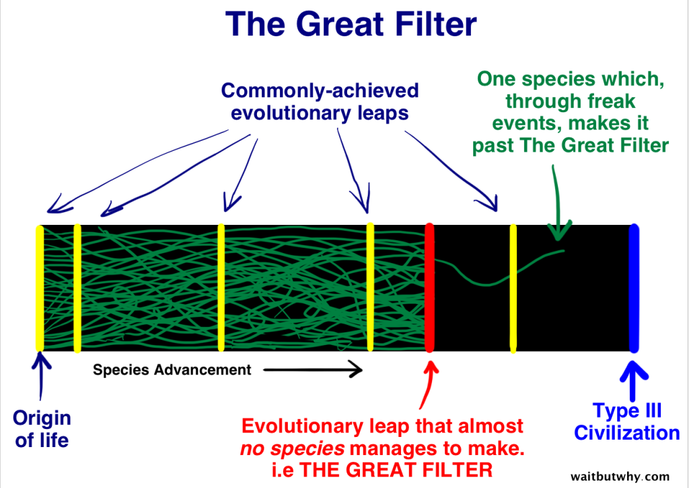
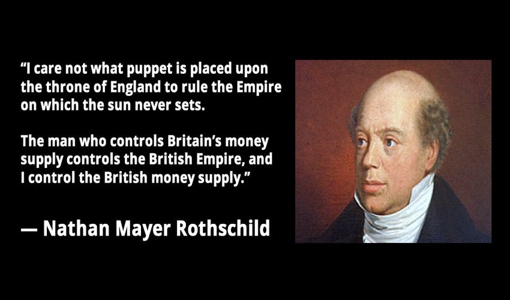
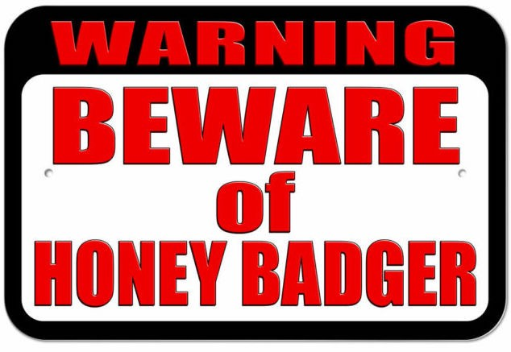

<header>

  
  


</header>

This is 🇨🇿 Czech translation of <a href="https://brandonquittem.com/bitcoin-is-the-mycelium-of-money/">this article</a> 
by <a href="https://twitter.com/Bquittem">Brandon Quittem</a> 
 Translated @744260 by <a href="https://twitter.com/nekonecnik">@nekonecnik</a> 🧡

# Bitcoin je myceliem peněz

*Jsem přesvědčen, že stejně jako Satoshi spojil jednotlivé obory, aby dal dohromady technologii, které 
říkáme bitcoin, má i každý z nás zodpovědnost za zkoumání svých vlastních jedinečných přesahů znalostí. Zde je můj průzkum 
hub a bitcoinu - paralely jsou ohromující.*

# Kapitola 3: Bitcoin je antivirus (léky z hub)

Všichni jsme slyšeli o neuvěřitelném potenciálu bitcoinové budoucnosti. Pokud jde o zdravé peníze a sociální škálovatelnost, 
rozhodně se mnou počítejte.

Toto drama však bude trvat desítky let. Co když Bitcoin nepřežije dost dlouho na to, aby využil svůj potenciál naplno?

Satoshi se naštěstí poučil z neúspěšných pokusů o soukromé peníze. Genetický kód bitcoinu byl navržen tak, aby byl maximálně odolný.

V této části budeme pohledem hub zkoumat úrodné makroprostředí a schopnost Bitcoinu přežít.

Ponořme se do toho!

## Včely medonosné, Kleštíci včelí (roztoči Varroa) a léky z hub

V roce 1997 pozoroval zvídavý mykolog Paul Stamets unikátní chování včel medonosných. Včely se vydaly na cestu, aby konzumovaly vodu 
obsahující houbové výtrusy. "Hmm, to je zajímavé," pomyslel si Paul.

O 15 let později si Paul začal dávat dohromady souvislosti. V důsledku syndromu úhynu včelstev (CCD) docházelo k nebývalému úhynu 
medonosných včel. Včely umíraly částečně kvůli napadení roztoči Varroa, kteří přenášejí smrtící viry, jako je viróza včel deformující 
křídla (DWV) a Lake Sinai virus (LSV).

Chemikálie používané moderním zemědělstvím otrávily včely, jejichž imunitní systém je příliš oslaben, aby se roztočům Varroa ubránil. 
Jak včely cestují, roznášejí roztoče na všechny včely v okolí, což vede k 70% poklesu včelích populací od roku 2005.

<b>Koho zajímají včely?</b>

Včely jsou zásadním druhem, který je zodpovědný za opylování velkého procenta našich potravin (avokádo, mandle atd.). Pokud o včely 
přijdeme, bude to mít nespočet následných dopadů, jako je ztráta pracovních míst, zničené ekosystémy a snížená potravinová bezpečnost.

<small><a href="https://www.planetbee.org/planet-bee-blog//no-bees-no-dinner-2">zdroj obrázku</a></small>

Vraťme se k našemu mykologovi Paulovi, který v roce 2012 přišel s monumentálním zjištěním: je známo, že houby podporují imunitní 
systém - včely musely instinktivně vědět, že mají pít houbovou vodu. Paul svou hypotézu ověřil a brzy poté prokázal, že pomocí 
jednoduchého antivirového "houbového léku" můžeme snížit účinky viru deformovaných křídel / kolapsu včelstev o 80 %.

<b>Naším současným měnovým režimem je Kleštík včelí - roztoč Varroa.</b>

Náš současný měnový režim centrálního bankovnictví je jako otravní roztoči Varroa napadající naše finanční trhy.

- Roztoče Varroa je těžké zabít - režimy fiat měn těží z monopolu na násilí.
- Rozšiřují viry na vše, čeho se dotknou - deformace trhu, trafikářství, regulační zajetí
- Negativní navazující dopady - chybná alokace kapitálu, zvýšená časová preference, omezení lidské produktivity, zvýšení rizika katastrofy.

<b>Bitcoin je antivirem (houbovým léčivem), který "zachraňuje včely".</b>

Bitcoin (houbový lék) zabraňuje šíření naší destruktivní finanční hegemonie (roztoč Varroa), což přinese novou éru lidských úspěchů 
(záchrana včel má sekundární účinky, jako je zajištění potravinové bezpečnosti).

## Na cestě do velkého neznáma

Vstupujeme do období nejistoty, jaké naše civilizace dosud nezažila. Experiment s fiat penězi stojí na vratkých základech a naše 
sociální systémy se začínají hroutit.

V celosvětovém měřítku čelíme bezprecedentní úrovni zadlužení v poměru k HDP. Zdá se, že Fed, Evropská centrální banka, Bank of Japan 
a Bank of England nyní "<a href="https://www.ft.com/content/ae19e60e-81b0-11e7-94e2-c5b903247afd">vlastní pětinu celkového dluhu svých vlád</a>". 
Centrálním bankám docházejí tahy.

Evropská centrální banka v poslední snaze prosazuje záporné úrokové sazby. Opravdu dovolíme hegemonnímu bankovnímu systému, aby vkladatelům 
ZPOPLATŇOVAL uložení digitálního fiatu ve svých nejistých panoptikonech?

<b>Jak je to s Čínou?</b>

Čínský trh s nemovitostmi je nestabilní a už dávno měl projít korekcí. Řízení kapitálu a hledání výnosů v ochlazující se ekonomice vedly 
k nafouknutí cen tamějších nemovitostí. Co se stane, až trh zkoriguje a všichni začnou brát do zaječích? Raději mít plán ₿.

<b>A co USA?</b>

Dluh Spojených států v současné době přesahuje 22 bilionů dolarů, neočekávejte však, že by USA nedostály svým závazkům. Bývalý předseda 
Fedu Alan <a href="https://www.youtube.com/watch?v=Ck3FuTzZvhI">Greenspan řekl, že "Spojené státy mohou splatit jakýkoli dluh, protože 
  si na to vždy můžeme natisknout peníze"</a>.

V poučném článku s názvem <a href="https://www.epsilontheory.com/this-is-water/">This is Water</a> Ben Hunt vysvětluje, jak uměle stlačené 
úrokové sazby (snadné peníze) vedou ke snížení produktivity a zombifikaci finančních trhů. Stejný vzorec předznamenal finanční kolaps 
v letech 08/09.

<!--The reason companies aren't investing more aggressively in plant and equipment and technology is BECAUSE we have the most accommodative 
monetary policy in the history of the world, with the easisiest money to borrow that corporations have ever seen. Why in the world would 
management take the risk - and it's definitely a risk - of investing for real growth when they are so awash in easy money that they can 
beat their earnings guidance with a risk-free stock buyback? Why in the world would management take the risk - and it's definitely 
a risk - of investing for GAAP earnings when they are so awash in easy money that they can hit their pro forma narrative guidance by simply 
buying profitless revenue? Why in the world would companies take any risk at all when the Fed has eliminated any and all negative 
consequences for playing it safe?-->

> Důvodem, proč společnosti neinvestují agresivněji do zařízení, vybavení a technologií, je to, že máme nejvstřícnější měnovou politiku 
> v dějinách a nejsnadnější půjčování peněz, jaké kdy společnosti zažily. Proč by proboha management podstupoval riziko investovat 
> do skutečného růstu (což riziko rozhodně je), když je zaplaven snadnými penězi tak, že může překonat své výhledové zisky bezrizikovým 
> odkupem akcií? Proč by proboha management podstupoval riziko investování do účetních zisků, když je tak zaplaven snadnými penězi, že se 
> může trefit do svých pro forma odhadů jednoduše nákupem výnosů bez zisku? Proč by proboha měly společnosti vůbec podstupovat nějaké 
> riziko, když Fed eliminoval veškeré negativní důsledky hry na jistotu?

<b>Sociální struktury vykazují slabiny</b>

Země po celém světě se snaží zrušit fyzickou hotovost. Hotovost je základním nástrojem ochrany soukromí a je podmínkou pro zachování 
otevřené společnosti. Bez fyzické hotovosti (nebo bitcoinu) jsou občané vydáni na milost a nemilost finančnímu dohledu. To už jsme vpravdě 
na šikmé ploše.

Nelze zapomenout na čínský systém sociálních kreditů. Čínská sledovací technologie bude brzy exportována do celého světa.

Mladí lidé nedůvěřují svým vládám ani finančním institucím. 40 % Američanů si nemůže dovolit neočekávané výdaje ve výši 400 dolarů. Není 
divu, že potenciální demokratický kandidát Andrew Yang nabírá v průzkumech na síle a zároveň vede kampaň za všeobecný základní příjem.

Nejistá budoucnost je dokonalým substrátem pro růst extremismu. Demokratický socialismus, moderní měnová teorie (MMT), politika záporných 
úrokových sazeb (NIRP), válka proti hotovosti, všudypřítomný konzumerismus a rostoucí zadlužení studentů jsou toliko příznaky upadajícího režimu.

## Naše tradiční instituce prostě nejsou vybaveny na to, aby se vypořádaly s komplexitou informačního věku.

Současné pokusy o nápravu politicko-ekonomické mašinérie zevnitř jsou ironicky poháněny "odpadním teplem válečné mašinérie" (h/t Vinay 
Gupta). Potřebujeme systémovou změnu. Ušít něco z jiné látky.

<b>Co když je protilátkou proti tomuto šílenství standard zdravých peněz (bitcoin)?</b>

Doufám, že v budoucnu se budeme na náš současný "bankovní fiat experiment" dívat s odporem. Jak jen jsme mohli tak dlouho žít v tak 
archaickém režimu?

Stejně jako houby přeměňují mrtvou a odumírající organickou hmotu v nový život, bitcoin přemění náš zchátralý bankovní systém v robustní 
finanční základy, na nichž může dojít k novému růstu.

## Velký filtr kryptoměn

*Může bitcoin přežít dostatečně dlouho, aby dosáhl svého plného potenciálu?*

Cypherpunkeři, anarchisté a voluntaristé se snaží vytvořit soukromé, nevládní peníze již velmi dlouho. Ve skutečnosti se moderní pokusy 
datují více než 30 let zpět, od počátků Chaumian Ecash až po E-gold a B-Money.

Navzdory skromnému úspěchu soukromých peněz před Bitcoinem byly nakonec všechny pokusy zmařeny přehnanými vládními zásahy a/nebo obchodními zájmy.

<b>Teorie velkého filtru</b>

Teorie Velkého filtru vznikla poté, co jsme si všimli, že se nám ve vesmíru nedaří najít inteligentní život. Kde jsou všichni?

Teorie předpovídá: během evolučního procesu života existují překážky, jejichž překonání je velmi nepravděpodobné nebo nemožné. Takovou 
překážkou je "Velký filtr".

Co kdyby se například vyspělá civilizace pokaždé, když vytvoří jadernou bombu, nakonec sama zničila? V takovém případě by mohlo být 
statisticky nepravděpodobné, že by po vynalezení jaderných zbraní dlouho přežila.

<small>Zdroj: <a href="https://waitbutwhy.com/2014/05/fermi-paradox.html">The Fermi Paradox</a> od Tima Urbana, což je můj oblíbený blog</small>

<b>Pro kryptoměny je velkým filtrem přežití útoků na úrovni národních států</b>

Bitcoin je jediný peněžní druh, který má šanci velký filtr přežít. *Více o tomto níže.*

<b>Proč by měl národní stát nebo etablovaná společnost útočit na konkurenční formu peněz?</b>

Stručně řečeno: ten, kdo má zlato, určuje pravidla.

Dvěma hlavními výhodami kontroly peněžní zásoby jsou možnost peněžní zásobu nafouknout (neviditelná daň) a Cantillonův efekt.

Cantillonův efekt <a href="https://www.austriancenter.com/cantillon-effect-populism/">popisuje nerovnoměrnou expanzi peněžní zásoby</a>. 
Když centrální banka vytvoří nové peníze, profitují z těchto nových "levných peněz" ti, kteří k nim mají nejblíže (banky a velké korporace). 
V době, kdy nové peníze obdrží zbytek obyvatelstva, probíhá již cenová inflace.

Cantillonův efekt vede k přerozdělování bohatství od chudých k bohatým.

<small>Je mi jedno, jaká loutka usedne na anglický trůn, aby vládla říši, nad níž slunce nikdy nezapadá. 
Člověk, který ovládá britskou peněžní zásobu, ovládá britské impérium - a já ovládám britskou peněžní zásobu. 
Nathan Mayer Rothschild</small>
 

<b>Vláda vynakládá velké úsilí na ochranu svého monopolu.</b>

Stejně jako E-gold v 90. letech minulého století může v době míru prosperovat jakákoli konkurenční kryptoměna. Při patřičném pozdvižení 
se však ti, kdo jsou u moci, vrhnou na ochranu svých zájmů. Historie je plná podobných příkladů.

Mezi roky 2006-2008 vláda USA rozšířila definici "licence pro převod peněz" (podle zákona Patriot Act) tak, aby se vztahovala i na E-gold. 
Na svém vrcholu E-gold ročně zpracovával nákupy v hodnotě přes 2 miliardy dolarů. Vláda USA bohužel využila jeho centralizované povahy, 
vrazila do dveří a E-gold ukončila.

<b>Poučení z příběhu? Vlády nemají rády konkurenci.</b>

Kongresman Sherman z Kalifornie nedávno vyzval k úplnému zákazu bitcoinu. Sherman je překvapivě osvícený. Vlastně tak chápe skutečné 
poslání bitcoinu: Vytvořit nové globální podkladové peníze, jež nemohou být zneužity žádnou aktuální globální supervelmocí.

<b>Čas na novou strategii: Být nezastavitelný?</b>

V roce 1984 slavný rakouský ekonom Friedrich August von Hayek nevědomky položil základ evoluční strategie bitcoinu: být nezastavitelný.

> <b>“Nevěřím, že ještě někdy budeme mít dobré peníze, dokud je nevytrhneme z rukou vlády, tedy nemůžeme je vytrhnout z rukou vlády násilím, jediné, co můžeme udělat, je nějakou mazanou oklikou zavést něco, co oni nemohou zastavit.”</b>
>  <a href="https://www.youtube.com/watch?v=EYhEDxFwFRU&t=1124s">Friedrich Hayek</a>

Hayek s mrazivou prozíravostí předpověděl bitcoin již před nějakými 25 lety.

<b>Satoshi očividně Hayeka četl a chápal "Velký filtr kryptoměn".</b>

V roce 2009 vydal Satoshi Nakamoto implementaci Hayekových "nezastavitelných peněz". Bitcoin byl od prvního dne navržen tak, aby "velký filtr" přežil.

> <b>"Mnoho lidí automaticky odmítá elektronickou měnu jako ztracený případ kvůli všem společnostem, které od 90. let zkrachovaly. 
> Doufám, že je zřejmé, že to byla pouze centrálně řízená povaha těchto systémů, která je odsoudila k zániku. Myslím, že to je poprvé, 
> co zkoušíme decentralizovaný systém, který není založen na důvěře."</b>
>  Satoshi Nakamoto

Aby mohl být potenciál bitcoinu plně využit, musí být natolik odolný, aby ho nedokázali úspěšně zničit ani aktéři na úrovni národních 
států. Což znamená zabránit tomu, aby jakákoli strana měla nad systémem plnou kontrolu.

<b>Paralely s houbami: nejodolnější druhy planety</b>

<small>Pravěké houby zvané Prototaxites</small>

Během 1,3 miliardy let evoluce se houby zdokonalily v umění zůstat naživu. Na rozdíl od rostlin nejsou závislé na slunečním světle, ale samy 
si hledají/vyrábějí potravu. Houby nemají centralizovaný bod selhání, což je činí odolnými vůči útokům. Při patřičném ohrožení houby kradou 
genetický kód svým ekologickým sousedům (horizontální přenos genů).

Od doby, kdy se na naší planetě vyvinul složitý život, jsme zažili pět velkých vymírání, při nichž zahynulo 75-96 % veškerého života na Zemi.

Při každé kataklyzmatické události zdědily houby Zemi díky své antifragilní povaze. Ve snaze přežít "velký filtr" napodobuje Bitcoin účinné 
evoluční strategie pozorované v říši hub.

## Může bitcoin přežít "Velký filtr"?

*Jak byste mohli zabít bitcoin? Vypnout internet? Zakázat jeho používání? Pekelně ho zdanit?*

Jakákoli kryptoměna, která nemůže (reálně) přežít útok na úrovni národního státu, je zbytečná. Pouze oddaluje svůj nevyhnutelný zánik.

Satoshi navrhl superorganismus bitcoinu tak, aby přežil "Velký filtr" a odolal korupci. Tento vznešený cíl odstartoval evoluční cestu 
oddělující bitcoin od všech ostatních kryptoměn a "blockchainových projektů".

<b>Znamená to, že bitcoin zaručeně velký filtr přežije?</b>

Ne nevyhnutelně. To se nedá zjistit, dokud nedojde ke koordinovanému útoku ze strany aktéra na státní úrovni. Bitcoin je však jediná 
existující kryptoměna, která má šanci. Prozkoumejme některé pozitivní trendy, jaké má bitcoin, pro své přežití, v zásobě.

- <b>Bitcoin nelze regulovat.</b> Žádná osoba nebo subjekt za něj nezodpovídá. Kód je svobodný projev. Každá země má vlastní 
konkurenční jurisdikci.
- <b>Teorie her chrání bitcoin před globálním koordinovaným útokem.</b> Národní státy mezi sebou soutěží. Je nepravděpodobné, 
že by vrcholné státy spolupracovaly. Pokud USA zakážou BTC, Čína bude mít motivaci ho přijmout. Národy, které nemají prospěch 
ze současného režimu USD, mají motivaci přijmout BTC.
- <b>PoW bitcoinu chrání účetní knihu "energetickým štítem".</b> Tím, že je bitcoin ukotven k reálné ekonomické hodnotě (energii), 
je jediným způsobem, jak změnit účetní knihu, "znovu provést veškerou práci" neboli utratit stejné množství peněz ve formě 
elektřiny. h/t @danheld
- <b>Bitcoin vzbuzuje u svých příznivců náboženský zápal.</b> Ideologicky motivovaní "zastánci tvrdé linie" působí jako imunitní 
systém. Přežití škálovacích válek (NYA/S2X) je toho důkazem. Bitcoineři "poskytují krycí palbu", dokud bitcoin neprojde dveřmi. 
(h/t Bitcoin Sign Guy)
- <b>Bitcoin může obcházet cenzuru poskytovatelů internetových služeb.</b> Bitcoin má rostoucí síť alternativ k běžnému internetu 
(mesh sítě, satelity a radioamatérská řešení). Třeba dokonce i směrování transakcí přes myceliální síť (teoreticky možné).
- <b>Bitcoin je myšlenka, myšlenky jsou věčné.</b> Bitcoin se šíří jako myšlenkový virus. I kdyby byla současná podoba nějak 
"zabita", myšlenka bude žít navždy. "Tenhle Snow Crash - je to virus, droga, nebo náboženství?" Juanita pokrčí rameny. "Jaký 
je v tom rozdíl?" h/t @nealstephenson
- <b>Zlepšení ochrany soukromí v bitcoinu snižuje zdanitelnost.</b> CoinJoin a další technologie ochrany soukromí minimalizují 
možnost vlád napadnout bitcoin prostřednictvím dravé daňové legislativy. Díky @wasabiwallet @SamouraiWallet
- <b>Bitcoin minimalizuje možnost podvádět.</b> Bitcoin nespoléhá na důvěru. Přemýšlejte o tom, že "nemůže být změněn", místo 
abyste věřili, že systém "nebude změněn". Bitcoin považuje vůdce, formalizovanou vládu a koncentraci moci za vektory útoku, které 
čekají na zneužití.
- <b>Národní státy bitcoin podceňují.</b> Tím bitcoin získává čas, aby posílil a stal se hůře zničitelným. Hegemonický bankovní 
systém si kope vlastní hrob lopatou ze 100% čisté pýchy. Kdybychom tak měli plán ₿.

Zatím jsme nezaznamenali žádný vážný útok na bitcoin na státní úrovni. Pokud však bitcoin bude i nadále pohlcovat hodnotu, vznikne 
stimul k útoku na něj. V budoucnu budeme toto období v životě bitcoinu nazývat "velký mír".

<b>Alternativní teorie her: Tady žije medojed</b>

Bitcoin musí přesvědčit pouze několik velmocí, že odměna za jeho přijetí převáží riziko útoku na něj.

Tato teorie her je podobná tomu, jako kdybyste měli před domem ceduli s nápisem "nainstalován bezpečnostní systém" nebo "tady žije velký 
zlý pes". Nezáleží na tom, zda máte skutečně psa nebo bezpečnostní systém, samotná hrozba působí na případné útočníky jako odstrašující 
prostředek.

Bitcoin má před domem ceduli s nápisem "Pozor na medojeda". Ta připomíná národním státům, že bitcoin jen tak lehce nezabijí.

Pokud se národní státy pokusí zničit svou měnovou konkurenci, zdůrazní tím především samotnou potřebu bitcoinu. A přesto, čím déle budou 
čekat, tím silnějším se bitcoin stane.

## "Blockchainový průmysl" je argumentační klam

Nejdříve je důležité si uvědomit, že blockchaineři, stable coineři, security tokenizátoři a korporátní chainers s bitcoinem NESOUPEŘÍ. 
Taxonomicky se rozvětvily a snaží se uspokojit samostatnou niku.

Zjednodušeně řečeno, "blockchainový průmysl" je argumentační klam, který vede podniky a vlády k falešným závěrům. Slouží k odvádění 
pozornosti a nechtěně poskytuje bitcoinu krycí palbu.

Znamená to, že bychom se měli blockchainerům vyhýbat? Ne. Oni si prostě jen pletou blockchainový hype (houby) s bitcoinem (myceliální síť).

Měli bychom se je nejprve pokusit vzdělávat, protože většina lidí se bitcoinerem nenarodila. Přesto však úmyslní podvodníci 
si zaslouží dostat kotel.

<b>Jak "blockchainový průmysl" pomáhá bitcoinu...</b>

Blockchaineři vážou vládní zdroje, školí budoucí vývojáře, matou zavedené podniky a uspávají bankéře.

Banky jako JP Morgan vyškolí stovky vývojářů blockchainu. Ti nakonec objeví bitcoin a dají sbohem nudnému bankovnictví a místo toho se připojí 
k mírové revoluci. JP Morgan financuje svůj vlastní zánik? Jak poetické.

Zuckerberg brzy vloží "kryptopeněženku" do kapsy každého z nás. Místo toho, aby ZuckBucks konkurovaly bitcoinu, mohou se ve skutečnosti pokusit 
konkurovat americkému dolaru. Každopádně lidem zpohodlní práci s nestátními penězi v telefonu podobně jako WeChat a Alipay. První rozsáhlá 
cenzura ZuckBucks pak hezky ukáže, proč je BTC zapotřebí především.

Blockchaineři a podvodníci tvrdí, že Bitcoin je starý a nedá se škálovat. Je jako myspace nebo videokazety. Bitcoin vykreslují jako 
přátelskou, ale omezeně použitelnou houbu, která "nám přinesla blockchain".

Zatímco se blockchainový duch honí za svým ocasem, bitcoin tiše roste v podzemí, splývá s "kořeny" tradičního finančního systému, 
buduje odolnost, nabírá dobrovolníky, infikuje zvědavé mysli jako houba cordyceps a připravuje se na "Velký filtr".

Pokud budeme mít štěstí, Blockchaineři odvedou pozornost globálních velmocí na dostatečně dlouhou dobu, aby se bitcoin mohl stát 
"příliš velkým na to, aby padl".

## ---
<big>Autor: <a href="https://twitter.com/Bquittem">Brandon Quittem</a> 
 Původní článek: <a href="https://brandonquittem.com/bitcoin-is-the-mycelium-of-money/">Bitcoin is The Mycelium of Money</a>
 Přeložil:</big> ⚡ <a href="lightning:nekonecnik@stacker.news">nekonecnik@stacker.news</a> 🔗 Samourai 
PayNym 🤖 <a href="https://paynym.is/+muddydarkness33F">+muddydarkness33F</a>


  <footer>
    

    
  </footer>

