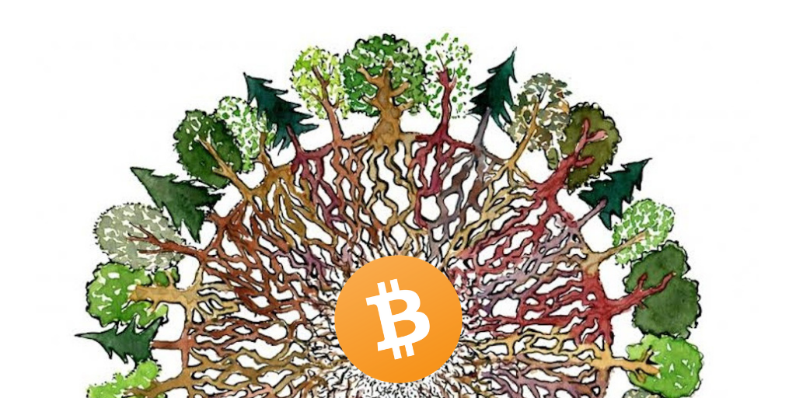
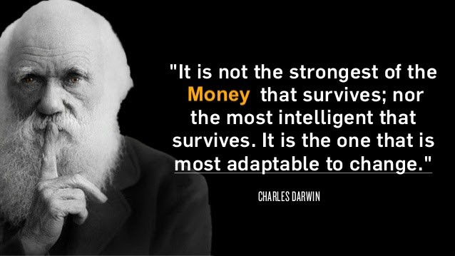
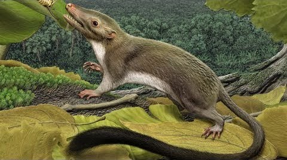

<header>

  
  


</header>

This is 🇨🇿 Czech translation of <a href="https://brandonquittem.com/bitcoin-is-the-mycelium-of-money/">this article</a> 
by <a href="https://twitter.com/Bquittem">Brandon Quittem</a> 
 Translated @744260 by <a href="https://twitter.com/nekonecnik">@nekonecnik</a> 🧡

# Bitcoin je myceliem peněz

*Jsem přesvědčen, že stejně jako Satoshi spojil jednotlivé obory, aby dal dohromady technologii, které 
říkáme bitcoin, má i každý z nás zodpovědnost za zkoumání svých vlastních jedinečných přesahů znalostí. Zde je můj průzkum 
hub a bitcoinu - paralely jsou ohromující.*

# Kapitola 4: Bitcoin je katalyzátorem lidské evoluce (symbióza)
*Zkoumání Bitcoinu optikou přírodního výběru, evoluce a symbiózy*

  <small>Original Art by <a href="https://fritsahlefeldt.com/">FritsAhlefeldt.com</a></small>

Příběh o tom, jak symbiotické vztahy mohou navždy změnit běh dějin.

Obdobně jako houby a rostliny vytvořily symbiotický vztah, aby úspěšně kolonizovaly souš, mohou lidé vytvořit symbiózu s bitcoinem, 
aby dosáhli individuálních zlepšení, stejně jako pokroku celého druhu.

V této části se budeme zabývat bitcoinem jako katalyzátorem lidské evoluce, a to z pohledu geologických časových měřítek, evoluce a symbiózy.

> <b>Definice symbiózy:</b> když spolu dva odlišné organismy žijí v důvěrném spojení (jako parazitismus nebo mutualismus). Příklad: klauni 
> očkatí a mořské sasanky

## Start života na Terra Incognita

Před pěti sty miliony let žil veškerý biologický život v oceánech. Souš, jak ji známe, byla sterilní sopečnou pustinou bez života. Tedy 
až do chvíle, kdy rostliny a houby uzavřely osudové partnerství, které navždy změnilo běh dějin.

Toto symbiotické partnerství vytvořilo kaskádu evolučních sil, které vedly ke vzniku veškerého pozemského života, včetně homo sapiens.

V moderní době se lidé organizují kolem síťových technologií, jako je internet a bitcoin, které jsou reinkarnací prastarého myceliálního 
archetypu, z něhož jsme vzešli.

Zhluboka se nadechněte. Život je úchvatný.

<b>Dobrá, jak jsme se sem dostali?</b>

Nejprve krátká lekce biologie. Organismy se dělí na *autotrofní* nebo *heterotrofní*.

*Autotrofové* jsou organismy, které si samy vyrábějí potravu. Například: rostliny přeměňují sluneční světlo a oxid uhličitý na potravu 
prostřednictvím fotosyntézy.

*Heterotrofy* jsou organismy, které si potravu vyhledávají. Například: lvi se živí gazelami a houby produkují enzymy k vnějšímu trávení 
svého prostředí.

Stejně jako lidští osadníci jsou i organismy kolonizující nové území nejzranitelnější v prvních dnech. Aby houby mohly kolonizovat 
souš (terra), musely si zajistit spolehlivý zdroj potravy.

Houby si účinně ochočily stroje na fotosyntézu (řasy), aby získaly soběstačný zdroj potravy. Tyto řasy si můžeme představit jako malé 
solární panely přišroubované k houbovým sítím, které umožnily kolonizaci panenské souše.

Brzy poté, co se houby usadily, začaly trávit sopečnou horninu, na níž se nacházely. Tím se uvolňovaly cenné živiny, které pak vyměňovaly 
s okolními houbami, řasami, bakteriemi atd. Společně tak tito první osadníci započali život na souši. Podívejme se, jak v tomto světle 
vypadá bitcoin.

## Jak Satoshi spustil zárodek bitcoinu

Aby mohl Satoshi kolonizovat internet (terra incognita) novou formou peněz, potřeboval navázat symbiotické partnerství.

Naštěstí našel perfektní partnerství a učinil řadu moudrých rozhodnutí, která maximalizovala šanci Bitcoinu na přežití bootstrapovací fáze.

Jak Satoshi "spolupracoval s řasami", aby nastartoval život bitcoinu na internetu

- Vysoká ranná emise neúměrně odměňovala early adoptery (míra včasné emise mohla být příliš agresivní) 
- Spuštění v kryptografickém mailing listu (pokud někdo dokázal bitcoin rozvíjet, byli to právě cypherpunkeři z tohoto  listu) 
- Načasování startu v době finanční krize v letech 08/09 (byla to náhoda?) 
- Satoshiho zpráva v genesis bloku "Kancléř na pokraji druhého záchranného balíčku" (výzva k získání ideologicky motivovaných příznivců)

## Mutualismus nebo parazitismus: Zkoumání symbiózy mezi Cypherpunkem a Satoshim

Podílely se řasy na partnerství s houbami (mutualismus)? Nebo houby využívaly schopnosti řas vytvářet si potravu na jejich úkor (parazitismus)?

Zdá se, že jde o mutualismus. Řasy mohly být zpočátku využity, ale výměnou za fotosyntézu získaly myceliální bezpečnostní systém a možnost 
kolonizovat novou niku.

Byli cypherpunkeři spoluviníky a měli z partnerství (mutualismu) prospěch? Nebo Satoshi využil cyberpunkerů z důvodu potřeby počáteční 
distribuční strategie (parazitismus)?

> <b>"Pro libertariánský pohled je to velmi atraktivní, pokud to dokážeme správně vysvětlit. Ale já jsem lepší v kódování než se slovy."</b>
>  Satoshi Nakamoto

Většina cypherpunkerů zpočátku bitcoin odmítala, ale pár vyvolených (především Hal Finney) se k němu přidalo. Vzhledem k tomu, že se o bitcoinu 
dozvěděli jako první, měli možnost získat nativní peněžní jednotky bitcoinu výměnou za mezní náklady na elektřinu při těžbě (v podstatě nulové). 
S výhodou zpětného pohledu by získání bitcoinů během prvních několika let vedlo k nezměrnému bohatství.

> <b>"Možnost generovat mince dnes za pár centů výpočetního času může být dobrou sázkou, výhra je něco jako 100 milionů ku 1!"</b>
>  Hal Finney

## (Ekonomická) evoluce přírodním výběrem

Po nastolení počátečních podmínek života na souši může aliance hub a rostlin začít přijímat nové účastníky trhu vstupující do ekosystému (organismy).

Houby komunikují se světem prostřednictvím chemie. Vylučují enzymy, kterými navenek tráví své prostředí. Sopečná hornina byla jedinou 
restaurací ve městě. Tyto rané houby uvolňovaly molekulární zdroje tím, že metabolizovaly sopečnou horninu, na níž se nacházely.

To umožnilo vznik protoekonomiky složené z primitivních hub, rostlin a bakterií. Obchodovaly se základními molekulami potřebnými pro život 
na bázi uhlíku (uhlík, dusík, kyslík atd.).

Houby v podstatě měnily kamení v zaměnitelné biologické tokeny. Tyto biologické tokeny pak byly obchodovány na koncích myceliálních tras 
spojujících vše živé v okolí. Houby vytvářely trh i usnadňovaly obchod, což vedlo k explozi biologické rozmanitosti na souši.

## Terra se poprvé nadechuje

Než rostliny osídlily souš, nebyla atmosféra naší Země příliš pohostinná. Jak víte, rostliny vdechují oxid uhličitý a vydechují kyslík. 
To nakonec vedlo ke vzniku naší atmosféry bohaté na kyslík - planeta Země se poprvé nadechla.

Houby v jistém smyslu uvolnily dynamiku volného trhu, což vedlo k neuvěřitelnému rozšíření života. Nyní prozkoumejme paralely s bitcoinem.

## Bitcoin umožňuje nové ekonomické paradigma

Stejně jako se objevují nové organismy (prostřednictvím speciace), aby obsadily nově vytvořené niky na souši, vyvíjí se i DNA (kód) bitcoinu, 
aby vytvořil nové fenotypy (inovující vlastnosti) a využil tak nové mezery.

Jinými slovy, bitcoin přináší nové finanční způsoby použití, které dříve nebyly možné. Tím se zvětšuje ekonomický koláč, a vytváří se tak 
společenské bohatství.

Novinky přinesené bitcoinem:

- První a jediná implementace absolutní vzácnosti (těžko přehánět) 
- Globální, téměř okamžitý, apolitický systém vypořádání plateb 
- Neutrální peníze, které není snadné uchvátit do područí zvláštních zájmů 
- Necenzurovatelný prostředek směny pro černé/šedé trhy 
- Demokratizace základních finančních služeb 
- Nestátní úložiště hodnoty se zanedbatelnou vstupní bariérou

## Bitcoin i mycelium vylepšují obchod

Myceliální sítě fungují jako transportní vrstva zdrojů a komunikační systém propojující organismy v biosféře. Díky tomu si organismy mohou 
dobrovolně vyměňovat zdroje a znalosti napříč druhy. Rostoucí obchod vede k větší specializaci (dělbě práce), což dále zvyšuje biodiverzitu 
(bohatství a odolnost) v ekosystému.

V současné době naše vlády vytvářejí hospodářské monopoly, které mnoha občanům brání v přístupu na světové trhy.

Vzpomeňte si na všechen neproduktivní lidský kapitál, který se nachází v zemích, jako je Írán, Venezuela a Argentina. Bez přístupu 
ke společnému ekonomickému jazyku (bitcoinu) se mnoho lidí nemůže zapojit do globálního obchodu.

Jakmile se bitcoin stane všudypřítomným, uvolní lidskou produktivitu vedoucí k větší inovaci, specializaci a obchodu. Již nyní jsme svědky 
některých základních příkladů, jako jsou freelanceři ve Venezuele, kteří používají bitcoin coby překlenovací měnu pro přístup k USD, čímž 
se účinně vyhýbají finanční kontrole.

Tvrzení, že "bitcoin se používá jako překlenovací měna" můžeme extrapolovat do širší vize budoucnosti, kde všichni mluví stejným ekonomickým 
jazykem. Globální trh talentů vede k většímu množství zboží a služeb vyráběných za nižší cenu. Nemluvě o tom, že zvýšení obchodu s rozvojovými 
zeměmi pomůže tamějším lidem vymanit se z chudoby.

## Bitcoin umožňuje ekonomickou evoluci přirozeným výběrem

Darwinovská evoluce přirozeným výběrem je biologický motor, jehož cílem je odměňovat úspěšné aktéry a eliminovat neúspěšné. Když antilopu 
sežere lev, zemře, nikdo ji nezachrání. Příroda jde se svou kůží na trh. Tato zpětná vazba je klíčová. Jedinci jsou křehcí, aby bylo 
zajištěno, že systém bude antifragilní.

Tržní ekonomika je motorem, který má za cíl hledat efektivnější využití kapitálu tím, že odměňuje úspěšné projekty a trestá neúspěšné. Naše 
současná forma "kapitalismu" však připomíná spíše trafikářství, nebo jak řekl Travis Kling: "socialismus pro bohaté".

Místo toho, abychom nechali podniky zkrachovat, je zachraňujeme. To vede k selhání incentiv, které vytvářejí morální hazard a celý systém 
se stává křehčím. Nemluvě o tom, že to neúměrně poškozuje pracující třídu. Když moje panna vyhraje, váš orel prohraje.

Zdravý peněžní systém (jako je bitcoin) zlepšuje tento ekonomický motor tím, že zpřísňuje zpětnovazební mechanismus, který odměňuje tvorbu 
hodnoty a trestá neúspěch. Ve světě bitcoinu nejsou bailouty skutečně možné, protože měnová expanze je omezena pevnou měnovou bází. Bitcoin 
zajišťuje, že jednotliví lidé/společnosti jsou křehcí, aby se zajistilo, že ekonomický systém zůstane antifragilní.

Jinými slovy, bitcoin posiluje nutkání jít s "kůží na trh", což zlepšuje zpětnou vazbu vedoucí k ekonomické evoluci přirozeným výběrem. 
Ekonomický darwinismus vítězí.

## Zkrocení bodlína

<small>Bodlín: předek všech žijících placentálních savců</small>

Díky symbiotickému vztahu s houbami a rostlinami a evoluci přirozeným výběrem se naše bleděmodrá tečka ve vesmíru proměnila z pusté skály 
v rajskou zahradu. Skutečně podivuhodné.

Přibližme si konec období křídy (před asi 65 miliony let). Planetu ovládali na souši i v oceánech dinosauři. Savci neměli téměř žádný 
význam. Vypravěč: ale situace se měla změnit.

Obří meteorit dopadl na území dnešního Mexika a ukončil existenci dinosaurů a většiny života na planetě Zemi. Náraz způsobil krátkodobý 
nárůst povrchových teplot, po němž následovalo dlouhodobé ochlazení v důsledku toho, že prach a nečistoty blokovaly sluneční světlo.

Přestože většina organismů byla během kataklyzmatu vyhubena, některé druhy v chaosu prospívaly. Pro náš příběh jsou nejvýznamnější houby 
(samozřejmě) a malý savec podobný rejskovi, známý jako bodlín (překvapivě).

Bez slunečního světla většina rostlin rychle zahynula. Houbám se však dařilo, protože nejsou na sluneční světlo odkázány (nezapomeňte, 
že si potravu hledají samy). Houby spokojeně rozkládaly všechny nově odumřelé organismy.

## A co bodlín Terenc? 😄

S poklesem teplot a nedostatkem potravy byla většina zvířat, která přežila počáteční šok, zabita houbovými patogeny nebo nakonec zemřela 
hlady, protože se globální potravní řetězec zastavil. Ne však bodlín.

Bodlínovití jsou skromní savci, podobní rejskům nebo krtkům, kteří žili v podzemí, kde byli chráněni před nepříznivými podmínkami na povrchu. 
Jejich oblíbená potrava (hmyz a vodní rostliny) zůstala relativně nedotčena.

Bodlíni jsou schopni <a href="https://www.ncbi.nlm.nih.gov/pmc/articles/PMC4213634/">hibernovat až 9 měsíců</a>. To je chrání před krátkodobými 
výkyvy a umožňuje jim to přežít konkurenci. Nejlepším útokem je dobrá obrana.

Bitcoin mi připomíná bodlína - oba žijí v podzemí a prospívají díky volatilitě. Stejně jako bodlín musí i bitcoin jednoduše přečkat svou konkurenci.

> <b>"Když budeš čekat u řeky dost dlouho, těla tvých nepřátel proplují kolem."</b>
>  Sun Tzu

<b>Poděkujte bodlínovi Terencovi</b>

Ukázalo se, že bodlín je společným předkem všech žijících placentálních savců. Jinými slovy, vy i já jsme dnes naživu jen proto, že drobný 
bodlín přežil apokalypsu, která před 65 miliony let znamenala konec dinosaurů.

## Stojící na ramenou mycelia

Ačkoli jsme jako savci začínali pozvolna, za poslední milion let jsme se skutečně prosadili. Jeden konkrétní lidoop, homo sapiens, dosáhl 
globální dominance v relativně krátkém časovém úseku.

Současné poznatky naznačují, že lidé jsou na světě teprve asi 500 tisíc let, takže jsme relativně mladý druh. Pro srovnání, moderní sloni 
jsou na světě již asi 5 milionů let.

Stejně jako naši houboví předkové, i lidé si v průběhu historie vytvořili symbiotické vztahy s okolním prostředím. Ve skutečnosti vděčíme 
za svůj život zasíťovaným organismům, kterým říkáme houby.

## Lidé se začínají usazovat

Jedním z obzvláště významných houbových organismů je Saccharomyces cerevisiae, též známý jako pivovarské kvasnice.

Zdá se, že lidé začali se zemědělstvím přibližně před 11 500 lety (<a href="https://grahamhancock.com/america-before/">i když je možné, že je 
  mnohem starší</a>). Zajímavé je, že první plodiny, které jsme pěstovali, byly zároveň nejlepšími obilovinami pro vaření piva. Nabízí 
  se otázka: usadili jsme se kvůli potravě/stabilitě, nebo abychom uvařili více piva?

Ukazuje se, že kvašené nápoje (pivo, víno apod.) představovaly bezpečný způsob, jak se hydratovat, protože voda často obsahovala patogeny, 
které dávného člověka zabíjely.

Ačkoli to v té době nevěděli, navázali lidé symbiotické vztahy s houbami, aby mohli vyrábět zdravé nápoje, které zachránily mnoho životů.

Většina moderních lidí ani netuší, že na své spojence houby spoléháme i dnes. Bez hub bychom se rozloučili s pivem, vínem, čokoládou, 
chlebem a mnoha léky, například penicilinem.

Stejně jako pravěký člověk spolupracoval s houbami, aby přežil, máme my, moderní lidé, podobnou příležitost spolupráce s bitcoinem...

## Dosažení symbiózy s bitcoinem

Zjistili jsme, jak houby i bitcoin symbioticky spolupracují s jinými organismy, aby podpořily život a vytvořily antifragilní ekosystémy. 
Nyní dokončíme zkoumáním toho, jak mohou lidé spolupracovat s bitcoinem pro individuální zlepšení a pokrok našeho druhu.

> <b>"Skutečný problém lidstva je následující: máme paleolitické emoce, středověké instituce a božskou technologii."</b>
>  E. O. Wilson

Peníze jsou nejdůležitějším koordinačním mechanismem společnosti a náš stávající fiat systém žene náš druh z útesu. Namísto hádek mezi 
červenými a modrými je načase řešit hlavní příčinu našeho společenského neštěstí. Je načase odkurvit peníze.

Fiat peníze se v historii objevovaly pravidelně, nicméně jde o výjimku, nikoliv o pravidlo. Po většinu historie se lidé koordinovali 
kolem volného trhu s penězi, a to především zlatem a stříbrem. Je čas probudit se z kómatu fiat peněz.

## Bitcoin je rozšířený fenotyp lidstva

<a href="https://www.ncbi.nlm.nih.gov/pmc/articles/PMC2658563/">Rozšířené fenotypy</a> jsou chování, která rozšiřují přirozené schopnosti 
organismu. Dobrým příkladem jsou bobří hráze. Bitcoin je rozšířeným fenotypem pro lidstvo - snižuje důvěru potřebnou pro globální společnost 
ke komunikaci hodnot, což umožňuje sofistikovanější spolupráci.

Nabízí se tak jedinečná příležitost přebudovat společnost na základě "přirozených peněz" neboli odluky peněz od státu. Pro lidstvo je to 
obrovská výhra. Je tedy naší povinností vytvořit s takovou silou symbiózu.

*Znovu* se zhluboka nadechněte, protože máme to štěstí, že žijeme v takovém zlomovém okamžiku.

## Vše začíná u jednotlivců vytvářejících symbiózu s bitcoinem

Bitcoin byl nejvýkonnějším aktivem posledního desetiletí. To vytvořilo nepředstavitelné bohatství pro rané nabyvatele. Kromě finančního zisku 
mohou jednotlivci z bitcoinu těžit i dalšími způsoby. Zajímavé je, že hodnoty vtělené do bitcoinu se zřejmě přenášejí i na jeho přívržence.

Bitcoin jako deflační aktivum nás učí odkládat dnešní spotřebu, abychom zítra získali větší výhody (nízká časová preference).

Ve světě plném nejistoty je bitcoin důvodem k optimismu. Místo toho, abychom měnili systém zevnitř, můžeme svou energii věnovat 
paralelnímu systému.

Bitcoin nás nutí převzít osobní odpovědnost za své bohatství, což je zároveň požehnání i prokletí. Ve světě, který si neváží osobní 
odpovědnosti, slouží bitcoin jako signál k probuzení.

Partnerství s bitcoinem je pro jednotlivce přínosné, je však prospěšné také lidstvu?

## Kryptografie je v principu o obraně

Bitcoin je nejrozsáhlejší implementací kryptografie s veřejným klíčem, jakou kdo kdy viděl. Svět se silnou kryptografií posouvá rovnováhu 
sil směrem k obraně. Obraně před tyranií, cenzurou, nadřazenými vládami a šmírovacím kapitalismem.

Kryptografie nám umožňuje prosazovat naše přirozená práva. Bitcoin chrání svobodu projevu a zajišťuje, že můžeme "hlasovat svými penězi". 
Svoboda slova je základem otevřené společnosti. Vytvoření symbiózy s bitcoinem zachovává svobody pro naše budoucí generace. Důvod, za nějž 
stojí za to bojovat.

## Bitcoin požírá infrastrukturu fiatu

Pomocí hub můžeme odstraňovat ropné skvrny, zastavovat erozi, vytvářet přírodní pesticidy, a dokonce rozkládat jaderný odpad v Černobylu. 
Podobným způsobem lze bitcoin použít k vyčištění naší zchátralé fiat infrastruktury.

> Houbový fakt č. 8: Houby už vyřešily mnoho našich problémů, ale my jim sotva rozumíme. "Mykoremediace" je slibný nový obor, který využívá 
> naše znalosti mykologie ke zlepšení životního prostředí. V podstatě se jedná o "aplikovanou mykologii".

Prožíváme období bezprecedentní měnové expanze. Bitcoin jako peněžní zboží s pevnou nabídkou slouží jako protiváha neomezeného tisku peněz. 
Krátkodobě se jednotlivci pomocí bitcoinu vyhýbají kontrole kapitálu a zajišťují se proti riziku místní měny. Z dlouhodobého hlediska může 
bitcoin přinutit centrální banky, počínaje rozvojovými zeměmi, ke konzervatismu.

V nejbohatší zemi světa (Americe) pracují průměrní lidé 40 let a nikdy se neprosadí. Tento systém byl navržen tak, aby odčerpával bohatství 
zdola nahoru, zejména během každé finanční krize. Protože čas jsou peníze, měl by být tento systém nuceného přesunu bohatství považován 
za systémovou krádež času. Nenechte se mýlit, kvůli něčemu takovému bychom se měli zradikalizovat.

Při každém nákupu bitcoinu prodáváte dolary. Je čas připojit se k mírové revoluci. Occupy UTXOs.

## Náklady obětované příležitosti způsobené otálením s bitcoinem

Uvědomte si, kolik odpadu vzniká ve fiat systému. V systému tvrdých peněz se výrazně omezí (ne-li odstraní) záchranné akce pro banky, 
nekonečné války i špatná alokace kapitálu.

Každým rokem odkladu nám vznikají náklady ušlé příležitosti. Jak můžeme místo zbytečného ničení bohatství investovat drahocenný kapitál 
do prospěšných projektů?

> <b>"Slibovali nám létající auta a dostali jsme akorát 140 znaků"</b>
>  Peter Thiel

Co taková kolonizace Marsu? Nebo snížení rizika zániků civilizace, jako jsou pandemie nebo jaderná válka? Co třeba Dysonovy sféry? 
Těžba na asteroidech? Nebo definitivní odstranění infekčních chorob a dětské úmrtnosti?

Přivítejme bitcoinovou renesanci.

## Bitcoin nese riziko na dlani

Než abychom setrvávali v neprůhledném finančním systému, jehož cílem je obohacovat několik málo lidí na úkor mnoha, pojďme přijmout 
transparentnější systém. Takový, v němž jsou rizika odkryta všem na očích, a ne pohřbena pod byrokracií a podvody.

Fiat peníze jsou anorganický systém podobný monokulturnímu průmyslovému zemědělství. Centrálně plánovaný, náchylný k nemocem, neudržitelný 
a křehký. Fiat nabízí krátkodobou cenovou stabilitu na úkor dlouhodobého systémového rizika. Jinými slovy, nepočítáme 
s " fat tail riziky", jako je krach bank nebo globální pandemie. Oba příklady vedou k transferu prostředků, který prohlubuje 
rozdíly v bohatství.

Bitcoin je naopak organický systém podobný starému deštnému pralesu. Tvrdá konkurence, postupný růst, udržitelnost a antifragilita. Bitcoin 
akceptuje krátkodobou cenovou volatilitu výměnou za dlouhodobou systémovou stabilitu.

Bitcoin umožňuje antifragilní peněžní systém, což je pro lidstvo obrovská výhra.

## Bitcoin podporuje energetickou nezávislost

Bitcoin má neukojitelnou poptávku po levné energii. Těžaři hledají levné energetické zdroje a fungují jako kupci energie poslední instance. 
To podněcuje inovace v oblasti výroby levné energie, jako u přebytečného zemního plynu a nevyužitých vodních elektráren.

Hash rate neustále roste, a to i v případě, že se cena nezvyšuje. Těžaři bitcoinu jsou ze své podstaty long na BTC. Vědí těžaři něco, 
co vy nevíte? Místo strkání hlavy do písku je čas pohlédnout realitě do očí.

  <small>Hash rate bitcoinu stále roste (<a href="https://bitcoinvisuals.com/chain-hash-rate">zdroj</a>)</small>

Předpokládejme, že Bitcoin bude pokračovat ve své monetizaci. Nakonec se těžba bitcoinu stane otázkou národní bezpečnosti. Země, které 
vyrábějí vlastní energii (a těží bitcoin), budou mít další geopolitickou výhodu oproti zemím závislým na dovozu energie.

> Houbový fakt č. 9: Fosilní paliva (uhlovodíky) přenášejí energii dávného slunečního světla, kterou rostliny původně získaly fotosyntézou. 
> Zajímavé je, že veškeré zásoby uhlí na Zemi vznikly v období "karbonu", které skončilo před asi 300 miliony let, kdy se houby naučily 
> trávit lignin. Lignin je polymer, který dává rostlinám jejich pevnou strukturu A SOUČASNĚ je předpokladem vzniku uhlí. Uhlí je prostě 
> rostlinný materiál, který byl "napůl stráven" primitivními houbami. Moderní houby lignin tráví, což brání vzniku nového uhlí.

To vytváří další pobídku pro státy, aby si zajistily místní zdroje energie - ať už z fosilních paliv, jaderných elektráren, obnovitelných 
zdrojů nebo jinak. Z dlouhodobého hlediska je svět s lokalizovanější výrobou energie odolnější. Stejně jako houby je i bitcoin neviditelnou 
membránou zlepšující zdraví ekosystému, který obývá.

## Lidstvo se sjednotí na neutrálních penězích

Současná geopolitická hra odměňuje ty, kteří uplatňují vliv na tvorbu peněz. To znamená velké mocné státy, zpolitizované peníze a zájmové 
skupiny soupeřící spolu o vliv.

> <b>"Dejte mi kontrolu nad národními penězi a nezajímá mě, kdo tvoří zákony."</b>
>  Mayer Amschel Rothschild

Bitcoin je naopak neutrální měnou. Je to systém, který má zabránit tomu, aby zvláštní zájmy měly na peníze nepatřičný vliv. To vytváří 
férovější hru.

Proč by se jakákoli vláda vzdávala kontroly nad svými tiskařskými stroji?

V postdolarovém režimu se národní státy nedohodnou na nové rezervní měně. Je logické, že každý stát dává přednost vypořádání dluhů ve své 
vlastní měně. Již nyní vidíme trhliny v hegemonii dolaru, které se objevují na místech, jako je Čína, Rusko a Írán. Bitcoin se pro tento 
problém dobře hodí.

Bitcoin je plně auditovatelný, má pevný limit a nabízí rychlé konečné vypořádání. Jsou to ideální neutrální peníze pro vypořádání dluhů 
mezi nedůvěřivými národními státy. V tomto světle je bitcoin penězi pro nepřátele.

Je na čase vylepšit lidstvo vytvořením symbiózy s bitcoinem.

## Pojďme si to shrnout

Příběh života na Zemi lze shrnout takto: úspěchu dosáhnou ti, kteří naváží symbiotické vztahy s organismy založenými na síťové bázi 
(zejména s houbami).

Jako skromné opice máme povinnost vytvořit s bitcoinem symbiotický vztah. Musíme usilovat o pochopení této veličiny, abychom ji mohli 
provést dospíváním.

Stejně jako byly houby kolonizující souš katalyzátorem biologické evoluce na pevnině, je bitcoin katalyzátorem lidské evoluce.

Přijměme bitcoin, nebo nás stihne osud dinosaurů.

Děkuji,
Brandon

<b>P.S. Kdo kormidluje loď?</b>

Houby umožnily na Zemi vznik komplexního života, z něhož se nakonec vyvinul člověk. Nyní lidé vytvářejí internet (a bitcoin), přičemž 
obě tyto technologie ztělesňují stejný myceliální archetyp, z něhož jsme vzešli.

V těchto návrzích jsme se vědomě nerozhodli napodobovat myceliální sítě. Živočichové se však před miliony let taxonomicky oddělili od hub 
a u lidí se uzavřel kruh - ze žáka se stal učitel.

Bylo to nevyhnutelné?

Vypadá to, že myceliální archetyp je v našem druhu zakořeněn. V průběhu času se neustále objevují síťové struktury, ať už díky vtělené 
moudrosti, nebo slepému štěstí. Zdá se, že jakmile jsou tyto síťové technologie inspirované myceliem jednou objeveny, díky své antifragilní 
povaze přetrvávají dál.

Mnoho lidí tvrdí, že jsme "objevili bitcoin". Tato myšlenka je mi sympatická, nicméně přesnější je říci, že jsme bitcoin znovuobjevili. 
Myceliální archetyp je emergentní vlastností biologie, což znamená, že bitcoin byl nevyhnutelný.

Díky za přečtení Mycelia peněz.

## Poděkování

- Za podnětné poznámky během redakčního procesu děkuji následujícím osobám - Dan Held, Gigi, Robert Breedlove, Rob Fox, Danielle Diamond, 
Dan Liebeskind, Justin Evidon a Nic Carter
- Děkuji mykologické komunitě za inspiraci k mé fascinaci houbami (bitcoinová komunita vás vítá)
- Inspirace a zmínky: Paul Stamets, Merlin Sheldrake, E.O. Wilson, Richard Dawkins, Charles Darwin, Nassim Taleb (jeho myšlenky, ne člověk), 
Peter Thiel, Tuur Demeester, Pierre Rochard, Brady Swenson, Andreas Antonopolous, Pomp, Hasu, Saifedean Ammous, Travis Kling, Yuval Harari, 
Neal Stephenson a všichni, na které jsem zapomněl 🙂
- Kreativní režie: Kapitola 1 - úvodní obrázek od Emmaline Bailey, kapitola 2 - úvodní obrázek od Richarda Gibletta, kapitola 4 - úvodní 
obrázek od FritsAhlefeldt.com
- Na závěr děkuji všem, kteří mi v posledních letech při rozhovorech na toto téma zbystřili myšlenky

## ---
<big>Autor: <a href="https://twitter.com/Bquittem">Brandon Quittem</a> 
 Původní článek: <a href="https://brandonquittem.com/bitcoin-is-the-mycelium-of-money/">Bitcoin is The Mycelium of Money</a>
 Přeložil:</big> ⚡ <a href="lightning:nekonecnik@stacker.news">nekonecnik@stacker.news</a> 🔗 Samourai 
PayNym 🤖 <a href="https://paynym.is/+muddydarkness33F">+muddydarkness33F</a>


  <footer>
    

    
  </footer>

