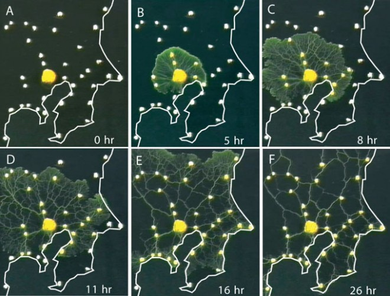
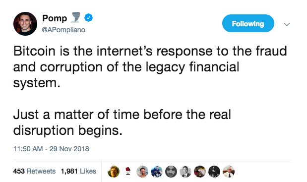
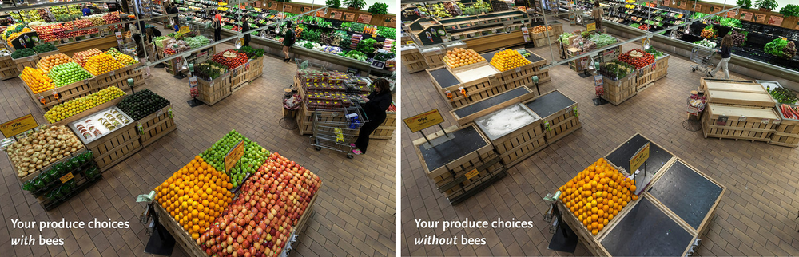
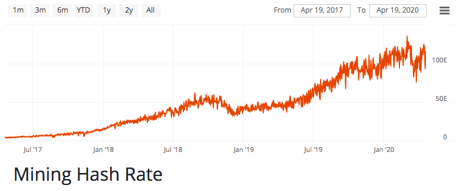

<header>

  
  


</header>

This is 🇨🇿 Czech translation of <a href="https://brandonquittem.com/bitcoin-is-the-mycelium-of-money/">this article</a> 
by <a href="https://twitter.com/Bquittem">Brandon Quittem</a> 
 Translated @744260 by <a href="https://twitter.com/nekonecnik">@nekonecnik</a> 🧡

# Bitcoin je myceliem peněz 1 /4

## Předmluva

Toto je celá (čtyřdílná) série bitcoin+houby spojená do jednoho článku. Mám více nepublikovaných materiálů, měl bych z toho udělat knihu? Dejte mi vědět 
  na twitteru, moje DMs jsou otevřené. Chtěli byste také dostávat upozornění, když budu publikovat nové články? Zaregistrujte se zde.
  
Musím ocenit Dana Helda za vydání čtyřdílného seriálu, který přirovnává vznik bitcoinu k sázení stromu. I když se mi jeho 
  seriál líbil, domnívám se, že robustnější analogií je přirovnání bitcoinu k houbám. Pokud jste v tomto tématu noví, připoutejte se - je mi 
  ctí vás zasvětit do fascinujícího světa hub.
  
*<b>Polymatická odpovědnost:</b> Jsem přesvědčen, že stejně jako Satoshi spojil jednotlivé obory, aby dal dohromady technologii, které 
říkáme bitcoin, má i každý z nás zodpovědnost za zkoumání svých vlastních jedinečných přesahů znalostí. Zde je můj průzkum 
hub a bitcoinu - paralely jsou ohromující.*

# Kapitola 1: Bitcoin je decentralizovaný organismus (mycelium)

Na první pohled bitcoin vypadá jednoduše, ale pochopit tento systém je náročný úkol.

Na této cestě existují "intelektuální pasti" svádějící pozorovatele k unáhleným předpokladům. Snahu o pochopení bitcoinu 
  přirovnávám k horolezci, který neustále dosahuje "falešných vrcholů", které ho na chvíli oklamou, aby si myslel, že dosáhl 
  vrcholu skutečného.

Jakmile si myslíte, že jste bitcoin pochopili, zjistíte, jak málo toho ve skutečnosti víte (falešný vrchol).

Konkurenční narativy to ztěžují ještě více... Magické internetové peníze, spekulativní mánie, fintech revoluce, bitcoin vařící oceány, 
  krysí jed na druhou, libertariánský idealismus, digitální zlato, vrcholový predátor peněžních médií, gordický uzel vzájemně provázaných 
  incentiv atd.

Aby to bylo ještě složitější, bitcoin je živý systém, neustále se měnící na základě podnětů z okolí. Skutečné porozumění je pohyblivým 
  cílem, jenž zasáhneme jen stěží.

Když jsem se pokoušel nalézt odpověď na otázku "co je bitcoin", zjistil jsem, že zkoumání paralel se světem přírody je obzvláště podnětné.

Především pak některé z nejlepších vlastností bitcoinu jsou pouhým odrazem úspěšných evolučních strategií, jaké se vyskytují v přírodě, 
  konkrétně v říši hub.

Houby jsou převážně tvořeny svou vegetativní částí "myceliem" - podhoubím - podzemní decentralizovanou inteligentní sítí, kterou 
  Paul Stamets popsal jako "přírodní internet Země".

 
<small>Image credit: John Upton</small>

> <b>"Věřím, že mycelium je neurologickou sítí přírody. Prolínající se mozaiky mycelia naplňují habitaty membránami sdílejícími informace. 
> Tyto membrány jsou uvědomělé, reagují na změny a společně mají na paměti dlouhodobé zdraví hostitelského prostředí. Mycelium zůstává 
> v neustálé molekulární komunikaci se svým prostředím a v reakci na složité výzvy vytváří rozmanité enzymatické a chemické reakce."</b>
>  Paul Stamets, Mycelium Running: How Mushrooms Can Help Save the World

## Úvod do hub

Houby patří do samostatné říše stejně jako rostliny a živočichové. Existuje více druhů hub než rostlin a živočichů dohromady.

Jako živočichové jsme příbuznější houbám než rostlinám. Houby i živočichové vdechují kyslík a vydechují oxid uhličitý. Rostliny 
  si vytvářejí vlastní potravu fotosyntézou (jsou autotrofní), zatímco živočichové a houby si musí potravu sami najít (heterotrofní). 
  Živočichové se vyvinuli tak, že mají vnitřní žaludek/mozek, zatímco houby mají žaludek/mozek vnější.

> Houbový fakt č. 1: lidé sdílejí s houbami více než 50 % své DNA. Vědci navrhli novou superříši nazvanou Opisthokon, která spojuje houby 
> a živočichy.

Houby mohou mít mnoho podob. Většina z nich je organizována v podzemní "kořenové struktuře" zvané mycelium (podhoubí), která se vyskytuje 
  na naší planetě téměř všude.

Když jsou vhodné podmínky, houby produkují plodnice, které pak uvolňují spory (výtrusná semena), jež se snaží kolonizovat život 
  v blízkém okolí. Houby, jak je známe z naší pozemské perspektivy, jsou jednoduše rozmnožovacím orgánem. Houby jsou pro mycelium tím, 
  čím jsou pro strom jablka.

Houby mají pro život na Zemi zásadní význam:
 - Nejrozsáhlejším organismem této planety je houbová struktura.
 - Houby jsou nejlepšími chemiky na naší planetě, většina našich léků pochází z hub.
 - Stromy by bez svých podzemních houbových spojenců nepřežily.
 - Houby existují již 1,3 miliardy let a přežily všech 5 velkých případů vymírání druhů.
 - Houby jsou schopné zachránit včely

## Houby jsou decentralizované inteligentní sítě

Houbové sítě nemají centralizovaný "mozek". Místo toho tvoří jednobuněčný "kořenový systém" zvaný mycelium. Tento podzemní žaludek 
  a distribuovaná inteligentní síť je schopna obousměrně posílat informace na velké vzdálenosti a dokonce i napříč druhy. Tyto houbové 
  sítě se neustále vyvíjejí na základě zpětné vazby z prostředí.

V každém okamžiku obsahuje houbová síť miliony koncových bodů, z nichž každý hledá potravu, brání své území nebo vymýšlí nové molekuly, 
  kterými se snaží přemoci konkurenci (jiné houby, bakterie atd.). Tyto sítě vytvářejí decentralizovaný konsensus o tom, jak využívat zdroje, 
  kdy se rozmnožovat a jaká strategie nejlépe brání organismus.

To odráží decentralizovaný konsensus (<a href="https://medium.com/s/story/bitcoins-social-contract-1f8b05ee24a9">společenskou smlouvu</a>) 
  vytvořený v bitcoinu. Uzly určují, jaký software chtějí provozovat, a podle toho prosazují pravidla konsensu, která podporují. Těžaři určují, 
  které transakce mají být zahrnuty do bloků. Burzy, peněženky a obchodníci spravují velké skupiny uživatelů. Každý účastník bitcoinu se dobrovolně 
  rozhoduje, jakým způsobem se chce zapojit, a souhrnný konsensus představuje síť.

 
<small>Zleva: lidské srdce, blesky, lidský mozek, mycelium, kořeny stromu, Velký Kaňon z leteckého záběru, větve stromu, vesmírná, 
  kosmická pavučina vesmíru</small>

## Decentralizované sítě jsou starší než lidstvo

Decentralizované sítě existovaly již dávno před příchodem lidí. Ve skutečnosti houby úspěšně zavádějí takové systémy již 1,3 miliardy let, 
  což z nich činí nejúspěšnější říši planety.

Kromě hub existuje v přírodě několik příkladů archetypů distribuovaných sítí (mycelium, temná hmota, neurony, internet atd.). Tato 
  strategie zjevně funguje, jinak by příroda netrvala na jejím opakování.

V kontextu této dlouhé historie archetypu decentralizované sítě se nástup decentralizovaných digitálních peněz jeví jako méně novátorský 
  a více nevyhnutelný.

Archetypem decentralizované sítě je <a href="https://en.wikipedia.org/wiki/Lindy_effect">Lindy</a>.

## Během miliardy let evoluce se houby staly mistry v přežití

Houby jsou jedinečně přizpůsobivé a neustále přežívají hromadná vymírání druhů.

Před 65 miliony let zasáhl naši planetu obří asteroid, čímž zahubil většinu života (včetně dinosaurů). Náraz vytvořil tak hustý oblak dýmu, 
  že po mnoho let bránil přístupu slunečního světla na zemský povrch. Bez slunečního světla vymřely rostliny a s nimi i většina živočichů. Houby 
  však nejsou závislé na slunečním světle, dokážou se rychle přizpůsobit a najít si vlastní potravu.

Po každém vymírání houby "zdědí Zemi" a pomalu ji obnovují, dokud se podmínky nestabilizují a život může opět pokračovat.

Bitcoin se stane nejúspěšnějším peněžním druhem, protože je decentralizovaný, (relativně) rychle se přizpůsobuje, sám si najde potravu 
  (neuspokojenou poptávku) a nepotřebuje vládní podporu. V případě masového vymírání peněz bitcoin "zdědí Zemi".

## Japonská vláda vs. pokorné hlenky

Ať už jde o centrální banky, které se snaží řídit ekonomiku, nebo o hierarchické korporace, které se snaží v informačním věku maximalizovat hodnotu... Centrální plánování má mnoho chyb.

Při rozhodování v "informační ekonomice" jsou efektivnější decentralizované nebo ploché (nehierarchické) organizace. Odolávají korupci, 
  minimalizují byrokracii a posouvají rozhodování do extrémů, kde mají jednotlivci (uzly) o daném problému nejaktuálnější informace.

Pro ilustraci síly decentralizovaných sítí se podívejme na tokijské metro.

Vědci provedli <a href="https://www.science.org/doi/10.1126/science.1177894">experiment</a>, při němž byla pradávná houba (hlenka 
  či slizovka) podněcována k tomu, aby znovu vytvořila systém tokijského metra. Každá zastávka metra (uzel) byla označena oblíbenou potravou 
  hlenek (ovesnými vločkami).

Po krátké době se hlenka rozrostla a propojila všechny uzly/zastávky v efektivnějším designu než centrálně plánovaná komise inženýrů najatých japonskou vládou.

 
<small>Hlenka navrhující systém tokijského metra</small>

Z abstraktu:
> Dopravní sítě jsou všudypřítomné jak v sociálních, tak v biologických systémech. Robustní výkonnost sítě zahrnuje složitý kompromis mezi 
> náklady, efektivitou přenosu a odolností proti poruchám. Biologické sítě byly zdokonaleny mnoha cykly evolučního selekčního tlaku 
> a pravděpodobně poskytují takovým kombinatorickým optimalizačním problémům rozumná řešení. Navíc se vyvíjejí bez centralizovaného řízení 
> a mohou představovat snadno škálovatelné řešení pro rostoucí sítě obecně. Ukazujeme, že hlenka Vápenatka mnohohlavá vytváří sítě 
> se srovnatelnou účinností, odolností proti poruchám a náklady jako sítě reálné infrastruktury - v tomto případě tokijský železniční systém. 
> Základní mechanismy potřebné pro adaptivní tvorbu sítí lze zachytit v biologicky inspirovaném matematickém modelu, který může být užitečný 
> pro řízení výstavby sítí v jiných oblastech.

Když se zamyslíte nad náklady a složitostí takového infrastrukturního projektu, je docela vystřízlivující si uvědomit, že hlenka 
  dokáže navrhnout lepší síť za jediný den.

<b>Satoshi si sílu hlenek uvědomoval.</b>

Bitcoin je nestátní peněžní statek, který posouvá složitost a rozhodování na okraj stejně jako houby. Postupem času tato decentralizace 
  volného trhu umožňuje bitcoinu konkurovat různým zavedeným finančním systémům, které příliš nejdou s kůží na trh, trpí dilematem inovátora, 
  časem křehnou a často se utápějí v byrokracii (nebo ještě hůře).

## Život bez centrálního bodu selhání

Mycelium nemá žádný "centrální řídící bod". Každá jednotlivá část může být odstraněna, ale systém jako celek přežije.

> <b>"Jdeš-li po králi, střez se minout."</b>
>  Omar Little (<a href="https://en.wikipedia.org/wiki/The_Wire">The Wire</a>)

Národní státy a centrální banky čelí paradoxní výzvě. Pokud se pokusí svou konkurenci zničit, zdůrazní tím především samotnou potřebu 
  bitcoinu. A přesto, čím déle budou čekat, tím silnější bitcoin bude.

<b>Tvrzeni nevraživoství</b>

Mycelium i bitcoin přetrvávají v nejkonkurenčnějších ekosystémech naší planety a pro své přežití se musí neustále přizpůsobovat. Jdou 
  s kůží na trh a utužují se nepřátelstvím.

Houby žijí v nepřetržitém konkurenčním prostředí a neustále svádějí malé podzemní boje s různými bakteriemi, mikroby a konkurenčními houbami.

Pokud jeden myceliální "uzel" zaznamená predátora nebo kořist, pošle informaci "houbovým vědcům", kteří pak vytvoří nový enzym cílící 
  přímo na dotyčného. Houbová síť tento nový enzym distribuuje tam, kde je to zapotřebí.

> Houbový fakt č. 2: Jako lidé využíváme léčivé látky vytvořené houbami. Nejslavnější je penicilin, 
> <a href="https://www.ncbi.nlm.nih.gov/pmc/articles/PMC4520913/">náhodně objevený Alexanderem Flemingem</a>. Ten se používal v boji proti 
> bakteriálním epidemiím, které v minulosti decimovaly lidskou společnost. Od objevu penicilinu se naše populace ztrojnásobila.

Bitcoin reaguje na své okolí podobným způsobem. Jakmile jsou v systému nalezeny chyby/hrozby/příležitosti, informace putují 
  k "bitcoinovým vědcům" (vývojářům), kteří vytvoří "enzym" ( softwarový patch) a tato aktualizace se šíří systémem. To umožňuje větší 
  ekologickou úspěšnost i pro bitcoin. Bitcoin je antifragilní.

Houby i bitcoiny časem zpevní svou obranu a naučí se konzumovat nové zdroje potravy. To má složený účinek, který časem zvyšuje 
  antifragilitu i délku života.

V jednom extrémním případě se podívejme na <a href="https://www.bbcearth.com/news/8-fantastic-facts-about-fungi">největší organismus 
  na naší planetě, houbu václavku (Armillaria)</a>. Tento jediný organismus, který se nachází v Modrých horách ve východním Oregonu, měří 
  přes 3,8 km. Jeho stáří se odhaduje na 1 900 až 8 650 let a v současné době pohlcuje celý les.

## Konkurenční boj

Houbové sítě kradou konkurenční výhody svým sousedům v podobě genetické informace, stejně jako bitcoin absorbuje konkurenční výhody, 
  které nabízejí altcoiny.

Existuje (mylné) přesvědčení lidí předpokládajících, že altcoiny budou implementovat skvělé nové funkce, které nakonec překonají bitcoin.

>Opačný tábor se domnívá, že bitcoin nakonec absorbuje všechny nejlepší funkce poté, co budou otestovány na trhu, což způsobí, že alternativní měny nebudou schopny dlouhodobě konkurovat. Osobně se hlásím k tomuto názoru.

<b>Podívejme se, jak ke své konkurenci přistupují houby...</b>

Nejprve je třeba pochopit některé základní genetické poznatky. Geny se obvykle předávají z rodičů na potomky v rámci tzv. vertikálního 
  přenosu genetické informace.

Zajímavé je, že houby provádějí tzv. horizontální přenos genů - účinně přebírají genetickou informaci od různých druhů soupeřících 
  v témže ekosystému.

Tento proces horizontálního přenosu genetické informace demonstrovaný houbami předznamenává budoucí stav, kdy bitcoin plošně integruje 
  všechny osvědčené myšlenky pocházející z altcoinů.

<b>Například:</b> Kombinace rozšíření Lightning Joule Browser s nodou (spuštěním vlastní, použitím Casa nebo jinak) umožňuje mikrotransakce prostřednictvím prohlížeče. Tím se účinně eliminuje potřeba tokenů, jako je BAT.

Dokonce byste mohli tvrdit, že bitcoin provádí horizontální přenos genů od doby, kdy Satoshi poprvé zkombinoval technologie používané 
  v předchozích pokusech o elektronické peněžní systémy, jako jsou Hash Cash, E-gold atd.

## Arbitráž, pobídky a jejich uplatnění v ekologii

Houby plní na Zemi dvě ekologické funkce: recyklují veškerou hmotu na základní prvky a fungují jako imunitní systém naší planety.

> <b>"Mycelia jsou velkolepými rozkládači přírody."</b>
>  Paul Stamets

Houby tráví své dny tichým rozkladem organických látek. Přeměňují kameny, větve, listí, uhynulá zvířata a ropné skvrny na základní prvky 
  (uhlík, dusík, kyslík atd.). Tyto cenné prvky pak houby vyměňují s okolními organismy.

> Houbový fakt č. 3: Naše lesy by byly pohřbeny stovkami metrů listí a větví, kdyby je houby nerozkládaly a nedistribuovaly živiny.

Jinými slovy, houby odemykají nevyužité zdroje. Strom nemůže znovu použít své vlastní listy nebo větve, protože uhlík, dusík a fosfor 
  jsou uzamčeny v nepoužitelné formě. Houby tak využívají arbitrážní příležitosti ve svém ekosystému.

## Bitcoin díky mechanismu proof of work uvolňuje nevyužité zdroje v podobě energie

Než se pustíme do bitcoinu, prozkoumejme fascinující historický příklad: Jak se používal hliník k "vývozu nevyužité obnovitelné energie" 
  ze země, jako je Island.

Island vyrábí obnovitelnou geotermální energii, často na odlehlých místech. To vede k nadměrné nabídce, která nedokáže dosáhnout 
  k poptávce (energie se špatně přepravuje na velké vzdálenosti).

Island využil přebytek energie k výrobě hliníku, což je energeticky velmi náročný proces. Island účinně přeměňuje přebytečnou energii 
  na trvalou zásobu hodnoty (hliník), kterou lze vyvážet.

Bitcoin dělá totéž. Místo nevyužité energie "ležící ladem" mohou její výrobci těžit bitcoin (nebo jen prodávat přebytečnou energii těžařům). 
  I to umožňuje přeměnit přebytečnou produkci energie na trvalé uchování hodnoty. Efektem druhého řádu je, že bitcoin účinně dotuje projekty 
  obnovitelné energie.

Chcete-li tento koncept prozkoumat podrobněji, podívejte se na článek Dana Helda: <a href ="https://danhedl.medium.com/pow-is-efficient-aa3d442754d3">PoW is Efficient</a>.

> Houbový fakt č. 4: Houby pojídající horniny jsou hlavním důvodem, proč máme svrchní vrstvu půdy, jež nám umožňuje pěstovat potraviny. 
> Houbám trvalo více než 1 miliardu let, než vytvořily jen asi 18 palců dnešní ornice.

## Houby (a bitcoin) jsou ekologické imunitní systémy

Houby jsou imunitním systémem jak vlastních ekosystémů, tak celé planety.

Houby produkují léčivé látky a chrání své ekosystémy prostřednictvím složitých symbiotických vztahů. Houby si v podzemí zprostředkovávají 
  zdroje (prostřednictvím mycelia) mezi jednotlivými druhy, aby zajistily zdraví celého ekosystému.

<b>Jak spolu stromy v lese tajně mluví</b>

O čem stromy mluví? V kanadských lesích douglasky tisolisté se podívejte, jak spolu stromy navzájem "mluví" vytvářením...

<video width="480" height="272" controls>
  <source src="./pics/0744260-04-nat-geo-video-ipod-pt-1-.mp4" type="video/mp4">
<!--  <source src="movie.ogg" type="video/ogg">-->
Your browser does not support the video tag.
</video>

Zjednodušeně řečeno, houby v podzemí těží minerály stromům výměnou za cukry (potravu), které stromy produkují prostřednictvím fotosyntézy. 
  Stromy tak získávají zvýšenou ochranu před útočníky a důležité minerální látky, které si samy nedokážou najít. Přemýšleli jste někdy o tom, 
  jak může mladý dub přežít na lesním podloží, kam se nedostane sluneční světlo?

Každý organismus zapojený do tohoto sdíleného systému incentiv zlepšuje evoluční kondici lesa. Věřím, že lesy jsou živé superorganismy 
  složené z různých druhů.

## Bitcoin plní podobnou ekologickou roli

Trh vysílá bitcoinu signály, aby vytvářel funkcionality, které vyhoví neuspokojeným požadavkům nebo vylepší bezpečnost, jakmile se objeví nové hrozby.
 - Poptávka po block space naroste nad kapacitu a vznikne síť Lightning Network.
 - Čína potlačuje burzy, LocalBitcoins.com vzkvétá.
 - Měny ve Venezuele, Turecku a Argentině podléhají hyperinflaci, bitcoin nastupuje jako nestátní úložiště hodnoty.
 - Blockstream spouští satelity schopné vysílat bitcoinové transakce, aby zmírnil dopady katastrofických událostí.

<b>Kladná zpětná vazba</b>

Bitcoin také získává z vyrovnaných pobídek mezi uživateli, full nody, těžaři, burzami a obchodníky. Jak se bitcoin lépe přizpůsobuje 
  svému prostředí, lépe splňuje požadavky svých rostoucích uživatelů, což následně přitahuje další účastníky. Tato pozitivní zpětná vazba 
  podporuje udržitelný růst sítě.

Stejně jako houba václavka, která pohlcuje celé lesy v Oregonu, i bitcoin se postupem času zvětšuje a sílí.

> Houbový fakt č. 5: Při psaní převážné části této eseje jsem konzumoval medicinální houby používané pro zlepšení kognitivních 
> funkcí (Lions Mane, Chaga a Cordyceps).

# Kapitola 2: Bitcoin jako sociální fenomén (houba - plodnice)
*Zkoumání hype cyklů, etnomykologie a Satoshiho kultu*

  <small>Original Artwork by <a href="http://www.richardgiblett.com.au/2dworks.html">Richard Giblett</a></small>

V první části jsme zkoumali decentralizovanou architekturu bitcoinu z pohledu mycelia. Věnovali jsme se archetypu decentralizované sítě, antifragilitě, PoW, arbitráži, roli bitcoinu v jeho ekosystému a přednostem decentralizace.

Nicméně náš příběh o houbách ještě není kompletní. Další fází životního cyklu hub je rozmnožování odehrávající se uvnitř houby. Po dosažení zralosti houby uvolňují malá semínka zvaná spory, díky nimž jsou schopny kolonizovat nové území.

Ačkoli je říše hub v porovnání s říší živočišnou poměrně cizí, lidé mají k houbám vztah již dlouho. Historicky představují houby tajemství, strach, příležitost, pomíjivost a pro některé až kultovní úctu.

V kapitole 2 prozkoumáme bitcoin jako společenský fenomén optikou tajemné houbičky.

Ponořme se do toho!

## Bitcoin je sociální systém stvrzený kódem

Bitcoin se skládá z jednotlivých účastníků, z nichž každý má vlastní pohled na věc, motivace a schopnosti. Společně vytvářejí konsensus na pravidlech bitcoinové hry. Kód tuto společenskou shodu pouze ratifikuje.

Z Hasuova zásadního článku <a href ="https://medium.com/s/story/bitcoins-social-contract-1f8b05ee24a9">Unpacking Bitcoin's Social Contract</a>:
> "Bitcoinový protokol automatizuje smlouvu odshouhlasenou na sociální vrstvě, zatímco sociální vrstva určuje pravidla bitcoinu na základě 
> konsensu jeho uživatelů. Jsou v symbióze: jedno bez druhého by nepostačovalo."

Lidé jsou chaotické, emocionální a předvídatelně iracionální bytosti. Bitcoin, který je tvořen sítí lidí, není jiný.

## Lidská psychologie, hype cykly a metoda hub

Houby se primárně vyskytují ve formě "mycelia", které si můžete představit jako podzemní kořenový systém spojující stromy a rostliny. Lidé by o existenci mycelia ani netušili, neboť po většinu svého života zůstává v tichosti pod zemí.

Nicméně vycítí-li houba příznivé podmínky (teplota, vlhkost atd.), vytvoří nadzemní houbu - plodnici. Tyto plodnice jsou pohlavními orgány hub - v podstatě jde o falické systémy pro přenos výtrusů (semen).

Než plodnice prorazí půdu, soustředí houby energii do malého množství buněk pod zemí, které se nazývají "pinheads - špendlíkové hlavičky" a které vytrvávají až do ideálního okamžiku. Pak houby zdánlivě z ničeho nic vyrazí ze země a každý den, dokud nedosáhnou zralosti, zdvojnásobí svou velikost.

> Houbový fakt č. 6: Některé houby dokáží tvořit plodnice takovou silou, že prorazí skrze asfalt.

Po dosažení plné zralosti houba vyprodukuje miliony výtrusů (houbových "semínek") a poté se rychle rozloží zpět do země.

Houba žije jen několik vítězných dní a většina spor zahyne ještě před dozráním, malé procento spor však cestuje do okolí a vytváří nové houbové kolonie. Ty pak mohou zůstat několik let v podzemí, než se reprodukční cyklus znovu rozběhne.

> Houbový fakt č. 7: Výtrusy jsou lehčí než vzduch, což usnadňuje jejich cestování. Teoreticky by spory mohly zachytit vzestupný proud a opustit oběžnou dráhu Země. Navíc se jakýmsi štěstím dostaly na kratičký seznam biologické hmoty schopné přežít chladné vakuum a radiaci vesmíru. Libo-li panspermie?

## Bitcoinové cykly jsou analogické s rozmnožováním hub

Pro náhodného pozorovatele je většina života bitcoinu nudná - ubíhají měsíce a nic se neděje. Když pak nastanou ty správné podmínky, bitcoin ožije, masivně se rozroste a dostane se do povědomí pozorovatelů. Cena vyletí na "měsíc", média zaplaví hyperbola a zprávy od "normíků" se jen hrnou.

Téměř ihned po svém vzestupu bitcoin zaniká a upadá do zapomnění, když ho náhodní účastníci odepisují jako módní výstřelek, hype nebo nepovedený experiment. Stejně jako houbové výtrusy většina nových uživatelů ekosystém opouští. Malé procento z nich však v bitcoinové zemi zakládá nové kolonie. Tito přeživší z medvědího trhu se stávají novými "hodlery poslední instance".

Není překvapením, že narativ medvědího trhu je poháněn aktivitou na povrchu (cenou).

## Odpůrci bitcoinu si pletou jeden cyklus (houbu) s celkovým obrazem (myceliální síť)

Amnézií trpící vědátoři hrdě hlásají, že bitcoin zanikl (<a href="https://99bitcoins.com/bitcoin-obituaries/">po 459.</a>). Fiatoví maximalisté se předvádějí na twitteru a zveřejňují dvanáctiměsíční grafy.

> "Pro houbu nevidíš mycelium!" 
h/t Nic Carter

Roubini pořádá barbecue na oslavu svého třetího medvědího trhu. Odpůrci se scházejí, aby si opekli pověstné (bitcoinové) houby a poplácali se přitom po zádech.

Abychom však byli spravedliví, bitcoin je komplikovaný. Mnoho "kryptolidí" si stále myslí, že bitcoin je myspace a Ripplecoin je "standard". Není překvapením, že většina novinářů nechápe, o co jde. Představte si, že vám jako novináři s dobrými úmysly a zaběhnutými postupy přidělí "bitcoinový štěk".

## Zatímco houba odumřela (nedávný hype cyklus), mycelium (bitcoin) v podzemí prospívá.

Stejně jako houby po vrcholu bujení, i bitcoin zažívá úpadek a jeho cena padá. Tento medvědí trh setřese slabé ruce, hedgeové fondy zkrachují, ICOs vrátí investorům peníze nebo ještě hůř, projekty zkrachují a někteří šarlatáni budou odhaleni.

Avšak hodleři, noví i staří, kolektivně přecházejí do podzemí a v tichosti bitcoin vylepšují: budují, učí se a vytvářejí aliance.

## Bitcoin se v medvědím trhu 2018-2019 dramaticky zlepšil

- Síť Lightning Network <a href="https://twitter.com/lnstats">nabírá na obrátkách</a>
- Nové služby typu <a href="https://www.swanbitcoin.com/Quittem/">SwanBitcoin</a>, usnadňují nabývání bitcoinů (auto DCA)
- Adopce SegWitu, zlepšující transakce, roste na <a href="http://charts.woobull.com/bitcoin-segwit-adoption/">zhruba 50 %</a>.
- Jimmy Song a Justin Moon vychovávají nové vývojáře
- Casa, Pierre, Nodl a další usnadňují provoz full nodů
- Nomics poskytuje čistší údaje než CMC (CoinMarketCap)
- Vznikají finanční služby bitcoinu (Unchained, River, Blockfi)
- Základy pro nevyhnutelnou financializaci (Fidelity, Bakkt atd.)
- Vytvářejí se Schnorrovy podpisy ( technická specifikace / whitepaper / TL;DR)
- "Proof of Keys" k minimalizaci rizika rehypotekace + zátěžový test ekosystému + připomenutí novým uživatelům ohledně vlastní suverenity.
- Blockstream umožňuje provádět bitcoinové transakce přes satelit. V kombinaci s mesh sítěmi to začíná být zajímavé.
- Objevují se metriky pro měření zdraví kryptoměn, jako je realizovaný cap, ekonomická propustnost, ekonomická hustota ($/byt) a MVRV.
- Vrchol centralizace těžby byl překonán (sbohem, Bitmain).
- Zpráva Coinshares uvádí, že 77 % energie spotřebované bitcoinem pochází z obnovitelných zdrojů
- Noví pisálci stojí na ramenou velikánů a snaží se bitcoin popsat neotřelým způsobem.

Postupem času, jak bitcoin pokračuje v odhalování sebe sama zvědavým pozorovatelům, se příběhy vyvíjejí.

  <small>Hodl Waves by Dhruv Bansal at <a href="https://unchained.com/hodlwaves/">Unchained Capital</a></small>

Nakonec se trh dostane na dno. Hodleři drží při sobě jako <a href="https://cs.wikipedia.org/wiki/Bratrstvo_neohro%C5%BEen%C3%BDch">Bratrstvo neohrožených</a> vytvářejíce pevný základ, který je schopen udržet budoucí růst.

> "<a href="https://tokeneconomy.co/hodlers-are-the-revolutionaries-66c8362ef9eb">Hodleři jsou revolucionáři</a>"
> Dan Held

Vzhledem k tomu, že hodleři hromadí stále více bitcoinů, je "float" (nabídka, s níž se aktivně obchoduje) stále omezenější. S klesající dostupnou nabídkou každý nový uživatel vyvíjí větší tlak na růst ceny. Jak cena stoupá, média si na ni posvítí, přitáhnou nové uživatele a zanedlouho jsme opět v dalším hype cyklu.

## Mykofobie, Maria Sabina a Satoshiho kult

Někdy se říká, že kryptografie může být trochu "okultní". To je pravda a zároveň čisté pozitivum. Než se pustíme do náboženských sklonů bitcoinu, poučme se z historie s houbami.

Moderní západní svět je postižen "mykofobií" - iracionálním strachem z hub. Lidé se bojí toho, čemu nerozumí, a přiznejme si to: většina lidí si myslí, že houby jsou "zelenina".

Houby jsou zvláštní. Představují koloběh pomíjivosti života a smrti, kterého se lidé podvědomě bojí. Čelit vlastní smrtelnosti není žádná legrace, lepší je se tomu raději vyhnout.

Nebylo tomu tak ale vždy. Lidé mají k houbám vztah už dlouho. Od potravin přes léčiva až po pověry a náboženské artefakty. Houby 
vám <a href="https://www.ncbi.nlm.nih.gov/pmc/articles/PMC4684114/">mohou zachránit život</a>, zabít vás, nasytit vás, a dokonce změnit vaše vědomí.

Antropologické důkazy naznačují, že lidé, kteří spolupracovali s houbami, měli evoluční výhodu. Jakmile více lidí porozumí houbám (a bitcoinu), brzy si uvědomí, jak významné mohou být.

## Lidé, kteří spolupracují s houbami, mají evoluční výhodu

Starověký člověk se v Alpách v severní Itálii spoléhal na houby, aby přežil. Ötzi, ledový muž, který zemřel před téměř 5 300 lety, byl nalezen se dvěma houbami (Troudnatcem kopytovitým - hubkou - a Březovníkem obecným) přivázanými na koženém řemínku. Jedna z hub sloužila k rozdělávání ohně a u druhé bylo zjištěna léčebná účinnost proti parazitovi objevenému v jeho střevech.

  <small>Original Artwork by <a href="http://theicemantheory.weebly.com/artifacts.html">zdroj</a></small>

Již před 19 000 lety konzumovala houby vysoce postavená žena, které se přezdívalo "červená dáma", což dokazují spóry nalezené na jejích zubech. Není známo, zda se jednalo o houby k jídlu, náboženským či jiným účelům.

Jeden z našich nejstarších příkladů jeskynních maleb byl objeven v severním Alžírsku a jeho stáří se odhaduje na více než 6 000 let. Tato malba zobrazovala "včelího muže", který má houby v rukou a vyrůstají mu z těla.

  <small>Jeskynní malba: "Včelí muž" pokrytý houbami. Asi 4 000 let př. n. l.</small>

Na Sibiři uctívali Koryakové houbu muchomůrku (Amanita Muscaria), což je ikonická "červenobílá" houba, která je známá z filmů Super Mario Brothers a Alenka v říši divů. Koryakové tuto houbu milovali natolik, že pili moč lidí a sobů, kteří ji nedávno konzumovali. Údajně lze tímto způsobem recyklovat moč až 5x a zároveň dosáhnout požadovaných účinků. Jak na tento jev přišli, to už je úplně jiná otázka...

Nasaďte si alobalový klobouk, <a hre="https://inhabitat.com/santa-and-the-shrooms-the-real-story-behind-the-design-of-christmas/">muchomůrka mohla inspirovat naše vánoční tradice</a>.

Mazatecká kultura z dnešního Mexika uctívala houby jako posvátné. Objevil ji relativně nedávno Gordon Wasson a podrobně ji popsal ve slavném článku v časopise Life Magazine z roku 1955. Od té doby navštívilo tuto oblast v Mexiku mnoho turistů, kteří usilovali o to, aby je učila slavná houbová šamanka Maria Sabina a její příbuzní.

  <small>Houbové artefakty ze Střední Ameriky</small>

Je zřejmé, že houby upoutaly pozornost našich předků.

## Bitcoin vzbuzuje podobný kvazináboženský náboj

Yuval Noah Harari skvěle popsal, že Homo Sapiens jsou jedinečně <a href="https://www.ynharari.com/topic/power-and-imagination/">schopni pružně spolupracovat ve velkém počtu</a>. To nám umožňuje kolektivně se dohodnout na abstraktních konceptech, jako jsou národy, bohové nebo peníze.

Stejně jako lidé vytvořili náboženské kulty kolem hub, lze bitcoin popsat jako náboženské hnutí nových peněz.

<b>Satoshiho tajemství vytvořilo pevný základ umožňující vznik religiózních tendencí.</b>

Bitcoin byl vytvořen díky neposkvrněnému početí mýtickou postavou (Satoshi), která se později obětovala pro vyšší dobro.

Satoshiho kult inspiruje některé fanatiky k tomu, aby zasvětili svůj život propagaci "dobrého slova". Ne všichni bitcoineři patří do stejné náboženské sekty. Někteří badatelé se drží starobylého náboženského textu (whitepaper), zatímco jiní interpretují Satoshiho vizi prostřednictvím jeho <a href="https://twitter.com/yassineARK/status/1047978606297792513">raných příspěvků na fóru.</a>

Neshody ohledně priorit, které se projevily ve škálovacích debatách, vedly k tvrdým rozkolům a roztříštěným "kongregacím". Ne nepodobné tomu, jak Martin Luther rozštěpil katolickou církev pověšením "Devadesáti pěti tezí" na dveře kostela v roce 1517.

Roger Ver byl od svých začátků známý jako "Bitcoin Jesus", který šířil dobré slovo tím, že obdarovával restauratéry postižené fiatem.

Objevují se mesiášské postavy jako Faketoshi (Craig Wright), který tvrdí, že je skutečný Satoshi Nakamoto. Fundamentalista Faketoshi označuje svou svátost za "Satoshiho vizi", jediný pravý bitcoin, jak je popsán v "bibli" (whitepaper).

> "Funkční detaily nejsou v dokumentu popsány, ale zdrojový kód bude brzy k dispozici."
Satoshi Nakamoto

Nehledě na to, jak neúplný whitepaper je a kolik chyb v něm lze najít, Faketoshi tvrdí, že jeho fork je skutečnou "Satoshiho vizí". I kdyby Faketoshiho fork BYL nejblíže Satoshiho původní vizi (což není), záleží na tom vůbec?

Odpověď zní ne. Podstata bitcoinu je úzce spjata s neustále se vyvíjejícím společenským konsenzem, který tento protokol obklopuje.

## Každá soupeřící sekta je konkurenční společenskou smlouvou

Společenská smlouva bitcoinu se opírá o několik jednoduchých pravidel. Tato odsouhlasená pravidla (Schelling point) jsou pak ratifikována v bitcoinovém protokolu automatizujícím společenský konsensus.

  <small>Zdroj: Hasu - <a href="https://medium.com/s/story/bitcoins-social-contract-1f8b05ee24a9">Bitcoin as a Social Contract</a></small>

Jako příklad uveďme "velkou debatu o škálování". Jedna skupina (BCH) se domnívala, že bychom se měli zaměřit na "levné platby" na úkor "decentralizace", zatímco druhá (BTC) věřila, že musíme upřednostnit "decentralizaci" na základní vrstvě a platby škálovat off-chain.

Jako konkurenční náboženská sekta na volném trhu mohl gang BCash svobodně forknout kód bitcoinu a otestovat svou hypotézu. O rok později je jasné, že společenský konsensus kolem bitcoinu s přístupem BCH nesouhlasí, protože trh nevidí žádnou hodnotu v BCH ani u jiného forknutého výplodu.

<b>Odpůrci bitcoinu by tedy mohli tvrdit, že "forkování kódu bitcoinu navyšuje nabídku".</b>

To je však stejné, jako kdybyste tvrdili, že když Zimbabwe tiskne více peněz, znehodnocuje to americký dolar. [h/t Murad]

V případě neúspěšných BCash forků zkopírovali kód (bitcoinový protokol), ale nedokázali zmobilizovat lidi (sociální vrstvu), což vedlo ke vzniku aktiva s relativně minimální hodnotou. Ukázkový příklad toho, jak bitcoin odolává korupci ze strany nekalých aktérů tím, že ke změně sítě vyžaduje společenský konsensus.

Jinými slovy, bitcoin nahrazuje sociální předpoklady matematickými premisami. Do důsledků, které to má na naši <a href="https://unenumerated.blogspot.com/2017/02/money-blockchains-and-social-scalability.html">sociální škálovatelnost</a>, se hlouběji ponoříme v kapitole 4.

## Je nábožensky fanatické chování indikátorem budoucího úspěchu?

Stáváme se svědky zpeněžení nové vzácné komodity v reálném čase. Žádný živý člověk dosud nebyl takového jevu svědkem.

Aby se to skutečně podařilo, musí se změnit kolektivní vědomí planety. Přesvědčit lidi, že peníze nejsou zelený papír a nemusí pocházet od vlády, bude chvíli trvat.

K překonání nevyhnutelné nepřízně osudu, která je nutná k vytvoření nové světové rezervní měny, je možná zapotřebí určité "náboženské zapálení". S tím, jak každý nový stoupenec konvertuje k Satoshiho kultu, se šance na hyperbitcoinizaci zvyšují.

<b>To znamená, že existují rizika přílišné politizace bitcoinu.</b> [h/t Hasu]

Některé frakce komunity líčí bitcoin jako klub rakouských ekonomů, kteří jedí jen maso, které osobně zastřelili jednou ze svých mnoha zbraní. Tyto věci jsou sice v pořádku, ale nejsou předpokladem pro to stát se bitcoinerem. Nemíchejme je sem, zaplatíme za to odpuzením potenciálních uživatelů bitcoinu.

*Než se vydáte na další křížovou výpravu proti FUD, přesvědčte všechny své přátele a rodinu, aby si alespoň dvakrát přečetli Nový zákon (Bitcoinový Standard).*

## Dobré kulty mají incentivy k evangelizaci

Peníze jsou ultimátním síťovým efektem - jejich hodnota je určena počtem lidí, s nimiž můžete interagovat.

V případě bitcoinu nejde jen o zaujetí uživatele v náboženském smyslu, ale také o finanční pobídky k náboru nových členů do kongregace. S každým novým uživatelem, který si bitcoin koupí, jeho hodnota roste, z čehož těží předchozí hodleři. Nový uživatel je pak motivován k tomu, aby konvertoval své přátele. Konvertující následně své přátele. A cyklus pokračuje.

S rostoucí cenou roste i motivace k lepšímu zabezpečení, což dosvědčuje úprava obtížnosti - jeden z nejgeniálnějších Satoshiho příspěvků.

Cena se zvyšuje → těžba se stává výnosnější → více těžařů přispívá hashovací silou → lepší zabezpečení zvyšuje hodnotu bitcoinu.

## Houba se šíří

Pokud se na vás mračí medvědí trh, stačí se podívat pod zem. Vývoj, přinášející optimismus, probíhá v bezpočtu oblastí (z nichž některé jsou uvedeny výše).

Bitcoinová houba se v tichosti šíří podzemím.

S každým dalším dnem bitcoin pohlcuje více fiatu, stává se robustnějším, decentralizovanějším a roste jeho Lindy efekt.

I ta nejtemnější noc ustoupí před východem slunce.

# Kapitola 3: Bitcoin je antivirus (léky z hub)

Všichni jsme slyšeli o neuvěřitelném potenciálu bitcoinové budoucnosti. Pokud jde o zdravé peníze a sociální škálovatelnost, 
rozhodně se mnou počítejte.

Toto drama však bude trvat desítky let. Co když Bitcoin nepřežije dost dlouho na to, aby využil svůj potenciál naplno?

Satoshi se naštěstí poučil z neúspěšných pokusů o soukromé peníze. Genetický kód bitcoinu byl navržen tak, aby byl maximálně odolný.

V této části budeme pohledem hub zkoumat úrodné makroprostředí a schopnost Bitcoinu přežít.

Ponořme se do toho!

## Včely medonosné, Kleštíci včelí (roztoči Varroa) a léky z hub

V roce 1997 pozoroval zvídavý mykolog Paul Stamets unikátní chování včel medonosných. Včely se vydaly na cestu, aby konzumovaly vodu 
obsahující houbové výtrusy. "Hmm, to je zajímavé," pomyslel si Paul.

O 15 let později si Paul začal dávat dohromady souvislosti. V důsledku syndromu úhynu včelstev (CCD) docházelo k nebývalému úhynu 
medonosných včel. Včely umíraly částečně kvůli napadení roztoči Varroa, kteří přenášejí smrtící viry, jako je viróza včel deformující 
křídla (DWV) a Lake Sinai virus (LSV).

Chemikálie používané moderním zemědělstvím otrávily včely, jejichž imunitní systém je příliš oslaben, aby se roztočům Varroa ubránil. 
Jak včely cestují, roznášejí roztoče na všechny včely v okolí, což vede k 70% poklesu včelích populací od roku 2005.

<b>Koho zajímají včely?</b>

Včely jsou zásadním druhem, který je zodpovědný za opylování velkého procenta našich potravin (avokádo, mandle atd.). Pokud o včely 
přijdeme, bude to mít nespočet následných dopadů, jako je ztráta pracovních míst, zničené ekosystémy a snížená potravinová bezpečnost.

<small><a href="https://www.planetbee.org/planet-bee-blog//no-bees-no-dinner-2">zdroj obrázku</a></small>

Vraťme se k našemu mykologovi Paulovi, který v roce 2012 přišel s monumentálním zjištěním: je známo, že houby podporují imunitní 
systém - včely musely instinktivně vědět, že mají pít houbovou vodu. Paul svou hypotézu ověřil a brzy poté prokázal, že pomocí 
jednoduchého antivirového "houbového léku" můžeme snížit účinky viru deformovaných křídel / kolapsu včelstev o 80 %.

<b>Naším současným měnovým režimem je Kleštík včelí - roztoč Varroa.</b>

Náš současný měnový režim centrálního bankovnictví je jako otravní roztoči Varroa napadající naše finanční trhy.

- Roztoče Varroa je těžké zabít - režimy fiat měn těží z monopolu na násilí.
- Rozšiřují viry na vše, čeho se dotknou - deformace trhu, trafikářství, regulační zajetí
- Negativní navazující dopady - chybná alokace kapitálu, zvýšená časová preference, omezení lidské produktivity, zvýšení rizika katastrofy.

<b>Bitcoin je antivirem (houbovým léčivem), který "zachraňuje včely".</b>

Bitcoin (houbový lék) zabraňuje šíření naší destruktivní finanční hegemonie (roztoč Varroa), což přinese novou éru lidských úspěchů 
(záchrana včel má sekundární účinky, jako je zajištění potravinové bezpečnosti).

## Na cestě do velkého neznáma

Vstupujeme do období nejistoty, jaké naše civilizace dosud nezažila. Experiment s fiat penězi stojí na vratkých základech a naše 
sociální systémy se začínají hroutit.

V celosvětovém měřítku čelíme bezprecedentní úrovni zadlužení v poměru k HDP. Zdá se, že Fed, Evropská centrální banka, Bank of Japan 
a Bank of England nyní "<a href="https://www.ft.com/content/ae19e60e-81b0-11e7-94e2-c5b903247afd">vlastní pětinu celkového dluhu svých vlád</a>". 
Centrálním bankám docházejí tahy.

Evropská centrální banka v poslední snaze prosazuje záporné úrokové sazby. Opravdu dovolíme hegemonnímu bankovnímu systému, aby vkladatelům 
ZPOPLATŇOVAL uložení digitálního fiatu ve svých nejistých panoptikonech?

<b>Jak je to s Čínou?</b>

Čínský trh s nemovitostmi je nestabilní a už dávno měl projít korekcí. Řízení kapitálu a hledání výnosů v ochlazující se ekonomice vedly 
k nafouknutí cen tamějších nemovitostí. Co se stane, až trh zkoriguje a všichni začnou brát do zaječích? Raději mít plán ₿.

<b>A co USA?</b>

Dluh Spojených států v současné době přesahuje 22 bilionů dolarů, neočekávejte však, že by USA nedostály svým závazkům. Bývalý předseda 
Fedu Alan <a href="https://www.youtube.com/watch?v=Ck3FuTzZvhI">Greenspan řekl, že "Spojené státy mohou splatit jakýkoli dluh, protože 
  si na to vždy můžeme natisknout peníze"</a>.

V poučném článku s názvem <a href="https://www.epsilontheory.com/this-is-water/">This is Water</a> Ben Hunt vysvětluje, jak uměle stlačené 
úrokové sazby (snadné peníze) vedou ke snížení produktivity a zombifikaci finančních trhů. Stejný vzorec předznamenal finanční kolaps 
v letech 08/09.

<!--The reason companies aren't investing more aggressively in plant and equipment and technology is BECAUSE we have the most accommodative 
monetary policy in the history of the world, with the easisiest money to borrow that corporations have ever seen. Why in the world would 
management take the risk - and it's definitely a risk - of investing for real growth when they are so awash in easy money that they can 
beat their earnings guidance with a risk-free stock buyback? Why in the world would management take the risk - and it's definitely 
a risk - of investing for GAAP earnings when they are so awash in easy money that they can hit their pro forma narrative guidance by simply 
buying profitless revenue? Why in the world would companies take any risk at all when the Fed has eliminated any and all negative 
consequences for playing it safe?-->

> Důvodem, proč společnosti neinvestují agresivněji do zařízení, vybavení a technologií, je to, že máme nejvstřícnější měnovou politiku 
> v dějinách a nejsnadnější půjčování peněz, jaké kdy společnosti zažily. Proč by proboha management podstupoval riziko investovat 
> do skutečného růstu (což riziko rozhodně je), když je zaplaven snadnými penězi tak, že může překonat své výhledové zisky bezrizikovým 
> odkupem akcií? Proč by proboha management podstupoval riziko investování do účetních zisků, když je tak zaplaven snadnými penězi, že se 
> může trefit do svých pro forma odhadů jednoduše nákupem výnosů bez zisku? Proč by proboha měly společnosti vůbec podstupovat nějaké 
> riziko, když Fed eliminoval veškeré negativní důsledky hry na jistotu?

<b>Sociální struktury vykazují slabiny</b>

Země po celém světě se snaží zrušit fyzickou hotovost. Hotovost je základním nástrojem ochrany soukromí a je podmínkou pro zachování 
otevřené společnosti. Bez fyzické hotovosti (nebo bitcoinu) jsou občané vydáni na milost a nemilost finančnímu dohledu. To už jsme vpravdě 
na šikmé ploše.

Nelze zapomenout na čínský systém sociálních kreditů. Čínská sledovací technologie bude brzy exportována do celého světa.

Mladí lidé nedůvěřují svým vládám ani finančním institucím. 40 % Američanů si nemůže dovolit neočekávané výdaje ve výši 400 dolarů. Není 
divu, že potenciální demokratický kandidát Andrew Yang nabírá v průzkumech na síle a zároveň vede kampaň za všeobecný základní příjem.

Nejistá budoucnost je dokonalým substrátem pro růst extremismu. Demokratický socialismus, moderní měnová teorie (MMT), politika záporných 
úrokových sazeb (NIRP), válka proti hotovosti, všudypřítomný konzumerismus a rostoucí zadlužení studentů jsou toliko příznaky upadajícího režimu.

## Naše tradiční instituce prostě nejsou vybaveny na to, aby se vypořádaly s komplexitou informačního věku.

Současné pokusy o nápravu politicko-ekonomické mašinérie zevnitř jsou ironicky poháněny "odpadním teplem válečné mašinérie" (h/t Vinay 
Gupta). Potřebujeme systémovou změnu. Ušít něco z jiné látky.

<b>Co když je protilátkou proti tomuto šílenství standard zdravých peněz (bitcoin)?</b>

Doufám, že v budoucnu se budeme na náš současný "bankovní fiat experiment" dívat s odporem. Jak jen jsme mohli tak dlouho žít v tak 
archaickém režimu?

Stejně jako houby přeměňují mrtvou a odumírající organickou hmotu v nový život, bitcoin přemění náš zchátralý bankovní systém v robustní 
finanční základy, na nichž může dojít k novému růstu.

## Velký filtr kryptoměn

*Může bitcoin přežít dostatečně dlouho, aby dosáhl svého plného potenciálu?*

Cypherpunkeři, anarchisté a voluntaristé se snaží vytvořit soukromé, nevládní peníze již velmi dlouho. Ve skutečnosti se moderní pokusy 
datují více než 30 let zpět, od počátků Chaumian Ecash až po E-gold a B-Money.

Navzdory skromnému úspěchu soukromých peněz před Bitcoinem byly nakonec všechny pokusy zmařeny přehnanými vládními zásahy a/nebo obchodními zájmy.

<b>Teorie velkého filtru</b>

Teorie Velkého filtru vznikla poté, co jsme si všimli, že se nám ve vesmíru nedaří najít inteligentní život. Kde jsou všichni?

Teorie předpovídá: během evolučního procesu života existují překážky, jejichž překonání je velmi nepravděpodobné nebo nemožné. Takovou 
překážkou je "Velký filtr".

Co kdyby se například vyspělá civilizace pokaždé, když vytvoří jadernou bombu, nakonec sama zničila? V takovém případě by mohlo být 
statisticky nepravděpodobné, že by po vynalezení jaderných zbraní dlouho přežila.

<small>Zdroj: <a href="https://waitbutwhy.com/2014/05/fermi-paradox.html">The Fermi Paradox</a> od Tima Urbana, což je můj oblíbený blog</small>

<b>Pro kryptoměny je velkým filtrem přežití útoků na úrovni národních států</b>

Bitcoin je jediný peněžní druh, který má šanci velký filtr přežít. *Více o tomto níže.*

<b>Proč by měl národní stát nebo etablovaná společnost útočit na konkurenční formu peněz?</b>

Stručně řečeno: ten, kdo má zlato, určuje pravidla.

Dvěma hlavními výhodami kontroly peněžní zásoby jsou možnost peněžní zásobu nafouknout (neviditelná daň) a Cantillonův efekt.

Cantillonův efekt <a href="https://www.austriancenter.com/cantillon-effect-populism/">popisuje nerovnoměrnou expanzi peněžní zásoby</a>. 
Když centrální banka vytvoří nové peníze, profitují z těchto nových "levných peněz" ti, kteří k nim mají nejblíže (banky a velké korporace). 
V době, kdy nové peníze obdrží zbytek obyvatelstva, probíhá již cenová inflace.

Cantillonův efekt vede k přerozdělování bohatství od chudých k bohatým.

<small>Je mi jedno, jaká loutka usedne na anglický trůn, aby vládla říši, nad níž slunce nikdy nezapadá. 
Člověk, který ovládá britskou peněžní zásobu, ovládá britské impérium - a já ovládám britskou peněžní zásobu. 
Nathan Mayer Rothschild</small>
 

<b>Vláda vynakládá velké úsilí na ochranu svého monopolu.</b>

Stejně jako E-gold v 90. letech minulého století může v době míru prosperovat jakákoli konkurenční kryptoměna. Při patřičném pozdvižení 
se však ti, kdo jsou u moci, vrhnou na ochranu svých zájmů. Historie je plná podobných příkladů.

Mezi roky 2006-2008 vláda USA rozšířila definici "licence pro převod peněz" (podle zákona Patriot Act) tak, aby se vztahovala i na E-gold. 
Na svém vrcholu E-gold ročně zpracovával nákupy v hodnotě přes 2 miliardy dolarů. Vláda USA bohužel využila jeho centralizované povahy, 
vrazila do dveří a E-gold ukončila.

<b>Poučení z příběhu? Vlády nemají rády konkurenci.</b>

Kongresman Sherman z Kalifornie nedávno vyzval k úplnému zákazu bitcoinu. Sherman je překvapivě osvícený. Vlastně tak chápe skutečné 
poslání bitcoinu: Vytvořit nové globální podkladové peníze, jež nemohou být zneužity žádnou aktuální globální supervelmocí.

<b>Čas na novou strategii: Být nezastavitelný?</b>

V roce 1984 slavný rakouský ekonom Friedrich August von Hayek nevědomky položil základ evoluční strategie bitcoinu: být nezastavitelný.

> <b>“Nevěřím, že ještě někdy budeme mít dobré peníze, dokud je nevytrhneme z rukou vlády, tedy nemůžeme je vytrhnout z rukou vlády násilím, jediné, co můžeme udělat, je nějakou mazanou oklikou zavést něco, co oni nemohou zastavit.”</b>
>  <a href="https://www.youtube.com/watch?v=EYhEDxFwFRU&t=1124s">Friedrich Hayek</a>

Hayek s mrazivou prozíravostí předpověděl bitcoin již před nějakými 25 lety.

<b>Satoshi očividně Hayeka četl a chápal "Velký filtr kryptoměn".</b>

V roce 2009 vydal Satoshi Nakamoto implementaci Hayekových "nezastavitelných peněz". Bitcoin byl od prvního dne navržen tak, aby "velký filtr" přežil.

> <b>"Mnoho lidí automaticky odmítá elektronickou měnu jako ztracený případ kvůli všem společnostem, které od 90. let zkrachovaly. 
> Doufám, že je zřejmé, že to byla pouze centrálně řízená povaha těchto systémů, která je odsoudila k zániku. Myslím, že to je poprvé, 
> co zkoušíme decentralizovaný systém, který není založen na důvěře."</b>
>  Satoshi Nakamoto

Aby mohl být potenciál bitcoinu plně využit, musí být natolik odolný, aby ho nedokázali úspěšně zničit ani aktéři na úrovni národních 
států. Což znamená zabránit tomu, aby jakákoli strana měla nad systémem plnou kontrolu.

<b>Paralely s houbami: nejodolnější druhy planety</b>

<small>Pravěké houby zvané Prototaxites</small>

Během 1,3 miliardy let evoluce se houby zdokonalily v umění zůstat naživu. Na rozdíl od rostlin nejsou závislé na slunečním světle, ale samy 
si hledají/vyrábějí potravu. Houby nemají centralizovaný bod selhání, což je činí odolnými vůči útokům. Při patřičném ohrožení houby kradou 
genetický kód svým ekologickým sousedům (horizontální přenos genů).

Od doby, kdy se na naší planetě vyvinul složitý život, jsme zažili pět velkých vymírání, při nichž zahynulo 75-96 % veškerého života na Zemi.

Při každé kataklyzmatické události zdědily houby Zemi díky své antifragilní povaze. Ve snaze přežít "velký filtr" napodobuje Bitcoin účinné 
evoluční strategie pozorované v říši hub.

## Může bitcoin přežít "Velký filtr"?

*Jak byste mohli zabít bitcoin? Vypnout internet? Zakázat jeho používání? Pekelně ho zdanit?*

Jakákoli kryptoměna, která nemůže (reálně) přežít útok na úrovni národního státu, je zbytečná. Pouze oddaluje svůj nevyhnutelný zánik.

Satoshi navrhl superorganismus bitcoinu tak, aby přežil "Velký filtr" a odolal korupci. Tento vznešený cíl odstartoval evoluční cestu 
oddělující bitcoin od všech ostatních kryptoměn a "blockchainových projektů".

<b>Znamená to, že bitcoin zaručeně velký filtr přežije?</b>

Ne nevyhnutelně. To se nedá zjistit, dokud nedojde ke koordinovanému útoku ze strany aktéra na státní úrovni. Bitcoin je však jediná 
existující kryptoměna, která má šanci. Prozkoumejme některé pozitivní trendy, jaké má bitcoin, pro své přežití, v zásobě.

- <b>Bitcoin nelze regulovat.</b> Žádná osoba nebo subjekt za něj nezodpovídá. Kód je svobodný projev. Každá země má vlastní 
konkurenční jurisdikci.
- <b>Teorie her chrání bitcoin před globálním koordinovaným útokem.</b> Národní státy mezi sebou soutěží. Je nepravděpodobné, 
že by vrcholné státy spolupracovaly. Pokud USA zakážou BTC, Čína bude mít motivaci ho přijmout. Národy, které nemají prospěch 
ze současného režimu USD, mají motivaci přijmout BTC.
- <b>PoW bitcoinu chrání účetní knihu "energetickým štítem".</b> Tím, že je bitcoin ukotven k reálné ekonomické hodnotě (energii), 
je jediným způsobem, jak změnit účetní knihu, "znovu provést veškerou práci" neboli utratit stejné množství peněz ve formě 
elektřiny. h/t @danheld
- <b>Bitcoin vzbuzuje u svých příznivců náboženský zápal.</b> Ideologicky motivovaní "zastánci tvrdé linie" působí jako imunitní 
systém. Přežití škálovacích válek (NYA/S2X) je toho důkazem. Bitcoineři "poskytují krycí palbu", dokud bitcoin neprojde dveřmi. 
(h/t Bitcoin Sign Guy)
- <b>Bitcoin může obcházet cenzuru poskytovatelů internetových služeb.</b> Bitcoin má rostoucí síť alternativ k běžnému internetu 
(mesh sítě, satelity a radioamatérská řešení). Třeba dokonce i směrování transakcí přes myceliální síť (teoreticky možné).
- <b>Bitcoin je myšlenka, myšlenky jsou věčné.</b> Bitcoin se šíří jako myšlenkový virus. I kdyby byla současná podoba nějak 
"zabita", myšlenka bude žít navždy. "Tenhle Snow Crash - je to virus, droga, nebo náboženství?" Juanita pokrčí rameny. "Jaký 
je v tom rozdíl?" h/t @nealstephenson
- <b>Zlepšení ochrany soukromí v bitcoinu snižuje zdanitelnost.</b> CoinJoin a další technologie ochrany soukromí minimalizují 
možnost vlád napadnout bitcoin prostřednictvím dravé daňové legislativy. Díky @wasabiwallet @SamouraiWallet
- <b>Bitcoin minimalizuje možnost podvádět.</b> Bitcoin nespoléhá na důvěru. Přemýšlejte o tom, že "nemůže být změněn", místo 
abyste věřili, že systém "nebude změněn". Bitcoin považuje vůdce, formalizovanou vládu a koncentraci moci za vektory útoku, které 
čekají na zneužití.
- <b>Národní státy bitcoin podceňují.</b> Tím bitcoin získává čas, aby posílil a stal se hůře zničitelným. Hegemonický bankovní 
systém si kope vlastní hrob lopatou ze 100% čisté pýchy. Kdybychom tak měli plán ₿.

Zatím jsme nezaznamenali žádný vážný útok na bitcoin na státní úrovni. Pokud však bitcoin bude i nadále pohlcovat hodnotu, vznikne 
stimul k útoku na něj. V budoucnu budeme toto období v životě bitcoinu nazývat "velký mír".

<b>Alternativní teorie her: Tady žije medojed</b>

Bitcoin musí přesvědčit pouze několik velmocí, že odměna za jeho přijetí převáží riziko útoku na něj.

Tato teorie her je podobná tomu, jako kdybyste měli před domem ceduli s nápisem "nainstalován bezpečnostní systém" nebo "tady žije velký 
zlý pes". Nezáleží na tom, zda máte skutečně psa nebo bezpečnostní systém, samotná hrozba působí na případné útočníky jako odstrašující 
prostředek.

Bitcoin má před domem ceduli s nápisem "Pozor na medojeda". Ta připomíná národním státům, že bitcoin jen tak lehce nezabijí.

Pokud se národní státy pokusí zničit svou měnovou konkurenci, zdůrazní tím především samotnou potřebu bitcoinu. A přesto, čím déle budou 
čekat, tím silnějším se bitcoin stane.

## "Blockchainový průmysl" je argumentační klam

Nejdříve je důležité si uvědomit, že blockchaineři, stable coineři, security tokenizátoři a korporátní chainers s bitcoinem NESOUPEŘÍ. 
Taxonomicky se rozvětvily a snaží se uspokojit samostatnou niku.

Zjednodušeně řečeno, "blockchainový průmysl" je argumentační klam, který vede podniky a vlády k falešným závěrům. Slouží k odvádění 
pozornosti a nechtěně poskytuje bitcoinu krycí palbu.

Znamená to, že bychom se měli blockchainerům vyhýbat? Ne. Oni si prostě jen pletou blockchainový hype (houby) s bitcoinem (myceliální síť).

Měli bychom se je nejprve pokusit vzdělávat, protože většina lidí se bitcoinerem nenarodila. Přesto však úmyslní podvodníci 
si zaslouží dostat kotel.

<b>Jak "blockchainový průmysl" pomáhá bitcoinu...</b>

Blockchaineři vážou vládní zdroje, školí budoucí vývojáře, matou zavedené podniky a uspávají bankéře.

Banky jako JP Morgan vyškolí stovky vývojářů blockchainu. Ti nakonec objeví bitcoin a dají sbohem nudnému bankovnictví a místo toho se připojí 
k mírové revoluci. JP Morgan financuje svůj vlastní zánik? Jak poetické.

Zuckerberg brzy vloží "kryptopeněženku" do kapsy každého z nás. Místo toho, aby ZuckBucks konkurovaly bitcoinu, mohou se ve skutečnosti pokusit 
konkurovat americkému dolaru. Každopádně lidem zpohodlní práci s nestátními penězi v telefonu podobně jako WeChat a Alipay. První rozsáhlá 
cenzura ZuckBucks pak hezky ukáže, proč je BTC zapotřebí především.

Blockchaineři a podvodníci tvrdí, že Bitcoin je starý a nedá se škálovat. Je jako myspace nebo videokazety. Bitcoin vykreslují jako 
přátelskou, ale omezeně použitelnou houbu, která "nám přinesla blockchain".

Zatímco se blockchainový duch honí za svým ocasem, bitcoin tiše roste v podzemí, splývá s "kořeny" tradičního finančního systému, 
buduje odolnost, nabírá dobrovolníky, infikuje zvědavé mysli jako houba cordyceps a připravuje se na "Velký filtr".

Pokud budeme mít štěstí, Blockchaineři odvedou pozornost globálních velmocí na dostatečně dlouhou dobu, aby se bitcoin mohl stát 
"příliš velkým na to, aby padl".

# Kapitola 4: Bitcoin je katalyzátorem lidské evoluce (symbióza)
*Zkoumání Bitcoinu optikou přírodního výběru, evoluce a symbiózy*

  <small>Original Art by <a href="https://fritsahlefeldt.com/">FritsAhlefeldt.com</a></small>

Příběh o tom, jak symbiotické vztahy mohou navždy změnit běh dějin.

Obdobně jako houby a rostliny vytvořily symbiotický vztah, aby úspěšně kolonizovaly souš, mohou lidé vytvořit symbiózu s bitcoinem, 
aby dosáhli individuálních zlepšení, stejně jako pokroku celého druhu.

V této části se budeme zabývat bitcoinem jako katalyzátorem lidské evoluce, a to z pohledu geologických časových měřítek, evoluce a symbiózy.

> <b>Definice symbiózy:</b> když spolu dva odlišné organismy žijí v důvěrném spojení (jako parazitismus nebo mutualismus). Příklad: klauni 
> očkatí a mořské sasanky

## Počátek života na Terra Incognita

Před pěti sty miliony let žil veškerý biologický život v oceánech. Souš, jak ji známe, byla sterilní sopečnou pustinou bez života. Tedy 
až do chvíle, kdy rostliny a houby uzavřely osudové partnerství, které navždy změnilo běh dějin.

Toto symbiotické partnerství vytvořilo kaskádu evolučních sil, které vedly ke vzniku veškerého pozemského života, včetně homo sapiens.

V moderní době se lidé organizují kolem síťových technologií, jako je internet a bitcoin, které jsou reinkarnací prastarého myceliálního 
archetypu, z něhož jsme vzešli.

Zhluboka se nadechněte. Život je úchvatný.

<b>Dobrá, jak jsme se sem dostali?</b>

Nejprve krátká lekce biologie. Organismy se dělí na *autotrofní* nebo *heterotrofní*.

*Autotrofové* jsou organismy, které si samy vyrábějí potravu. Například: rostliny přeměňují sluneční světlo a oxid uhličitý na potravu 
prostřednictvím fotosyntézy.

*Heterotrofy* jsou organismy, které si potravu vyhledávají. Například: lvi se živí gazelami a houby produkují enzymy k vnějšímu trávení 
svého prostředí.

Stejně jako lidští osadníci jsou i organismy kolonizující nové území nejzranitelnější v prvních dnech. Aby houby mohly kolonizovat 
souš (terra), musely si zajistit spolehlivý zdroj potravy.

Houby si účinně ochočily stroje na fotosyntézu (řasy), aby získaly soběstačný zdroj potravy. Tyto řasy si můžeme představit jako malé 
solární panely přišroubované k houbovým sítím, které umožnily kolonizaci panenské souše.

Brzy poté, co se houby usadily, začaly trávit sopečnou horninu, na níž se nacházely. Tím se uvolňovaly cenné živiny, které pak vyměňovaly 
s okolními houbami, řasami, bakteriemi atd. Společně tak tito první osadníci započali život na souši. Podívejme se, jak v tomto světle 
vypadá bitcoin.

## Jak Satoshi spustil zárodek bitcoinu

Aby mohl Satoshi kolonizovat internet (terra incognita) novou formou peněz, potřeboval navázat symbiotické partnerství.

Naštěstí našel perfektní partnerství a učinil řadu moudrých rozhodnutí, která maximalizovala šanci Bitcoinu na přežití bootstrapovací fáze.

Jak Satoshi "spolupracoval s řasami", aby nastartoval život bitcoinu na internetu

- Vysoká ranná emise neúměrně odměňovala early adoptery (míra včasné emise mohla být příliš agresivní) 
- Spuštění v kryptografickém mailing listu (pokud někdo dokázal bitcoin rozvíjet, byli to právě cypherpunkeři z tohoto  listu) 
- Načasování startu v době finanční krize v letech 08/09 (byla to náhoda?) 
- Satoshiho zpráva v genesis bloku "Kancléř na pokraji druhého záchranného balíčku" (výzva k získání ideologicky motivovaných příznivců)

## Mutualismus nebo parazitismus: Zkoumání symbiózy mezi Cypherpunkem a Satoshim

Podílely se řasy na partnerství s houbami (mutualismus)? Nebo houby využívaly schopnosti řas vytvářet si potravu na jejich úkor (parazitismus)?

Zdá se, že jde o mutualismus. Řasy mohly být zpočátku využity, ale výměnou za fotosyntézu získaly myceliální bezpečnostní systém a možnost 
kolonizovat novou niku.

Byli cypherpunkeři spoluviníky a měli z partnerství (mutualismu) prospěch? Nebo Satoshi využil cyberpunkerů z důvodu potřeby počáteční 
distribuční strategie (parazitismus)?

> <b>"Pro libertariánský pohled je to velmi atraktivní, pokud to dokážeme správně vysvětlit. Ale já jsem lepší v kódování než se slovy."</b>
>  Satoshi Nakamoto

Většina cypherpunkerů zpočátku bitcoin odmítala, ale pár vyvolených (především Hal Finney) se k němu přidalo. Vzhledem k tomu, že se o bitcoinu 
dozvěděli jako první, měli možnost získat nativní peněžní jednotky bitcoinu výměnou za mezní náklady na elektřinu při těžbě (v podstatě nulové). 
S výhodou zpětného pohledu by získání bitcoinů během prvních několika let vedlo k nezměrnému bohatství.

> <b>"Možnost generovat mince dnes za pár centů výpočetního času může být dobrou sázkou, výhra je něco jako 100 milionů ku 1!"</b>
>  Hal Finney

## (Ekonomická) evoluce přírodním výběrem

Po nastolení počátečních podmínek života na souši může aliance hub a rostlin začít přijímat nové účastníky trhu vstupující do ekosystému (organismy).

Houby komunikují se světem prostřednictvím chemie. Vylučují enzymy, kterými navenek tráví své prostředí. Sopečná hornina byla jedinou 
restaurací ve městě. Tyto rané houby uvolňovaly molekulární zdroje tím, že metabolizovaly sopečnou horninu, na níž se nacházely.

To umožnilo vznik protoekonomiky složené z primitivních hub, rostlin a bakterií. Obchodovaly se základními molekulami potřebnými pro život 
na bázi uhlíku (uhlík, dusík, kyslík atd.).

Houby v podstatě měnily kamení v zaměnitelné biologické tokeny. Tyto biologické tokeny pak byly obchodovány na koncích myceliálních tras 
spojujících vše živé v okolí. Houby vytvářely trh i usnadňovaly obchod, což vedlo k explozi biologické rozmanitosti na souši.

## Terra se poprvé nadechuje

Než rostliny osídlily souš, nebyla atmosféra naší Země příliš pohostinná. Jak víte, rostliny vdechují oxid uhličitý a vydechují kyslík. 
To nakonec vedlo ke vzniku naší atmosféry bohaté na kyslík - planeta Země se poprvé nadechla.

Houby v jistém smyslu uvolnily dynamiku volného trhu, což vedlo k neuvěřitelnému rozšíření života. Nyní prozkoumejme paralely s bitcoinem.

## Bitcoin umožňuje nové ekonomické paradigma

Stejně jako se objevují nové organismy (prostřednictvím speciace), aby obsadily nově vytvořené niky na souši, vyvíjí se i DNA (kód) bitcoinu, 
aby vytvořil nové fenotypy (inovující vlastnosti) a využil tak nové mezery.

Jinými slovy, bitcoin přináší nové finanční způsoby použití, které dříve nebyly možné. Tím se zvětšuje ekonomický koláč, a vytváří se tak 
společenské bohatství.

Novinky přinesené bitcoinem:

- První a jediná implementace absolutní vzácnosti (těžko přehánět) 
- Globální, téměř okamžitý, apolitický systém vypořádání plateb 
- Neutrální peníze, které není snadné uchvátit do područí zvláštních zájmů 
- Necenzurovatelný prostředek směny pro černé/šedé trhy 
- Demokratizace základních finančních služeb 
- Nestátní úložiště hodnoty se zanedbatelnou vstupní bariérou

## Bitcoin i mycelium vylepšují obchod

Myceliální sítě fungují jako transportní vrstva zdrojů a komunikační systém propojující organismy v biosféře. Díky tomu si organismy mohou 
dobrovolně vyměňovat zdroje a znalosti napříč druhy. Rostoucí obchod vede k větší specializaci (dělbě práce), což dále zvyšuje biodiverzitu 
(bohatství a odolnost) v ekosystému.

V současné době naše vlády vytvářejí hospodářské monopoly, které mnoha občanům brání v přístupu na světové trhy.

Vzpomeňte si na všechen neproduktivní lidský kapitál, který se nachází v zemích, jako je Írán, Venezuela a Argentina. Bez přístupu 
ke společnému ekonomickému jazyku (bitcoinu) se mnoho lidí nemůže zapojit do globálního obchodu.

Jakmile se bitcoin stane všudypřítomným, uvolní lidskou produktivitu vedoucí k větší inovaci, specializaci a obchodu. Již nyní jsme svědky 
některých základních příkladů, jako jsou freelanceři ve Venezuele, kteří používají bitcoin coby překlenovací měnu pro přístup k USD, čímž 
se účinně vyhýbají finanční kontrole.

Tvrzení, že "bitcoin se používá jako překlenovací měna" můžeme extrapolovat do širší vize budoucnosti, kde všichni mluví stejným ekonomickým 
jazykem. Globální trh talentů vede k většímu množství zboží a služeb vyráběných za nižší cenu. Nemluvě o tom, že zvýšení obchodu s rozvojovými 
zeměmi pomůže tamějším lidem vymanit se z chudoby.

## Bitcoin umožňuje ekonomickou evoluci přirozeným výběrem

Darwinovská evoluce přirozeným výběrem je biologický motor, jehož cílem je odměňovat úspěšné aktéry a eliminovat neúspěšné. Když antilopu 
sežere lev, zemře, nikdo ji nezachrání. Příroda jde se svou kůží na trh. Tato zpětná vazba je klíčová. Jedinci jsou křehcí, aby bylo 
zajištěno, že systém bude antifragilní.

Tržní ekonomika je motorem, který má za cíl hledat efektivnější využití kapitálu tím, že odměňuje úspěšné projekty a trestá neúspěšné. Naše 
současná forma "kapitalismu" však připomíná spíše trafikářství, nebo jak řekl Travis Kling: "socialismus pro bohaté".

Místo toho, abychom nechali podniky zkrachovat, je zachraňujeme. To vede k selhání incentiv, které vytvářejí morální hazard a celý systém 
se stává křehčím. Nemluvě o tom, že to neúměrně poškozuje pracující třídu. Když moje panna vyhraje, váš orel prohraje.

Zdravý peněžní systém (jako je bitcoin) zlepšuje tento ekonomický motor tím, že zpřísňuje zpětnovazební mechanismus, který odměňuje tvorbu 
hodnoty a trestá neúspěch. Ve světě bitcoinu nejsou bailouty skutečně možné, protože měnová expanze je omezena pevnou měnovou bází. Bitcoin 
zajišťuje, že jednotliví lidé/společnosti jsou křehcí, aby se zajistilo, že ekonomický systém zůstane antifragilní.

Jinými slovy, bitcoin posiluje nutkání jít s "kůží na trh", což zlepšuje zpětnou vazbu vedoucí k ekonomické evoluci přirozeným výběrem. 
Ekonomický darwinismus vítězí.

## Zkrocení bodlína

<small>Bodlín: předek všech žijících placentálních savců</small>

Díky symbiotickému vztahu s houbami a rostlinami a evoluci přirozeným výběrem se naše bleděmodrá tečka ve vesmíru proměnila z pusté skály 
v rajskou zahradu. Skutečně podivuhodné.

Přibližme si konec období křídy (před asi 65 miliony let). Planetu ovládali na souši i v oceánech dinosauři. Savci neměli téměř žádný 
význam. Vypravěč: ale situace se měla změnit.

Obří meteorit dopadl na území dnešního Mexika a ukončil existenci dinosaurů a většiny života na planetě Zemi. Náraz způsobil krátkodobý 
nárůst povrchových teplot, po němž následovalo dlouhodobé ochlazení v důsledku toho, že prach a nečistoty blokovaly sluneční světlo.

Přestože většina organismů byla během kataklyzmatu vyhubena, některé druhy v chaosu prospívaly. Pro náš příběh jsou nejvýznamnější houby 
(samozřejmě) a malý savec podobný rejskovi, známý jako bodlín (překvapivě).

Bez slunečního světla většina rostlin rychle zahynula. Houbám se však dařilo, protože nejsou na sluneční světlo odkázány (nezapomeňte, 
že si potravu hledají samy). Houby spokojeně rozkládaly všechny nově odumřelé organismy.

## A co bodlín Terenc? 😄

S poklesem teplot a nedostatkem potravy byla většina zvířat, která přežila počáteční šok, zabita houbovými patogeny nebo nakonec zemřela 
hlady, protože se globální potravní řetězec zastavil. Ne však bodlín.

Bodlínovití jsou skromní savci, podobní rejskům nebo krtkům, kteří žili v podzemí, kde byli chráněni před nepříznivými podmínkami na povrchu. 
Jejich oblíbená potrava (hmyz a vodní rostliny) zůstala relativně nedotčena.

Bodlíni jsou schopni <a href="https://www.ncbi.nlm.nih.gov/pmc/articles/PMC4213634/">hibernovat až 9 měsíců</a>. To je chrání před krátkodobými 
výkyvy a umožňuje jim to přežít konkurenci. Nejlepším útokem je dobrá obrana.

Bitcoin mi připomíná bodlína - oba žijí v podzemí a prospívají díky volatilitě. Stejně jako bodlín musí i bitcoin jednoduše přečkat svou konkurenci.

> <b>"Když budeš čekat u řeky dost dlouho, těla tvých nepřátel proplují kolem."</b>
>  Sun Tzu

<b>Poděkujte bodlínovi Terencovi</b>

Ukázalo se, že bodlín je společným předkem všech žijících placentálních savců. Jinými slovy, vy i já jsme dnes naživu jen proto, že drobný 
bodlín přežil apokalypsu, která před 65 miliony let znamenala konec dinosaurů.

## Stojící na ramenou mycelia

Ačkoli jsme jako savci začínali pozvolna, za poslední milion let jsme se skutečně prosadili. Jeden konkrétní lidoop, homo sapiens, dosáhl 
globální dominance v relativně krátkém časovém úseku.

Současné poznatky naznačují, že lidé jsou na světě teprve asi 500 tisíc let, takže jsme relativně mladý druh. Pro srovnání, moderní sloni 
jsou na světě již asi 5 milionů let.

Stejně jako naši houboví předkové, i lidé si v průběhu historie vytvořili symbiotické vztahy s okolním prostředím. Ve skutečnosti vděčíme 
za svůj život zasíťovaným organismům, kterým říkáme houby.

## Lidé se začínají usazovat

Jedním z obzvláště významných houbových organismů je Saccharomyces cerevisiae, též známý jako pivovarské kvasnice.

Zdá se, že lidé začali se zemědělstvím přibližně před 11 500 lety (<a href="https://grahamhancock.com/america-before/">i když je možné, že je 
  mnohem starší</a>). Zajímavé je, že první plodiny, které jsme pěstovali, byly zároveň nejlepšími obilovinami pro vaření piva. Nabízí 
  se otázka: usadili jsme se kvůli potravě/stabilitě, nebo abychom uvařili více piva?

Ukazuje se, že kvašené nápoje (pivo, víno apod.) představovaly bezpečný způsob, jak se hydratovat, protože voda často obsahovala patogeny, 
které dávného člověka zabíjely.

Ačkoli to v té době nevěděli, navázali lidé symbiotické vztahy s houbami, aby mohli vyrábět zdravé nápoje, které zachránily mnoho životů.

Většina moderních lidí ani netuší, že na své spojence houby spoléháme i dnes. Bez hub bychom se rozloučili s pivem, vínem, čokoládou, 
chlebem a mnoha léky, například penicilinem.

Stejně jako pravěký člověk spolupracoval s houbami, aby přežil, máme my, moderní lidé, podobnou příležitost spolupráce s bitcoinem...

## Dosažení symbiózy s bitcoinem

Zjistili jsme, jak houby i bitcoin symbioticky spolupracují s jinými organismy, aby podpořily život a vytvořily antifragilní ekosystémy. 
Nyní dokončíme zkoumáním toho, jak mohou lidé spolupracovat s bitcoinem pro individuální zlepšení a pokrok našeho druhu.

> <b>"Skutečný problém lidstva je následující: máme paleolitické emoce, středověké instituce a božskou technologii."</b>
>  E. O. Wilson

Peníze jsou nejdůležitějším koordinačním mechanismem společnosti a náš stávající fiat systém žene náš druh z útesu. Namísto hádek mezi 
červenými a modrými je načase řešit hlavní příčinu našeho společenského neštěstí. Je načase odkurvit peníze.

Fiat peníze se v historii objevovaly pravidelně, nicméně jde o výjimku, nikoliv o pravidlo. Po většinu historie se lidé koordinovali 
kolem volného trhu s penězi, a to především zlatem a stříbrem. Je čas probudit se z kómatu fiat peněz.

## Bitcoin je rozšířený fenotyp lidstva

<a href="https://www.ncbi.nlm.nih.gov/pmc/articles/PMC2658563/">Rozšířené fenotypy</a> jsou chování, která rozšiřují přirozené schopnosti 
organismu. Dobrým příkladem jsou bobří hráze. Bitcoin je rozšířeným fenotypem pro lidstvo - snižuje důvěru potřebnou pro globální společnost 
ke komunikaci hodnot, což umožňuje sofistikovanější spolupráci.

Nabízí se tak jedinečná příležitost přebudovat společnost na základě "přirozených peněz" neboli odluky peněz od státu. Pro lidstvo je to 
obrovská výhra. Je tedy naší povinností vytvořit s takovou silou symbiózu.

*Znovu* se zhluboka nadechněte, protože máme to štěstí, že žijeme v takovém zlomovém okamžiku.

## Vše začíná u jednotlivců vytvářejících symbiózu s bitcoinem

Bitcoin byl nejvýkonnějším aktivem posledního desetiletí. To vytvořilo nepředstavitelné bohatství pro rané nabyvatele. Kromě finančního zisku 
mohou jednotlivci z bitcoinu těžit i dalšími způsoby. Zajímavé je, že hodnoty vtělené do bitcoinu se zřejmě přenášejí i na jeho přívržence.

Bitcoin jako deflační aktivum nás učí odkládat dnešní spotřebu, abychom zítra získali větší výhody (nízká časová preference).

Ve světě plném nejistoty je bitcoin důvodem k optimismu. Místo toho, abychom měnili systém zevnitř, můžeme svou energii věnovat 
paralelnímu systému.

Bitcoin nás nutí převzít osobní odpovědnost za své bohatství, což je zároveň požehnání i prokletí. Ve světě, který si neváží osobní 
odpovědnosti, slouží bitcoin jako signál k probuzení.

Partnerství s bitcoinem je pro jednotlivce přínosné, je však prospěšné také lidstvu?

## Kryptografie je v principu o obraně

Bitcoin je nejrozsáhlejší implementací kryptografie s veřejným klíčem, jakou kdo kdy viděl. Svět se silnou kryptografií posouvá rovnováhu 
sil směrem k obraně. Obraně před tyranií, cenzurou, nadřazenými vládami a šmírovacím kapitalismem.

Kryptografie nám umožňuje prosazovat naše přirozená práva. Bitcoin chrání svobodu projevu a zajišťuje, že můžeme "hlasovat svými penězi". 
Svoboda slova je základem otevřené společnosti. Vytvoření symbiózy s bitcoinem zachovává svobody pro naše budoucí generace. Důvod, za nějž 
stojí za to bojovat.

## Bitcoin požírá infrastrukturu fiatu

Pomocí hub můžeme odstraňovat ropné skvrny, zastavovat erozi, vytvářet přírodní pesticidy, a dokonce rozkládat jaderný odpad v Černobylu. 
Podobným způsobem lze bitcoin použít k vyčištění naší zchátralé fiat infrastruktury.

> Houbový fakt č. 8: Houby už vyřešily mnoho našich problémů, ale my jim sotva rozumíme. "Mykoremediace" je slibný nový obor, který využívá 
> naše znalosti mykologie ke zlepšení životního prostředí. V podstatě se jedná o "aplikovanou mykologii".

Prožíváme období bezprecedentní měnové expanze. Bitcoin jako peněžní zboží s pevnou nabídkou slouží jako protiváha neomezeného tisku peněz. 
Krátkodobě se jednotlivci pomocí bitcoinu vyhýbají kontrole kapitálu a zajišťují se proti riziku místní měny. Z dlouhodobého hlediska může 
bitcoin přinutit centrální banky, počínaje rozvojovými zeměmi, ke konzervatismu.

V nejbohatší zemi světa (Americe) pracují průměrní lidé 40 let a nikdy se neprosadí. Tento systém byl navržen tak, aby odčerpával bohatství 
zdola nahoru, zejména během každé finanční krize. Protože čas jsou peníze, měl by být tento systém nuceného přesunu bohatství považován 
za systémovou krádež času. Nenechte se mýlit, kvůli něčemu takovému bychom se měli zradikalizovat.

Při každém nákupu bitcoinu prodáváte dolary. Je čas připojit se k mírové revoluci. Occupy UTXOs.

## Náklady obětované příležitosti způsobené otálením s bitcoinem

Uvědomte si, kolik odpadu vzniká ve fiat systému. V systému tvrdých peněz se výrazně omezí (ne-li odstraní) záchranné akce pro banky, 
nekonečné války i špatná alokace kapitálu.

Každým rokem odkladu nám vznikají náklady ušlé příležitosti. Jak můžeme místo zbytečného ničení bohatství investovat drahocenný kapitál 
do prospěšných projektů?

> <b>"Slibovali nám létající auta a dostali jsme akorát 140 znaků"</b>
>  Peter Thiel

Co taková kolonizace Marsu? Nebo snížení rizika zániků civilizace, jako jsou pandemie nebo jaderná válka? Co třeba Dysonovy sféry? 
Těžba na asteroidech? Nebo definitivní odstranění infekčních chorob a dětské úmrtnosti?

Přivítejme bitcoinovou renesanci.

## Bitcoin nese riziko na dlani

Než abychom setrvávali v neprůhledném finančním systému, jehož cílem je obohacovat několik málo lidí na úkor mnoha, pojďme přijmout 
transparentnější systém. Takový, v němž jsou rizika odkryta všem na očích, a ne pohřbena pod byrokracií a podvody.

Fiat peníze jsou anorganický systém podobný monokulturnímu průmyslovému zemědělství. Centrálně plánovaný, náchylný k nemocem, neudržitelný 
a křehký. Fiat nabízí krátkodobou cenovou stabilitu na úkor dlouhodobého systémového rizika. Jinými slovy, nepočítáme 
s " fat tail riziky", jako je krach bank nebo globální pandemie. Oba příklady vedou k transferu prostředků, který prohlubuje 
rozdíly v bohatství.

Bitcoin je naopak organický systém podobný starému deštnému pralesu. Tvrdá konkurence, postupný růst, udržitelnost a antifragilita. Bitcoin 
akceptuje krátkodobou cenovou volatilitu výměnou za dlouhodobou systémovou stabilitu.

Bitcoin umožňuje antifragilní peněžní systém, což je pro lidstvo obrovská výhra.

## Bitcoin podporuje energetickou nezávislost

Bitcoin má neukojitelnou poptávku po levné energii. Těžaři hledají levné energetické zdroje a fungují jako kupci energie poslední instance. 
To podněcuje inovace v oblasti výroby levné energie, jako u přebytečného zemního plynu a nevyužitých vodních elektráren.

Hash rate neustále roste, a to i v případě, že se cena nezvyšuje. Těžaři bitcoinu jsou ze své podstaty long na BTC. Vědí těžaři něco, 
co vy nevíte? Místo strkání hlavy do písku je čas pohlédnout realitě do očí.

  <small>Hash rate bitcoinu stále roste (<a href="https://bitcoinvisuals.com/chain-hash-rate">zdroj</a>)</small>

Předpokládejme, že Bitcoin bude pokračovat ve své monetizaci. Nakonec se těžba bitcoinu stane otázkou národní bezpečnosti. Země, které 
vyrábějí vlastní energii (a těží bitcoin), budou mít další geopolitickou výhodu oproti zemím závislým na dovozu energie.

> Houbový fakt č. 9: Fosilní paliva (uhlovodíky) přenášejí energii dávného slunečního světla, kterou rostliny původně získaly fotosyntézou. 
> Zajímavé je, že veškeré zásoby uhlí na Zemi vznikly v období "karbonu", které skončilo před asi 300 miliony let, kdy se houby naučily 
> trávit lignin. Lignin je polymer, který dává rostlinám jejich pevnou strukturu A SOUČASNĚ je předpokladem vzniku uhlí. Uhlí je prostě 
> rostlinný materiál, který byl "napůl stráven" primitivními houbami. Moderní houby lignin tráví, což brání vzniku nového uhlí.

To vytváří další pobídku pro státy, aby si zajistily místní zdroje energie - ať už z fosilních paliv, jaderných elektráren, obnovitelných 
zdrojů nebo jinak. Z dlouhodobého hlediska je svět s lokalizovanější výrobou energie odolnější. Stejně jako houby je i bitcoin neviditelnou 
membránou zlepšující zdraví ekosystému, který obývá.

## Lidstvo se sjednotí na neutrálních penězích

Současná geopolitická hra odměňuje ty, kteří uplatňují vliv na tvorbu peněz. To znamená velké mocné státy, zpolitizované peníze a zájmové 
skupiny soupeřící spolu o vliv.

> <b>"Dejte mi kontrolu nad národními penězi a nezajímá mě, kdo tvoří zákony."</b>
>  Mayer Amschel Rothschild

Bitcoin je naopak neutrální měnou. Je to systém, který má zabránit tomu, aby zvláštní zájmy měly na peníze nepatřičný vliv. To vytváří 
férovější hru.

Proč by se jakákoli vláda vzdávala kontroly nad svými tiskařskými stroji?

V postdolarovém režimu se národní státy nedohodnou na nové rezervní měně. Je logické, že každý stát dává přednost vypořádání dluhů ve své 
vlastní měně. Již nyní vidíme trhliny v hegemonii dolaru, které se objevují na místech, jako je Čína, Rusko a Írán. Bitcoin se pro tento 
problém dobře hodí.

Bitcoin je plně auditovatelný, má pevný limit a nabízí rychlé konečné vypořádání. Jsou to ideální neutrální peníze pro vypořádání dluhů 
mezi nedůvěřivými národními státy. V tomto světle je bitcoin penězi pro nepřátele.

Je na čase vylepšit lidstvo vytvořením symbiózy s bitcoinem.

## Pojďme si to shrnout

Příběh života na Zemi lze shrnout takto: úspěchu dosáhnou ti, kteří naváží symbiotické vztahy s organismy založenými na síťové bázi 
(zejména s houbami).

Jako skromné opice máme povinnost vytvořit s bitcoinem symbiotický vztah. Musíme usilovat o pochopení této veličiny, abychom ji mohli 
provést dospíváním.

Stejně jako byly houby kolonizující souš katalyzátorem biologické evoluce na pevnině, je bitcoin katalyzátorem lidské evoluce.

Přijměme bitcoin, nebo nás stihne osud dinosaurů.

Děkuji,
Brandon

<b>P.S. Kdo kormidluje loď?</b>

Houby umožnily na Zemi vznik komplexního života, z něhož se nakonec vyvinul člověk. Nyní lidé vytvářejí internet (a bitcoin), přičemž 
obě tyto technologie ztělesňují stejný myceliální archetyp, z něhož jsme vzešli.

V těchto návrzích jsme se vědomě nerozhodli napodobovat myceliální sítě. Živočichové se však před miliony let taxonomicky oddělili od hub 
a u lidí se uzavřel kruh - ze žáka se stal učitel.

Bylo to nevyhnutelné?

Vypadá to, že myceliální archetyp je v našem druhu zakořeněn. V průběhu času se neustále objevují síťové struktury, ať už díky vtělené 
moudrosti, nebo slepému štěstí. Zdá se, že jakmile jsou tyto síťové technologie inspirované myceliem jednou objeveny, díky své antifragilní 
povaze přetrvávají dál.

Mnoho lidí tvrdí, že jsme "objevili bitcoin". Tato myšlenka je mi sympatická, nicméně přesnější je říci, že jsme bitcoin znovuobjevili. 
Myceliální archetyp je emergentní vlastností biologie, což znamená, že bitcoin byl nevyhnutelný.

Díky za přečtení Mycelia peněz.

## Poděkování

- Za podnětné poznámky během redakčního procesu děkuji následujícím osobám - Dan Held, Gigi, Robert Breedlove, Rob Fox, Danielle Diamond, 
Dan Liebeskind, Justin Evidon a Nic Carter
- Děkuji mykologické komunitě za inspiraci k mé fascinaci houbami (bitcoinová komunita vás vítá)
- Inspirace a zmínky: Paul Stamets, Merlin Sheldrake, E.O. Wilson, Richard Dawkins, Charles Darwin, Nassim Taleb (jeho myšlenky, ne člověk), 
Peter Thiel, Tuur Demeester, Pierre Rochard, Brady Swenson, Andreas Antonopolous, Pomp, Hasu, Saifedean Ammous, Travis Kling, Yuval Harari, 
Neal Stephenson a všichni, na které jsem zapomněl 🙂
- Kreativní režie: Kapitola 1 - úvodní obrázek od Emmaline Bailey, kapitola 2 - úvodní obrázek od Richarda Gibletta, kapitola 4 - úvodní 
obrázek od FritsAhlefeldt.com
- Na závěr děkuji všem, kteří mi v posledních letech při rozhovorech na toto téma zbystřili myšlenky

## ---
<big>Autor: <a href="https://twitter.com/Bquittem">Brandon Quittem</a> 
 Původní článek: <a href="https://brandonquittem.com/bitcoin-is-the-mycelium-of-money/">Bitcoin is The Mycelium of Money</a>
 Přeložil:</big> ⚡ <a href="lightning:nekonecnik@stacker.news">nekonecnik@stacker.news</a> 🔗 Samourai 
PayNym 🤖 <a href="https://paynym.is/+muddydarkness33F">+muddydarkness33F</a>


  <footer>
    

    
  </footer>

